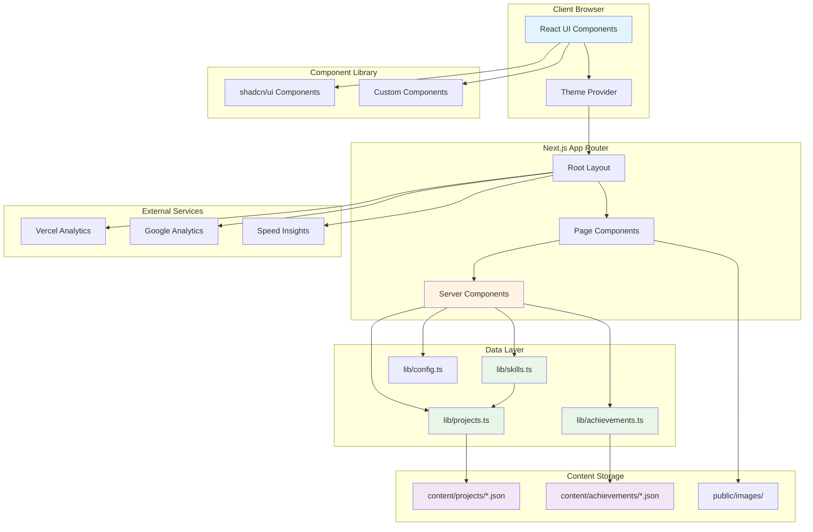
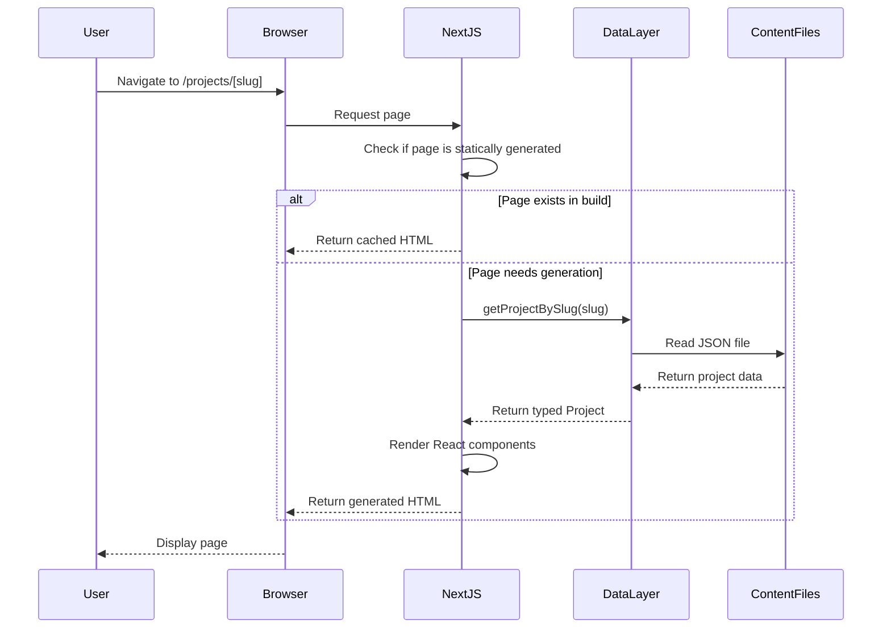

# Architecture Overview

**Navigation:** [Documentation Home](../README.md) → [Architecture](./README.md) → Overview

---

## Table of Contents

- [Introduction](#introduction)
- [Tech Stack](#tech-stack)
- [Key Features](#key-features)
- [High-Level Architecture](#high-level-architecture)
- [Core Patterns](#core-patterns)
- [See Also](#see-also)
- [Next Steps](#next-steps)

---

## Introduction

This is a modern portfolio website built for **Simon Stijnen**, showcasing projects, achievements, and technical skills. The application is designed with performance, maintainability, and developer experience as top priorities.

### Project Goals

- **Performance**: Optimized for speed with Next.js 15 static generation and Turbopack
- **Maintainability**: Content-driven architecture with JSON data sources
- **Scalability**: Modular component design with shadcn/ui
- **Developer Experience**: TypeScript-first with comprehensive tooling
- **SEO & Discoverability**: Structured data, OpenGraph, and LLM-readable content

### Target Audience

This documentation serves:

- **Developers** joining or contributing to the project
- **Employers & Clients** evaluating technical capabilities
- **Future maintainers** understanding architectural decisions

---

## Tech Stack

### Core Framework

**Next.js 15** with App Router

- Static site generation (SSG) for optimal performance
- React Server Components by default
- Turbopack for blazing-fast development builds
- Standalone output mode for Docker deployment

```1:19:/workspaces/website/next.config.ts
import type { NextConfig } from "next";
import bundleAnalyzer from "@next/bundle-analyzer";

// Import site configuration for URL parsing
import { siteConfig } from "./lib/config";

// Extract domain from site URL
const siteUrlDomain = new URL(siteConfig.url).hostname;

// Common domains for images
const commonDomains = [
  "github.githubassets.com",
  "github.com",
  "colorsplash.vercel.app",
  "flagcdn.com",
];
const domains = ["localhost", siteUrlDomain, ...commonDomains];

const nextConfig: NextConfig = {
  images: {
```

### Frontend Stack

| Technology         | Purpose                                         | Version    |
| ------------------ | ----------------------------------------------- | ---------- |
| **React 19**       | UI library                                      | `^19.0.0`  |
| **TypeScript 5**   | Type safety                                     | `^5`       |
| **Tailwind CSS 4** | Utility-first styling                           | `^4`       |
| **shadcn/ui**      | Component library (New York style, Slate theme) | Various    |
| **Radix UI**       | Accessible primitives                           | `^1.x`     |
| **Lucide React**   | Icon system                                     | `^0.513.0` |

### Data & State Management

- **Content Storage**: JSON files in `content/` directory
- **Type Definitions**: TypeScript interfaces in `lib/` directory
- **Data Access**: Async server-side functions
- **Theme Management**: `next-themes` for dark/light mode

### UI Component Libraries

**shadcn/ui Components** (New York style, Slate base color):

- Button, Card, Badge, Dialog, Tabs, Carousel
- Navigation Menu, Tooltip, Dropdown Menu
- Table, Separator, Input

**Custom Components**:

- Skills Data Table with `@tanstack/react-table`
- Project & Achievement Cards
- Timeline component for experience display

### Developer Tools

| Tool            | Purpose           | Configuration       |
| --------------- | ----------------- | ------------------- |
| **ESLint 9**    | Code linting      | `eslint.config.mjs` |
| **Prettier 3**  | Code formatting   | `.prettierrc.json`  |
| **Husky**       | Git hooks         | `.husky/`           |
| **lint-staged** | Pre-commit checks | `package.json`      |
| **Jest 30**     | Unit testing      | `jest.config.js`    |
| **TypeScript**  | Type checking     | `tsconfig.json`     |

### Analytics & Monitoring

- **Vercel Analytics**: User analytics and insights
- **Vercel Speed Insights**: Performance monitoring
- **Custom Analytics Component**: Google Analytics & GTM integration
- **Structured Data**: Schema.org JSON-LD for SEO

### Deployment

- **Docker**: Production containerization with standalone Next.js build
- **Vercel**: Recommended hosting platform
- **Docker Compose**: Development and production orchestration

---

## Key Features

### 1. Content-Driven Architecture

All content is stored as JSON and dynamically rendered:

```1:28:/workspaces/website/content/projects/audionome.json
{
  "title": "Audionome: Music Genre Classification",
  "shortDescription": "Using a Support Vector Machine (SVM) to classify music clips based on their genre.",
  "description": "For the AI Machine Learning course at VIVES University of Applied Sciences, I worked with Lynn Delaere on Audionome: an AI-powered system for music genre classification.\nWe trained several models (including logistic regression, SGD, and random forest) to automatically recognize and accurately classify music clips based on their genre. The project combines audio processing, machine learning, and a user-friendly interface built with Streamlit.",
  "technologies": [
    "AI",
    "SVM",
    "Streamlit",
    "Python",
    "Pandas",
    "NumPy",
    "Librosa",
    "Scikit-learn"
  ],
  "images": [
    {
      "src": "/images/projects/audionome/preview.jpg",
      "alt": "Audionome application interface showing music genre classification"
    },
    {
      "src": "/images/projects/audionome/quick-demo.webp",
      "alt": "Demo screenshot of Audionome classifying a music track with SVM model results"
    }
  ],
  "demoUrl": "https://audionome.streamlit.app/",
  "githubUrl": "https://github.com/SimonStnn/Audionome"
}
```

### 2. Dynamic Skills Generation

Skills are automatically extracted from project technologies:

```18:49:/workspaces/website/lib/skills.ts
export async function getSkills(): Promise<Skill[]> {
  const projects = await getProjects();

  // Create a map to collect unique skills and their projects
  const skillsMap = new Map<string, Skill>();

  projects.forEach((project) => {
    project.technologies.forEach((tech) => {
      const skillId = generateSkillId(tech);

      if (skillsMap.has(skillId)) {
        // Add project to existing skill
        const existingSkill = skillsMap.get(skillId)!;
        if (!existingSkill.projects.includes(project)) {
          existingSkill.projects.push(project);
        }
      } else {
        // Create new skill
        skillsMap.set(skillId, {
          id: skillId,
          name: tech,
          projects: [project],
        });
      }
    });
  });

  // Convert to array and sort by name
  return Array.from(skillsMap.values()).sort((a, b) => {
    return a.name.localeCompare(b.name);
  });
}
```

### 3. Type-Safe Data Layer

Strong TypeScript interfaces ensure data consistency:

```9:19:/workspaces/website/lib/projects.ts
export interface Project {
  slug: string;
  title: string;
  shortDescription: string;
  description: string;
  technologies: string[];
  images: ProjectImage[];
  demoUrl?: string;
  githubUrl?: string;
  order?: number;
}
```

### 4. Static Generation with Dynamic Routes

Projects are statically generated at build time:

```20:27:/workspaces/website/app/projects/[slug]/page.tsx
// Generate static params for all projects at build time
export async function generateStaticParams() {
  const projects = await getProjects();

  return projects.map((project) => ({
    slug: project.slug,
  }));
}
```

### 5. SEO & Structured Data

Comprehensive metadata and Schema.org structured data:

```23:75:/workspaces/website/app/layout.tsx
export const metadata: Metadata = {
  metadataBase: new URL(siteConfig.url),
  title: {
    template: `%s | Software Engineer & AI`,
    default: `${siteConfig.name} | Software Engineer & AI`,
  },
  description: siteConfig.description,
  keywords: [
    siteConfig.author.name,
    "Software Engineer",
    "AI",
    "Artificial Intelligence",
    "Machine Learning",
    "Developer",
    "Portfolio",
    "Full Stack",
    "TypeScript",
    "Junior Software Engineer",
  ],
  authors: [{ name: siteConfig.author.name }],
  creator: siteConfig.author.name,
  publisher: siteConfig.author.name,
  robots: {
    index: true,
    follow: true,
  },
  openGraph: {
    type: "website",
    locale: "en_US",
    url: siteConfig.url,
    siteName: "Software Engineer & AI Portfolio",
    title: `${siteConfig.name} | Software Engineer & AI`,
    description: siteConfig.description,
    images: [
      {
        url: "/images/profile-meta.jpg",
        width: 1200,
        height: 630,
        alt: "Simon Stijnen - Software Engineer & AI Specialist",
      },
    ],
  },
  twitter: {
    card: "summary_large_image",
    title: `Software Engineer & AI | ${siteConfig.name}`,
    description: siteConfig.description,
    images: ["/images/profile-meta.jpg"],
  },
  manifest: "/site.webmanifest",
  other: {
    "llms-txt": `${siteConfig.url}/llms.txt`,
  },
};
```

---

## High-Level Architecture

### System Architecture Diagram



### Request Flow



---

## Core Patterns

### 1. Server Components by Default

All pages and layouts use React Server Components for optimal performance:

```77:136:/workspaces/website/app/layout.tsx
export default function RootLayout({
  children,
}: Readonly<{
  children: React.ReactNode;
}>) {
  return (
    <html lang="en" className="scroll-smooth" suppressHydrationWarning>
      <head>
        {/* AI agent discovery: structured site info for LLMs */}
        <link
          rel="alternate"
          type="text/plain"
          href="/llms.txt"
          title="LLM-readable site information"
        />
        <Analytics />
        <VercelAnalytics />
        <SpeedInsights />
        <PersonJsonLd
          name={siteConfig.author.name}
          url={siteConfig.url}
          sameAs={[siteConfig.social.linkedin, siteConfig.social.github]}
          jobTitle={siteConfig.person.jobTitle}
          homeCountry={siteConfig.location.country}
          worksFor={siteConfig.person.worksFor}
          alumniOf={siteConfig.person.alumniOf}
          hasCredential={siteConfig.person.hasCredential}
          knowsAbout={siteConfig.person.knowsAbout}
          email={siteConfig.author.email}
        />
      </head>
      <body
        className={`${geistSans.variable} ${geistMono.variable} selection:bg-primary/80 selection:text-accent flex min-h-screen flex-col antialiased`}
      >
        <noscript>
          <iframe
            src="https://www.googletagmanager.com/ns.html?id=GTM-KH4ZNPL4"
            height="0"
            width="0"
            style={{ display: "none", visibility: "hidden" }}
          ></iframe>
        </noscript>
        <ThemeProvider attribute="class" defaultTheme="system" enableSystem>
          <a
            // Skip to main content link for screen readers
            href="#main-content"
            className="focus:bg-primary focus:text-primary-foreground focus:ring-accent sr-only focus:not-sr-only focus:absolute focus:top-2 focus:left-2 focus:z-50 focus:rounded-md focus:px-8 focus:py-2 focus:shadow-lg"
          >
            Skip to main content
          </a>
          <Header className="sticky top-0 z-40" />
          <main id="main-content" className="flex-grow">
            {children}
          </main>
          <Footer />
        </ThemeProvider>
      </body>
    </html>
  );
}
```

### 2. Absolute Imports Pattern

All imports use the `@/` prefix for consistency:

```1:28:/workspaces/website/app/page.tsx
import Link from "next/link";
import Image from "next/image";
import { getFeaturedProjects } from "@/lib/projects";
import { getAchievements } from "@/lib/achievements";
import { Button } from "@/components/ui/button";
import {
  Dialog,
  DialogContent,
  DialogDescription,
  DialogFooter,
  DialogHeader,
  DialogTitle,
  DialogTrigger,
} from "@/components/ui/dialog";
import { Badge } from "@/components/ui/badge";
import { Card, CardContent } from "@/components/ui/card";
import ProjectCard from "@/components/project-card";
import AchievementCard from "@/components/achievement-card";
import { Tabs, TabsContent, TabsList, TabsTrigger } from "@/components/ui/tabs";
import Timeline from "@/components/timeline";
import { cn } from "@/lib/utils";
import SocialLink from "@/components/social-link";
import { Download, Mail, MapPin } from "lucide-react";
import { GitHubIcon, LinkedInIcon } from "@/components/icons";
import { SkillsDataTable } from "@/components/skills-data-table";
import { siteConfig } from "@/lib/config";
import { getSkills } from "@/lib/skills";
import { Separator } from "@/components/ui/separator";

export default async function Home() {
```

### 3. Type-Safe Configuration

Environment variables are centralized and typed:

```9:66:/workspaces/website/lib/config.ts
// Site configuration
export const siteConfig = {
  name: process.env.NEXT_PUBLIC_SITE_NAME || "Simon Stijnen",
  url: process.env.NEXT_PUBLIC_SITE_URL || "https://simon.stijnen.be",
  description:
    process.env.NEXT_PUBLIC_SITE_DESCRIPTION ||
    "Software engineer and AI student in Belgium building scalable, reliable products.",
  recruiterSummary:
    process.env.NEXT_PUBLIC_RECRUITER_SUMMARY ||
    "Software engineer and AI student focused on scalable web apps, LLM automation, and data-driven systems. Available for internships and junior roles.",
  author: {
    name: process.env.NEXT_PUBLIC_AUTHOR_NAME || "Simon Stijnen",
    email: process.env.NEXT_PUBLIC_AUTHOR_EMAIL || "simon.stijnen.23+portfolio@gmail.com",
  },
  location: {
    city: process.env.NEXT_PUBLIC_AUTHOR_CITY || "Bruges",
    country: process.env.NEXT_PUBLIC_AUTHOR_COUNTRY || "Belgium",
  },
  social: {
    github: process.env.NEXT_PUBLIC_GITHUB_URL || "https://github.com/SimonStnn",
    linkedin: process.env.NEXT_PUBLIC_LINKEDIN_URL || "https://www.linkedin.com/in/simon-stijnen/",
  },
  person: {
    jobTitle: process.env.NEXT_PUBLIC_AUTHOR_JOB_TITLE || "Software Engineer & AI student",
    worksFor: [
      {
        name: process.env.NEXT_PUBLIC_AUTHOR_WORKS_FOR || "Cerm",
        url: process.env.NEXT_PUBLIC_AUTHOR_WORKS_FOR_URL || "https://www.cerm.be/",
      },
    ],
    alumniOf: [
      {
        name: process.env.NEXT_PUBLIC_AUTHOR_ALUMNI_OF || "VIVES University of Applied Sciences",
        url: process.env.NEXT_PUBLIC_AUTHOR_ALUMNI_OF_URL || "https://www.vives.be/en",
      },
    ],
    hasCredential: [
      {
        name:
          process.env.NEXT_PUBLIC_AUTHOR_CREDENTIAL ||
          "Computer Science - Software Engineering & AI (in progress)",
      },
    ],
    knowsAbout: [
      "TypeScript",
      "React",
      "Next.js",
      "Node.js",
      "Python",
      "AI",
      "LLMs",
      "Machine Learning",
      "APIs",
      "PostgreSQL",
      "Docker",
    ],
  },
};
```

### 4. Utility-First Styling

Tailwind CSS with `cn()` utility for conditional classes:

```21:21:/workspaces/website/app/page.tsx
import { cn } from "@/lib/utils";
```

---

## See Also

Related documentation:

- **[Directory Structure](./02-directory-structure.md)** - Complete project file organization
- **[Data Flow](./03-data-flow.md)** - How data moves through the application
- **[Routing & Navigation](./04-routing-navigation.md)** - App Router and page structure
- **[Conventions](./05-conventions.md)** - Coding standards and best practices
- **[Configuration Reference](./06-configuration.md)** - All config files explained

---

## Next Steps

1. **Understand the structure**: Read [Directory Structure](./02-directory-structure.md) to learn how files are organized
2. **Learn data flow**: Review [Data Flow](./03-data-flow.md) to understand content management
3. **Add content**: See [Adding New Projects](../02-guides/01-adding-projects.md) to contribute
4. **Development setup**: Follow [Development Guide](../02-guides/03-development-workflow.md) to start coding

---

[← Back to Architecture Index](./README.md) | [Documentation Home](../README.md)
