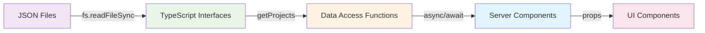
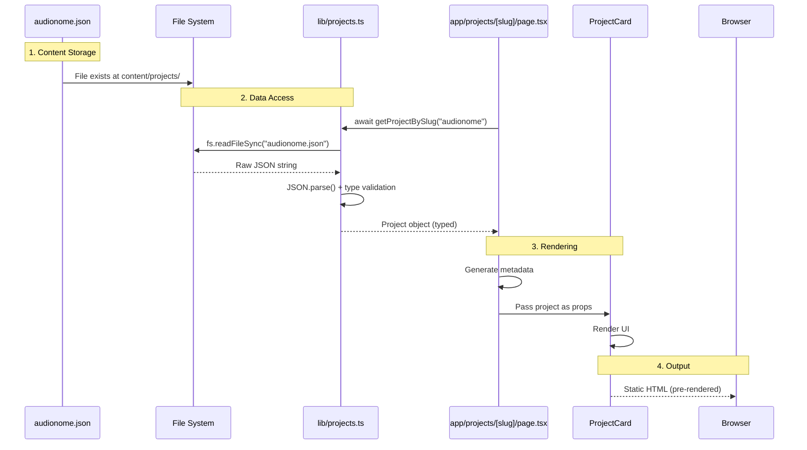
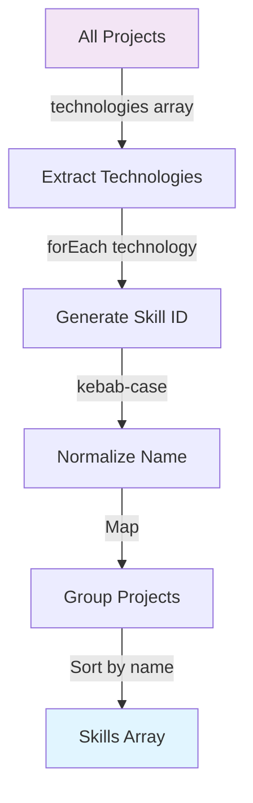
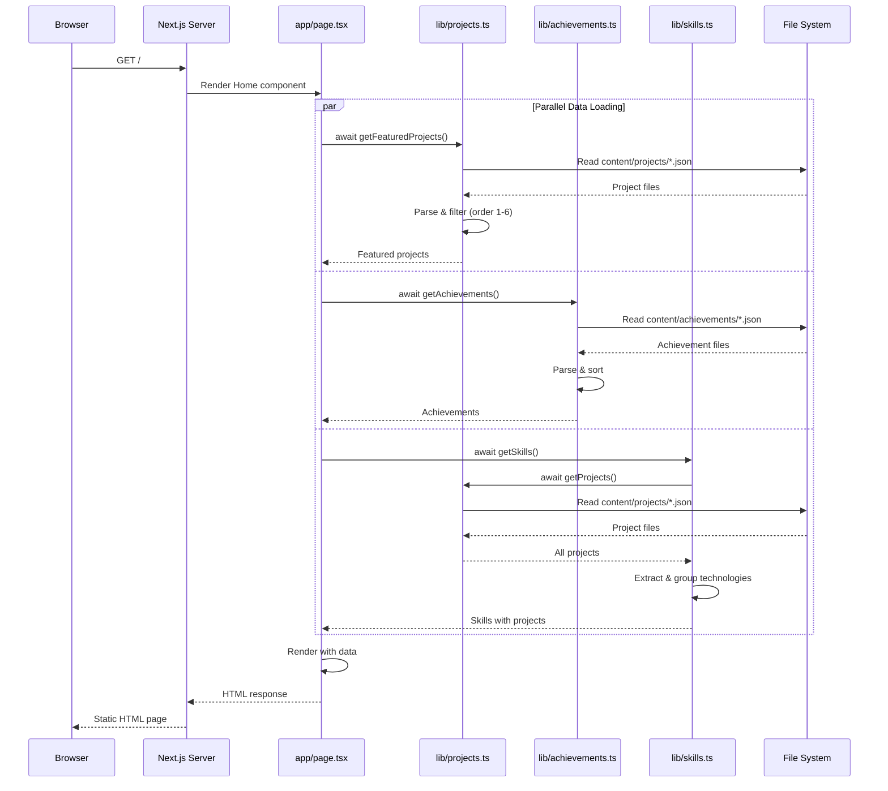
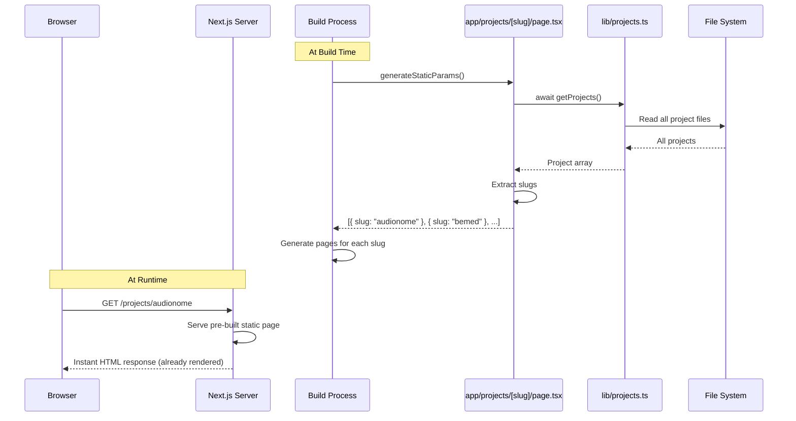
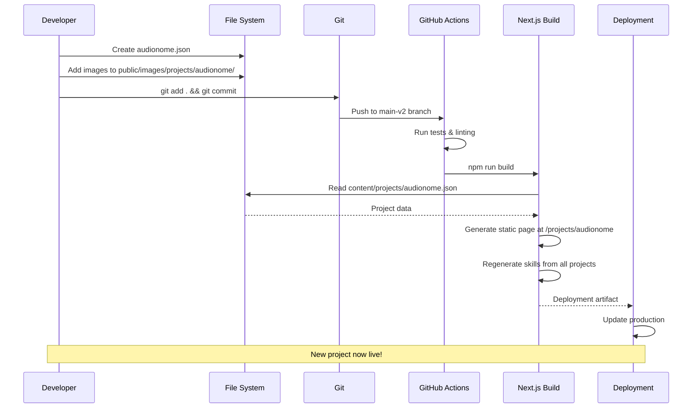
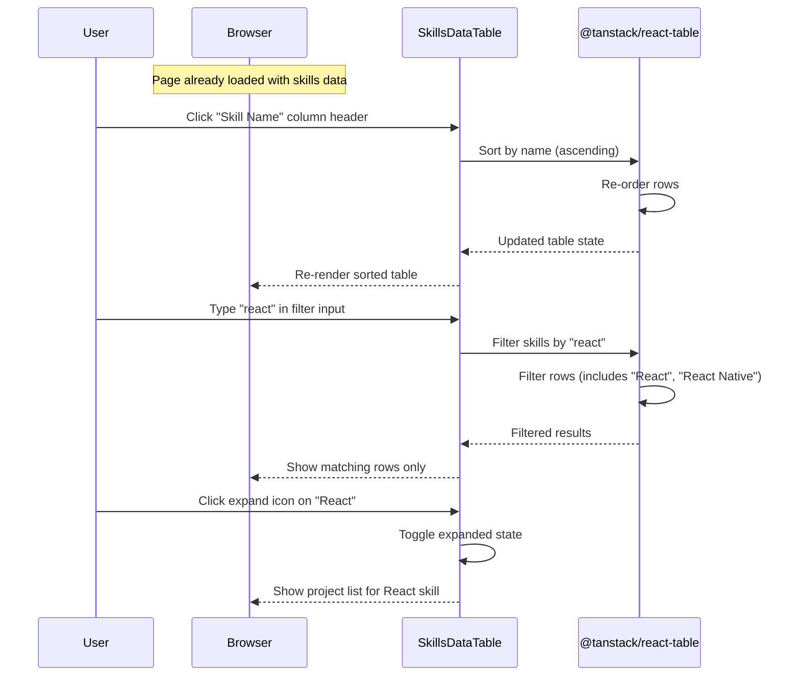

# Data Flow

**Navigation:** [Documentation Home](../README.md) → [Architecture](./README.md) → Data Flow

---

## Table of Contents

- [Overview](#overview)
- [Content-to-Component Pipeline](#content-to-component-pipeline)
- [Data Access Layer](#data-access-layer)
- [Skills Generation Flow](#skills-generation-flow)
- [Image Handling](#image-handling)
- [Detailed Sequence Diagrams](#detailed-sequence-diagrams)
- [See Also](#see-also)
- [Next Steps](#next-steps)

---

## Overview

The application follows a unidirectional data flow pattern:

```
JSON Files → TypeScript Interfaces → Data Access Functions → Server Components → UI
```

All data is:

- **Stored as JSON** in the `content/` directory
- **Typed with TypeScript interfaces** for compile-time safety
- **Accessed via async functions** in the `lib/` directory
- **Rendered by Server Components** for optimal performance
- **Statically generated at build time** for instant page loads

### Key Principles

1. **Content as Data** - Content is stored separately from code
2. **Type Safety** - All data validated by TypeScript interfaces
3. **Server-Side Processing** - Data access happens server-side only
4. **Build-Time Generation** - Pages generated during build, not runtime
5. **No Client State** - Content is read-only, no client-side mutations

---

## Content-to-Component Pipeline

### High-Level Flow



### Step-by-Step Example: Rendering a Project



---

## Data Access Layer

All data access functions are in the `lib/` directory and follow consistent patterns.

### Projects Data Access

Located in `lib/projects.ts`:

```28:80:/workspaces/website/lib/projects.ts
export async function getProjects(): Promise<Project[]> {
  // Read all files from the projects directory
  const fileNames = fs.readdirSync(projectsDirectory);

  // Get project data from each file
  const projects = fileNames
    .filter((fileName) => fileName.endsWith(".json"))
    .map((fileName) => {
      // Get the slug from the filename (without .json extension)
      const slug = fileName.replace(/\.json$/, "");

      // Read the JSON file content
      const filePath = path.join(projectsDirectory, fileName);
      const fileContent = fs.readFileSync(filePath, "utf8");

      // Parse the JSON data with error handling
      let projectData: unknown;
      try {
        projectData = JSON.parse(fileContent);
      } catch (error) {
        console.error(`Error parsing JSON for project ${slug}`, { error, fileName });
        return null; // Skip invalid files
      }

      // Ensure it's an object and not an array
      if (typeof projectData !== "object" || projectData === null || Array.isArray(projectData)) {
        console.error(`Invalid JSON structure for project ${slug}`, { projectData });
        return null;
      }

      // Return the project data with the slug
      return {
        slug,
        ...projectData,
      };
    })
    .filter((project): project is Project => project !== null);

  // Sort projects by order (if specified)
  return projects.sort((a, b) => {
    // If both have order, sort by order
    if (a.order !== undefined && b.order !== undefined) {
      return a.order - b.order;
    }

    // If only one has order, it comes first
    if (a.order !== undefined && b.order === undefined) return -1;
    if (a.order === undefined && b.order !== undefined) return 1;

    // If neither has order, sort alphabetically
    return a.title.localeCompare(b.title);
  });
}
```

**Key Functions:**

```typescript
// Get all projects (sorted by order, then alphabetically)
export async function getProjects(): Promise<Project[]>;

// Get featured projects (order 1-6)
export async function getFeaturedProjects(): Promise<Project[]>;

// Get a single project by slug
export async function getProjectBySlug(slug: string): Promise<Project | null>;
```

### Achievements Data Access

Located in `lib/achievements.ts`:

```28:95:/workspaces/website/lib/achievements.ts
export async function getAchievements(): Promise<Achievement[]> {
  // Check if directory exists
  if (!fs.existsSync(achievementsDirectory)) {
    return [];
  }

  // Read all files from the achievements directory
  const fileNames = fs.readdirSync(achievementsDirectory);

  // Get achievement data from each file
  const achievements = fileNames
    .filter((fileName) => fileName.endsWith(".json"))
    .map((fileName) => {
      // Get the slug from the filename (without .json extension)
      const slug = fileName.replace(/\.json$/, "");

      // Read the JSON file content
      const filePath = path.join(achievementsDirectory, fileName);
      const fileContent = fs.readFileSync(filePath, "utf8");

      // Parse the JSON data with error handling
      let achievementData: unknown;
      try {
        achievementData = JSON.parse(fileContent);
      } catch (error) {
        console.error(`Error parsing JSON for achievement ${slug}`, { error, fileName });
        return null; // Skip invalid files
      }

      // Ensure it's an object and not an array
      if (
        typeof achievementData !== "object" ||
        achievementData === null ||
        Array.isArray(achievementData)
      ) {
        console.error(`Invalid JSON structure for achievement ${slug}`, { achievementData });
        return null;
      }

      // Return the achievement data with the slug
      return {
        slug,
        ...achievementData,
      };
    })
    .filter((achievement): achievement is Achievement => achievement !== null);

  // Sort achievements by order (if specified), then by date (newest first)
  return achievements.sort((a, b) => {
    // If both have order specified, sort by order (lower numbers first)
    if (a.order !== undefined && b.order !== undefined) {
      return a.order - b.order;
    }

    // If only one has order specified, prioritize it
    if (a.order !== undefined && b.order === undefined) {
      return -1;
    }
    if (a.order === undefined && b.order !== undefined) {
      return 1;
    }

    // If neither has order, sort by date (newest first)
    const dateA = new Date(a.date).getTime();
    const dateB = new Date(b.date).getTime();
    return dateB - dateA;
  });
}
```

### TypeScript Interfaces

Interfaces define the shape of data and provide compile-time safety:

**Project Interface:**

```9:19:/workspaces/website/lib/projects.ts
export interface Project {
  slug: string;
  title: string;
  shortDescription: string;
  description: string;
  technologies: string[];
  images: ProjectImage[];
  demoUrl?: string;
  githubUrl?: string;
  order?: number;
}
```

**Achievement Interface:**

```9:19:/workspaces/website/lib/achievements.ts
export interface Achievement {
  slug: string;
  title: string;
  issuer: string;
  date: string;
  type: "certification" | "award" | "achievement";
  description?: string;
  link?: string;
  image?: AchievementImage;
  order?: number;
}
```

### Data Validation

The data access layer includes runtime validation:

```typescript
// Type checking at runtime
if (typeof projectData !== "object" || projectData === null || Array.isArray(projectData)) {
  console.error(`Invalid JSON structure for project ${slug}`, { projectData });
  return null;
}

// Filter out invalid entries
.filter((project): project is Project => project !== null)
```

This ensures:

- Invalid JSON files are skipped
- Build doesn't fail on malformed data
- Errors are logged for debugging
- TypeScript type guards work correctly

---

## Skills Generation Flow

Skills are dynamically generated from project technologies, creating a relationship table.

### Generation Process



### Skills Generation Code

```18:49:/workspaces/website/lib/skills.ts
export async function getSkills(): Promise<Skill[]> {
  const projects = await getProjects();

  // Create a map to collect unique skills and their projects
  const skillsMap = new Map<string, Skill>();

  projects.forEach((project) => {
    project.technologies.forEach((tech) => {
      const skillId = generateSkillId(tech);

      if (skillsMap.has(skillId)) {
        // Add project to existing skill
        const existingSkill = skillsMap.get(skillId)!;
        if (!existingSkill.projects.includes(project)) {
          existingSkill.projects.push(project);
        }
      } else {
        // Create new skill
        skillsMap.set(skillId, {
          id: skillId,
          name: tech,
          projects: [project],
        });
      }
    });
  });

  // Convert to array and sort by name
  return Array.from(skillsMap.values()).sort((a, b) => {
    return a.name.localeCompare(b.name);
  });
}
```

### Skill ID Generation

```9:16:/workspaces/website/lib/skills.ts
export function generateSkillId(skillName: string): string {
  return skillName
    .toLowerCase()
    .replace(/[^\w\s-]/g, "") // Remove special characters except hyphens
    .replace(/\s+/g, "-") // Replace spaces with hyphens
    .replace(/-+/g, "-") // Replace multiple hyphens with single
    .replace(/^-|-$/g, ""); // Remove leading/trailing hyphens
}
```

**Examples:**

- `"TypeScript"` → `"typescript"`
- `"Next.js"` → `"nextjs"`
- `"Node.js v20"` → `"nodejs-v20"`

### Skills Data Structure

```typescript
export interface Skill {
  id: string; // Normalized ID (kebab-case)
  name: string; // Original display name
  projects: Project[]; // All projects using this skill
}
```

**Example Output:**

```typescript
{
  id: "typescript",
  name: "TypeScript",
  projects: [
    { slug: "audionome", title: "Audionome", ... },
    { slug: "bemed", title: "BeMed", ... },
    { slug: "harlock", title: "Harlock", ... }
  ]
}
```

---

## Image Handling

Images are stored in `public/images/` and referenced in JSON with relative paths.

### Image Storage Pattern

```
public/
└── images/
    └── projects/
        └── {slug}/           # One folder per project
            ├── preview.jpg
            ├── screenshot-1.png
            └── demo.webp
```

### Image JSON Structure

```json
{
  "images": [
    {
      "src": "/images/projects/audionome/preview.jpg",
      "alt": "Audionome application interface showing music genre classification"
    },
    {
      "src": "/images/projects/audionome/quick-demo.webp",
      "alt": "Demo screenshot of Audionome classifying a music track"
    }
  ]
}
```

### Image Rendering

```typescript
import Image from "next/image"

// From project data
const { src, alt } = project.images[0]

<Image
  src={src}                    // /images/projects/audionome/preview.jpg
  alt={alt}                    // Descriptive alt text
  width={1200}
  height={675}
  priority={index === 0}       // Priority load first image
/>
```

### Video Support

The application supports video files (`.mp4`, `.webm`, `.ogg`, `.mov`):

```typescript
import { isVideoFile } from "@/lib/utils"

const isVideo = isVideoFile(src)

if (isVideo) {
  return (
    <video src={src} controls muted loop autoPlay>
      Your browser does not support the video tag.
    </video>
  )
}
```

---

## Detailed Sequence Diagrams

### Home Page Load



### Dynamic Project Page Load



### Adding New Project Flow



### Skills Table Interaction (Client-Side)



---

## See Also

Related documentation:

- **[Architecture Overview](./01-overview.md)** - High-level architecture patterns
- **[Directory Structure](./02-directory-structure.md)** - Where data files live
- **[Routing & Navigation](./04-routing-navigation.md)** - How routes access data
- **[Adding New Projects](../02-guides/01-adding-projects.md)** - Step-by-step content creation
- **[Data Access API](../03-api/01-data-access.md)** - Complete function reference

---

## Next Steps

1. **Add content**: Follow [Adding New Projects](../02-guides/01-adding-projects.md) to create projects
2. **Understand routing**: Read [Routing & Navigation](./04-routing-navigation.md) for page generation
3. **Explore components**: See [Component Reference](../03-api/02-components.md) for UI patterns
4. **Learn conventions**: Review [Conventions](./05-conventions.md) for best practices

---

[← Back to Architecture Index](./README.md) | [Documentation Home](../README.md)
