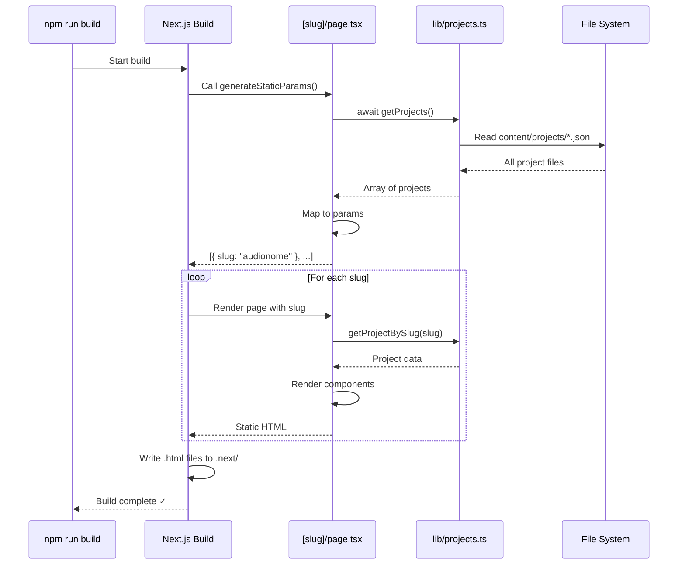
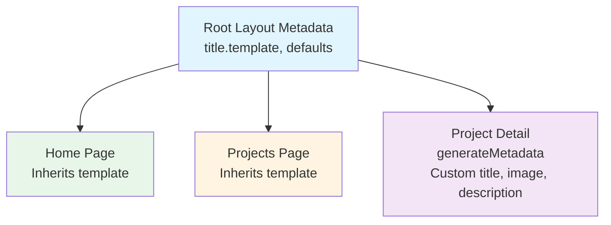

# Routing & Navigation

**Navigation:** [Documentation Home](../README.md) → [Architecture](./README.md) → Routing & Navigation

---

## Table of Contents

- [Overview](#overview)
- [App Router Fundamentals](#app-router-fundamentals)
- [Route Hierarchy](#route-hierarchy)
- [Static Generation](#static-generation)
- [Dynamic Routes](#dynamic-routes)
- [Metadata Generation](#metadata-generation)
- [Navigation Components](#navigation-components)
- [See Also](#see-also)
- [Next Steps](#next-steps)

---

## Overview

This portfolio uses **Next.js 15 App Router** with Server Components and static site generation (SSG). All pages are pre-rendered at build time for optimal performance.

### Key Characteristics

- **File-based routing**: Directory structure = URL structure
- **Server Components by default**: Optimal performance
- **Static generation**: All pages built at compile time
- **Type-safe routes**: TypeScript integration
- **SEO-optimized**: Metadata generated per page

---

## App Router Fundamentals

### File Conventions

The App Router uses special file names to define routes:

| File            | Purpose                        | Required      |
| --------------- | ------------------------------ | ------------- |
| `page.tsx`      | Page component (creates route) | Yes           |
| `layout.tsx`    | Wraps child routes             | No (inherits) |
| `error.tsx`     | Error boundary                 | No            |
| `loading.tsx`   | Loading UI                     | No            |
| `not-found.tsx` | 404 page                       | No            |

### Route Segments

Each folder in `app/` becomes a URL segment:

```
app/
├── page.tsx              → /
├── projects/
│   ├── page.tsx          → /projects
│   └── [slug]/
│       └── page.tsx      → /projects/[slug]
```

### Layout Nesting

Layouts automatically wrap all nested routes:

```
app/layout.tsx                 (Root layout - all pages)
├── app/page.tsx              (Home page)
└── app/projects/             (Projects section)
    ├── page.tsx              (Projects listing)
    └── [slug]/page.tsx       (Individual project)
```

---

## Route Hierarchy

### Complete Route Structure

```mermaid
graph TD
    Root[app/layout.tsx<br/>Root Layout] --> Home[app/page.tsx<br/>GET /]
    Root --> Projects[app/projects/page.tsx<br/>GET /projects]
    Root --> ProjectDetail[app/projects/[slug]/page.tsx<br/>GET /projects/:slug]
    Root --> NotFound[app/not-found.tsx<br/>404 Page]
    Root --> Error[app/error.tsx<br/>Error Boundary]

    style Root fill:#e1f5ff
    style Home fill:#e8f5e9
    style Projects fill:#fff4e1
    style ProjectDetail fill:#f3e5f5
    style NotFound fill:#ffebee
    style Error fill:#ffebee
```

### URL Mapping

| URL                      | File                           | Component        | Generated?   |
| ------------------------ | ------------------------------ | ---------------- | ------------ |
| `/`                      | `app/page.tsx`                 | Home             | Static       |
| `/projects`              | `app/projects/page.tsx`        | Projects Listing | Static       |
| `/projects/audionome`    | `app/projects/[slug]/page.tsx` | Project Detail   | Static (SSG) |
| `/projects/bemed`        | `app/projects/[slug]/page.tsx` | Project Detail   | Static (SSG) |
| `/projects/invalid-slug` | `app/not-found.tsx`            | 404 Page         | Static       |

---

## Static Generation

### Build-Time Generation

All pages are generated during `npm run build`:

```bash
Route (app)                              Size     First Load JS
┌ ○ /                                    16.4 kB         108 kB
├ ○ /projects                            5.21 kB         102 kB
├ ○ /projects/audionome                  4.89 kB         101 kB
├ ○ /projects/bemed                      4.92 kB         101 kB
├ ○ /projects/harlock                    5.01 kB         102 kB
└ ○ /projects/[slug]                     4.85 kB         101 kB

○  (Static)  prerendered as static content
```

### Static Generation Flow



### Benefits of Static Generation

1. **Performance**: Pages served instantly (no server processing)
2. **SEO**: All content visible to crawlers
3. **Cost**: No server needed (CDN only)
4. **Reliability**: No database or API failures at runtime
5. **Scalability**: Handles unlimited traffic

---

## Dynamic Routes

### Dynamic Segment Syntax

Use brackets for dynamic segments:

```
app/projects/[slug]/page.tsx  →  /projects/:slug
```

### Generate Static Params

Tell Next.js which dynamic pages to generate:

```20:27:/workspaces/website/app/projects/[slug]/page.tsx
// Generate static params for all projects at build time
export async function generateStaticParams() {
  const projects = await getProjects();

  return projects.map((project) => ({
    slug: project.slug,
  }));
}
```

**Return Format:**

```typescript
[
  { slug: "audionome" },
  { slug: "bemed" },
  { slug: "cerm-mcp-poc" },
  { slug: "harlock" },
  // ... one entry per project
];
```

### Accessing Dynamic Params

Params are passed to the page component:

```typescript
export default async function ProjectPage({
  params,
}: {
  params: Promise<{ slug: string }>
}) {
  const { slug } = await params
  const project = await getProjectBySlug(slug)

  if (!project) {
    notFound()  // Show 404 page
  }

  return <div>...</div>
}
```

**Note:** In Next.js 15, `params` is a Promise and must be awaited.

### 404 Handling

If a slug doesn't match any project, return `notFound()`:

```200:207:/workspaces/website/app/projects/[slug]/page.tsx
export default async function ProjectPage({ params }: { params: Promise<{ slug: string }> }) {
  const projects = await getProjects();
  const { slug } = await params;
  const project = projects.find((p) => p.slug === slug);

  if (!project) {
    notFound();
  }
```

This renders `app/not-found.tsx` with a proper 404 status code.

---

## Metadata Generation

### Static Metadata

Root layout defines default metadata:

```23:75:/workspaces/website/app/layout.tsx
export const metadata: Metadata = {
  metadataBase: new URL(siteConfig.url),
  title: {
    template: `%s | Software Engineer & AI`,
    default: `${siteConfig.name} | Software Engineer & AI`,
  },
  description: siteConfig.description,
  keywords: [
    siteConfig.author.name,
    "Software Engineer",
    "AI",
    "Artificial Intelligence",
    "Machine Learning",
    "Developer",
    "Portfolio",
    "Full Stack",
    "TypeScript",
    "Junior Software Engineer",
  ],
  authors: [{ name: siteConfig.author.name }],
  creator: siteConfig.author.name,
  publisher: siteConfig.author.name,
  robots: {
    index: true,
    follow: true,
  },
  openGraph: {
    type: "website",
    locale: "en_US",
    url: siteConfig.url,
    siteName: "Software Engineer & AI Portfolio",
    title: `${siteConfig.name} | Software Engineer & AI`,
    description: siteConfig.description,
    images: [
      {
        url: "/images/profile-meta.jpg",
        width: 1200,
        height: 630,
        alt: "Simon Stijnen - Software Engineer & AI Specialist",
      },
    ],
  },
  twitter: {
    card: "summary_large_image",
    title: `Software Engineer & AI | ${siteConfig.name}`,
    description: siteConfig.description,
    images: ["/images/profile-meta.jpg"],
  },
  manifest: "/site.webmanifest",
  other: {
    "llms-txt": `${siteConfig.url}/llms.txt`,
  },
};
```

### Dynamic Metadata

Project pages generate metadata dynamically:

```29:80:/workspaces/website/app/projects/[slug]/page.tsx
export async function generateMetadata({ params }: { params: Promise<{ slug: string }> }) {
  const projects = await getProjects();
  const { slug } = await params;
  const project = projects.find((p) => p.slug === slug);

  if (!project) {
    return {
      title: "Project Not Found | Simon Stijnen Portfolio",
    };
  }

  const firstImage = project.images?.find((image) => {
    const src = typeof image === "string" ? image : image.src;
    return !isVideoFile(src);
  });
  const firstImageSrc = firstImage
    ? typeof firstImage === "string"
      ? firstImage
      : firstImage.src
    : "/images/profile-meta.jpg";
  const firstImageAlt =
    typeof firstImage === "string"
      ? `${project.title} screenshot`
      : firstImage?.alt || `${project.title} screenshot`;
  const description = project.shortDescription || `Details about ${project.title}.`;

  return {
    title: `${project.title} | Simon Stijnen Portfolio`,
    description,
    openGraph: {
      type: "website",
      locale: "en_US",
      url: `${siteConfig.url}/projects/${project.slug}`,
      title: `${project.title} | ${siteConfig.name}`,
      description,
      images: [
        {
          url: firstImageSrc,
          alt: firstImageAlt,
          width: 1200,
          height: 630,
        },
      ],
    },
    twitter: {
      card: "summary_large_image",
      title: `${project.title} | ${siteConfig.name}`,
      description,
      images: [firstImageSrc],
    },
  };
}
```

**Metadata Features:**

- Page title with template: `"Audionome | Simon Stijnen Portfolio"`
- Project-specific description
- OpenGraph image from project's first image
- Twitter card with preview
- Proper canonical URLs

### Metadata Hierarchy



Metadata merges from parent to child:

- **Root layout**: Sets defaults and template
- **Child pages**: Override specific fields
- **Template**: Applied to all child titles (`%s | Software Engineer & AI`)

---

## Navigation Components

### Header Navigation

Located at `components/layout/header.tsx`:

**Features:**

- Responsive mobile/desktop menu
- Active link highlighting
- Theme toggle integration
- Sticky positioning

**Navigation Structure:**

```typescript
const navItems = [
  { href: "/", label: "Home" },
  { href: "/#projects", label: "Projects" },
  { href: "/projects", label: "All Projects" },
  { href: "/#skills", label: "Skills" },
  { href: "/#about", label: "About" },
];
```

### Link Components

**Next.js Link:**

```typescript
import Link from "next/link"

<Link href="/projects">View All Projects</Link>
```

**Anchor Links (same page):**

```typescript
<a href="#projects">Jump to Projects</a>
```

**External Links:**

```typescript
<Link
  href="https://github.com/SimonStnn"
  target="_blank"
  rel="noopener noreferrer"
>
  GitHub
</Link>
```

### Programmatic Navigation

For client components:

```typescript
'use client'

import { useRouter } from 'next/navigation'

export function MyComponent() {
  const router = useRouter()

  const handleClick = () => {
    router.push('/projects')  // Navigate to route
  }

  return <button onClick={handleClick}>Go</button>
}
```

### Back Navigation

```typescript
import Link from "next/link"
import { ArrowLeft } from "lucide-react"

<Link href="/projects">
  <ArrowLeft />
  Back to All Projects
</Link>
```

Example from project detail page:

```220:225:/workspaces/website/app/projects/[slug]/page.tsx
          <Button variant="link" className="mb-6 !px-0" asChild>
            <Link href="/projects" className="text-primary hover:underline">
              <ArrowLeft />
              Back to All Projects
            </Link>
          </Button>
```

---

## Route Diagram with Data Flow

### Complete Application Flow

```mermaid
graph TB
    subgraph "Browser"
        UserNav[User Navigation]
    end

    subgraph "Routes"
        Home[/ - Home Page]
        ProjectsList[/projects - Listing]
        ProjectDetail[/projects/slug - Detail]
    end

    subgraph "Data Layer"
        GetFeatured[getFeaturedProjects]
        GetAll[getProjects]
        GetBySlug[getProjectBySlug]
        GetSkills[getSkills]
    end

    subgraph "Content"
        JSON[(JSON Files)]
    end

    UserNav --> Home
    UserNav --> ProjectsList
    UserNav --> ProjectDetail

    Home --> GetFeatured
    Home --> GetSkills
    ProjectsList --> GetAll
    ProjectDetail --> GetBySlug

    GetFeatured --> JSON
    GetAll --> JSON
    GetBySlug --> JSON
    GetSkills --> GetAll

    style UserNav fill:#e1f5ff
    style Home fill:#e8f5e9
    style ProjectsList fill:#fff4e1
    style ProjectDetail fill:#f3e5f5
    style JSON fill:#ffebee
```

---

## See Also

Related documentation:

- **[Architecture Overview](./01-overview.md)** - High-level system architecture
- **[Data Flow](./03-data-flow.md)** - How data reaches pages
- **[Directory Structure](./02-directory-structure.md)** - Where route files live
- **[Adding New Projects](../02-guides/01-adding-projects.md)** - Creating new routes
- **[Next.js App Router Docs](https://nextjs.org/docs/app)** - Official documentation

---

## Next Steps

1. **Add a new route**: Create a page in `app/` directory
2. **Add dynamic content**: Create JSON and use `generateStaticParams()`
3. **Customize metadata**: Use `generateMetadata()` for SEO
4. **Test routing**: Run `npm run dev` and navigate between pages

---

[← Back to Architecture Index](./README.md) | [Documentation Home](../README.md)
