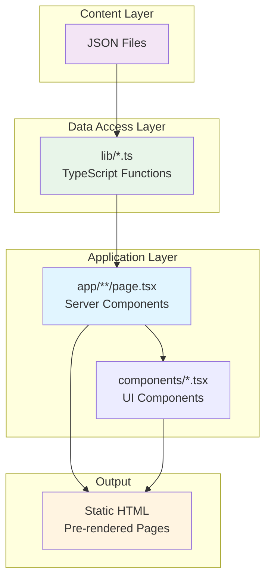
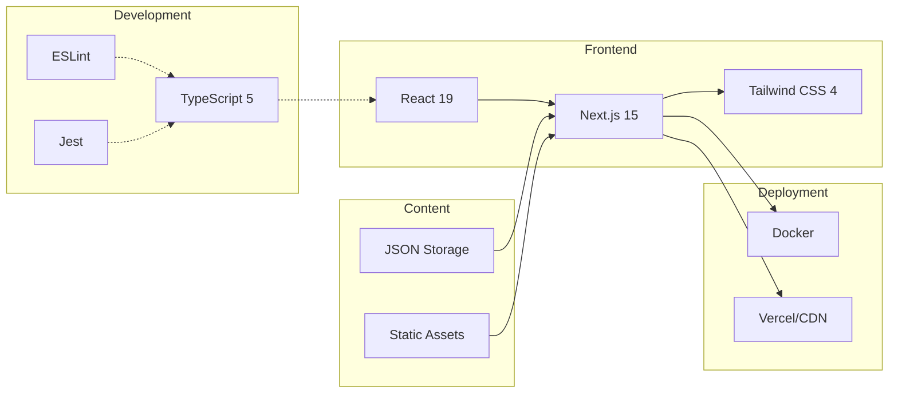

# Architecture Documentation

**Navigation:** [Documentation Home](../index.md) → Architecture

---

## Overview

This section provides comprehensive documentation of the portfolio website's architecture, design patterns, and technical implementation. It serves as the foundation for understanding how the system works and how to work with it effectively.

---

## Documentation Structure

### 1. [Overview](./01-overview.md)

**Start here for the big picture**

Learn about the project's goals, tech stack, and high-level architecture. This document provides:

- Project introduction and goals
- Complete tech stack breakdown
- Key features and capabilities
- High-level architecture diagrams
- Core architectural patterns

**Audience:** Developers, employers, clients evaluating the project

---

### 2. [Directory Structure](./02-directory-structure.md)

**Understand how files are organized**

Complete reference for the project's file and folder organization:

- Directory tree with descriptions
- File naming conventions
- Where to find specific types of files
- Quick reference tables
- Configuration file locations

**Audience:** Developers navigating the codebase

---

### 3. [Data Flow](./03-data-flow.md)

**See how content becomes pages**

Detailed explanation of how data moves through the application:

- JSON → TypeScript → React pipeline
- Data access layer patterns
- Skills generation flow
- Image and video handling
- Sequence diagrams for key flows

**Audience:** Developers working with content and data

---

### 4. [Routing & Navigation](./04-routing-navigation.md)

**Master the App Router**

Deep dive into Next.js 15 App Router implementation:

- File-based routing structure
- Static generation patterns
- Dynamic routes with `generateStaticParams()`
- Metadata generation
- Navigation components
- Route hierarchy diagrams

**Audience:** Developers adding pages or routes

---

### 5. [Conventions](./05-conventions.md)

**Follow the standards**

Coding standards and best practices for the project:

- File naming conventions
- Absolute imports pattern
- TypeScript guidelines
- React patterns (Server vs Client Components)
- Styling with Tailwind CSS
- Git workflow and commit messages
- Testing standards

**Audience:** All developers contributing to the project

---

### 6. [Configuration Reference](./06-configuration.md)

**Complete config file guide**

Detailed reference for all configuration files:

- Next.js (`next.config.ts`)
- TypeScript (`tsconfig.json`)
- Tailwind CSS (`tailwind.config.ts`)
- ESLint, Prettier, Jest
- Package.json scripts
- Docker setup
- Environment variables

**Audience:** Developers configuring the project

---

## Quick Start Paths

### 🆕 New to the Project?

1. Start with [Overview](./01-overview.md) to understand the big picture
2. Review [Directory Structure](./02-directory-structure.md) to navigate the codebase
3. Read [Conventions](./05-conventions.md) to follow best practices
4. Explore [Data Flow](./03-data-flow.md) when working with content

### 🔨 Adding Content?

1. [Data Flow](./03-data-flow.md) - Understand how content works
2. [Adding New Projects Guide](../03-content/06-adding-projects.md) - Step-by-step instructions
3. [Directory Structure](./02-directory-structure.md) - Where to put files

### 🚀 Building Features?

1. [Routing & Navigation](./04-routing-navigation.md) - Add new routes
2. [Conventions](./05-conventions.md) - Follow patterns
3. [Component Reference](../02-features/01-components-overview.md) - Use existing components
4. [Data Access API](../03-content/04-data-fetching.md) - Access data

### ⚙️ Configuring the Project?

1. [Configuration Reference](./06-configuration.md) - All config files
2. [Environment Setup Guide](../04-development/01-getting-started.md) - Set up dev environment
3. [Deployment Guide](../05-deployment/01-docker-guide.md) - Production configuration

---

## Key Concepts

### Server-First Architecture

This project leverages **React Server Components** by default:

- Data fetching on the server
- No JavaScript sent to client for static content
- Optimal performance and SEO

See: [Overview - Core Patterns](./01-overview.md#core-patterns)

### Content-Driven Design

All content is stored as **JSON files** and statically generated:

- Separation of content and code
- Type-safe with TypeScript interfaces
- Easy to add/edit content without code changes

See: [Data Flow](./03-data-flow.md)

### Static Generation

All pages are **pre-rendered at build time**:

- Instant page loads
- Perfect Lighthouse scores
- CDN-friendly deployment

See: [Routing & Navigation - Static Generation](./04-routing-navigation.md#static-generation)

### Type Safety

**TypeScript everywhere** with strict mode:

- Compile-time error catching
- IntelliSense and autocomplete
- Self-documenting code

See: [Conventions - TypeScript Guidelines](./05-conventions.md#typescript-guidelines)

---

## Architecture Diagrams

### System Overview

### Technology Stack

---

## Related Documentation

### Developer Guides

- **[Adding New Projects](../03-content/06-adding-projects.md)** - Create content step-by-step
- **[Environment Setup](../04-development/01-getting-started.md)** - Get your dev environment ready
- **[Development Workflow](../04-development/02-development-workflow.md)** - Day-to-day development
- **[Deployment Guide](../05-deployment/01-docker-guide.md)** - Deploy to production
- **[Testing Guide](../04-development/07-testing.md)** - Write and run tests

### API Reference

- **[Data Access API](../03-content/04-data-fetching.md)** - Functions for accessing content
- **[Component Reference](../02-features/01-components-overview.md)** - Reusable UI components
- **[Utility Functions](../06-guides/utilities/01-utility-functions.md)** - Helper functions

---

## Contributing

When working on this project:

1. **Read the conventions**: Follow [Conventions](./05-conventions.md)
2. **Use absolute imports**: Always `@/` prefix
3. **Type everything**: No `any` types
4. **Test your changes**: Run `npm test` and `npm run lint`
5. **Format code**: Pre-commit hooks will enforce

---

## Need Help?

- **Can't find something?** Check [Directory Structure](./02-directory-structure.md)
- **Adding content?** See [Adding New Projects](../03-content/06-adding-projects.md)
- **Config issues?** Review [Configuration Reference](./06-configuration.md)
- **Code questions?** Follow [Conventions](./05-conventions.md)

---

[← Back to Documentation Home](../index.md)
