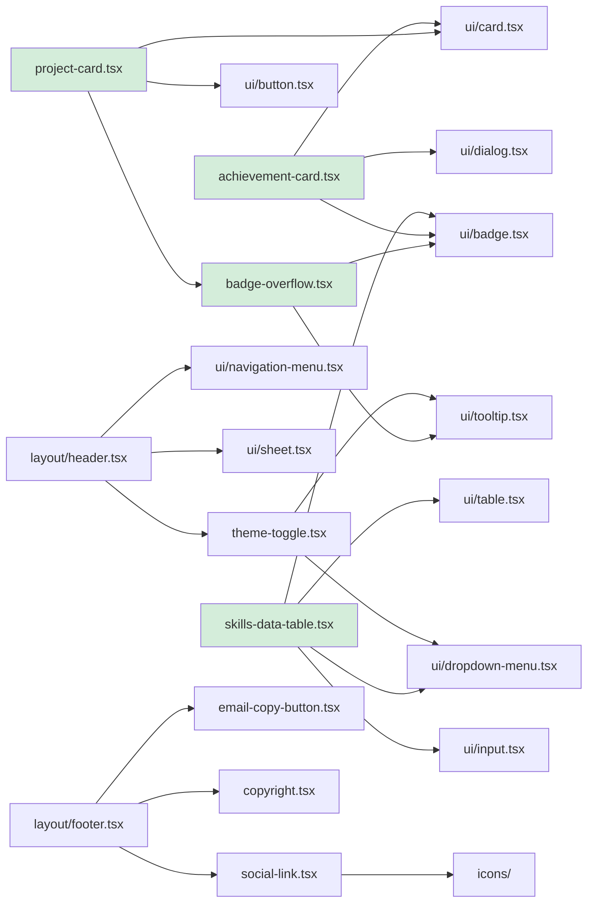

# Components Overview

**Navigation:** [Home](../index.md) → [Features & Components](./01-components-overview.md)

## Table of Contents

- [Introduction](#introduction)
- [Component Architecture](#component-architecture)
- [Component Tree Diagram](#component-tree-diagram)
- [Component Categories](#component-categories)
  - [Custom Components](#custom-components)
  - [Layout Components](#layout-components)
  - [UI Components (shadcn/ui)](#ui-components-shadcnui)
  - [Meta Components](#meta-components)
  - [Icon Components](#icon-components)
- [Component Dependencies](#component-dependencies)
- [Import Patterns](#import-patterns)
- [See Also](#see-also)
- [Next Steps](#next-steps)

## Introduction

This portfolio website is built with **Next.js 15** using the App Router architecture and features a rich component library combining custom components with [shadcn/ui](https://ui.shadcn.com/) primitives. All components follow TypeScript-first patterns with strict typing and use Tailwind CSS for styling.

The component system is organized into distinct categories, each serving specific purposes within the application architecture.

## Component Architecture

The component architecture follows these key principles:

1. **Absolute Imports**: All imports use the `@/` prefix for consistency
2. **Composition over Inheritance**: Components are highly composable
3. **Type Safety**: Strict TypeScript interfaces for all props
4. **Accessibility First**: ARIA attributes and semantic HTML
5. **Client/Server Split**: Explicit `"use client"` directives where needed

### Project Structure

```
components/
├── ui/                      # shadcn/ui components
│   ├── badge.tsx
│   ├── button.tsx
│   ├── card.tsx
│   ├── carousel.tsx
│   ├── dialog.tsx
│   ├── dropdown-menu.tsx
│   ├── input.tsx
│   ├── navigation-menu.tsx
│   ├── separator.tsx
│   ├── sheet.tsx
│   ├── table.tsx
│   ├── tabs.tsx
│   └── tooltip.tsx
├── consent/                 # GDPR cookie consent
│   ├── ConsentProvider.tsx
│   ├── CookieBanner.tsx
│   └── CookieSettingsButton.tsx
├── layout/                  # Layout components
│   ├── header.tsx
│   └── footer.tsx
├── meta/                    # SEO and analytics
│   ├── analytics.tsx
│   ├── structured-data.tsx
│   └── project-structured-data.tsx
├── icons/                   # Custom SVG icons
│   ├── index.ts
│   ├── github-icon.tsx
│   ├── linkedin-icon.tsx
│   └── file-download-icon.tsx
├── achievement-card.tsx     # Achievement display
├── badge-overflow.tsx       # Dynamic badge overflow
├── copyright.tsx            # Copyright notice
├── email-copy-button.tsx    # Email copy utility
├── project-card.tsx         # Project card display
├── related-projects.tsx     # Related project suggestions
├── skills-data-table.tsx    # Interactive skills table
├── social-link.tsx          # Social media links
├── theme-toggle.tsx         # Dark mode toggle
└── timeline.tsx             # Experience timeline
```

## Component Tree Diagram

The following diagram illustrates the component hierarchy and relationships:

```mermaid
graph TB
    App[App Layout] --> Header[Header]
    App --> Pages[Page Content]
    App --> Footer[Footer]

    Header --> Nav[NavigationMenu]
    Header --> ThemeToggle[ThemeToggle]
    Header --> Sheet[Mobile Menu Sheet]

    Footer --> SocialLink[SocialLink]
    Footer --> EmailCopyButton[EmailCopyButton]
    Footer --> Copyright[Copyright]
    Footer --> Icons[Custom Icons]

    Pages --> ProjectCard[ProjectCard]
    Pages --> AchievementCard[AchievementCard]
    Pages --> SkillsTable[SkillsDataTable]
    Pages --> Timeline[Timeline]
    Pages --> RelatedProjects[RelatedProjects]

    ProjectCard --> BadgeOverflow[BadgeOverflow]
    ProjectCard --> Card[UI: Card]
    ProjectCard --> Button[UI: Button]

    AchievementCard --> Dialog[UI: Dialog]
    AchievementCard --> Badge[UI: Badge]
    AchievementCard --> Card

    SkillsTable --> Table[UI: Table]
    SkillsTable --> Input[UI: Input]
    SkillsTable --> DropdownMenu[UI: DropdownMenu]
    SkillsTable --> Badge

    BadgeOverflow --> Tooltip[UI: Tooltip]
    BadgeOverflow --> Badge

    Timeline --> Button

    ThemeToggle --> DropdownMenu
    ThemeToggle --> Tooltip

    Pages --> Carousel[Project Gallery]
    Carousel --> CarouselUI[UI: Carousel]

    App --> Meta[Meta Components]
    Meta --> Analytics[Analytics]
    Meta --> StructuredData[Structured Data]

    App --> Consent[ConsentProvider]
    Consent --> Banner[CookieBanner]
    Consent --> Analytics
    Footer --> CookieSettingsBtn[CookieSettingsButton]

    style App fill:#e1f5ff
    style Header fill:#fff3cd
    style Footer fill:#fff3cd
    style Pages fill:#d4edda
    style Meta fill:#f8d7da
    style Consent fill:#e8f5e9
    style Banner fill:#e8f5e9
    style CookieSettingsBtn fill:#e8f5e9
```



## Component Categories

### Custom Components

Custom components are built specifically for this portfolio and handle domain-specific logic:

| Component               | Purpose                       | Client/Server | Key Features                       |
| ----------------------- | ----------------------------- | ------------- | ---------------------------------- |
| `project-card.tsx`      | Display project summaries     | Server        | Image optimization, badge overflow |
| `achievement-card.tsx`  | Show achievements with modals | Client        | Dialog integration, type badges    |
| `skills-data-table.tsx` | Interactive skills table      | Client        | Sorting, filtering, pagination     |
| `badge-overflow.tsx`    | Dynamic technology badges     | Client        | Responsive overflow detection      |
| `related-projects.tsx`  | Suggest related projects      | Server        | Algorithm-based matching           |
| `timeline.tsx`          | Experience timeline           | Client        | Smart date formatting              |
| `theme-toggle.tsx`      | Dark mode switcher            | Client        | Theme persistence                  |
| `social-link.tsx`       | Social media links            | Server        | Icon flexibility                   |
| `email-copy-button.tsx` | Copy email to clipboard       | Client        | Tooltip feedback                   |
| `copyright.tsx`         | Dynamic copyright year        | Client        | Auto-updating                      |

**See:** [Custom Components Deep Dive](./02-custom-components.md)

### Layout Components

Layout components provide the structural foundation for all pages:

- **Header** (`layout/header.tsx`): Navigation bar with responsive menu
- **Footer** (`layout/footer.tsx`): Site footer with links and contact info

**See:** [Layout Components](./13-layout-components.md)

### UI Components (shadcn/ui)

The UI layer uses shadcn/ui components configured with the **New York** style and **Slate** color scheme:

| Component             | Usage                     | Documentation                                                            |
| --------------------- | ------------------------- | ------------------------------------------------------------------------ |
| `button.tsx`          | Buttons with variants     | [shadcn Button](https://ui.shadcn.com/docs/components/button)            |
| `card.tsx`            | Content containers        | [shadcn Card](https://ui.shadcn.com/docs/components/card)                |
| `dialog.tsx`          | Modal dialogs             | [shadcn Dialog](https://ui.shadcn.com/docs/components/dialog)            |
| `table.tsx`           | Data tables               | [shadcn Table](https://ui.shadcn.com/docs/components/table)              |
| `carousel.tsx`        | Image carousels (Embla)   | [shadcn Carousel](https://ui.shadcn.com/docs/components/carousel)        |
| `dropdown-menu.tsx`   | Dropdown menus            | [shadcn Dropdown](https://ui.shadcn.com/docs/components/dropdown-menu)   |
| `tooltip.tsx`         | Hover tooltips            | [shadcn Tooltip](https://ui.shadcn.com/docs/components/tooltip)          |
| `badge.tsx`           | Tag badges                | [shadcn Badge](https://ui.shadcn.com/docs/components/badge)              |
| `sheet.tsx`           | Side panels (mobile menu) | [shadcn Sheet](https://ui.shadcn.com/docs/components/sheet)              |
| `navigation-menu.tsx` | Navigation menus          | [shadcn Nav Menu](https://ui.shadcn.com/docs/components/navigation-menu) |

**Configuration:**

```json:1:21:components.json
{
  "$schema": "https://ui.shadcn.com/schema.json",
  "style": "new-york",
  "rsc": true,
  "tsx": true,
  "tailwind": {
    "config": "tailwind.config.ts",
    "css": "app/globals.css",
    "baseColor": "slate",
    "cssVariables": true,
    "prefix": ""
  },
  "aliases": {
    "components": "@/components",
    "utils": "@/lib/utils",
    "ui": "@/components/ui",
    "lib": "@/lib",
    "hooks": "@/hooks"
  },
  "iconLibrary": "lucide"
}
```

**See:** [shadcn/ui Integration](./03-shadcn-ui.md)

### Consent Components

Consent components implement GDPR-compliant cookie consent:

| Component | Purpose | Client/Server |
|---|---|---|
| `consent/ConsentProvider.tsx` | React context exposing `accept()`, `decline()`, `reset()`; persists to `localStorage` | Client |
| `consent/CookieBanner.tsx` | Fixed bottom banner shown until user makes a choice | Client |
| `consent/CookieSettingsButton.tsx` | Footer button that calls `reset()` to re-show the banner | Client |

**See:** [Consent System](./16-consent-system.md)

### Meta Components

Meta components handle SEO, analytics, and structured data:

- **Analytics** (`meta/analytics.tsx`): Consent-gated Google Analytics 4, GTM, Vercel Analytics, and Speed Insights — only loads when user has accepted cookies
- **Structured Data** (`meta/structured-data.tsx`): JSON-LD schemas
- **Project Structured Data** (`meta/project-structured-data.tsx`): Project-specific schemas

**See:** [Meta Components](./15-meta-components.md)

### Icon Components

Custom SVG icons exported from `icons/index.ts`:

- `GitHubIcon`: GitHub logo
- `LinkedInIcon`: LinkedIn logo
- `FileDownloadIcon`: Download icon

**See:** [Icon System](./14-icons.md)

## Component Dependencies

### Dependency Graph



### External Dependencies

Key npm packages used by components:

```json
{
  "@tanstack/react-table": "^8.x", // SkillsDataTable
  "embla-carousel-react": "^8.x", // Carousel
  "next-themes": "^0.x", // ThemeToggle
  "lucide-react": "^0.x", // Icons
  "class-variance-authority": "^0.x", // Component variants
  "clsx": "^2.x", // Conditional classes
  "tailwind-merge": "^2.x" // Tailwind class merging
}
```

## Import Patterns

All components follow these import conventions:

### Absolute Imports

```typescript
// ✅ Correct - Using @/ prefix
import { Button } from "@/components/ui/button";
import { getProjects } from "@/lib/projects";
import { cn } from "@/lib/utils";

// ❌ Incorrect - Relative imports
import { Button } from "../ui/button";
import { getProjects } from "../../lib/projects";
```

### Component Imports

```typescript
// UI Components
import { Card, CardContent, CardTitle } from "@/components/ui/card";
import { Badge } from "@/components/ui/badge";

// Custom Components
import ProjectCard from "@/components/project-card";
import BadgeOverflow from "@/components/badge-overflow";

// Icons
import { GitHubIcon, LinkedInIcon } from "@/components/icons";
import { Mail, ExternalLink } from "lucide-react";

// Utilities
import { cn } from "@/lib/utils";
```

### Client Component Pattern

```typescript
"use client"; // Must be first line for client components

import { useState, useEffect } from "react";
import { useTheme } from "next-themes";
// ... rest of imports
```

## See Also

- [Custom Components Deep Dive](./02-custom-components.md) - Detailed component documentation
- [shadcn/ui Integration](./03-shadcn-ui.md) - UI component library setup
- [Theme System](./09-theme-system.md) - Dark mode implementation
- [Layout Components](./13-layout-components.md) - Header and footer details

## Next Steps

1. **Explore Custom Components**: Review [Custom Components](./02-custom-components.md) for implementation details
2. **Understand UI Layer**: Read [shadcn/ui Integration](./03-shadcn-ui.md)
3. **Learn State Management**: See [Theme System](./09-theme-system.md) for client-side state
4. **Review Best Practices**: Check [Architecture Overview](../01-architecture/01-overview.md)

---

**Last Updated:** 2024-02-09  
**Related Docs:** [Architecture](../01-architecture/01-overview.md) | [Data Flow](../01-architecture/03-data-flow.md) | [Design System](../06-guides/styling/04-design-system.md)
