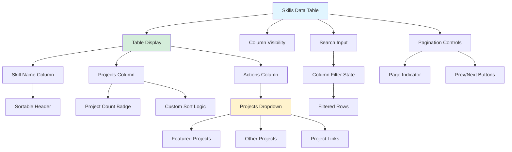
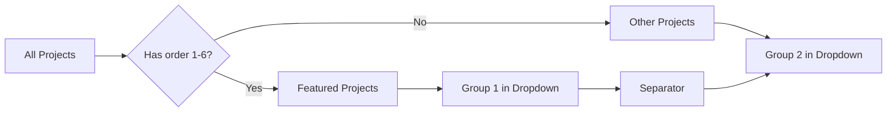
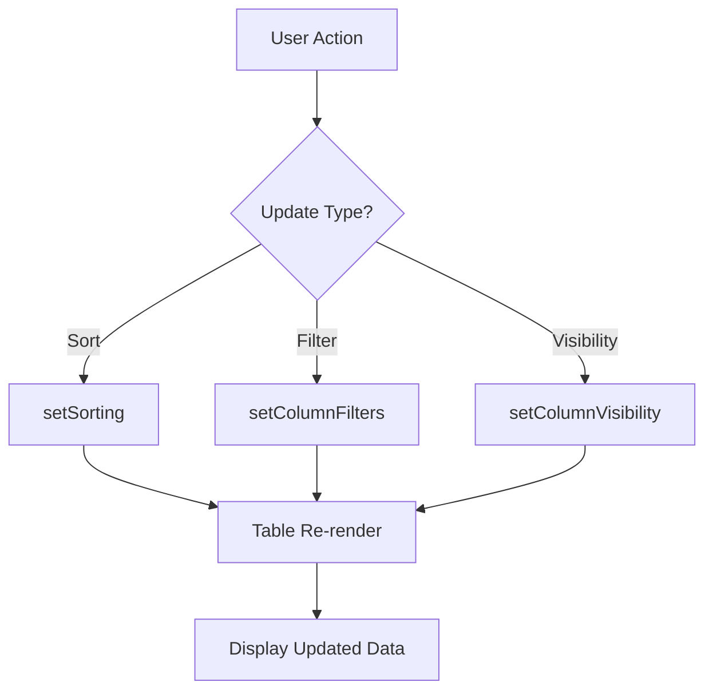
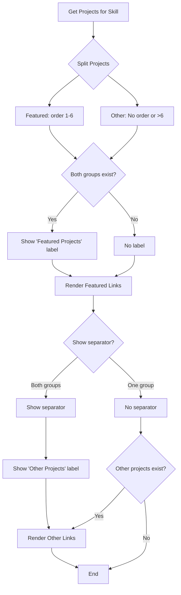

# Skills Table

**Navigation:** [Home](../index.md) → [Features & Components](./01-components-overview.md) → Skills Table

## Table of Contents

- [Introduction](#introduction)
- [Features](#features)
- [Architecture](#architecture)
- [TanStack React Table Integration](#tanstack-react-table-integration)
- [Column Definitions](#column-definitions)
- [State Management](#state-management)
- [Sorting Implementation](#sorting-implementation)
- [Filtering & Search](#filtering--search)
- [Pagination](#pagination)
- [Actions Dropdown](#actions-dropdown)
- [Responsive Design](#responsive-design)
- [Usage Examples](#usage-examples)
- [See Also](#see-also)
- [Next Steps](#next-steps)

## Introduction

The **Skills Data Table** (`components/skills-data-table.tsx`) is an interactive, feature-rich table component that displays programming skills alongside the projects where they're used. Built with [@tanstack/react-table](https://tanstack.com/table/latest), it provides professional data management capabilities including sorting, filtering, and pagination.

### Key Capabilities

- ✅ **Sortable Columns**: Click headers to sort by skill name or project count
- ✅ **Search/Filter**: Real-time skill name filtering
- ✅ **Pagination**: 10 skills per page with navigation controls
- ✅ **Column Visibility**: Toggle column visibility via dropdown
- ✅ **Project Dropdown**: Quick access to project pages
- ✅ **Featured Project Grouping**: Separates featured from other projects
- ✅ **Responsive**: Adapts to mobile and desktop layouts

## Features

### Visual Overview



## Architecture

### Component Structure

```typescript
components/skills-data-table.tsx
├── Column Definitions (exported)
│   ├── name: Skill name with sort
│   ├── projects: Project count with badge
│   └── actions: Dropdown menu
├── SkillsDataTable Component
│   ├── React Table Hook
│   ├── State Management
│   ├── Search Input
│   ├── Column Visibility Dropdown
│   ├── Table Rendering
│   └── Pagination Controls
```

### Dependencies

```json
{
  "@tanstack/react-table": "^8.x", // Core table logic
  "lucide-react": "^0.x" // Icons (ArrowUpDown, ChevronDown, etc.)
}
```

## TanStack React Table Integration

### Imports

```typescript:1:40:components/skills-data-table.tsx
"use client";

import * as React from "react";
import {
  ColumnDef,
  ColumnFiltersState,
  SortingState,
  VisibilityState,
  flexRender,
  getCoreRowModel,
  getFilteredRowModel,
  getPaginationRowModel,
  getSortedRowModel,
  useReactTable,
} from "@tanstack/react-table";
import { ArrowUpDown, ChevronDown, ExternalLink, MoreHorizontal } from "lucide-react";

import { Button } from "@/components/ui/button";
import {
  DropdownMenu,
  DropdownMenuCheckboxItem,
  DropdownMenuContent,
  DropdownMenuItem,
  DropdownMenuLabel,
  DropdownMenuSeparator,
  DropdownMenuTrigger,
} from "@/components/ui/dropdown-menu";
import { Input } from "@/components/ui/input";
import {
  Table,
  TableBody,
  TableCell,
  TableHead,
  TableHeader,
  TableRow,
} from "@/components/ui/table";
import { Badge } from "@/components/ui/badge";
import { Skill } from "@/lib/skills";
import Link from "next/link";
import { Project } from "@/lib/projects";
```

### Table Initialization

```typescript:161:189:components/skills-data-table.tsx
export function SkillsDataTable({ data }: DataTableProps) {
  const [sorting, setSorting] = React.useState<SortingState>([{ id: "projects", desc: true }]);
  const [columnFilters, setColumnFilters] = React.useState<ColumnFiltersState>([]);
  const [columnVisibility, setColumnVisibility] = React.useState<VisibilityState>({});
  const [rowSelection, setRowSelection] = React.useState({});

  const table = useReactTable({
    data,
    columns,
    onSortingChange: setSorting,
    onColumnFiltersChange: setColumnFilters,
    getCoreRowModel: getCoreRowModel(),
    getPaginationRowModel: getPaginationRowModel(),
    getSortedRowModel: getSortedRowModel(),
    getFilteredRowModel: getFilteredRowModel(),
    onColumnVisibilityChange: setColumnVisibility,
    onRowSelectionChange: setRowSelection,
    initialState: {
      pagination: {
        pageSize: 10, // Show 10 skills per page
      },
    },
    state: {
      sorting,
      columnFilters,
      columnVisibility,
      rowSelection,
    },
  });
  // ... render
}
```

### Default Sorting

The table initializes with **descending sort by project count**:

```typescript
const [sorting, setSorting] = React.useState<SortingState>([{ id: "projects", desc: true }]);
```

This ensures skills used in the most projects appear first.

## Column Definitions

### Name Column

```typescript:42:58:components/skills-data-table.tsx
export const columns: ColumnDef<Skill>[] = [
  {
    accessorKey: "name",
    header: ({ column }) => {
      return (
        <Button
          variant="ghost"
          onClick={() => column.toggleSorting(column.getIsSorted() === "asc")}
          className="text-card-foreground !px-0"
        >
          Skill
          <ArrowUpDown className="size-4" />
        </Button>
      );
    },
    cell: ({ row }) => <div className="font-medium">{row.getValue("name")}</div>,
  },
```

**Features:**

- Clickable header for alphabetical sorting
- `ArrowUpDown` icon indicates sortability
- Bold text (`font-medium`) for emphasis

### Projects Column

```typescript:59:87:components/skills-data-table.tsx
  {
    accessorKey: "projects",
    header: ({ column }) => {
      return (
        <Button
          variant="ghost"
          onClick={() => column.toggleSorting(column.getIsSorted() === "asc")}
          className="text-card-foreground !px-0"
        >
          Projects
          <ArrowUpDown className="size-4" />
        </Button>
      );
    },
    cell: ({ row }) => {
      const projects = row.getValue("projects") as Project[];

      return (
        <Badge variant="outline">
          {projects.length} project{projects.length !== 1 ? "s" : ""}
        </Badge>
      );
    },
    sortingFn: (rowA, rowB) => {
      const projectsA = rowA.getValue("projects") as Project[];
      const projectsB = rowA.getValue("projects") as Project[];
      return projectsA.length - projectsB.length;
    },
  },
```

**Features:**

- Custom `sortingFn` compares project array lengths
- Badge component displays count with proper pluralization
- `outline` variant for subtle appearance

### Actions Column

```typescript:88:154:components/skills-data-table.tsx
  {
    id: "actions",
    enableHiding: false,
    cell: ({ row }) => {
      const projects = row.getValue("projects") as Project[];
      const featuredProjects = projects.filter(
        (project) => project.order !== undefined && project.order >= 1 && project.order <= 6
      );
      const nonFeaturedProjects = projects.filter(
        (project) => featuredProjects.indexOf(project) === -1
      );

      return (
        <DropdownMenu>
          <DropdownMenuTrigger asChild>
            <Button variant="ghost" className="size-8">
              <span className="sr-only">Open menu</span>
              <MoreHorizontal className="size-4" />
            </Button>
          </DropdownMenuTrigger>
          <DropdownMenuContent align="end">
            <DropdownMenuLabel>View Projects</DropdownMenuLabel>
            {/* Featured Projects */}
            {featuredProjects.length > 0 && (
              <>
                {nonFeaturedProjects.length > 0 && (
                  <DropdownMenuLabel className="text-muted-foreground text-xs font-medium">
                    Featured Projects
                  </DropdownMenuLabel>
                )}
                {featuredProjects.map((project, i) => (
                  <DropdownMenuItem key={project.slug + i} asChild>
                    <Link href={`/projects/${project.slug}`} target="_blank">
                      <ExternalLink className="size-4" />
                      {project.title}
                    </Link>
                  </DropdownMenuItem>
                ))}
              </>
            )}
            {/* Separator */}
            {featuredProjects.length > 0 && nonFeaturedProjects.length > 0 && (
              <DropdownMenuSeparator />
            )}
            {/* Non-Featured Projects */}
            {nonFeaturedProjects.length > 0 && (
              <>
                {featuredProjects.length > 0 && (
                  <DropdownMenuLabel className="text-muted-foreground text-xs font-medium">
                    Other Projects
                  </DropdownMenuLabel>
                )}
                {nonFeaturedProjects.map((project, i) => (
                  <DropdownMenuItem key={project.slug + i} asChild>
                    <Link href={`/projects/${project.slug}`} target="_blank">
                      <ExternalLink className="size-4" />
                      {project.title}
                    </Link>
                  </DropdownMenuItem>
                ))}
              </>
            )}
          </DropdownMenuContent>
        </DropdownMenu>
      );
    },
  },
];
```

**Featured Project Logic:**



## State Management

### State Variables

```typescript
const [sorting, setSorting] = React.useState<SortingState>([...]);
const [columnFilters, setColumnFilters] = React.useState<ColumnFiltersState>([]);
const [columnVisibility, setColumnVisibility] = React.useState<VisibilityState>({});
const [rowSelection, setRowSelection] = React.useState({});
```

| State              | Type                 | Purpose                                     |
| ------------------ | -------------------- | ------------------------------------------- |
| `sorting`          | `SortingState`       | Tracks which column is sorted and direction |
| `columnFilters`    | `ColumnFiltersState` | Stores active filter values (search)        |
| `columnVisibility` | `VisibilityState`    | Controls which columns are visible          |
| `rowSelection`     | `object`             | Tracks selected rows (currently unused)     |

### State Flow



## Sorting Implementation

### Toggle Sorting

Clicking a column header toggles between three states:

1. **Ascending**: A → Z or 0 → 9
2. **Descending**: Z → A or 9 → 0
3. **None**: Original order

```typescript
onClick={() => column.toggleSorting(column.getIsSorted() === "asc")}
```

### Visual Indicator

The `ArrowUpDown` icon is always visible, indicating the column is sortable. The table doesn't show sort direction visually (could be enhanced).

### Custom Sort Function

The projects column uses a custom sorting function to compare array lengths:

```typescript
sortingFn: (rowA, rowB) => {
  const projectsA = rowA.getValue("projects") as Project[];
  const projectsB = rowB.getValue("projects") as Project[];
  return projectsA.length - projectsB.length;
};
```

## Filtering & Search

### Search Input

```typescript:192:201:components/skills-data-table.tsx
      <div className="flex items-center py-4">
        <Input
          placeholder="Search skills..."
          value={(table.getColumn("name")?.getFilterValue() as string) ?? ""}
          onChange={(event: React.ChangeEvent<HTMLInputElement>) =>
            table.getColumn("name")?.setFilterValue(event.target.value)
          }
          className="max-w-sm"
        />
```

**How It Works:**

1. Input binds to `name` column filter value
2. Typing updates `columnFilters` state
3. TanStack Table's `getFilteredRowModel` automatically filters rows
4. Case-insensitive substring matching (default behavior)

### Filter Status Display

```typescript:269:277:components/skills-data-table.tsx
        <div className="text-muted-foreground flex flex-1 gap-2 text-sm">
          <span>
            Page {table.getState().pagination.pageIndex + 1} of {table.getPageCount()}
          </span>
          -
          <span className="italic">
            {table.getFilteredRowModel().rows.length === data.length
              ? `${data.length} skill${data.length !== 1 ? "s" : ""}`
              : `${table.getFilteredRowModel().rows.length} of ${data.length} skills`}
```

Shows either:

- "50 skills" (no filter active)
- "12 of 50 skills" (filter active)

## Pagination

### Pagination Controls

```typescript:268:297:components/skills-data-table.tsx
      <div className="flex items-center justify-between space-x-2 py-4">
        <div className="text-muted-foreground flex flex-1 gap-2 text-sm">
          <span>
            Page {table.getState().pagination.pageIndex + 1} of {table.getPageCount()}
          </span>
          -
          <span className="italic">
            {table.getFilteredRowModel().rows.length === data.length
              ? `${data.length} skill${data.length !== 1 ? "s" : ""}`
              : `${table.getFilteredRowModel().rows.length} of ${data.length} skills`}
          </span>
        </div>
        <div className="flex items-center space-x-2">
          <Button
            variant="secondary"
            size="sm"
            onClick={() => table.previousPage()}
            disabled={!table.getCanPreviousPage()}
          >
            Previous
          </Button>
          <Button
            variant="secondary"
            size="sm"
            onClick={() => table.nextPage()}
            disabled={!table.getCanNextPage()}
          >
            Next
          </Button>
        </div>
      </div>
```

### Page Size

Set in `initialState`:

```typescript
initialState: {
  pagination: {
    pageSize: 10,  // 10 skills per page
  },
}
```

### Navigation Logic

- `table.previousPage()`: Go to previous page
- `table.nextPage()`: Go to next page
- `table.getCanPreviousPage()`: Disable button on first page
- `table.getCanNextPage()`: Disable button on last page

## Actions Dropdown

### Project Grouping Algorithm



### Dropdown UI Structure

```
┌─────────────────────────┐
│ View Projects           │ ← Label
├─────────────────────────┤
│ Featured Projects       │ ← Group Label (conditional)
│ 🔗 Project A            │ ← Featured project link
│ 🔗 Project B            │
├─────────────────────────┤ ← Separator (conditional)
│ Other Projects          │ ← Group Label (conditional)
│ 🔗 Project C            │ ← Other project link
│ 🔗 Project D            │
└─────────────────────────┘
```

## Responsive Design

### Mobile Considerations

The table uses shadcn/ui's responsive Table component which:

- Adds horizontal scroll on narrow screens
- Maintains column alignment
- Preserves interactive elements (buttons, dropdowns)

### Responsive Container

```typescript:227:267:components/skills-data-table.tsx
      <div className="rounded-md border">
        <Table className="bg-card text-card-foreground rounded-md">
          <TableHeader>
            {table.getHeaderGroups().map((headerGroup) => (
              <TableRow key={headerGroup.id} className="hover:bg-inherit">
                {headerGroup.headers.map((header) => {
                  return (
                    <TableHead key={header.id} className="w-full">
                      {header.isPlaceholder
                        ? null
                        : flexRender(header.column.columnDef.header, header.getContext())}
                    </TableHead>
                  );
                })}
              </TableRow>
            ))}
          </TableHeader>
          <TableBody>
            {table.getRowModel().rows?.length ? (
              table.getRowModel().rows.map((row) => (
                <TableRow key={row.id} className="hover:bg-inherit">
                  {row.getVisibleCells().map((cell) => (
                    <TableCell key={cell.id}>
                      {flexRender(cell.column.columnDef.cell, cell.getContext())}
                    </TableCell>
                  ))}
                </TableRow>
              ))
            ) : (
              <TableRow>
                <TableCell colSpan={columns.length} className="h-24 text-center">
                  No results.
                </TableCell>
              </TableRow>
            )}
          </TableBody>
        </Table>
      </div>
```

## Usage Examples

### Basic Usage

```typescript
import { getSkills } from "@/lib/skills";
import { SkillsDataTable } from "@/components/skills-data-table";

export default async function SkillsPage() {
  const skills = await getSkills();

  return (
    <div className="container mx-auto py-10">
      <h1 className="mb-6 text-3xl font-bold">My Skills</h1>
      <SkillsDataTable data={skills} />
    </div>
  );
}
```

### With Section Wrapper

```typescript
<section id="skills" className="py-20">
  <div className="container mx-auto">
    <h2 className="mb-8 text-center text-4xl font-bold">Skills & Technologies</h2>
    <p className="text-muted-foreground mb-12 text-center">
      Technologies I've worked with across different projects
    </p>
    <SkillsDataTable data={skills} />
  </div>
</section>
```

## See Also

- [Skills Data Generation](../03-content/05-skills-generation.md) - How skills are extracted from projects
- [TanStack Table Docs](https://tanstack.com/table/latest) - Official documentation
- [Badge Overflow](./08-badge-overflow.md) - Technology badge display
- [Custom Components](./02-custom-components.md) - Other custom components

## Next Steps

1. **Enhance Sorting**: Add visual indicators for sort direction (up/down arrows)
2. **Add Filters**: Implement project count range filters (e.g., "1-3 projects", "4+ projects")
3. **Persist State**: Save filter/sort preferences to localStorage
4. **Export Function**: Add CSV/JSON export capability
5. **Keyboard Navigation**: Enhance accessibility with keyboard shortcuts

---

**Last Updated:** 2024-02-09  
**Related Docs:** [Components](./01-components-overview.md) | [Data Flow](../01-architecture/03-data-flow.md) | [Testing](../04-development/07-testing.md)
