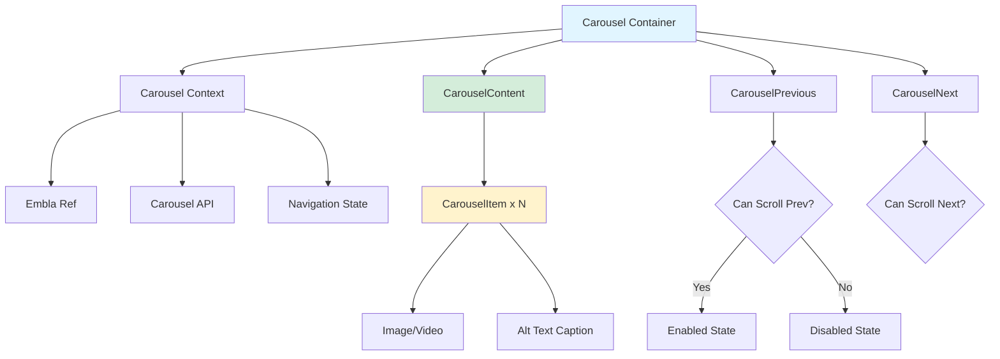

# Project Gallery with Embla Carousel

**Navigation:** [Home](../index.md) → [Features & Components](./01-components-overview.md) → Project Gallery

## Table of Contents

- [Introduction](#introduction)
- [Embla Carousel Integration](#embla-carousel-integration)
- [Carousel Component Structure](#carousel-component-structure)
- [Implementation in Project Pages](#implementation-in-project-pages)
- [Image and Video Support](#image-and-video-support)
- [Carousel Features](#carousel-features)
- [Accessibility](#accessibility)
- [Customization](#customization)
- [Usage Examples](#usage-examples)
- [See Also](#see-also)
- [Next Steps](#next-steps)

## Introduction

The **Project Gallery** feature provides an interactive carousel for browsing project screenshots, mockups, and demo videos. Built with **Embla Carousel** via shadcn/ui's Carousel component, it offers smooth animations, keyboard navigation, and responsive design.

### Key Features

- ✅ **Multi-Media Support**: Images and videos with proper optimization
- ✅ **Loop Navigation**: Seamless infinite scrolling
- ✅ **Keyboard Controls**: Arrow keys for navigation
- ✅ **Touch/Swipe**: Mobile-friendly gesture support
- ✅ **Lazy Loading**: Efficient resource loading
- ✅ **Captions**: Alt text displayed below each slide
- ✅ **Gradient Container**: Aesthetic background styling

## Embla Carousel Integration

### What is Embla Carousel?

[Embla Carousel](https://www.embla-carousel.com/) is a lightweight, dependency-free carousel library for React. It provides:

- Smooth momentum-based scrolling
- Extensive API for customization
- Small bundle size (~10KB)
- Framework-agnostic core
- Excellent TypeScript support

### shadcn/ui Wrapper

The project uses shadcn/ui's Carousel component, which wraps Embla Carousel:

```typescript:1:10:components/ui/carousel.tsx
"use client";

import * as React from "react";
import useEmblaCarousel, { type UseEmblaCarouselType } from "embla-carousel-react";
import { ArrowLeft, ArrowRight } from "lucide-react";

import { cn } from "@/lib/utils";
import { Button } from "@/components/ui/button";

type CarouselApi = UseEmblaCarouselType[1];
```

### Package Installation

```json
{
  "dependencies": {
    "embla-carousel-react": "^8.x"
  }
}
```

## Carousel Component Structure

### Component Architecture



### Core Hook

```typescript:43:103:components/ui/carousel.tsx
function Carousel({
  orientation = "horizontal",
  opts,
  setApi,
  plugins,
  className,
  children,
  ...props
}: React.ComponentProps<"div"> & CarouselProps) {
  const [carouselRef, api] = useEmblaCarousel(
    {
      ...opts,
      axis: orientation === "horizontal" ? "x" : "y",
    },
    plugins
  );
  const [canScrollPrev, setCanScrollPrev] = React.useState(false);
  const [canScrollNext, setCanScrollNext] = React.useState(false);

  const onSelect = React.useCallback((api: CarouselApi) => {
    if (!api) return;
    setCanScrollPrev(api.canScrollPrev());
    setCanScrollNext(api.canScrollNext());
  }, []);

  const scrollPrev = React.useCallback(() => {
    api?.scrollPrev();
  }, [api]);

  const scrollNext = React.useCallback(() => {
    api?.scrollNext();
  }, [api]);

  const handleKeyDown = React.useCallback(
    (event: React.KeyboardEvent<HTMLDivElement>) => {
      if (event.key === "ArrowLeft") {
        event.preventDefault();
        scrollPrev();
      } else if (event.key === "ArrowRight") {
        event.preventDefault();
        scrollNext();
      }
    },
    [scrollPrev, scrollNext]
  );

  React.useEffect(() => {
    if (!api || !setApi) return;
    setApi(api);
  }, [api, setApi]);

  React.useEffect(() => {
    if (!api) return;
    onSelect(api);
    api.on("reInit", onSelect);
    api.on("select", onSelect);

    return () => {
      api?.off("select", onSelect);
    };
  }, [api, onSelect]);
```

### Navigation Buttons

```typescript:163:220:components/ui/carousel.tsx
function CarouselPrevious({
  className,
  variant = "outline",
  size = "icon",
  ...props
}: React.ComponentProps<typeof Button>) {
  const { orientation, scrollPrev, canScrollPrev } = useCarousel();

  return (
    <Button
      data-slot="carousel-previous"
      variant={variant}
      size={size}
      className={cn(
        "absolute size-8 rounded-full",
        orientation === "horizontal"
          ? "top-1/2 -left-12 -translate-y-1/2"
          : "-top-12 left-1/2 -translate-x-1/2 rotate-90",
        className
      )}
      disabled={!canScrollPrev}
      onClick={scrollPrev}
      {...props}
    >
      <ArrowLeft />
      <span className="sr-only">Previous slide</span>
    </Button>
  );
}

function CarouselNext({
  className,
  variant = "outline",
  size = "icon",
  ...props
}: React.ComponentProps<typeof Button>) {
  const { orientation, scrollNext, canScrollNext } = useCarousel();

  return (
    <Button
      data-slot="carousel-next"
      variant={variant}
      size={size}
      className={cn(
        "absolute size-8 rounded-full",
        orientation === "horizontal"
          ? "top-1/2 -right-12 -translate-y-1/2"
          : "-bottom-12 left-1/2 -translate-x-1/2 rotate-90",
        className
      )}
      disabled={!canScrollNext}
      onClick={scrollNext}
      {...props}
    >
      <ArrowRight />
      <span className="sr-only">Next slide</span>
    </Button>
  );
}
```

## Implementation in Project Pages

### Project Detail Page Integration

```typescript:228:256:app/projects/[slug]/page.tsx
          {project.images && project.images.length > 1 && (
            <Carousel className="w-full overflow-hidden rounded-md" opts={{ loop: true }}>
              <CarouselContent>
                {project.images.map((image, index) => {
                  const { src, alt } = getImageProperties(
                    image,
                    `${project.title} screenshot ${index + 1}`
                  );
                  const isVideo = isVideoFile(src);

                  return (
                    <CarouselItem key={index}>
                      <GradientContainer>
                        {renderMediaContent(
                          src,
                          alt,
                          isVideo,
                          index === 0,
                          index === 0 ? "metadata" : "none"
                        )}
                      </GradientContainer>
                      <ImageCaption alt={alt} />
                    </CarouselItem>
                  );
                })}
              </CarouselContent>
              <CarouselPrevious className="left-2" />
              <CarouselNext className="right-2" />
            </Carousel>
          )}
```

### Configuration Options

```typescript
opts={{ loop: true }}
```

| Option          | Value         | Description                     |
| --------------- | ------------- | ------------------------------- |
| `loop`          | `true`        | Enable infinite loop navigation |
| `align`         | `"start"`     | Slide alignment (default)       |
| `skipSnaps`     | `false`       | Skip empty snaps (default)      |
| `containScroll` | `"trimSnaps"` | Handle scroll containment       |

**Full Options:** [Embla Carousel Options](https://www.embla-carousel.com/api/options/)

## Image and Video Support

### Media Type Detection

```typescript
import { isVideoFile } from "@/lib/utils";

const isVideo = isVideoFile(src);
```

**Utility Function:**

```typescript
// lib/utils.ts
export function isVideoFile(filename: string): boolean {
  const videoExtensions = [".mp4", ".webm", ".ogg", ".mov"];
  return videoExtensions.some((ext) => filename.toLowerCase().endsWith(ext));
}
```

### Image Properties Helper

```typescript
const { src, alt } = getImageProperties(image, `${project.title} screenshot ${index + 1}`);

function getImageProperties(image: ProjectImage | string, fallbackAlt: string) {
  if (typeof image === "string") {
    return { src: image, alt: fallbackAlt };
  }
  return { src: image.src, alt: image.alt || fallbackAlt };
}
```

### Rendering Media Content

```typescript
function renderMediaContent(
  src: string,
  alt: string,
  isVideo: boolean,
  isPriority: boolean,
  fetchPriority: "high" | "low" | "auto" | "metadata" | "none"
) {
  if (isVideo) {
    return (
      <video
        src={src}
        controls
        className="h-full w-full object-contain"
        preload="metadata"
      >
        Your browser does not support the video tag.
      </video>
    );
  }

  return (
    <Image
      src={src}
      alt={alt}
      width={1920}
      height={1080}
      className="h-full w-full object-contain"
      priority={isPriority}
      fetchPriority={fetchPriority as any}
    />
  );
}
```

### Gradient Container

```typescript
function GradientContainer({ children }: { children: React.ReactNode }) {
  return (
    <div className="from-accent via-muted to-primary bg-gradient-to-br aspect-video flex items-center justify-center overflow-hidden rounded-md">
      {children}
    </div>
  );
}
```

Creates a three-color gradient background (accent → muted → primary) for visual appeal.

### Image Caption

```typescript
function ImageCaption({ alt }: { alt: string }) {
  return (
    <p className="text-muted-foreground mt-2 text-center text-sm italic">
      {alt}
    </p>
  );
}
```

## Carousel Features

### Loop Navigation

With `opts={{ loop: true }}`, the carousel:

1. Wraps from last slide to first
2. Wraps from first slide to last
3. Maintains smooth transitions
4. Never disables navigation buttons

### Keyboard Navigation

Built-in keyboard support:

| Key               | Action         |
| ----------------- | -------------- |
| `←` (Left Arrow)  | Previous slide |
| `→` (Right Arrow) | Next slide     |

### Touch/Swipe Gestures

Automatically enabled on touch devices:

- **Swipe Left**: Next slide
- **Swipe Right**: Previous slide
- **Momentum Scrolling**: Natural physics-based movement

### Navigation State

The carousel tracks navigation state to disable buttons when appropriate:

```typescript
const [canScrollPrev, setCanScrollPrev] = React.useState(false);
const [canScrollNext, setCanScrollNext] = React.useState(false);
```

**Note:** With `loop: true`, these are always enabled.

## Accessibility

### ARIA Attributes

```typescript:118:124:components/ui/carousel.tsx
      <div
        onKeyDownCapture={handleKeyDown}
        className={cn("relative", className)}
        role="region"
        aria-roledescription="carousel"
        data-slot="carousel"
        {...props}
      >
```

### Slide Semantics

```typescript:145:160:components/ui/carousel.tsx
function CarouselItem({ className, ...props }: React.ComponentProps<"div">) {
  const { orientation } = useCarousel();

  return (
    <div
      role="group"
      aria-roledescription="slide"
      data-slot="carousel-item"
      className={cn(
        "min-w-0 shrink-0 grow-0 basis-full",
        orientation === "horizontal" ? "pl-4" : "pt-4",
        className
      )}
      {...props}
    />
  );
}
```

### Screen Reader Support

- Navigation buttons have `sr-only` labels:
  - "Previous slide"
  - "Next slide"
- Images include descriptive `alt` text
- Videos have text fallback for unsupported browsers

## Customization

### Button Positioning

Override default button positions:

```typescript
<CarouselPrevious className="left-2" />   {/* Default: -left-12 */}
<CarouselNext className="right-2" />      {/* Default: -right-12 */}
```

This moves buttons inside the carousel for better mobile UX.

### Button Variants

```typescript
<CarouselPrevious variant="ghost" size="lg" />
<CarouselNext variant="default" size="sm" />
```

### Custom Styling

```typescript
<Carousel className="mx-auto max-w-4xl shadow-2xl">
  {/* ... */}
</Carousel>

<CarouselItem className="md:basis-1/2 lg:basis-1/3">
  {/* Multiple slides visible on larger screens */}
</CarouselItem>
```

### Vertical Orientation

```typescript
<Carousel orientation="vertical" className="h-96">
  {/* ... */}
</Carousel>
```

## Usage Examples

### Basic Image Carousel

```typescript
import {
  Carousel,
  CarouselContent,
  CarouselItem,
  CarouselNext,
  CarouselPrevious,
} from "@/components/ui/carousel";
import Image from "next/image";

const images = [
  { src: "/image1.jpg", alt: "First image" },
  { src: "/image2.jpg", alt: "Second image" },
  { src: "/image3.jpg", alt: "Third image" },
];

export function ImageGallery() {
  return (
    <Carousel opts={{ loop: true }}>
      <CarouselContent>
        {images.map((image, index) => (
          <CarouselItem key={index}>
            <Image
              src={image.src}
              alt={image.alt}
              width={800}
              height={600}
              className="rounded-lg"
            />
          </CarouselItem>
        ))}
      </CarouselContent>
      <CarouselPrevious />
      <CarouselNext />
    </Carousel>
  );
}
```

### Carousel with API Access

```typescript
"use client";

import { useState } from "react";
import type { CarouselApi } from "@/components/ui/carousel";

export function ControlledCarousel() {
  const [api, setApi] = useState<CarouselApi>();
  const [current, setCurrent] = useState(0);
  const [count, setCount] = useState(0);

  React.useEffect(() => {
    if (!api) return;

    setCount(api.scrollSnapList().length);
    setCurrent(api.selectedScrollSnap() + 1);

    api.on("select", () => {
      setCurrent(api.selectedScrollSnap() + 1);
    });
  }, [api]);

  return (
    <div>
      <Carousel setApi={setApi}>
        {/* Carousel content */}
      </Carousel>
      <div className="text-center text-sm text-muted-foreground">
        Slide {current} of {count}
      </div>
    </div>
  );
}
```

### Multiple Slides Visible

```typescript
<Carousel
  opts={{
    align: "start",
    loop: true,
  }}
  className="w-full max-w-screen-xl"
>
  <CarouselContent>
    {Array.from({ length: 10 }).map((_, index) => (
      <CarouselItem key={index} className="md:basis-1/2 lg:basis-1/3">
        <Card>
          <CardContent className="flex aspect-square items-center justify-center p-6">
            <span className="text-4xl font-semibold">{index + 1}</span>
          </CardContent>
        </Card>
      </CarouselItem>
    ))}
  </CarouselContent>
  <CarouselPrevious />
  <CarouselNext />
</Carousel>
```

## See Also

- [Embla Carousel Documentation](https://www.embla-carousel.com/) - Official Embla docs
- [shadcn/ui Carousel](https://ui.shadcn.com/docs/components/carousel) - Component reference
- [Project Card Component](./02-custom-components.md#project-card-component) - Project card implementation
- [Next.js Image Optimization](https://nextjs.org/docs/app/building-your-application/optimizing/images) - Image component docs

## Next Steps

1. **Add Thumbnails**: Implement thumbnail navigation below carousel
2. **Lightbox Mode**: Full-screen image viewer on click
3. **Auto-play**: Add automatic slide progression with pause on hover
4. **Indicators**: Add dot indicators for slide position
5. **Lazy Loading**: Defer loading of off-screen slides

---

**Last Updated:** 2024-02-09  
**Related Docs:** [Components](./01-components-overview.md) | [shadcn/ui](./03-shadcn-ui.md) | [Image Handling](../03-content/08-image-handling.md)
