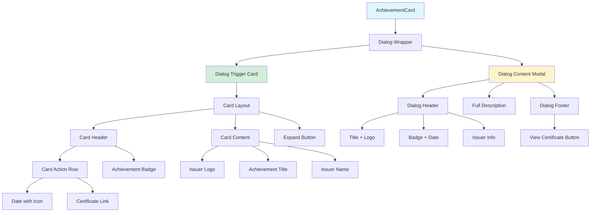

# Achievement Cards & Dialogs

**Navigation:** [Home](../README.md) → [Features & Components](./01-components-overview.md) → Achievement Cards

## Table of Contents

- [Introduction](#introduction)
- [Component Architecture](#component-architecture)
- [Type-Based Styling](#type-based-styling)
- [Card Structure](#card-structure)
- [Dialog Integration](#dialog-integration)
- [Achievement Types](#achievement-types)
- [Interactive Elements](#interactive-elements)
- [Accessibility Features](#accessibility-features)
- [Usage Examples](#usage-examples)
- [See Also](#see-also)
- [Next Steps](#next-steps)

## Introduction

The **Achievement Card** component (`components/achievement-card.tsx`) displays professional certifications, awards, and achievements in an interactive card-dialog pattern. Clicking a card opens a modal with complete details, external links, and formatted metadata.

### Key Features

- ✅ **Type-Based Coloring**: Visual distinction between certifications, awards, and achievements
- ✅ **Modal Details**: Click to expand for full description
- ✅ **External Links**: Direct links to certificate verification
- ✅ **Issuer Branding**: Display issuer logos in cards
- ✅ **Smart Dates**: ISO date formatting
- ✅ **Responsive Layout**: Grid-based responsive display
- ✅ **Dark Mode Support**: Color schemes adapt to theme

## Component Architecture

### File Structure

```
components/
├── achievement-card.tsx       # Main component + badge subcomponent
└── ui/
    ├── card.tsx              # Card primitives
    ├── dialog.tsx            # Modal primitives
    └── badge.tsx             # Badge component
```

### Component Flow



## Type-Based Styling

### Achievement Types

The component supports three achievement types:

```typescript
type AchievementType = "certification" | "award" | "achievement";
```

### Color Mapping Function

```typescript:32:43:components/achievement-card.tsx
const getTypeColor = (type: Achievement["type"]) => {
  switch (type) {
    case "certification":
      return "bg-blue-100 text-blue-800 dark:bg-blue-900 dark:text-blue-200";
    case "award":
      return "bg-yellow-100 text-yellow-800 dark:bg-yellow-900 dark:text-yellow-200";
    case "achievement":
      return "bg-green-100 text-green-800 dark:bg-green-900 dark:text-green-200";
    default:
      return "bg-gray-100 text-gray-800 dark:bg-gray-900 dark:text-gray-200";
  }
};
```

### Color Schemes

| Type              | Light Mode     | Dark Mode      | Icon      |
| ----------------- | -------------- | -------------- | --------- |
| **Certification** | Blue 100/800   | Blue 900/200   | FileBadge |
| **Award**         | Yellow 100/800 | Yellow 900/200 | Award     |
| **Achievement**   | Green 100/800  | Green 900/200  | Trophy    |

Visual representation:

```
Certification: 🔵 Blue (Professional credentials)
Award:         🟡 Yellow (Recognition & prizes)
Achievement:   🟢 Green (Milestones & accomplishments)
```

### Icon Mapping Function

```typescript:45:56:components/achievement-card.tsx
const getTypeIcon = (type: Achievement["type"]) => {
  switch (type) {
    case "certification":
      return <FileBadge className="h-4 w-4" />;
    case "award":
      return <Award className="h-4 w-4" />;
    case "achievement":
      return <Trophy className="h-4 w-4" />;
    default:
      return <Award className="h-4 w-4" />;
  }
};
```

## Card Structure

### Achievement Badge Component

Reusable subcomponent for consistent badge display:

```typescript:58:68:components/achievement-card.tsx
export function AchievementBadge({ achievement }: AchievementCardProps) {
  return (
    <Badge
      variant="secondary"
      className={cn(getTypeColor(achievement.type), "capitalize select-none")}
    >
      {getTypeIcon(achievement.type)}
      {achievement.type}
    </Badge>
  );
}
```

### Card Layout

```typescript:70:121:components/achievement-card.tsx
export default function AchievementCard({ achievement }: AchievementCardProps) {
  return (
    <Dialog>
      <DialogTrigger asChild>
        <Card className="group relative cursor-pointer gap-2.5 transition-all hover:shadow-lg">
          <CardHeader className="grid-rows-1 gap-0">
            <CardAction className="text-muted-foreground flex flex-row-reverse justify-baseline gap-2 text-sm select-none">
              <span className="flex flex-nowrap items-center gap-1">
                <Calendar className="size-4" />
                {achievement.date}
              </span>
              {achievement.link && (
                <Button variant="link" asChild>
                  <Link
                    href={achievement.link}
                    target="_blank"
                    rel="noopener noreferrer"
                    className="text-muted-foreground hover:text-primary h-auto justify-start !gap-1 !p-0 text-sm leading-tight transition-colors"
                    onClick={(e) => e.stopPropagation()}
                  >
                    <ExternalLink className="size-4" />
                    Cert
                  </Link>
                </Button>
              )}
            </CardAction>
            <AchievementBadge achievement={achievement} />
          </CardHeader>
          <CardContent className="flex gap-2">
            {achievement.image && (
              <Image
                src={achievement.image.src}
                alt={achievement.image.alt}
                width={40}
                height={40}
                className="border-secondary size-10 rounded-full border object-contain p-0.5"
              />
            )}
            <div>
              <CardTitle className="line-clamp-1 text-lg leading-tight text-pretty">
                {achievement.title}
              </CardTitle>
              <CardDescription className="text-primary line-clamp-1 font-medium">
                {achievement.issuer}
              </CardDescription>
            </div>
          </CardContent>
          <Button variant="ghost" className="absolute right-1 bottom-1 opacity-30 dark:opacity-70">
            <Maximize2 className="h-4 w-4" />
          </Button>
        </Card>
      </DialogTrigger>
      {/* Dialog content... */}
    </Dialog>
  );
}
```

### Card Anatomy

```
┌─────────────────────────────────────┐
│ Card Header                         │
│  ┌──────────────────────────────┐  │
│  │ [Cert Link] [📅 Date]        │  │ ← CardAction (flex-row-reverse)
│  │ [🔵 certification]            │  │ ← AchievementBadge
│  └──────────────────────────────┘  │
├─────────────────────────────────────┤
│ Card Content                        │
│  ┌──┐                               │
│  │🏢│ Achievement Title             │ ← Logo + Title
│  └──┘ Issuer Name                   │ ← Issuer
└─────────────────────────────────────┘
                          [🔍] ← Expand button (absolute positioned)
```

### CSS Classes Breakdown

```typescript
// Card container
className = "group relative cursor-pointer gap-2.5 transition-all hover:shadow-lg";
// - group: Parent for group-hover utilities
// - relative: Position context for absolute children
// - cursor-pointer: Indicate clickability
// - hover:shadow-lg: Shadow on hover

// CardAction (date/link row)
className =
  "text-muted-foreground flex flex-row-reverse justify-baseline gap-2 text-sm select-none";
// - flex-row-reverse: Date on right, link on left
// - justify-baseline: Align items to text baseline

// Logo image
className = "border-secondary size-10 rounded-full border object-contain p-0.5";
// - size-10: 40x40px
// - rounded-full: Circle
// - object-contain: Preserve aspect ratio

// Title
className = "line-clamp-1 text-lg leading-tight text-pretty";
// - line-clamp-1: Truncate to 1 line
// - text-pretty: Better line breaking

// Issuer
className = "text-primary line-clamp-1 font-medium";
// - text-primary: Use primary color
```

## Dialog Integration

### Dialog Content Structure

```typescript:122:162:components/achievement-card.tsx
      <DialogContent className="max-w-md">
        <DialogHeader>
          <DialogTitle className="mb-1 flex items-center gap-2">
            {achievement.image && (
              <Image
                src={achievement.image.src}
                alt={achievement.image.alt}
                width={36}
                height={36}
                className="border-secondary size-9 rounded-full border object-contain p-0.5"
              />
            )}
            {achievement.title}
          </DialogTitle>
          <div className="flex items-center justify-between">
            <AchievementBadge achievement={achievement} />
            <span className="text-muted-foreground flex items-center gap-1 text-sm">
              <Calendar className="size-4" />
              {achievement.date}
            </span>
          </div>
          <div className="text-primary text-left font-medium">{achievement.issuer}</div>
        </DialogHeader>
        {achievement.description && (
          <DialogDescription className="text-left text-base">
            {achievement.description}
          </DialogDescription>
        )}
        {achievement.link && (
          <DialogFooter>
            <div className="flex justify-end">
              <Button asChild>
                <Link href={achievement.link} target="_blank" rel="noopener noreferrer">
                  <ExternalLink />
                  View Certificate
                </Link>
              </Button>
            </div>
          </DialogFooter>
        )}
      </DialogContent>
```

### Dialog Layout

```
┌────────────────────────────────────────┐
│ Dialog Header                          │
│  ┌──┐                                  │
│  │🏢│ Achievement Title                │ ← Logo + Title
│  └──┘                                  │
│                                        │
│  [🔵 certification]      [📅 Date]    │ ← Badge + Date
│  Issuer Name                           │ ← Issuer
├────────────────────────────────────────┤
│ Dialog Description                     │
│  Full multi-paragraph description...   │
│  of the achievement with all details.  │
├────────────────────────────────────────┤
│ Dialog Footer                          │
│                   [View Certificate →] │ ← External link button
└────────────────────────────────────────┘
```

### Click Event Handling

The certificate link in the card prevents dialog opening:

```typescript
onClick={(e) => e.stopPropagation()}
```

This allows clicking the certificate link without triggering the dialog, while clicking anywhere else on the card opens it.

## Achievement Types

### Data Structure

```typescript
// lib/achievements.ts
interface Achievement {
  slug: string;
  title: string;
  issuer: string;
  date: string; // e.g., "2024-01"
  type: "certification" | "award" | "achievement";
  description?: string;
  link?: string; // Certificate verification URL
  image?: {
    src: string;
    alt: string;
  };
  order?: number;
}
```

### Type Usage Guidelines

**Certification** 🔵

- Professional credentials
- Industry certifications (AWS, Azure, etc.)
- Training completion certificates
- Educational qualifications

**Award** 🟡

- Competition prizes
- Recognition awards
- Contest wins
- Honors and accolades

**Achievement** 🟢

- Personal milestones
- Project completions
- Goal accomplishments
- General achievements

## Interactive Elements

### Hover Effects

```typescript
className = "group relative cursor-pointer gap-2.5 transition-all hover:shadow-lg";
```

**Hover Changes:**

- Shadow increases from default to `shadow-lg`
- Expand button appears (via opacity change)
- Cursor changes to pointer

### Expand Button

```typescript
<Button variant="ghost" className="absolute right-1 bottom-1 opacity-30 dark:opacity-70">
  <Maximize2 className="h-4 w-4" />
</Button>
```

Positioned absolutely in bottom-right corner, subtle opacity indicates expandable content.

### External Links

Two link types:

1. **Card Link** (optional): Direct to certificate
2. **Dialog Button** (optional): Prominent certificate link

Both use:

- `target="_blank"` - Open in new tab
- `rel="noopener noreferrer"` - Security best practice

## Accessibility Features

### Semantic HTML

```typescript
<Dialog>
  <DialogTrigger asChild>
    <Card> {/* Button-like card */}
  </DialogTrigger>
  <DialogContent>
    <DialogHeader>
      <DialogTitle> {/* h2 by default */}
      <DialogDescription> {/* p by default */}
    </DialogHeader>
  </DialogContent>
</Dialog>
```

### Screen Reader Support

- Card is keyboard-focusable and activatable
- Dialog title announces content
- Close button has aria-label
- Icon buttons have sr-only labels

### Keyboard Navigation

| Key               | Action                   |
| ----------------- | ------------------------ |
| `Tab`             | Navigate between cards   |
| `Enter` / `Space` | Open dialog              |
| `Esc`             | Close dialog             |
| `Tab` (in dialog) | Navigate dialog elements |

### Color Contrast

All type colors meet WCAG AA standards:

- Light mode: Dark text on light background
- Dark mode: Light text on dark background
- Icon + text for redundancy (not color-only)

## Usage Examples

### Basic Implementation

```typescript
import AchievementCard from "@/components/achievement-card";
import { getAchievements } from "@/lib/achievements";

export default async function AchievementsSection() {
  const achievements = await getAchievements();

  return (
    <section className="py-20">
      <h2 className="mb-12 text-center text-4xl font-bold">Achievements</h2>
      <div className="grid grid-cols-1 gap-6 md:grid-cols-2 lg:grid-cols-3">
        {achievements.map((achievement) => (
          <AchievementCard key={achievement.slug} achievement={achievement} />
        ))}
      </div>
    </section>
  );
}
```

### Filtered by Type

```typescript
const certifications = achievements.filter(a => a.type === "certification");
const awards = achievements.filter(a => a.type === "award");

return (
  <>
    <h3>Certifications</h3>
    <div className="grid gap-6 md:grid-cols-2">
      {certifications.map(cert => (
        <AchievementCard key={cert.slug} achievement={cert} />
      ))}
    </div>

    <h3>Awards</h3>
    <div className="grid gap-6 md:grid-cols-2">
      {awards.map(award => (
        <AchievementCard key={award.slug} achievement={award} />
      ))}
    </div>
  </>
);
```

### Responsive Grid Layouts



```typescript
// 1 column mobile, 2 tablet, 3 desktop
className="grid grid-cols-1 gap-6 md:grid-cols-2 lg:grid-cols-3"

// 1 column mobile, 2 desktop
className="grid grid-cols-1 gap-6 md:grid-cols-2"

// 2 columns always, narrow gap
className="grid grid-cols-2 gap-4"

// Masonry-like with auto-fit
className="grid auto-rows-fr gap-6"
style={{ gridTemplateColumns: "repeat(auto-fit, minmax(300px, 1fr))" }}
```



### Standalone Badge Usage

```typescript
import { AchievementBadge } from "@/components/achievement-card";

<div className="flex gap-2">
  {achievements.map(achievement => (
    <AchievementBadge key={achievement.slug} achievement={achievement} />
  ))}
</div>
```

## See Also

- [Custom Components](./02-custom-components.md#achievement-card-component) - Overview
- [Dialog Component](https://ui.shadcn.com/docs/components/dialog) - shadcn/ui docs
- [Card Component](https://ui.shadcn.com/docs/components/card) - shadcn/ui docs
- [Badge Component](https://ui.shadcn.com/docs/components/badge) - shadcn/ui docs
- [Data Layer](../01-architecture/03-data-layer.md#achievements) - Achievement data structure

## Next Steps

1. **Add Sorting**: Sort by date, type, or issuer
2. **Add Filtering**: Filter by type with toggle buttons
3. **Enhance Images**: Add fallback images for issuers without logos
4. **Add Timeline**: Display achievements on a chronological timeline
5. **Add Sharing**: Share achievement cards on social media
6. **Add Print Styles**: Print-friendly achievement certificates

---

**Last Updated:** 2024-02-09  
**Related Docs:** [Components](./01-components-overview.md) | [shadcn/ui](./03-shadcn-ui.md) | [Data Layer](../01-architecture/03-data-layer.md)
