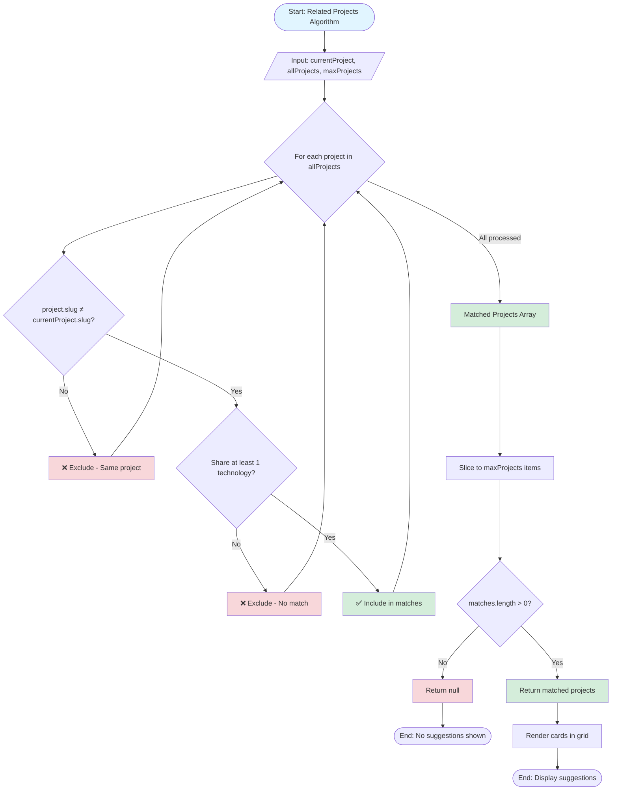

# Related Projects Algorithm

**Navigation:** [Home](../index.md) → [Features & Components](./01-components-overview.md) → Related Projects

## Table of Contents

- [Introduction](#introduction)
- [Algorithm Overview](#algorithm-overview)
- [Implementation](#implementation)
- [Algorithm Flowchart](#algorithm-flowchart)
- [Matching Logic](#matching-logic)
- [Edge Cases](#edge-cases)
- [Performance Considerations](#performance-considerations)
- [Customization](#customization)
- [Usage Examples](#usage-examples)
- [See Also](#see-also)
- [Next Steps](#next-steps)

## Introduction

The **Related Projects** component (`components/related-projects.tsx`) implements a recommendation algorithm that suggests projects similar to the one currently being viewed. It uses technology overlap as the primary matching criterion, helping visitors discover related work.

### Key Features

- ✅ **Technology-Based Matching**: Projects sharing technologies are considered related
- ✅ **Smart Filtering**: Excludes current project from suggestions
- ✅ **Configurable Limit**: Control number of suggestions (default: 3)
- ✅ **Graceful Degradation**: Returns null when no matches found
- ✅ **Server Component**: No client-side JavaScript overhead
- ✅ **Type-Safe**: Full TypeScript support

## Algorithm Overview

### High-Level Logic

```
1. Receive current project and all projects as input
2. Filter projects that share at least one technology with current project
3. Exclude the current project itself
4. Limit results to maxProjects (default: 3)
5. Return matched projects or null if none found
```

### Matching Criteria

A project is considered "related" if:

1. It's **not** the current project
2. It shares **at least one** technology with the current project

**Example:**

```
Current Project: "Portfolio Website"
Technologies: ["Next.js", "TypeScript", "Tailwind CSS"]

All Projects:
- "E-commerce App" → ["Next.js", "React", "Stripe"] ✅ Matches (Next.js)
- "Mobile Game" → ["Unity", "C#"] ❌ No match
- "Blog Platform" → ["TypeScript", "Node.js"] ✅ Matches (TypeScript)
- "Portfolio Website" → ["Next.js", "TypeScript", "Tailwind CSS"] ❌ Excluded (current)
```

## Implementation

### Component Code

```typescript:1:56:components/related-projects.tsx
import Link from "next/link";
import type { ClassValue } from "clsx";
import { Button } from "@/components/ui/button";
import { Card, CardContent, CardDescription, CardFooter, CardTitle } from "@/components/ui/card";
import { cn } from "@/lib/utils";
import type { Project } from "@/lib/projects";

interface RelatedProjectsProps {
  currentProject: Project;
  allProjects: Project[];
  maxProjects?: number;
  className?: ClassValue;
}

export default function RelatedProjects({
  currentProject,
  allProjects,
  maxProjects = 3,
  className,
}: RelatedProjectsProps) {
  // Find projects that share at least one technology with the current project
  const relatedProjects = allProjects
    .filter(
      (project) =>
        project.slug !== currentProject.slug && // Exclude current project
        project.technologies.some((tech) => currentProject.technologies.includes(tech))
    )
    .slice(0, maxProjects);

  if (relatedProjects.length === 0) {
    return null;
  }

  return (
    <div className={cn("", className)}>
      <h2 className="mb-6 text-2xl font-bold">Related Projects</h2>
      <div className="grid grid-cols-1 gap-6 md:grid-cols-3">
        {relatedProjects.map((project) => (
          <Card key={project.slug} className="shadow-md">
            <CardContent className="grow">
              <CardTitle className="mb-2 font-bold">{project.title}</CardTitle>
              <CardDescription className="line-clamp-3" title={project.shortDescription}>
                {project.shortDescription}
              </CardDescription>
            </CardContent>
            <CardFooter>
              <Button variant="secondary" size="sm" className="w-full" asChild>
                <Link href={`/projects/${project.slug}`}>View Project</Link>
              </Button>
            </CardFooter>
          </Card>
        ))}
      </div>
    </div>
  );
}
```

### Props Interface

```typescript
interface RelatedProjectsProps {
  currentProject: Project; // The project being viewed
  allProjects: Project[]; // All available projects
  maxProjects?: number; // Max suggestions (default: 3)
  className?: ClassValue; // Optional styling
}
```

## Algorithm Flowchart

### Visual Representation



### Detailed Step-by-Step

1. **Input Validation**
   - Receive current project
   - Receive all projects array
   - Receive max results limit (default 3)

2. **Filtering Phase**

   ```typescript
   allProjects.filter((project) => {
     // Step 2a: Exclude current project
     if (project.slug === currentProject.slug) return false;

     // Step 2b: Check technology overlap
     return project.technologies.some((tech) => currentProject.technologies.includes(tech));
   });
   ```

3. **Limiting Phase**

   ```typescript
   .slice(0, maxProjects)
   ```

   Takes first N matches

4. **Return Phase**
   ```typescript
   if (relatedProjects.length === 0) return null;
   return <RelatedProjectsUI />;
   ```

## Matching Logic

### Technology Comparison

The matching uses JavaScript's `Array.some()` and `Array.includes()`:

```typescript
project.technologies.some((tech) => currentProject.technologies.includes(tech));
```

**Breakdown:**

```typescript
// Example data
currentProject.technologies = ["React", "TypeScript", "Next.js"];
project.technologies = ["Vue", "TypeScript", "Vite"];

// Check if ANY tech in project exists in currentProject
project.technologies.some(
  (
    tech // For each: "Vue", "TypeScript", "Vite"
  ) => currentProject.technologies.includes(tech) // Check if exists in current
);
// "Vue" → includes? false
// "TypeScript" → includes? true ✅ (stops here, returns true)
```

### Match Strength

The current algorithm treats all matches equally (binary: match or no match). It doesn't consider:

- Number of shared technologies
- Importance of technologies
- Recency of projects

**Enhancement Opportunity:** Implement weighted matching (see [Next Steps](#next-steps))

### Array.slice() Behavior

```typescript
.slice(0, maxProjects)
```

- Returns first `maxProjects` items
- If fewer matches than limit, returns all matches
- Original array remains unchanged
- Empty array if no matches (handled by length check)

## Edge Cases

### No Matches Found

```typescript
if (relatedProjects.length === 0) {
  return null;
}
```

**Result:** Component renders nothing, no empty state shown.

**Alternative Approach:**

```typescript
if (relatedProjects.length === 0) {
  return <EmptyState />;
}
```

### Single Match

When only one related project exists:

- Component still renders
- Grid adapts responsively
- Single card displayed

### Excessive Matches

If 20 projects match but `maxProjects = 3`:

- Only first 3 returned
- No sorting applied (order depends on input array)
- No prioritization logic

**Enhancement:** Add sorting by relevance or date

### Current Project in AllProjects

The algorithm assumes `currentProject` exists in `allProjects` array and correctly filters it out:

```typescript
project.slug !== currentProject.slug;
```

### Duplicate Technologies

If current project has duplicate tech entries (data error):

```typescript
currentProject.technologies = ["React", "React", "TypeScript"];
```

The algorithm still works correctly due to `includes()` behavior, but data should be cleaned.

## Performance Considerations

### Time Complexity

**O(n × m × p)** where:

- n = number of all projects
- m = average technologies per project
- p = average technologies in current project

**Breakdown:**

```typescript
allProjects.filter(
  (
    project // O(n)
  ) =>
    project.slug !== currentProject.slug && // O(1)
    project.technologies.some(
      (
        tech // O(m)
      ) => currentProject.technologies.includes(tech) // O(p)
    )
);
```

### Optimization Opportunities

1. **Early Exit on Limit Reached**

   ```typescript
   const relatedProjects: Project[] = [];
   for (const project of allProjects) {
     if (relatedProjects.length >= maxProjects) break;
     if (/* match logic */) {
       relatedProjects.push(project);
     }
   }
   ```

2. **Use Set for Technology Lookup**

   ```typescript
   const currentTechs = new Set(currentProject.technologies);
   project.technologies.some((tech) => currentTechs.has(tech)); // O(1) lookup
   ```

3. **Memoization**
   Cache results for repeat views (if client-side)

### Memory Usage

Minimal - only stores filtered array slice:

- 3 projects (default) × ~1KB each = ~3KB
- Total component overhead: negligible

## Customization

### Change Maximum Results

```typescript
<RelatedProjects
  currentProject={project}
  allProjects={allProjects}
  maxProjects={5}  // Show 5 instead of 3
/>
```

### Custom Grid Layout

```typescript
<RelatedProjects
  currentProject={project}
  allProjects={allProjects}
  className="grid gap-4 md:grid-cols-4"  // 4 columns on desktop
/>
```

### Add Sorting

Modify the algorithm to sort by match strength:

```typescript
const relatedProjects = allProjects
  .filter(/* existing filter */)
  .map((project) => ({
    project,
    matchCount: project.technologies.filter((tech) => currentProject.technologies.includes(tech))
      .length,
  }))
  .sort((a, b) => b.matchCount - a.matchCount)
  .slice(0, maxProjects)
  .map((item) => item.project);
```

### Technology Weights

Assign importance to technologies:

```typescript
const techWeights = {
  React: 3,
  TypeScript: 2,
  CSS: 1,
};

const score = project.technologies.reduce((sum, tech) => sum + (techWeights[tech] || 1), 0);
```

## Usage Examples

### Basic Usage on Project Page

```typescript
import { getProjects, getProjectBySlug } from "@/lib/projects";
import RelatedProjects from "@/components/related-projects";

export default async function ProjectPage({ params }: { params: { slug: string } }) {
  const project = await getProjectBySlug(params.slug);
  const allProjects = await getProjects();

  return (
    <main>
      {/* Project content */}

      <RelatedProjects
        currentProject={project}
        allProjects={allProjects}
      />
    </main>
  );
}
```

### With Custom Limit

```typescript
<RelatedProjects
  currentProject={project}
  allProjects={allProjects}
  maxProjects={6}  // Show up to 6 suggestions
/>
```

### With Wrapper Section

```typescript
<section className="bg-muted/30 py-16">
  <div className="container mx-auto max-w-6xl px-4">
    <RelatedProjects
      currentProject={project}
      allProjects={allProjects}
      className="mx-auto"
    />
  </div>
</section>
```

### Conditional Rendering

```typescript
const relatedComponent = (
  <RelatedProjects
    currentProject={project}
    allProjects={allProjects}
  />
);

// Component returns null if no matches, so this works:
{relatedComponent && <Separator className="my-12" />}
{relatedComponent}
```

## See Also

- [Project Data Structure](../01-architecture/03-data-flow.md#projects) - Project schema
- [Project Card Component](./02-custom-components.md#project-card-component) - Card design
- [Skills Generation](../03-content/05-skills-generation.md) - Similar technology analysis
- [Performance Optimization](../06-guides/seo/05-performance.md) - Performance tips

## Next Steps

1. **Weighted Matching**: Score projects by number of shared technologies
2. **Category Matching**: Add project categories for better matching
3. **User Preferences**: Track viewed projects and personalize suggestions
4. **Featured Prioritization**: Boost featured projects in results
5. **Date Sorting**: Prefer recent projects in suggestions
6. **A/B Testing**: Test different matching algorithms
7. **Analytics**: Track which suggestions are clicked

### Enhanced Algorithm Example

```typescript
function getRelatedProjects(
  currentProject: Project,
  allProjects: Project[],
  options: {
    maxProjects?: number;
    sortBy?: "relevance" | "date" | "featured";
    minSharedTech?: number;
  }
) {
  const { maxProjects = 3, sortBy = "relevance", minSharedTech = 1 } = options;

  // Calculate match scores
  const scoredProjects = allProjects
    .filter((p) => p.slug !== currentProject.slug)
    .map((project) => {
      const sharedTech = project.technologies.filter((tech) =>
        currentProject.technologies.includes(tech)
      );

      return {
        project,
        score: sharedTech.length,
        isFeatured: project.order !== undefined,
        date: new Date(project.createdAt || 0),
      };
    })
    .filter((item) => item.score >= minSharedTech);

  // Sort based on criteria
  if (sortBy === "relevance") {
    scoredProjects.sort((a, b) => {
      if (a.score !== b.score) return b.score - a.score;
      if (a.isFeatured !== b.isFeatured) return a.isFeatured ? -1 : 1;
      return b.date.getTime() - a.date.getTime();
    });
  } else if (sortBy === "date") {
    scoredProjects.sort((a, b) => b.date.getTime() - a.date.getTime());
  } else if (sortBy === "featured") {
    scoredProjects.sort((a, b) => {
      if (a.isFeatured !== b.isFeatured) return a.isFeatured ? -1 : 1;
      return b.score - a.score;
    });
  }

  return scoredProjects.slice(0, maxProjects).map((item) => item.project);
}
```

---

**Last Updated:** 2024-02-09  
**Related Docs:** [Components](./01-components-overview.md) | [Data Flow](../01-architecture/03-data-flow.md) | [Project Card](./02-custom-components.md)
