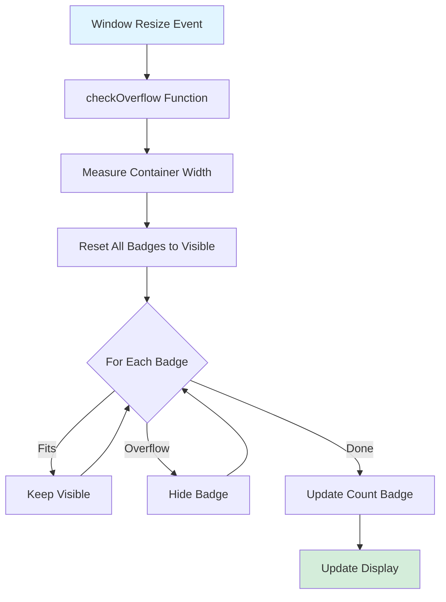

# Badge Overflow Detection

**Navigation:** [Home](../README.md) → [Features & Components](./01-components-overview.md) → Badge Overflow

## Table of Contents

- [Introduction](#introduction)
- [The Problem](#the-problem)
- [The Solution](#the-solution)
- [Algorithm Implementation](#algorithm-implementation)
- [Overflow Detection Logic](#overflow-detection-logic)
- [Performance Optimizations](#performance-optimizations)
- [Tooltip Integration](#tooltip-integration)
- [Responsive Behavior](#responsive-behavior)
- [Usage Examples](#usage-examples)
- [See Also](#see-also)
- [Next Steps](#next-steps)

## Introduction

The **BadgeOverflow** component (`components/badge-overflow.tsx`) dynamically displays technology badges with intelligent overflow handling. When badges exceed available width, it automatically hides overflow items and displays a "+N more" indicator with a tooltip showing hidden technologies.

### Key Features

- ✅ **Dynamic Overflow Detection**: Automatically calculates which badges fit
- ✅ **Responsive**: Adjusts on window resize
- ✅ **Performance Optimized**: Uses `requestAnimationFrame` and efficient DOM measurements
- ✅ **Tooltip Feedback**: Shows hidden technologies on hover
- ✅ **Graceful Degradation**: Works without JavaScript (shows all badges)
- ✅ **Accessibility**: Proper ARIA labels and tooltip roles

## The Problem

### Fixed-Width Containers

Project cards have fixed widths, but technology lists vary in length:

```
Card Width: 350px

Short list:  [React] [TypeScript]  ← Fits fine

Long list:   [React] [TypeScript] [Next.js] [Tailwind] [PostgreSQL] [Docker] [AWS]
             ← Wraps to multiple lines or overflows!
```

### Issues Without Overflow Handling

1. **Visual Chaos**: Badges wrap to multiple lines, breaking card layout
2. **Inconsistent Heights**: Cards become different sizes
3. **Information Overload**: Too many badges distract from key info
4. **Poor UX**: No indication of hidden technologies

## The Solution

### Visual Representation

```
Before Overflow Detection:
┌──────────────────────────────────┐
│ [React] [TypeScript] [Next.js]   │
│ [Tailwind] [PostgreSQL] [Docker] │ ← Wrapped to 2 lines
│ [AWS]                             │
└──────────────────────────────────┘

After Overflow Detection:
┌──────────────────────────────────┐
│ [React] [TypeScript] [Next.js]   │
│ +4 more ← Tooltip                 │ ← Single line, compact
└──────────────────────────────────┘
```

### Algorithm Overview

```
1. Measure container width
2. Measure each badge width
3. Calculate cumulative width + gap
4. Hide badges that exceed (containerWidth - 60px)
5. Display "+N more" indicator
6. Attach tooltip with hidden tech names
```

## Algorithm Implementation

### Component Structure



```typescript:1:93:components/badge-overflow.tsx
"use client";

import { useEffect, useRef, useState } from "react";
import { Badge } from "@/components/ui/badge";
import { Tooltip, TooltipContent, TooltipTrigger } from "@/components/ui/tooltip";
import { cn } from "@/lib/utils";

interface BadgeOverflowProps {
  technologies: string[];
  className?: string;
}

export default function BadgeOverflow({ technologies, className }: BadgeOverflowProps) {
  const containerRef = useRef<HTMLUListElement>(null);
  const countRef = useRef<HTMLLIElement>(null);
  const [hiddenTechs, setHiddenTechs] = useState<string[]>([]);

  useEffect(() => {
    const checkOverflow = () => {
      if (!containerRef.current || !countRef.current) return;

      // Reset badge visibility
      const badges = containerRef.current.querySelectorAll("li[data-tech]");
      badges.forEach((badge) => ((badge as HTMLElement).style.display = "inline-block"));

      // Hide count badge initially
      countRef.current.style.display = "none";

      // Measure container
      const containerWidth = containerRef.current.getBoundingClientRect().width;
      const hidden: string[] = [];

      // Calculate which badges fit
      let currentWidth = 0;
      badges.forEach((badge, i) => {
        const badgeWidth = badge.getBoundingClientRect().width + 8; // 8px for gap
        const tech = technologies[i];

        // Check if this badge would overflow (reserve 60px for count badge)
        if (currentWidth + badgeWidth > containerWidth - 60) {
          (badge as HTMLElement).style.display = "none";
          hidden.push(tech);
        } else {
          currentWidth += badgeWidth;
        }
      });

      // Update hidden techs and count badge
      setHiddenTechs(hidden);

      if (hidden.length > 0) {
        countRef.current.textContent = `+${hidden.length} more`;
        countRef.current.style.display = "inline";
      }
    };

    // Run after DOM update
    requestAnimationFrame(checkOverflow);
    window.addEventListener("resize", checkOverflow);

    return () => window.removeEventListener("resize", checkOverflow);
  }, [technologies]);

  return (
    <ul
      className={cn("flex items-baseline gap-2 overflow-hidden whitespace-nowrap", className)}
      ref={containerRef}
    >
      {technologies.map((tech) => (
        <Badge variant="secondary" key={tech} asChild>
          <li data-tech={tech}>{tech}</li>
        </Badge>
      ))}

      {/* "+x more" badge with tooltip */}
      <Tooltip>
        <TooltipTrigger asChild>
          <li
            className="text-muted-foreground cursor-help text-xs text-nowrap"
            style={{ display: "none" }}
            ref={countRef}
            role="tooltip"
            aria-label="Additional technologies"
            data-count
          />
        </TooltipTrigger>
        <TooltipContent>
          <span>{hiddenTechs.length > 0 ? hiddenTechs.join(", ") : "Additional technologies"}</span>
        </TooltipContent>
      </Tooltip>
    </ul>
  );
}
```



## Overflow Detection Logic

### Step-by-Step Breakdown

#### 1. Initialization & Refs

```typescript
const containerRef = useRef<HTMLUListElement>(null); // Reference to <ul>
const countRef = useRef<HTMLLIElement>(null); // Reference to "+N more" element
const [hiddenTechs, setHiddenTechs] = useState<string[]>([]); // State for tooltip
```

#### 2. Reset State

```typescript
const badges = containerRef.current.querySelectorAll("li[data-tech]");
badges.forEach((badge) => ((badge as HTMLElement).style.display = "inline-block"));
countRef.current.style.display = "none";
```

**Why Reset?**

- Window resize may allow more badges to fit
- Technologies array may change
- Ensures fresh calculation each time

#### 3. Measure Container

```typescript
const containerWidth = containerRef.current.getBoundingClientRect().width;
```

Uses `getBoundingClientRect()` for accurate pixel measurements including:

- Padding
- Borders
- Sub-pixel rendering

#### 4. Calculate Badge Widths

```typescript
let currentWidth = 0;
badges.forEach((badge, i) => {
  const badgeWidth = badge.getBoundingClientRect().width + 8; // 8px for gap
  const tech = technologies[i];

  if (currentWidth + badgeWidth > containerWidth - 60) {
    // Would overflow!
  } else {
    currentWidth += badgeWidth;
  }
});
```

**Magic Numbers Explained:**

- `+ 8`: CSS gap of `gap-2` (0.5rem = 8px) between badges
- `- 60`: Reserved space for "+N more" indicator (conservative estimate)

#### 5. Hide Overflowing Badges

```typescript
if (currentWidth + badgeWidth > containerWidth - 60) {
  (badge as HTMLElement).style.display = "none";
  hidden.push(tech);
}
```

**Why inline styles?**

- Direct DOM manipulation is fastest
- No need for re-render/reconciliation
- Clean separation from CSS classes

#### 6. Update Count Badge

```typescript
setHiddenTechs(hidden);

if (hidden.length > 0) {
  countRef.current.textContent = `+${hidden.length} more`;
  countRef.current.style.display = "inline";
}
```

## Performance Optimizations

### requestAnimationFrame

```typescript
requestAnimationFrame(checkOverflow);
```

**Benefits:**

- Runs after DOM paint
- Ensures accurate measurements
- Batches with browser rendering cycle
- Prevents layout thrashing

**Alternative (worse):**

```typescript
setTimeout(checkOverflow, 0); // Less reliable timing
```

### Resize Debouncing

**Current Implementation:**

```typescript
window.addEventListener("resize", checkOverflow);
```

**Enhancement Opportunity:**

```typescript
const debouncedResize = debounce(checkOverflow, 150);
window.addEventListener("resize", debouncedResize);
```

Reduces calculations during continuous resize events.

### Early Return

```typescript
if (!containerRef.current || !countRef.current) return;
```

Prevents errors during:

- Initial render (refs not yet attached)
- Component unmounting
- Conditional rendering

### Cleanup

```typescript
return () => window.removeEventListener("resize", checkOverflow);
```

Prevents memory leaks by removing event listener on unmount.

## Tooltip Integration

### Tooltip Structure



```typescript
<Tooltip>
  <TooltipTrigger asChild>
    <li
      className="text-muted-foreground cursor-help text-xs text-nowrap"
      style={{ display: "none" }}
      ref={countRef}
      role="tooltip"
      aria-label="Additional technologies"
      data-count
    />
  </TooltipTrigger>
  <TooltipContent>
    <span>{hiddenTechs.length > 0 ? hiddenTechs.join(", ") : "Additional technologies"}</span>
  </TooltipContent>
</Tooltip>
```



### Tooltip Content

```
Visible Badges: React, TypeScript, Next.js
Hidden Badges:  Tailwind CSS, PostgreSQL, Docker, AWS

Tooltip Text: "Tailwind CSS, PostgreSQL, Docker, AWS"
```

### Accessibility Features

- `cursor-help`: Indicates additional info available
- `role="tooltip"`: Semantic role for screen readers
- `aria-label`: Describes purpose
- `data-count`: Selector for styling/testing

## Responsive Behavior

### Container Constraints

```typescript
className = "flex items-baseline gap-2 overflow-hidden whitespace-nowrap";
```

- `overflow-hidden`: Clips overflow (no scrollbar)
- `whitespace-nowrap`: Prevents text wrapping within badges
- `flex`: Enables flexible layout
- `gap-2`: 8px spacing between items

### Window Resize Handling



### Responsive Breakpoints

The component adapts to container size, not screen breakpoints:

```typescript
// Works at any container width
<div className="w-full md:w-1/2 lg:w-1/3">
  <BadgeOverflow technologies={techs} />
</div>
```

## Usage Examples

### In Project Card

```typescript:14:14:components/project-card.tsx
import BadgeOverflow from "@/components/badge-overflow";
```

```typescript:56:56:components/project-card.tsx
        <BadgeOverflow technologies={project.technologies} />
```

Full context:

```typescript
<CardContent className="-my-2">
  <BadgeOverflow technologies={project.technologies} />
</CardContent>
```

### Standalone Usage

```typescript
import BadgeOverflow from "@/components/badge-overflow";

const technologies = ["React", "TypeScript", "Next.js", "Tailwind CSS", "PostgreSQL"];

<div className="max-w-sm rounded-lg border p-4">
  <h3 className="mb-2 font-bold">Technologies</h3>
  <BadgeOverflow technologies={technologies} />
</div>
```

### With Custom Styling

```typescript
<BadgeOverflow
  technologies={project.technologies}
  className="mb-4 justify-center"  // Custom classes
/>
```

### Dynamic Technologies

```typescript
const [techs, setTechs] = useState<string[]>([]);

useEffect(() => {
  // Fetch or compute technologies
  setTechs(computedTechnologies);
}, []);

<BadgeOverflow technologies={techs} />
```

The component automatically recalculates when `technologies` prop changes.

## See Also

- [Project Card Component](./02-custom-components.md#project-card-component) - Primary usage
- [Badge Component](https://ui.shadcn.com/docs/components/badge) - shadcn/ui badge
- [Tooltip Component](https://ui.shadcn.com/docs/components/tooltip) - shadcn/ui tooltip
- [Skills Table](./04-skills-table.md) - Technology display in table format

## Next Steps

1. **Debounce Resize**: Add debouncing to reduce resize calculations
2. **Intersection Observer**: Only calculate when component is visible
3. **Server Hints**: Pre-calculate on server for initial render
4. **CSS-Only Fallback**: Use CSS text-overflow as fallback
5. **Customizable Reserve**: Make the 60px reserve configurable
6. **Animation**: Add smooth transitions when badges hide/show
7. **Testing**: Add unit tests for overflow calculations

### Enhanced Implementation

```typescript
import { debounce } from "lodash";

export default function BadgeOverflow({
  technologies,
  className,
  reserveWidth = 60, // Configurable reserve
  debounceMs = 150, // Configurable debounce
}: BadgeOverflowProps) {
  // ... existing code ...

  useEffect(() => {
    const debouncedCheck = debounce(checkOverflow, debounceMs);

    requestAnimationFrame(checkOverflow);
    window.addEventListener("resize", debouncedCheck);

    return () => {
      debouncedCheck.cancel();
      window.removeEventListener("resize", debouncedCheck);
    };
  }, [technologies, reserveWidth]);

  // Use reserveWidth instead of hardcoded 60
}
```

---

**Last Updated:** 2024-02-09  
**Related Docs:** [Components](./01-components-overview.md) | [Project Card](./02-custom-components.md) | [Performance](../01-architecture/02-project-structure.md)
