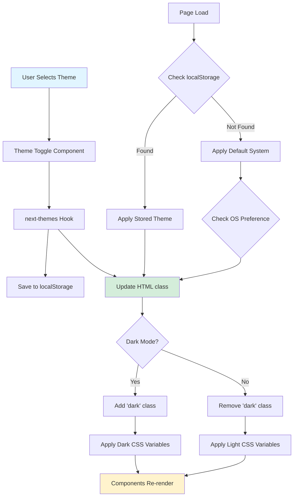
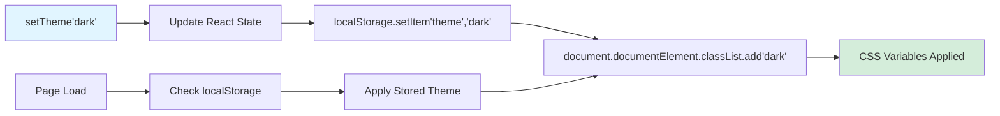

# Theme System & Dark Mode

**Navigation:** [Home](../README.md) → [Features & Components](./01-components-overview.md) → Theme System

## Table of Contents

- [Introduction](#introduction)
- [next-themes Integration](#next-themes-integration)
- [Theme Toggle Component](#theme-toggle-component)
- [CSS Variables System](#css-variables-system)
- [Hydration Handling](#hydration-handling)
- [Theme Persistence](#theme-persistence)
- [System Theme Detection](#system-theme-detection)
- [Usage Examples](#usage-examples)
- [See Also](#see-also)
- [Next Steps](#next-steps)

## Introduction

The portfolio implements a comprehensive **dark mode** system using [next-themes](https://github.com/pacocoursey/next-themes), providing seamless theme switching with three modes: **Light**, **Dark**, and **System** (automatic). The implementation ensures no flash of unstyled content (FOUC) and persists user preferences across sessions.

### Key Features

- ✅ **Three Theme Modes**: Light, Dark, and System (follows OS preference)
- ✅ **Persistent Preferences**: Saved to localStorage
- ✅ **No FOUC**: Prevents theme flash on page load
- ✅ **Smooth Transitions**: Optional transition animations
- ✅ **Type-Safe**: Full TypeScript support
- ✅ **SSR Compatible**: Works with Next.js App Router
- ✅ **Accessible**: Keyboard navigation and screen reader support

## next-themes Integration

### Installation

```json
{
  "dependencies": {
    "next-themes": "^0.x"
  }
}
```

### Provider Setup

```typescript
// app/layout.tsx
import { ThemeProvider } from "next-themes";

export default function RootLayout({ children }: { children: React.ReactNode }) {
  return (
    <html lang="en" suppressHydrationWarning>
      <body>
        <ThemeProvider
          attribute="class"
          defaultTheme="system"
          enableSystem
          disableTransitionOnChange
        >
          {children}
        </ThemeProvider>
      </body>
    </html>
  );
}
```

### Provider Configuration

| Option                      | Value      | Description                              |
| --------------------------- | ---------- | ---------------------------------------- |
| `attribute`                 | `"class"`  | Adds `class="dark"` to `<html>` element  |
| `defaultTheme`              | `"system"` | Default theme on first visit             |
| `enableSystem`              | `true`     | Allow system theme option                |
| `disableTransitionOnChange` | `true`     | Prevent transition flash on theme change |

### How It Works



## Theme Toggle Component

### Component Implementation

```typescript:1:123:components/theme-toggle.tsx
"use client";

import { useTheme } from "next-themes";
import { Button } from "@/components/ui/button";
import {
  DropdownMenu,
  DropdownMenuContent,
  DropdownMenuItem,
  DropdownMenuTrigger,
} from "@/components/ui/dropdown-menu";
import { Tooltip, TooltipContent, TooltipTrigger } from "@/components/ui/tooltip";
import { Moon, Sun, Monitor, Check } from "lucide-react";
import { useEffect, useState } from "react";

export function ThemeToggle() {
  const { theme, setTheme, themes } = useTheme();
  const [mounted, setMounted] = useState(false);

  // useEffect only runs on the client, so now we can safely show the UI
  useEffect(() => {
    setMounted(true);
  }, []);

  // Render a placeholder button until mounted to prevent hydration mismatch
  if (!mounted) {
    return (
      <DropdownMenu>
        <Tooltip>
          <TooltipTrigger asChild>
            <DropdownMenuTrigger asChild>
              <Button
                variant="ghost"
                size="icon"
                aria-label="Toggle theme"
                className="text-primary-foreground/80 hover:text-primary-foreground"
              >
                <Monitor className="h-5 w-5" />
                <span className="sr-only">Toggle theme</span>
              </Button>
            </DropdownMenuTrigger>
          </TooltipTrigger>
          <TooltipContent>
            <p>Change theme</p>
          </TooltipContent>
        </Tooltip>
        <DropdownMenuContent align="end" className="w-40">
          <DropdownMenuItem className="flex cursor-pointer items-center gap-2">
            <Monitor className="h-4 w-4" />
            <span className="flex-1">System</span>
          </DropdownMenuItem>
        </DropdownMenuContent>
      </DropdownMenu>
    );
  }

  const getThemeIcon = (themeName: string) => {
    switch (themeName) {
      case "light":
        return <Sun className="h-4 w-4" />;
      case "dark":
        return <Moon className="h-4 w-4" />;
      case "system":
        return <Monitor className="h-4 w-4" />;
      default:
        return <Monitor className="h-4 w-4" />;
    }
  };

  const getThemeLabel = (themeName: string) => {
    switch (themeName) {
      case "light":
        return "Light";
      case "dark":
        return "Dark";
      case "system":
        return "System";
      default:
        return themeName.charAt(0).toUpperCase() + themeName.slice(1);
    }
  };

  const getCurrentIcon = () => {
    if (theme === "system") return <Monitor className="h-5 w-5" />;
    if (theme === "dark") return <Moon className="h-5 w-5" />;
    return <Sun className="h-5 w-5" />;
  };

  return (
    <DropdownMenu>
      <Tooltip>
        <TooltipTrigger asChild>
          <DropdownMenuTrigger asChild>
            <Button
              variant="ghost"
              size="icon"
              aria-label="Toggle theme"
              className="text-primary-foreground/80 hover:text-primary-foreground"
            >
              {getCurrentIcon()}
              <span className="sr-only">Toggle theme</span>
            </Button>
          </DropdownMenuTrigger>
        </TooltipTrigger>
        <TooltipContent>
          <p>Change theme</p>
        </TooltipContent>
      </Tooltip>
      <DropdownMenuContent align="end" className="w-40">
        {themes.map((themeName) => (
          <DropdownMenuItem
            key={themeName}
            onClick={() => setTheme(themeName)}
            className="flex cursor-pointer items-center gap-2"
          >
            {getThemeIcon(themeName)}
            <span className="flex-1">{getThemeLabel(themeName)}</span>
            {theme === themeName && <Check className="h-4 w-4" />}
          </DropdownMenuItem>
        ))}
      </DropdownMenuContent>
    </DropdownMenu>
  );
}
```

### Icon Mapping

| Theme    | Icon       | Description |
| -------- | ---------- | ----------- |
| `light`  | ☀️ Sun     | Light mode  |
| `dark`   | 🌙 Moon    | Dark mode   |
| `system` | 🖥️ Monitor | Follow OS   |

### Dropdown Structure

```
┌─────────────────────┐
│ [🖥️] Change theme   │ ← Button with tooltip
└──┬──────────────────┘
   │ Click to expand ↓
   ┌───────────────────────┐
   │ 🌞 Light           ✓  │ ← Active (check mark)
   │ 🌙 Dark               │
   │ 🖥️  System            │
   └───────────────────────┘
```

## CSS Variables System

### Theme Definition

```css
/* app/globals.css */
@layer base {
  :root {
    --background: 0 0% 100%;
    --foreground: 222.2 84% 4.9%;
    --card: 0 0% 100%;
    --card-foreground: 222.2 84% 4.9%;
    --primary: 222.2 47.4% 11.2%;
    --primary-foreground: 210 40% 98%;
    --secondary: 210 40% 96.1%;
    --secondary-foreground: 222.2 47.4% 11.2%;
    --muted: 210 40% 96.1%;
    --muted-foreground: 215.4 16.3% 46.9%;
    --accent: 210 40% 96.1%;
    --accent-foreground: 222.2 47.4% 11.2%;
    --destructive: 0 84.2% 60.2%;
    --destructive-foreground: 210 40% 98%;
    --border: 214.3 31.8% 91.4%;
    --input: 214.3 31.8% 91.4%;
    --ring: 222.2 84% 4.9%;
    --radius: 0.5rem;
  }

  .dark {
    --background: 222.2 84% 4.9%;
    --foreground: 210 40% 98%;
    --card: 222.2 84% 4.9%;
    --card-foreground: 210 40% 98%;
    --primary: 210 40% 98%;
    --primary-foreground: 222.2 47.4% 11.2%;
    --secondary: 217.2 32.6% 17.5%;
    --secondary-foreground: 210 40% 98%;
    --muted: 217.2 32.6% 17.5%;
    --muted-foreground: 215 20.2% 65.1%;
    --accent: 217.2 32.6% 17.5%;
    --accent-foreground: 210 40% 98%;
    --destructive: 0 62.8% 30.6%;
    --destructive-foreground: 210 40% 98%;
    --border: 217.2 32.6% 17.5%;
    --input: 217.2 32.6% 17.5%;
    --ring: 212.7 26.8% 83.9%;
  }
}
```

### Color Format: HSL

Variables use **HSL without units** for flexibility:

```css
--background: 0 0% 100%; /* HSL(0, 0%, 100%) = White */
```

**Usage in Components:**

```css
background-color: hsl(var(--background));
color: hsl(var(--foreground));
```

**Benefits:**

- Easy to adjust opacity: `hsl(var(--background) / 0.5)`
- Consistent color manipulation
- Better theme customization

## Hydration Handling

### The Problem

```typescript
// ❌ Without hydration handling
export function ThemeToggle() {
  const { theme, setTheme } = useTheme();

  return <Button>{theme}</Button>;  // Server: "system", Client: "dark" → MISMATCH!
}
```

Server renders `"system"` (default), but client immediately loads `"dark"` from localStorage → **Hydration error!**

### The Solution

```typescript:17:22:components/theme-toggle.tsx
  const [mounted, setMounted] = useState(false);

  // useEffect only runs on the client, so now we can safely show the UI
  useEffect(() => {
    setMounted(true);
  }, []);
```

```typescript:24:54:components/theme-toggle.tsx
  // Render a placeholder button until mounted to prevent hydration mismatch
  if (!mounted) {
    return (
      <DropdownMenu>
        <Tooltip>
          <TooltipTrigger asChild>
            <DropdownMenuTrigger asChild>
              <Button
                variant="ghost"
                size="icon"
                aria-label="Toggle theme"
                className="text-primary-foreground/80 hover:text-primary-foreground"
              >
                <Monitor className="h-5 w-5" />
                <span className="sr-only">Toggle theme</span>
              </Button>
            </DropdownMenuTrigger>
          </TooltipTrigger>
          <TooltipContent>
            <p>Change theme</p>
          </TooltipContent>
        </Tooltip>
        <DropdownMenuContent align="end" className="w-40">
          <DropdownMenuItem className="flex cursor-pointer items-center gap-2">
            <Monitor className="h-4 w-4" />
            <span className="flex-1">System</span>
          </DropdownMenuItem>
        </DropdownMenuContent>
      </DropdownMenu>
    );
  }
```

**Strategy:**

1. Server renders placeholder (Monitor icon)
2. Client mounts, `useEffect` runs, sets `mounted = true`
3. Component re-renders with actual theme
4. No hydration mismatch!

### HTML Attribute

```html
<html lang="en" suppressHydrationWarning></html>
```

`suppressHydrationWarning` prevents Next.js from warning about the `class` attribute mismatch (next-themes manages it).

## Theme Persistence

### localStorage Key

```typescript
// Default key: "theme"
localStorage.getItem("theme"); // "light" | "dark" | "system"
```

### Storage Flow



## System Theme Detection

### Media Query

next-themes uses `prefers-color-scheme` media query:

```typescript
const systemTheme = window.matchMedia("(prefers-color-scheme: dark)").matches ? "dark" : "light";
```

### Dynamic Updates

Listens for OS theme changes:

```typescript
window.matchMedia("(prefers-color-scheme: dark)").addEventListener("change", (e) => {
  if (theme === "system") {
    // Update theme automatically
  }
});
```

**User Experience:**

1. User selects "System" theme
2. OS theme changes from Light to Dark
3. Website automatically switches to Dark mode
4. No user action required!

## Usage Examples

### In Header

```typescript
import { ThemeToggle } from "@/components/theme-toggle";

export function Header() {
  return (
    <header>
      <nav>{/* Navigation links */}</nav>
      <ThemeToggle />
    </header>
  );
}
```

### Accessing Theme in Components

```typescript
"use client";

import { useTheme } from "next-themes";

export function MyComponent() {
  const { theme, setTheme, systemTheme } = useTheme();

  return (
    <div>
      <p>Current theme: {theme}</p>
      <p>System theme: {systemTheme}</p>
      <button onClick={() => setTheme("dark")}>Dark Mode</button>
    </div>
  );
}
```

### Conditional Rendering

```typescript
const { resolvedTheme } = useTheme();

return (
  <>
    {resolvedTheme === "dark" ? (
      <DarkModeComponent />
    ) : (
      <LightModeComponent />
    )}
  </>
);
```

**Note:** `resolvedTheme` returns "light" or "dark" even when theme is "system".

### Custom Theme Colors

```typescript
<ThemeProvider
  attribute="class"
  defaultTheme="system"
  themes={["light", "dark", "blue", "purple"]}  // Custom themes
>
  {children}
</ThemeProvider>
```

Then add CSS:

```css
.blue {
  --primary: 217 91% 60%;
  /* ... other variables */
}

.purple {
  --primary: 271 91% 65%;
  /* ... other variables */
}
```

## See Also

- [next-themes Documentation](https://github.com/pacocoursey/next-themes) - Official docs
- [shadcn/ui Theming](https://ui.shadcn.com/docs/theming) - Theming guide
- [CSS Variables](https://developer.mozilla.org/en-US/docs/Web/CSS/Using_CSS_custom_properties) - MDN reference
- [Layout Components](./13-layout-components.md) - Header integration

## Next Steps

1. **Add Theme Animations**: Smooth color transitions
2. **More Themes**: Add custom color schemes (blue, purple, etc.)
3. **Theme Preview**: Show theme previews before selecting
4. **Per-Page Themes**: Different themes for different sections
5. **Accessibility**: High contrast theme for vision impairment
6. **Theme Customizer**: Let users create custom themes

---

**Last Updated:** 2024-02-09  
**Related Docs:** [Components](./01-components-overview.md) | [shadcn/ui](./03-shadcn-ui.md) | [Styling](../01-architecture/05-styling.md)
