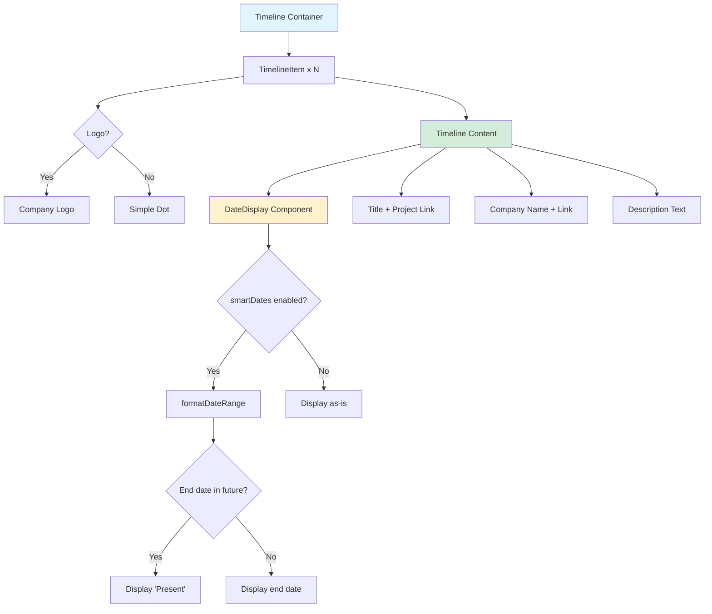

# Timeline Component

**Navigation:** [Home](../README.md) → [Features & Components](./01-components-overview.md) → Timeline

## Table of Contents

- [Introduction](#introduction)
- [Component Structure](#component-structure)
- [Smart Date Formatting](#smart-date-formatting)
- [Visual Design](#visual-design)
- [TimelineItem Props](#timelineitem-props)
- [Usage Examples](#usage-examples)
- [See Also](#see-also)
- [Next Steps](#next-steps)

## Introduction

The **Timeline** component (`components/timeline.tsx`) displays professional experience, education, and career milestones in a vertical timeline format. It features company logos, project links, and intelligent date formatting that automatically converts future end dates to "Present" for ongoing positions.

### Key Features

- ✅ **Smart Date Formatting**: Converts future dates to "Present" automatically
- ✅ **Company Logos**: Display circular company/organization logos
- ✅ **Project Links**: Optional links to related projects
- ✅ **External Company Links**: Link company names to websites
- ✅ **Responsive Design**: Adapts to mobile and desktop
- ✅ **Clean Visual Design**: Vertical line with markers
- ✅ **Client Component**: Interactive date updates

## Component Structure

### File Overview

```typescript:1:152:components/timeline.tsx
"use client";

import { cn } from "@/lib/utils";
import Image from "next/image";
import Link from "next/link";
import { ExternalLink } from "lucide-react";
import { Button } from "@/components/ui/button";
import { useEffect, useState } from "react";

interface TimelineItemProps {
  year: string;
  title: string;
  company: string;
  description: string;
  logo?: string;
  projectLink?: string;
  companyUrl?: string;
  /**
   * If true, formats date ranges to replace future end dates with "Present".
   */
  smartDates?: boolean;
}
```

### Component Architecture



## Smart Date Formatting

### The Problem

Timeline data may include future end dates for ongoing positions:

```json
{
  "year": "Jan. 2024 - Jun. 2026",
  "title": "Software Engineer",
  "company": "Current Company"
}
```

**Issue:** When June 2026 arrives, the entry still shows "Jun. 2026" instead of "Present".

### The Solution

```typescript:24:47:components/timeline.tsx
function formatDateRange(year: string): string {
  // Handle date ranges like "Jan. 2026 - Jun. 2026"
  if (year.includes(" - ")) {
    const [start, end] = year.split(" - ").map((s) => s.trim());

    // Parse end date to check if it's in the future
    // Create a proper date from "Mon. YYYY" format for cross-browser compatibility
    const monthYearRegex = /([A-Za-z]+)\.\s(\d{4})/;
    const match = end.match(monthYearRegex);

    if (match) {
      const [, monthStr, yearStr] = match;
      // Create date with the first day of the month to ensure it's valid
      const endDate = new Date(`${monthStr} 1, ${yearStr}`);
      const today = new Date();

      // If end date is in the future, replace with "Present"
      if (endDate > today) {
        return `${start} - Present`;
      }
    }
  }
  return year;
}
```

### Algorithm Breakdown

1. **Check for Date Range**

   ```typescript
   if (year.includes(" - "))
   ```

2. **Split Start and End**

   ```typescript
   const [start, end] = year.split(" - ").map((s) => s.trim());
   // "Jan. 2024 - Jun. 2026" → ["Jan. 2024", "Jun. 2026"]
   ```

3. **Parse End Date**

   ```typescript
   const monthYearRegex = /([A-Za-z]+)\.\s(\d{4})/;
   // Matches: "Jun. 2026" → ["Jun", "2026"]
   ```

4. **Create Valid Date**

   ```typescript
   const endDate = new Date(`${monthStr} 1, ${yearStr}`);
   // "Jun. 2026" → Date("Jun 1, 2026")
   ```

   **Why first of month?** Ensures valid date across all months (avoids Feb 30, etc.)

5. **Compare with Today**
   ```typescript
   if (endDate > today) {
     return `${start} - Present`;
   }
   ```

### DateDisplay Component

```typescript:49:59:components/timeline.tsx
function DateDisplay({ year, smartDates = false }: { year: string; smartDates?: boolean }) {
  const [displayYear, setDisplayYear] = useState(year);

  useEffect(() => {
    if (smartDates) {
      setDisplayYear(formatDateRange(year));
    }
  }, [year, smartDates]);

  return <div className="text-muted-foreground mb-1 pt-5 text-sm">{displayYear}</div>;
}
```

**Client-side Processing:**

- Uses `useEffect` to format on mount
- Responds to prop changes
- Maintains original date in data source

## Visual Design

### Timeline Layout

```
    Text Content          Visual Markers
    ════════════          ══════════════

    Mar. 2024 - Present
    Senior Developer      ●───[LOGO]
    Company Name          │
    Description text...   │
                          │
    Jan. 2023 - Feb. 2024 │
    Junior Developer      ●───[LOGO]
    Another Company       │
    Description text...   │
                          │
    Jul. 2021 - Dec. 2022 │
    Intern               ●
    First Company         │
    Description text...   ─
```

### CSS Structure

```typescript:72:94:components/timeline.tsx
    <div className="relative ml-5 pl-10 last:pb-5">
      {/* Vertical line */}
      <div className="bg-border absolute top-0 bottom-0 left-0 w-px"></div>

      {/* Company logo or circle marker */}
      {logo ? (
        <div
          className={cn(
            "bg-card absolute top-12 -left-6 h-12 w-12 rounded-full border-[1.5px] p-0.5"
          )}
        >
          <Image
            src={logo}
            alt={`${company} logo`}
            width={48}
            height={48}
            className="h-full w-full rounded-full object-contain text-xs"
          />
        </div>
      ) : (
        <div className="bg-primary absolute top-12 left-[-3.5px] mt-5 h-2 w-2 rounded-full"></div>
      )}
```

### Logo Marker

- **Size**: 48x48px (`h-12 w-12`)
- **Position**: Absolute, centered on vertical line (`-left-6`)
- **Styling**: Rounded, bordered, white background
- **Fallback**: Small dot if no logo provided

### Vertical Line

```typescript
className = "bg-border absolute top-0 bottom-0 left-0 w-px";
```

- Full height of timeline item
- 1px width
- Uses theme border color
- Absolute positioning

## TimelineItem Props

### Interface Definition

```typescript
interface TimelineItemProps {
  year: string; // Date or date range (e.g., "Jan. 2024 - Jun. 2026")
  title: string; // Position title
  company: string; // Company/organization name
  description: string; // Role description
  logo?: string; // Optional company logo path
  projectLink?: string; // Optional link to related project
  companyUrl?: string; // Optional company website URL
  smartDates?: boolean; // Enable smart date formatting (default: false)
}
```

### Example Data

```typescript
const timelineData: TimelineItemProps[] = [
  {
    year: "Jan. 2024 - Jun. 2026",
    title: "Senior Software Engineer",
    company: "Tech Corp",
    companyUrl: "https://techcorp.com",
    description: "Lead development of cloud-based solutions...",
    logo: "/images/companies/techcorp.png",
    projectLink: "/projects/cloud-platform",
    smartDates: true,
  },
  {
    year: "Mar. 2022 - Dec. 2023",
    title: "Full Stack Developer",
    company: "Startup Inc",
    description: "Built scalable web applications...",
    // No logo, no links
  },
];
```

### Project Link

```typescript:100:110:components/timeline.tsx
        {projectLink && (
          <Button variant="link" size="sm" className="h-full" asChild>
            <Link
              href={projectLink}
              target={projectLink.startsWith("http") ? "_blank" : undefined}
              rel={projectLink.startsWith("http") ? "noopener noreferrer" : undefined}
            >
              View Project
              <ExternalLink className="size-4" />
            </Link>
          </Button>
        )}
```

**Smart External Link Detection:**

- If starts with `http`: Opens in new tab
- Internal link: Normal navigation

### Company Link

```typescript:113:127:components/timeline.tsx
      <p className="text-muted-foreground mb-2">
        {companyUrl ? (
          <Link
            href={companyUrl}
            target="_blank"
            rel="noopener noreferrer"
            className="underline-offset-4 hover:underline"
          >
            {company}
            <ExternalLink className="ml-1 inline size-3 align-baseline" />
          </Link>
        ) : (
          company
        )}
      </p>
```

## Usage Examples

### Basic Timeline

```typescript
import { Timeline } from "@/components/timeline";

const experienceData = [
  {
    year: "2023 - Present",
    title: "Software Engineer",
    company: "Company A",
    description: "Working on exciting projects..."
  },
  {
    year: "2021 - 2023",
    title: "Junior Developer",
    company: "Company B",
    description: "Learned the fundamentals..."
  }
];

export default function ExperiencePage() {
  return (
    <section>
      <h2>Work Experience</h2>
      <Timeline items={experienceData} />
    </section>
  );
}
```

### With Smart Dates

```typescript
const currentPositions = [
  {
    year: "Jan. 2024 - Dec. 2025",  // Future end date
    title: "Senior Engineer",
    company: "Current Co",
    description: "Leading the team...",
    smartDates: true  // Will show "Jan. 2024 - Present"
  }
];

<Timeline items={currentPositions} smartDates />
```

### Full Featured

```typescript
const fullTimeline = [
  {
    year: "Jan. 2024 - Present",
    title: "Senior Software Engineer",
    company: "Tech Innovations",
    companyUrl: "https://techinnovations.com",
    description: "Architecting scalable microservices...",
    logo: "/images/logos/tech-innovations.png",
    projectLink: "/projects/microservices-platform",
    smartDates: true
  },
  {
    year: "Jun. 2021 - Dec. 2023",
    title: "Full Stack Developer",
    company: "Digital Agency",
    companyUrl: "https://digitalagency.com",
    description: "Built custom web applications for clients...",
    logo: "/images/logos/digital-agency.png"
  },
  {
    year: "Jan. 2020 - May 2021",
    title: "Junior Developer",
    company: "Startup XYZ",
    description: "First professional role, learned a ton!",
    // No logo or links
  }
];

<Timeline items={fullTimeline} smartDates />
```

### Education Timeline

```typescript
const educationTimeline = [
  {
    year: "2024 - Present",
    title: "Master's in Computer Science",
    company: "University Name",
    companyUrl: "https://university.edu",
    description: "Focus on AI and Machine Learning",
    logo: "/images/logos/university.png",
    smartDates: true,
  },
  {
    year: "2020 - 2024",
    title: "Bachelor's in Software Engineering",
    company: "College Name",
    description: "Graduated with honors",
  },
];
```

## See Also

- [Custom Components](./02-custom-components.md#timeline-component) - Overview
- [Next.js Image Component](https://nextjs.org/docs/app/api-reference/components/image) - Image optimization
- [Date Formatting](https://developer.mozilla.org/en-US/docs/Web/JavaScript/Reference/Global_Objects/Date) - JavaScript Date API

## Next Steps

1. **Add Animations**: Fade in timeline items on scroll
2. **Horizontal Timeline**: Alternative layout for desktop
3. **Expandable Details**: Click to expand/collapse descriptions
4. **Icons**: Add role-specific icons (code, design, management)
5. **Duration Calculator**: Show duration "2 years 4 months"
6. **Skills Tags**: Display relevant skills for each position
7. **Hover Effects**: Interactive hover states for timeline items

---

**Last Updated:** 2024-02-09  
**Related Docs:** [Components](./01-components-overview.md) | [Custom Components](./02-custom-components.md) | [Data Layer](../01-architecture/03-data-layer.md)
