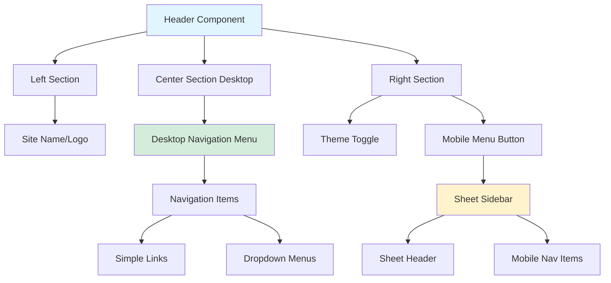

# Navigation Components

**Navigation:** [Home](../index.md) → [Features & Components](./01-components-overview.md) → Navigation

## Table of Contents

- [Introduction](#introduction)
- [Header Component](#header-component)
- [Desktop Navigation](#desktop-navigation)
- [Mobile Navigation](#mobile-navigation)
- [Navigation Structure](#navigation-structure)
- [Responsive Behavior](#responsive-behavior)
- [Theme Integration](#theme-integration)
- [Usage Examples](#usage-examples)
- [See Also](#see-also)
- [Next Steps](#next-steps)

## Introduction

The **Navigation System** provides a comprehensive, responsive navigation experience with both desktop and mobile implementations. The Header component integrates a horizontal navigation menu for desktop users and a slide-out sheet menu for mobile devices.

### Key Features

- ✅ **Responsive Design**: Seamlessly switches between desktop and mobile layouts
- ✅ **Dropdown Menus**: Nested navigation for complex hierarchies
- ✅ **Mobile Sheet**: Slide-out menu with smooth animations
- ✅ **Theme Toggle**: Integrated dark mode switcher
- ✅ **Hash Navigation**: Support for anchor links (/#about, /#projects)
- ✅ **Accessibility**: Keyboard navigation and ARIA attributes
- ✅ **Auto-Close**: Mobile menu closes automatically after navigation

## Header Component

### File Overview

```typescript:1:27:components/layout/header.tsx
"use client";

import React from "react";
import Link from "next/link";
import { cn } from "@/lib/utils";
import {
  NavigationMenu,
  NavigationMenuList,
  NavigationMenuItem,
  NavigationMenuLink,
  NavigationMenuContent,
  NavigationMenuTrigger,
} from "@/components/ui/navigation-menu";
import { Button } from "@/components/ui/button";
import {
  Sheet,
  SheetContent,
  SheetHeader,
  SheetTitle,
  SheetTrigger,
  SheetClose,
} from "@/components/ui/sheet";
import { ThemeToggle } from "@/components/theme-toggle";
import { Menu } from "lucide-react";
import { siteConfig } from "@/lib/config";
import { Separator } from "@/components/ui/separator";
```

### Header Structure



## Desktop Navigation

### Navigation Menu Implementation

```typescript:66:133:components/layout/header.tsx
      {/* Desktop Navigation */}
      <NavigationMenu className="hidden md:flex md:w-full md:grow md:justify-end" viewport={false}>
        <NavigationMenuList>
          {navigationItems.map((item) => (
            <NavigationMenuItem key={item.label}>
              {item.href ? (
                // Simple link
                <NavigationMenuLink asChild>
                  <Button variant="link" asChild>
                    <Link
                      href={item.href}
                      className="text-primary-foreground/80 hover:text-primary-foreground capitalize"
                    >
                      {item.label}
                    </Link>
                  </Button>
                </NavigationMenuLink>
              ) : (
                // Dropdown menu
                <>
                  <NavigationMenuTrigger className="text-primary-foreground/80 hover:text-primary-foreground capitalize">
                    {item.label}
                  </NavigationMenuTrigger>
                  <NavigationMenuContent>
                    <ul className="grid w-xs">
                      {item.items?.map((subItem) => (
                        <li key={subItem.href}>
                          <NavigationMenuLink asChild>
                            <Link
                              href={subItem.href}
                              className="transition-colors outline-none select-none"
                            >
                              <span className="text-sm leading-none font-medium">
                                {subItem.label}
                              </span>
                              {subItem.description && (
                                <p className="text-muted-foreground line-clamp-2 text-sm leading-snug">
                                  {subItem.description}
                                </p>
                              )}
                            </Link>
                          </NavigationMenuLink>
                        </li>
                      ))}
                    </ul>
                  </NavigationMenuContent>
                </>
              )}
            </NavigationMenuItem>
          ))}
        </NavigationMenuList>
      </NavigationMenu>
```

### Navigation Items Configuration

```typescript:42:64:components/layout/header.tsx
const navigationItems: NavigationItem[] = [
  { href: "/#home", label: "Home" },
  { href: "/#about", label: "About" },
  { href: "/#experience", label: "Experience" },
  {
    label: "Projects",
    items: [
      {
        label: "Featured Projects",
        href: "/#projects",
        description: "Browse my featured projects.",
      },
      {
        label: "All Projects",
        href: "/projects",
        description: "Browse all my projects.",
      },
    ],
  },
  { href: "/#skills", label: "Skills" },
  { href: "/#achievements", label: "Achievements" },
  { href: "/#contact", label: "Contact" },
];
```

### Desktop Menu Structure

```
┌──────────────────────────────────────────────────┐
│ Logo    Home  About  Experience  [Projects▼]    │
│                                    Skills  Theme │
└──────────────────────────────────────────────────┘
                              │
                              ↓ Click "Projects"
                    ┌─────────────────────┐
                    │ Featured Projects   │
                    │ Browse featured...  │
                    ├─────────────────────┤
                    │ All Projects        │
                    │ Browse all...       │
                    └─────────────────────┘
```

### Responsive Classes

```typescript
className = "hidden md:flex md:w-full md:grow md:justify-end";
```

- `hidden`: Hidden on mobile
- `md:flex`: Display as flex on medium+ screens
- `md:w-full`: Full width
- `md:grow`: Grow to fill space
- `md:justify-end`: Align items to right

## Mobile Navigation

### Sheet Implementation

```typescript:137:188:components/layout/header.tsx
        {/* Mobile Menu Sheet */}
        <Sheet>
          <SheetTrigger asChild>
            <Button
              variant="ghost"
              size="icon"
              aria-label="Toggle menu"
              className="text-primary-foreground/80 hover:text-primary-foreground md:hidden"
            >
              <Menu className="size-5" />
            </Button>
          </SheetTrigger>
          <SheetContent side="right">
            <SheetHeader>
              <SheetTitle className="text-lg font-bold">{siteConfig.name}</SheetTitle>
            </SheetHeader>
            <Separator />
            <nav className="flex flex-col">
              {navigationItems.map((item) => (
                <div key={item.label}>
                  {item.href ? (
                    // Simple link
                    <SheetClose asChild>
                      <Button variant="link" className="justify-start" size="lg" asChild>
                        <Link href={item.href} className="justify-start">
                          {item.label}
                        </Link>
                      </Button>
                    </SheetClose>
                  ) : (
                    // Dropdown items
                    <div className="flex flex-col px-2">
                      <span className="text-muted-foreground px-4 py-2 text-sm font-medium">
                        {item.label}
                      </span>
                      {item.items?.map((subItem) => (
                        <SheetClose key={subItem.href} asChild>
                          <Button variant="link" className="justify-start pl-8" size="lg" asChild>
                            <Link href={subItem.href} className="justify-start">
                              {subItem.label}
                            </Link>
                          </Button>
                        </SheetClose>
                      ))}
                    </div>
                  )}
                </div>
              ))}
            </nav>
          </SheetContent>
        </Sheet>
```

### Mobile Menu Structure

```
Mobile View:
┌──────────────────────────┐
│ Logo            ☰  Theme │
└──────────────────────────┘

Click hamburger →

┌──────────────────────────┐
│ × Portfolio              │
│ ─────────────────────── │
│ Home                     │
│ About                    │
│ Experience               │
│ Projects                 │
│   Featured Projects      │
│   All Projects           │
│ Skills                   │
│ Achievements             │
│ Contact                  │
└──────────────────────────┘
```

### SheetClose Auto-Close

```typescript
<SheetClose asChild>
  <Button variant="link" asChild>
    <Link href={item.href}>
      {item.label}
    </Link>
  </Button>
</SheetClose>
```

`SheetClose` automatically closes the sheet when the link is clicked, providing seamless navigation.

## Navigation Structure

### Type Definitions

```typescript:32:40:components/layout/header.tsx
interface NavigationItem {
  label: string;
  href?: string;
  items?: {
    label: string;
    href: string;
    description?: string;
  }[];
}
```

### Simple vs. Dropdown Items

**Simple Item:**

```typescript
{
  href: "/#about",
  label: "About"
}
```

**Dropdown Item:**

```typescript
{
  label: "Projects",
  items: [
    {
      label: "Featured Projects",
      href: "/#projects",
      description: "Browse my featured projects."
    },
    {
      label: "All Projects",
      href: "/projects",
      description: "Browse all my projects."
    }
  ]
}
```

### Hash Navigation

```typescript
href: "/#about"; // Navigates to homepage + scrolls to #about
href: "/projects"; // Navigates to /projects page
```

**Benefits:**

- Single-page navigation
- Smooth scrolling (with CSS `scroll-behavior: smooth`)
- Back button support
- Shareable URLs

## Responsive Behavior

### Breakpoint Strategy

| Screen Size       | Navigation Type | Components Visible     |
| ----------------- | --------------- | ---------------------- |
| < 768px (mobile)  | Sheet sidebar   | Logo, Hamburger, Theme |
| ≥ 768px (tablet+) | Horizontal menu | Logo, Nav Menu, Theme  |

### CSS Classes

```typescript
// Desktop-only navigation
className = "hidden md:flex";

// Mobile-only hamburger
className = "md:hidden";
```

### Viewport Disable

```typescript
<NavigationMenu viewport={false}>
```

Disables the default viewport portal for better control over menu positioning.

## Theme Integration

### Theme Toggle Placement

```typescript
<div className="flex items-center gap-2">
  <ThemeToggle />

  {/* Mobile Menu Sheet */}
  <Sheet>
    {/* ... */}
  </Sheet>
</div>
```

Theme toggle appears:

- **Desktop**: Far right of header
- **Mobile**: Right of hamburger menu

**See:** [Theme System](./09-theme-system.md) for theme toggle details

## Usage Examples

### Basic Header

```typescript
import { Header } from "@/components/layout/header";

export default function Layout({ children }) {
  return (
    <>
      <Header />
      <main>{children}</main>
    </>
  );
}
```

### Custom Styling

```typescript
<Header className="sticky top-0 z-50 shadow-md" />
```

### With Background Blur

The header uses backdrop blur by default:

```typescript:68:73:components/layout/header.tsx
    <header
      className={cn(
        "bg-primary/95 text-primary-foreground border-primary flex w-full justify-between border-b px-5 py-3",
        "supports-[backdrop-filter]:bg-primary/70 backdrop-blur",
        className
      )}
    >
```

**Effects:**

- Semi-transparent background (`bg-primary/95`)
- Backdrop filter blur (`backdrop-blur`)
- Falls back to opaque if unsupported

### Adding Custom Nav Items

```typescript
// Extend navigationItems array
const navigationItems: NavigationItem[] = [
  // ... existing items
  {
    label: "Resources",
    items: [
      {
        label: "Documentation",
        href: "/docs",
        description: "Read the documentation",
      },
      {
        label: "Blog",
        href: "/blog",
        description: "Latest articles",
      },
    ],
  },
];
```

## See Also

- [Header Documentation](./13-layout-components.md#header) - Detailed header info
- [shadcn/ui Navigation Menu](https://ui.shadcn.com/docs/components/navigation-menu) - Component docs
- [shadcn/ui Sheet](https://ui.shadcn.com/docs/components/sheet) - Sheet component docs
- [Theme Toggle](./09-theme-system.md) - Theme system integration

## Next Steps

1. **Breadcrumbs**: Add breadcrumb navigation for project pages
2. **Search**: Integrate search functionality in header
3. **Notifications**: Add notification badge to header
4. **User Menu**: Add user profile dropdown (for authenticated apps)
5. **Sticky Header**: Make header sticky on scroll with show/hide behavior
6. **Progress Bar**: Add page load progress indicator
7. **Multi-Level Menus**: Support deeper nesting (3+ levels)

---

**Last Updated:** 2024-02-09  
**Related Docs:** [Components](./01-components-overview.md) | [Layout](./13-layout-components.md) | [Theme System](./09-theme-system.md)
