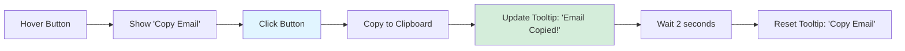

# Social Utilities & Links

**Navigation:** [Home](../index.md) → [Features & Components](./01-components-overview.md) → Social Utilities

## Table of Contents

- [Introduction](#introduction)
- [SocialLink Component](#sociallink-component)
- [EmailCopyButton Component](#emailcopybutton-component)
- [Copyright Component](#copyright-component)
- [Usage Examples](#usage-examples)
- [See Also](#see-also)
- [Next Steps](#next-steps)

## Introduction

The **Social Utilities** provide reusable components for social media links, email interactions, and copyright notices. These components are designed for flexibility, accessibility, and consistent branding across the portfolio.

### Components

- **SocialLink**: Flexible social media link component
- **EmailCopyButton**: Copy email to clipboard with visual feedback
- **Copyright**: Dynamic copyright notice with auto-updating year

## SocialLink Component

### Purpose

A versatile link component that supports multiple rendering modes: icon components, image sources, text labels, or custom children.

### File: `components/social-link.tsx`

```typescript:1:66:components/social-link.tsx
import Image from "next/image";
import Link from "next/link";
import { ReactNode } from "react";
import { cn } from "@/lib/utils";

interface SocialLinkProps {
  href: string;
  ariaLabel: string;
  className?: string;
  children?: ReactNode;
  // Icon component prop (optional)
  icon?: React.ElementType;
  // Icon image props (optional)
  imgSrc?: string;
  imgAlt?: string;
  imgWidth?: number;
  imgHeight?: number;
  // Text label (optional)
  label?: string;
}

export default function SocialLink({
  href,
  ariaLabel,
  className,
  children,
  icon: Icon,
  imgSrc,
  imgAlt,
  imgWidth = 32,
  imgHeight = 32,
  label,
}: SocialLinkProps) {
  return (
    <Link
      href={href}
      target="_blank"
      rel="noopener noreferrer"
      aria-label={ariaLabel}
      className={cn("hover:text-primary transition-colors", className)}
    >
      {/* If children are provided, render them directly */}
      {children || (
        <>
          {/* Render icon if provided */}
          {Icon && <Icon className="size-6" />}

          {/* Render image if provided and no icon */}
          {!Icon && imgSrc && (
            <Image
              src={imgSrc}
              alt={imgAlt || ariaLabel}
              width={imgWidth}
              height={imgHeight}
              className="size-6"
            />
          )}

          {label && <span>{label}</span>}

          {!Icon && !imgSrc && !label && ariaLabel}
        </>
      )}
    </Link>
  );
}
```

### Rendering Modes

#### 1. Icon Component Mode

```typescript
import { GitHubIcon, LinkedInIcon } from "@/components/icons";

<SocialLink
  href="https://github.com/username"
  ariaLabel="GitHub"
  icon={GitHubIcon}
/>
```

**Result:** Renders custom SVG icon component

#### 2. Image Source Mode

```typescript
<SocialLink
  href="https://twitter.com/username"
  ariaLabel="Twitter"
  imgSrc="/images/twitter-icon.png"
  imgAlt="Twitter"
  imgWidth={24}
  imgHeight={24}
/>
```

**Result:** Renders Next.js Image component

#### 3. Text Label Mode

```typescript
<SocialLink
  href="mailto:email@example.com"
  ariaLabel="Email"
  label="Email Me"
/>
```

**Result:** Renders text with hover effect

#### 4. Icon + Label Mode

```typescript
<SocialLink
  href="https://linkedin.com/in/username"
  ariaLabel="LinkedIn"
  icon={LinkedInIcon}
  label="LinkedIn"
/>
```

**Result:** Renders both icon and text

#### 5. Custom Children Mode

```typescript
<SocialLink href="https://example.com" ariaLabel="Custom">
  <div className="flex items-center gap-2">
    <CustomIcon />
    <span>Custom Content</span>
  </div>
</SocialLink>
```

**Result:** Renders custom JSX

### Props Priority

The component checks props in this order:

```typescript
{children || (
  <>
    {Icon && <Icon />}
    {!Icon && imgSrc && <Image />}
    {label && <span>{label}</span>}
    {!Icon && !imgSrc && !label && ariaLabel}
  </>
)}
```

1. **Children** (highest priority) - Full custom control
2. **Icon** - Component icon
3. **imgSrc** - Image fallback
4. **label** - Text label
5. **ariaLabel** - Fallback text (lowest priority)

### Accessibility Features

- `target="_blank"` - Opens in new tab
- `rel="noopener noreferrer"` - Security best practice
- `aria-label` - Screen reader description
- `className="hover:text-primary transition-colors"` - Visual feedback

## EmailCopyButton Component

### Purpose

Provides a button that copies an email address to the clipboard with tooltip feedback.

### File: `components/email-copy-button.tsx`

```typescript:1:37:components/email-copy-button.tsx
"use client";

import React from "react";
import { Button } from "@/components/ui/button";
import { Tooltip, TooltipContent, TooltipTrigger } from "@/components/ui/tooltip";
import { Copy } from "lucide-react";
import { siteConfig } from "@/lib/config";
import { cn } from "@/lib/utils";

interface EmailCopyButtonProps {
  className?: string;
}

export function EmailCopyButton({ className }: EmailCopyButtonProps) {
  const [tooltipContent, setTooltipContent] = React.useState("Copy Email");

  const handleCopyEmail = () => {
    navigator.clipboard.writeText(siteConfig.author.email);
    setTooltipContent("Email Copied!");
    setTimeout(() => {
      setTooltipContent("Copy Email");
    }, 2000); // Reset tooltip after 2 seconds
  };

  return (
    <Tooltip>
      <TooltipTrigger asChild>
        <Button size="icon" variant="ghost" onClick={handleCopyEmail} className={cn("", className)}>
          <Copy className="size-4" />
        </Button>
      </TooltipTrigger>
      <TooltipContent>
        <p>{tooltipContent}</p>
      </TooltipContent>
    </Tooltip>
  );
}
```

### User Flow



### Features

1. **Clipboard API**: Uses modern `navigator.clipboard.writeText()`
2. **Visual Feedback**: Tooltip changes to "Email Copied!"
3. **Auto-Reset**: Returns to "Copy Email" after 2 seconds
4. **Icon Button**: Compact design with Copy icon
5. **Configuration**: Email sourced from `siteConfig.author.email`

### Browser Compatibility

```typescript
navigator.clipboard.writeText(email);
```

**Supported:**

- Chrome 63+
- Firefox 53+
- Safari 13.1+
- Edge 79+

**Fallback for older browsers:**

```typescript
const handleCopyEmail = () => {
  try {
    if (navigator.clipboard) {
      navigator.clipboard.writeText(siteConfig.author.email);
    } else {
      // Fallback for older browsers
      const textArea = document.createElement("textarea");
      textArea.value = siteConfig.author.email;
      document.body.appendChild(textArea);
      textArea.select();
      document.execCommand("copy");
      document.body.removeChild(textArea);
    }
    setTooltipContent("Email Copied!");
  } catch (err) {
    console.error("Failed to copy:", err);
    setTooltipContent("Copy Failed");
  }

  setTimeout(() => {
    setTooltipContent("Copy Email");
  }, 2000);
};
```

## Copyright Component

### Purpose

Displays a copyright notice with automatically updating year.

### File: `components/copyright.tsx`

```typescript:1:19:components/copyright.tsx
"use client";
import React from "react";
import { siteConfig } from "@/lib/config";

interface CopyrightProps {
  className?: string;
}

export default function Copyright({ className }: CopyrightProps) {
  return (
    <p
      className={
        className ?? "text-primary-foreground/80 mx-auto py-6 text-center text-sm md:text-base"
      }
    >
      &copy; {new Date().getFullYear()} {siteConfig.name}. All rights reserved.
    </p>
  );
}
```

### Key Features

1. **Dynamic Year**: `new Date().getFullYear()` always shows current year
2. **Site Config Integration**: Uses `siteConfig.name`
3. **Customizable Styling**: Accept className prop
4. **Client Component**: Must run on client for date

### Output Examples

```
© 2024 John Doe. All rights reserved.
© 2025 Portfolio. All rights reserved.
© 2026 Company Name. All rights reserved.
```

### Why Client Component?

```typescript
"use client"; // Required!
```

**Reason:** `new Date().getFullYear()` runs at render time:

- Server: Renders year at build time
- Client: Re-renders with current year

Without `"use client"`, the year would be stale until next build.

## Usage Examples

### Social Links in Footer

```typescript:108:159:components/layout/footer.tsx
        <div>
          <h3 id="contact" className="mb-3 font-semibold">
            Connect
          </h3>
          <ul>
            <li>
              <Button
                variant="link"
                className="text-primary-foreground/80 hover:text-primary-foreground w-full justify-start !px-0"
                asChild
              >
                <SocialLink
                  href={siteConfig.social.linkedin}
                  ariaLabel="LinkedIn"
                  label="LinkedIn"
                  icon={LinkedInIcon}
                />
              </Button>
            </li>
            <li>
              <Button
                variant="link"
                className="text-primary-foreground/80 hover:text-primary-foreground w-full justify-start !px-0"
                asChild
              >
                <SocialLink
                  href={siteConfig.social.github}
                  ariaLabel="Github"
                  label="Github"
                  icon={GitHubIcon}
                />
              </Button>
            </li>
            <li className="flex items-center">
              <Button
                variant="link"
                className="text-primary-foreground/80 hover:text-primary-foreground grow justify-start !px-0"
                asChild
              >
                <SocialLink
                  href={`mailto:${siteConfig.author.email}`}
                  ariaLabel="Email"
                  label="Email"
                  icon={MailIcon}
                />
              </Button>
              <EmailCopyButton className="text-primary-foreground/80 hover:text-primary-foreground" />
            </li>
            <li>
              <Button
                variant="link"
                className="text-primary-foreground/80 hover:text-primary-foreground w-full justify-start !px-0"
                asChild
              >
                <SocialLink
                  href="/download/resume.pdf"
                  ariaLabel="Download Resume"
                  label="Resume"
                  icon={FileDownloadIcon}
                />
              </Button>
            </li>
          </ul>
        </div>
```

### Icon-Only Social Bar

```typescript
<div className="flex gap-4">
  <SocialLink
    href="https://github.com/username"
    ariaLabel="GitHub"
    icon={GitHubIcon}
  />
  <SocialLink
    href="https://linkedin.com/in/username"
    ariaLabel="LinkedIn"
    icon={LinkedInIcon}
  />
  <SocialLink
    href="https://twitter.com/username"
    ariaLabel="Twitter"
    imgSrc="/images/twitter.png"
  />
</div>
```

### Email with Copy Button

```typescript
<div className="flex items-center gap-2">
  <SocialLink
    href="mailto:contact@example.com"
    ariaLabel="Email"
    label="contact@example.com"
  />
  <EmailCopyButton />
</div>
```

### Custom Social Link

```typescript
<SocialLink href="https://custom.com" ariaLabel="Custom Platform">
  <div className="flex items-center gap-2 rounded-lg border px-4 py-2">
    <CustomIcon className="h-5 w-5" />
    <span>Follow on Custom</span>
  </div>
</SocialLink>
```

### Copyright in Footer

```typescript:163:163:components/layout/footer.tsx
      <Copyright className="text-primary-foreground/80 mx-auto py-6 text-center text-sm md:text-base" />
```

## See Also

- [Footer Component](./13-layout-components.md#footer) - Footer implementation
- [Icon System](./14-icons.md) - Custom icon components
- [Configuration](../01-architecture/06-configuration.md) - Site config

## Next Steps

1. **Share Buttons**: Add social share buttons for projects
2. **QR Codes**: Generate QR codes for contact info
3. **vCard Export**: Download contact as vCard file
4. **Social Meta Tags**: Add Open Graph and Twitter Card meta tags
5. **Analytics**: Track social link clicks
6. **Hover Cards**: Show profile previews on hover

---

**Last Updated:** 2024-02-09  
**Related Docs:** [Components](./01-components-overview.md) | [Layout](./13-layout-components.md) | [Icons](./14-icons.md)
