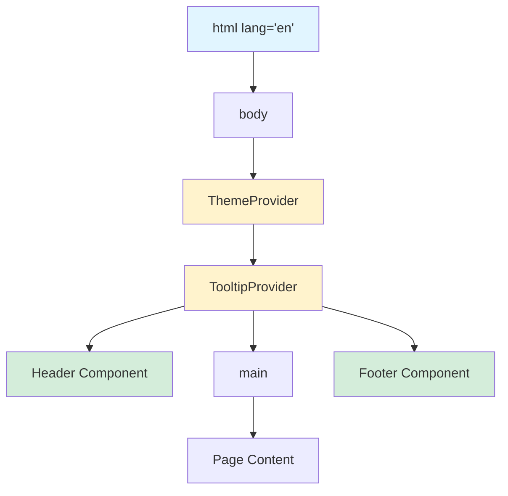

# Layout Components

**Navigation:** [Home](../README.md) → [Features & Components](./01-components-overview.md) → Layout Components

## Table of Contents

- [Introduction](#introduction)
- [Header Component](#header-component)
- [Footer Component](#footer-component)
- [Layout Structure](#layout-structure)
- [Styling Patterns](#styling-patterns)
- [Usage Examples](#usage-examples)
- [See Also](#see-also)
- [Next Steps](#next-steps)

## Introduction

**Layout Components** provide the structural foundation for all pages, including the global header, footer, and page layouts. These components ensure consistent branding, navigation, and information architecture across the entire portfolio.

### Key Components

- **Header**: Navigation bar with logo, menu, and theme toggle
- **Footer**: Site footer with links, contact info, and copyright
- **RootLayout**: Global app wrapper with providers

## Header Component

### Purpose

The Header provides primary navigation, branding, and theme controls. It adapts between desktop and mobile layouts using a responsive navigation menu and slide-out sheet.

### File: `components/layout/header.tsx`

**See detailed documentation:** [Navigation Components](./11-navigation.md)

### Key Features

- ✅ Responsive design (desktop menu + mobile sheet)
- ✅ Dropdown navigation for complex hierarchies
- ✅ Integrated theme toggle
- ✅ Hash navigation support (/#section)
- ✅ Backdrop blur effect
- ✅ Sticky positioning option

### Structure Overview

```typescript:66:79:components/layout/header.tsx
export function Header({ className }: HeaderProps) {
  return (
    <header
      className={cn(
        "bg-primary/95 text-primary-foreground border-primary flex w-full justify-between border-b px-5 py-3",
        "supports-[backdrop-filter]:bg-primary/70 backdrop-blur",
        className
      )}
    >
      <div className="flex items-center gap-2">
        <Link href="/" className="text-xl font-bold">
          {siteConfig.name}
        </Link>
      </div>
```

### Header Sections

```
┌────────────────────────────────────────────────────┐
│ [Logo]  [Nav Menu]              [Theme] [Mobile]  │
└────────────────────────────────────────────────────┘
   ↑         ↑                       ↑        ↑
  Left    Center                  Right    Right
Section  Desktop Only           Always   Mobile Only
```

**See:** [Navigation Documentation](./11-navigation.md) for complete header details

## Footer Component

### Purpose

The Footer provides secondary navigation, social links, contact information, and copyright notice. It's information-rich while maintaining visual hierarchy.

### File: `components/layout/footer.tsx`

```typescript:1:169:components/layout/footer.tsx
import React from "react";
import Link from "next/link";
import { cn } from "@/lib/utils";
import { Button } from "@/components/ui/button";
import SocialLink from "@/components/social-link";
import Copyright from "@/components/copyright";
import { siteConfig } from "@/lib/config";
import { FileDownloadIcon, GitHubIcon, LinkedInIcon } from "@/components/icons";
import { Mail as MailIcon } from "lucide-react";
import { Separator } from "@/components/ui/separator";
import { EmailCopyButton } from "@/components/email-copy-button";
interface FooterProps {
  className?: string;
}

export function Footer({ className }: FooterProps) {
  return (
    <footer
      className={cn("bg-primary/70 dark:bg-primary/30 text-primary-foreground w-full", className)}
    >
      <Separator className="from-accent via-muted to-primary bg-gradient-to-r" />
      <div className="container mx-auto grid max-w-6xl grid-cols-1 gap-8 px-8 py-12 md:grid-cols-5">
        {/* Name and Description */}
        <div className="flex flex-col gap-3 md:col-span-3">
          <Link href="/" className="text-xl font-bold">
            {siteConfig.name}
          </Link>
          <p className="text-primary-foreground/80">
            Software Engineering & AI student building scalable software solutions.
          </p>
          <p className="text-primary-foreground/70 text-sm">
            Currently studying at VIVES University of Applied Sciences, focusing on AI applications
            and modern software development practices.
          </p>
        </div>

        {/* Quick Links */}
        <div className="hidden md:block">
          <h3 className="mb-3 font-semibold">Navigate</h3>
          <ul className="space-y-0 text-sm">
            <li>
              <Button variant="link" asChild>
                <Link
                  href="/#about"
                  className="text-primary-foreground/80 hover:text-primary-foreground w-full justify-start !p-0 transition-colors"
                >
                  About
                </Link>
              </Button>
            </li>
            <li>
              <Button variant="link" asChild>
                <Link
                  href="/#experience"
                  className="text-primary-foreground/80 hover:text-primary-foreground w-full justify-start !p-0 transition-colors"
                >
                  Experience
                </Link>
              </Button>
            </li>
            <li>
              <Button variant="link" asChild>
                <Link
                  href="/#projects"
                  className="text-primary-foreground/80 hover:text-primary-foreground w-full justify-start !p-0 transition-colors"
                >
                  Projects
                </Link>
              </Button>
            </li>
            <li>
              <Button variant="link" asChild>
                <Link
                  href="/#achievements"
                  className="text-primary-foreground/80 hover:text-primary-foreground w-full justify-start !p-0 transition-colors"
                >
                  Achievements
                </Link>
              </Button>
            </li>
            <Separator className="bg-border/30 my-1" />
            <li>
              <Button variant="link" size="sm" asChild>
                <Link
                  href="/sitemap.xml"
                  className="text-primary-foreground/80 hover:text-primary-foreground w-full justify-start !p-0 transition-colors"
                  target="_blank"
                >
                  Sitemap
                </Link>
              </Button>
            </li>
          </ul>
        </div>

        {/* Contact Links */}
        <div>
          <h3 id="contact" className="mb-3 font-semibold">
            Connect
          </h3>
          <ul>
            <li>
              <Button
                variant="link"
                className="text-primary-foreground/80 hover:text-primary-foreground w-full justify-start !px-0"
                asChild
              >
                <SocialLink
                  href={siteConfig.social.linkedin}
                  ariaLabel="LinkedIn"
                  label="LinkedIn"
                  icon={LinkedInIcon}
                />
              </Button>
            </li>
            <li>
              <Button
                variant="link"
                className="text-primary-foreground/80 hover:text-primary-foreground w-full justify-start !px-0"
                asChild
              >
                <SocialLink
                  href={siteConfig.social.github}
                  ariaLabel="Github"
                  label="Github"
                  icon={GitHubIcon}
                />
              </Button>
            </li>
            <li className="flex items-center">
              <Button
                variant="link"
                className="text-primary-foreground/80 hover:text-primary-foreground grow justify-start !px-0"
                asChild
              >
                <SocialLink
                  href={`mailto:${siteConfig.author.email}`}
                  ariaLabel="Email"
                  label="Email"
                  icon={MailIcon}
                />
              </Button>
              <EmailCopyButton className="text-primary-foreground/80 hover:text-primary-foreground" />
            </li>
            <li>
              <Button
                variant="link"
                className="text-primary-foreground/80 hover:text-primary-foreground w-full justify-start !px-0"
                asChild
              >
                <SocialLink
                  href="/download/resume.pdf"
                  ariaLabel="Download Resume"
                  label="Resume"
                  icon={FileDownloadIcon}
                />
              </Button>
            </li>
          </ul>
        </div>
      </div>
      <Separator className="from-accent via-muted to-primary bg-gradient-to-r" />
      <Copyright className="text-primary-foreground/80 mx-auto py-6 text-center text-sm md:text-base" />
    </footer>
  );
}

export default Footer;
```

### Footer Structure

```
┌──────────────────────────────────────────────────┐
│ [Gradient Separator]                             │
├──────────────────────────────────────────────────┤
│                                                   │
│  ┌──────────────────┐  ┌────────┐  ┌─────────┐ │
│  │ Name & Bio       │  │Navigate│  │Connect   │ │
│  │ (3 columns)      │  │        │  │          │ │
│  └──────────────────┘  └────────┘  └─────────┘ │
│                                                   │
├──────────────────────────────────────────────────┤
│ [Gradient Separator]                             │
├──────────────────────────────────────────────────┤
│           © 2024 Name. All rights reserved.      │
└──────────────────────────────────────────────────┘
```

### Footer Grid Layout

```typescript:22:22:components/layout/footer.tsx
      <div className="container mx-auto grid max-w-6xl grid-cols-1 gap-8 px-8 py-12 md:grid-cols-5">
```

**Responsive Grid:**

- Mobile: 1 column (stacked)
- Desktop: 5 columns
  - Bio: 3 columns
  - Navigate: 1 column
  - Connect: 1 column

### Gradient Separators

```typescript:21:21:components/layout/footer.tsx
      <Separator className="from-accent via-muted to-primary bg-gradient-to-r" />
```

Three-color gradient (accent → muted → primary) provides visual interest.

### Navigation Links Section

**Desktop Only** (hidden on mobile):

```typescript:37:37:components/layout/footer.tsx
        <div className="hidden md:block">
```

Provides quick links to main sections:

- About
- Experience
- Projects
- Achievements
- Sitemap

### Connect Section

Social links with icons:

- LinkedIn
- GitHub
- Email (with copy button)
- Resume download

**See:** [Social Utilities](./12-social-utilities.md) for component details

## Layout Structure

### Root Layout

```typescript
// app/layout.tsx
import { Header } from "@/components/layout/header";
import { Footer } from "@/components/layout/footer";
import { ThemeProvider } from "next-themes";
import { TooltipProvider } from "@/components/ui/tooltip";

export default function RootLayout({ children }: { children: React.ReactNode }) {
  return (
    <html lang="en" suppressHydrationWarning>
      <body>
        <ThemeProvider attribute="class" defaultTheme="system" enableSystem>
          <TooltipProvider>
            <Header />
            <main className="min-h-screen">{children}</main>
            <Footer />
          </TooltipProvider>
        </ThemeProvider>
      </body>
    </html>
  );
}
```

### Layout Hierarchy



### Providers

1. **ThemeProvider** (`next-themes`)
   - Manages theme state
   - Persists to localStorage
   - Handles system theme

2. **TooltipProvider** (`@radix-ui/react-tooltip`)
   - Required for Tooltip components
   - Manages tooltip positioning
   - Handles hover delays

## Styling Patterns

### Semi-Transparent Backgrounds

```typescript
// Header
className = "bg-primary/95 text-primary-foreground";
className = "supports-[backdrop-filter]:bg-primary/70 backdrop-blur";

// Footer
className = "bg-primary/70 dark:bg-primary/30";
```

**Benefits:**

- Creates depth and layering
- Backdrop blur enhances readability
- Dark mode variations (70% vs 30%)

### Gradient Separators

```typescript
className = "from-accent via-muted to-primary bg-gradient-to-r";
```

Provides visual continuity and brand cohesion.

### Container Patterns

```typescript
// Centered with max width
className = "container mx-auto max-w-6xl px-8 py-12";
```

- `container`: Responsive container
- `mx-auto`: Center horizontally
- `max-w-6xl`: Limit maximum width
- `px-8`: Horizontal padding
- `py-12`: Vertical padding

### Responsive Utilities

```typescript
// Hide on mobile, show on desktop
className = "hidden md:block";

// Grid columns
className = "grid grid-cols-1 md:grid-cols-5";

// Text sizing
className = "text-sm md:text-base";
```

## Usage Examples

### Basic Layout

```typescript
import { Header } from "@/components/layout/header";
import { Footer } from "@/components/layout/footer";

export default function Page() {
  return (
    <>
      <Header />
      <main className="min-h-screen py-20">
        <div className="container mx-auto px-4">
          <h1>Page Content</h1>
        </div>
      </main>
      <Footer />
    </>
  );
}
```

### Sticky Header

```typescript
<Header className="sticky top-0 z-50" />
```

### Custom Footer Styling

```typescript
<Footer className="bg-gradient-to-b from-background to-primary/20" />
```

### Full-Width Content

```typescript
<main className="min-h-screen">
  <section className="w-full bg-accent py-20">
    {/* Full-width hero section */}
  </section>
  <div className="container mx-auto px-4 py-20">
    {/* Contained content */}
  </div>
</main>
```

## See Also

- [Navigation Components](./11-navigation.md) - Header navigation details
- [Social Utilities](./12-social-utilities.md) - Footer social links
- [Theme System](./09-theme-system.md) - Theme integration
- [Copyright Component](./12-social-utilities.md#copyright-component) - Dynamic copyright

## Next Steps

1. **Announcement Bar**: Add dismissible banner above header
2. **Back to Top**: Floating button in footer
3. **Newsletter Signup**: Add email subscription form to footer
4. **Footer Sitemap**: Expand footer navigation sections
5. **Language Switcher**: Add i18n support to header
6. **Breadcrumbs**: Add breadcrumb navigation below header
7. **Skip Links**: Add accessibility skip links

---

**Last Updated:** 2024-02-09  
**Related Docs:** [Components](./01-components-overview.md) | [Navigation](./11-navigation.md) | [Theme](./09-theme-system.md)
