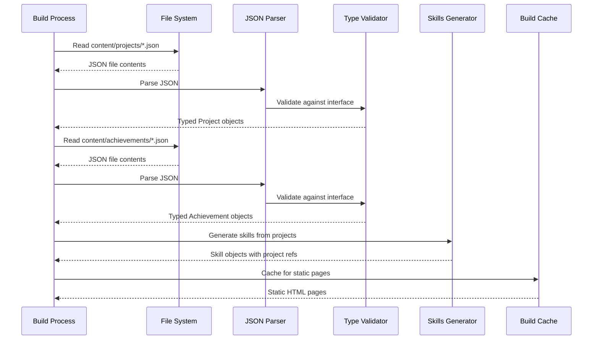
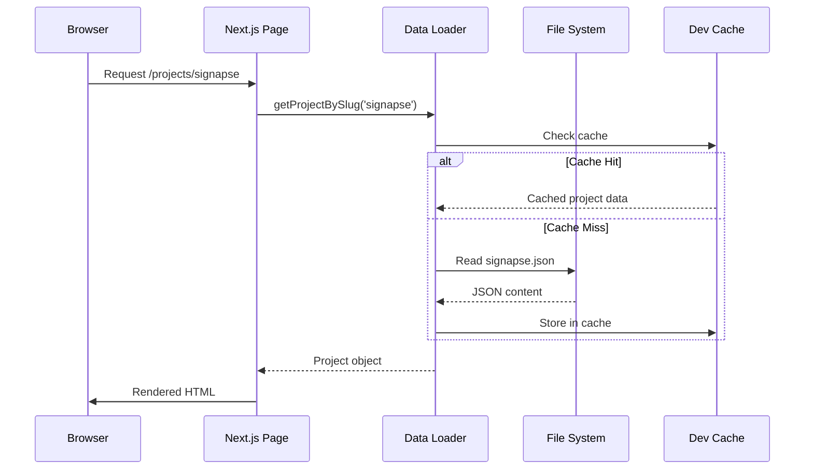

# Content Management System Overview

**Navigation**: [Documentation Home](../index.md) > [Content Management](./README.md) > CMS Overview

---

## Table of Contents

- [Introduction](#introduction)
- [File-Based CMS Architecture](#file-based-cms-architecture)
- [Content Flow](#content-flow)
- [Directory Structure](#directory-structure)
- [Content Types](#content-types)
- [Key Features](#key-features)
- [Data Pipeline](#data-pipeline)
- [Why File-Based?](#why-file-based)
- [See Also](#see-also)
- [Next Steps](#next-steps)

---

## Introduction

This portfolio uses a **file-based Content Management System (CMS)** that stores all content as structured JSON files in the `content/` directory. This approach provides version control, type safety, and simplicity without requiring a database or external CMS platform.

### Core Principles

1. **Content as Code**: All content lives in version-controlled JSON files
2. **Type Safety**: TypeScript interfaces ensure data integrity
3. **Auto-Generation**: Skills are dynamically generated from project technologies
4. **Static Generation**: Content is processed at build time for optimal performance
5. **Developer-Friendly**: Simple JSON editing with immediate preview in dev mode

---

## File-Based CMS Architecture

```mermaid
graph TB
    subgraph "Content Layer"
        A[📁 content/projects/*.json]
        B[📁 content/achievements/*.json]
    end

    subgraph "Data Access Layer"
        C[📄 lib/projects.ts]
        D[📄 lib/achievements.ts]
        E[📄 lib/skills.ts]
    end

    subgraph "Type System"
        F[🔷 TypeScript Interfaces]
        G[🔷 Project Interface]
        H[🔷 Achievement Interface]
        I[🔷 Skill Interface]
    end

    subgraph "Component Layer"
        J[⚛️ Project Components]
        K[⚛️ Achievement Components]
        L[⚛️ Skills Table]
    end

    subgraph "Page Layer"
        M[📄 /projects page]
        N[📄 /projects/[slug] page]
        O[📄 /skills page]
        P[📄 / home page]
    end

    A --> C
    B --> D
    C --> E

    C --> G
    D --> H
    E --> I

    F --> G
    F --> H
    F --> I

    G --> J
    H --> K
    I --> L

    J --> M
    J --> N
    K --> P
    L --> O

    style A fill:#e1f5ff
    style B fill:#e1f5ff
    style C fill:#fff4e1
    style D fill:#fff4e1
    style E fill:#fff4e1
    style F fill:#f0e1ff
    style G fill:#f0e1ff
    style H fill:#f0e1ff
    style I fill:#f0e1ff
    style J fill:#e1ffe1
    style K fill:#e1ffe1
    style L fill:#e1ffe1
    style M fill:#ffe1e1
    style N fill:#ffe1e1
    style O fill:#ffe1e1
    style P fill:#ffe1e1
```

---

## Content Flow

The content management system follows a unidirectional data flow from JSON files to rendered pages:

```mermaid
flowchart LR
    A[📝 Edit JSON File] --> B[💾 Save to content/]
    B --> C[🔄 Dev Server Reload]
    C --> D[📖 Read JSON Files]
    D --> E[🔍 Parse & Validate]
    E --> F[🏗️ Build Type-Safe Objects]
    F --> G[⚙️ Generate Skills]
    G --> H[⚛️ Render Components]
    H --> I[🎨 Display on Page]

    style A fill:#e3f2fd
    style B fill:#e8f5e9
    style C fill:#fff3e0
    style D fill:#f3e5f5
    style E fill:#fce4ec
    style F fill:#e0f2f1
    style G fill:#fff9c4
    style H fill:#e1bee7
    style I fill:#c5e1a5
```



### Flow Steps

1. **Edit**: Developer creates or modifies JSON file in `content/projects/` or `content/achievements/`
2. **Save**: File is saved with proper schema structure
3. **Reload**: Next.js dev server detects file change and triggers hot reload
4. **Read**: Data access functions (`getProjects()`, `getAchievements()`) read JSON files
5. **Parse**: JSON is parsed and validated against TypeScript interfaces
6. **Build**: Type-safe objects are created with slug derived from filename
7. **Generate**: Skills are auto-generated from project technologies array
8. **Render**: React components receive typed data as props
9. **Display**: Final pages are rendered with all content and relationships

---

## Directory Structure

```
content/
├── projects/
│   ├── signapse.json          # Featured project (order: 1)
│   ├── pop-a-loon.json        # Featured project (order: 2)
│   ├── chitchatz.json         # Featured project (order: 3)
│   ├── interactive-corridor.json  # Featured project (order: 4)
│   ├── mybot.json             # Featured project (order: 5)
│   ├── bemed.json             # Featured project (order: 6)
│   ├── final-project.json     # Non-featured project
│   ├── audionome.json         # Non-featured project
│   ├── colorsplash.json       # Non-featured project
│   ├── mlx90640.json          # Non-featured project
│   ├── paleonet.json          # Non-featured project
│   └── cerm-mcp-poc.json      # Non-featured project
│
└── achievements/
    ├── rotary-award.json      # Award (order: 1)
    ├── bip-madrid.json        # Achievement
    ├── ccna-1.json            # Certification
    └── ccna-2.json            # Certification

lib/
├── projects.ts                # Project data access & types
├── achievements.ts            # Achievement data access & types
├── skills.ts                  # Auto-generated skills logic
└── utils.ts                   # Utility functions (isVideoFile, cn)

public/images/
├── projects/
│   ├── signapse/
│   │   ├── demo.webp
│   │   ├── stack.webp
│   │   └── tablet-home-1-2527x1422.webp
│   ├── pop-a-loon/
│   │   ├── small.webp
│   │   ├── screenshot-1.webp
│   │   ├── screenshot-2.webp
│   │   └── screenshot-3.webp
│   └── [other-projects]/
│
└── logos/
    └── rotary-international.webp
```

---

## Content Types

### 1. Projects

**Location**: `content/projects/*.json`

Projects represent portfolio work including web apps, mobile apps, ML projects, and other development work.

**Key Features**:

- Featured projects (order 1-6) appear on homepage
- Technologies array generates skills automatically
- Support for both images and videos
- Optional demo and GitHub URLs
- Rich descriptions with markdown support

**Example Filename**: `signapse.json` → Slug: `signapse` → URL: `/projects/signapse`

### 2. Achievements

**Location**: `content/achievements/*.json`

Achievements include certifications, awards, and notable accomplishments.

**Key Features**:

- Three types: `certification`, `award`, `achievement`
- Optional issuer logos
- Date-based sorting
- Optional external verification links

**Example Filename**: `rotary-award.json` → Slug: `rotary-award`

### 3. Skills (Auto-Generated)

**Source**: Dynamically generated from project technologies

Skills are not stored as separate files but are computed from all project technology arrays.

**Key Features**:

- Automatic deduplication
- Case-insensitive matching with ID generation
- Associated projects list for each skill
- Sortable and filterable in UI

---

## Key Features

### 1. Slug Generation

Slugs are automatically derived from JSON filenames:

```typescript
// File: content/projects/my-awesome-project.json
// Slug: "my-awesome-project"
// URL: /projects/my-awesome-project
```

### 2. Order-Based Sorting

Projects and achievements support an `order` field for explicit positioning:

```json
{
  "order": 1 // Featured project, appears first
}
```

**Sorting Logic**:

1. Items with `order` field come first (sorted numerically)
2. Featured projects: `order` 1-6 appear on homepage
3. Items without `order` are sorted alphabetically by title
4. Achievements without `order` are sorted by date (newest first)

### 3. Technology-Based Skills

Skills are automatically extracted from project technologies:

```json
// Project A
{
  "technologies": ["React", "TypeScript", "Docker"]
}

// Project B
{
  "technologies": ["TypeScript", "Next.js", "PostgreSQL"]
}

// Generated Skills:
// - React (1 project: Project A)
// - TypeScript (2 projects: Project A, Project B)
// - Docker (1 project: Project A)
// - Next.js (1 project: Project B)
// - PostgreSQL (1 project: Project B)
```

### 4. Related Projects

Projects with shared technologies are automatically linked:

```typescript
// If viewing "Project A" (React, TypeScript)
// Related: "Project B" (TypeScript, Next.js) - shares TypeScript
```

### 5. Image and Video Support

Both static images and video files are supported in project galleries:

```json
{
  "images": [
    {
      "src": "/images/projects/demo/screenshot.webp",
      "alt": "App screenshot"
    },
    {
      "src": "/images/projects/demo/video-demo.mp4",
      "alt": "Video demonstration"
    }
  ]
}
```

Videos are detected by file extension (`.mp4`, `.webm`, `.mov`) using the `isVideoFile()` utility.

---

## Data Pipeline

### Build-Time Generation



### Runtime Access (Development)



---

## Why File-Based?

### Advantages

1. **Version Control**: All content changes tracked in Git
2. **No Database**: Eliminates database setup and maintenance
3. **Type Safety**: TypeScript ensures data integrity
4. **Simplicity**: Easy to understand and maintain
5. **Performance**: Static generation at build time
6. **Developer Experience**: Edit JSON, see results immediately
7. **Portability**: Content easily migrates between environments
8. **Backup**: Git serves as backup system
9. **Collaboration**: Standard PR workflow for content changes
10. **Zero Cost**: No CMS hosting or licensing fees

### Trade-offs

1. **No GUI**: Content editors must edit JSON files directly
2. **Build Required**: Changes require rebuild for production
3. **Technical Skills**: Content editors need JSON knowledge
4. **Scalability**: Not ideal for 1000+ content items
5. **No Real-Time**: Changes not immediately visible in production

### Ideal For

- ✅ Portfolio sites
- ✅ Personal blogs
- ✅ Documentation sites
- ✅ Small business sites
- ✅ Developer-focused content

### Not Ideal For

- ❌ E-commerce sites with frequent inventory changes
- ❌ Multi-user content teams without technical skills
- ❌ Sites requiring real-time content updates
- ❌ Large-scale content operations (1000+ pages)

---

## See Also

- [JSON Schema Reference](./02-json-schema.md) - Complete schema definitions
- [TypeScript Interfaces](./03-typescript-interfaces.md) - Type definitions
- [Data Fetching](./04-data-fetching.md) - Data access API
- [Skills Generation](./05-skills-generation.md) - Auto-generated skills logic
- [Adding Projects](./06-adding-projects.md) - Step-by-step project guide
- [Architecture Overview](../01-architecture/01-overview.md) - Full stack details

---

## Next Steps

1. **Understand the Schema**: Read the [JSON Schema Reference](./02-json-schema.md)
2. **Learn the Types**: Review [TypeScript Interfaces](./03-typescript-interfaces.md)
3. **Add Your First Project**: Follow [Adding Projects Guide](./06-adding-projects.md)
4. **Explore Data Access**: Study [Data Fetching Functions](./04-data-fetching.md)
5. **Master Skills**: Learn about [Skills Generation](./05-skills-generation.md)

---

**Last Updated**: February 2026  
**Maintainer**: Development Team  
**Related Files**: `content/`, `lib/projects.ts`, `lib/achievements.ts`, `lib/skills.ts`
