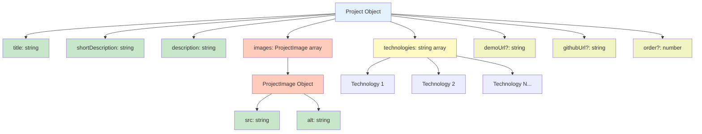
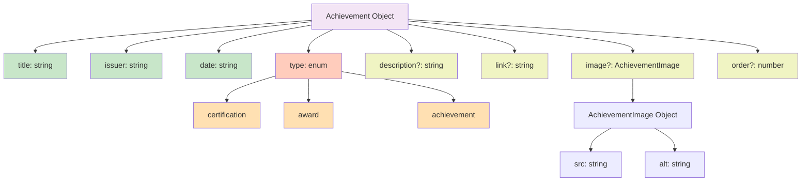

# JSON Schema Reference

**Navigation**: [Documentation Home](../index.md) > [Content Management](./README.md) > JSON Schema

---

## Table of Contents

- [Introduction](#introduction)
- [Project Schema](#project-schema)
- [Achievement Schema](#achievement-schema)
- [Schema Diagrams](#schema-diagrams)
- [Field Validation Rules](#field-validation-rules)
- [Common Patterns](#common-patterns)
- [Best Practices](#best-practices)
- [Schema Examples](#schema-examples)
- [Troubleshooting](#troubleshooting)
- [See Also](#see-also)
- [Next Steps](#next-steps)

---

## Introduction

This document defines the complete JSON schema for all content types in the portfolio. All JSON files must conform to these schemas to ensure proper rendering and type safety.

### Schema Philosophy

1. **Required vs Optional**: Core fields are required, metadata is optional
2. **Explicit Structure**: Arrays and objects have defined shapes
3. **Consistent Naming**: camelCase for all field names
4. **Semantic Fields**: Field names reflect their purpose
5. **Extensible**: Easy to add new optional fields

---

## Project Schema

### Complete Structure

```json
{
  "title": "string (required)",
  "shortDescription": "string (required)",
  "description": "string (required)",
  "technologies": ["string", "string", ...] (required, min 1),
  "images": [
    {
      "src": "string (required)",
      "alt": "string (required)"
    }
  ] (required, min 1),
  "demoUrl": "string (optional)",
  "githubUrl": "string (optional)",
  "order": number (optional, 1-6 for featured)
}
```

### Field Definitions

#### `title` (Required)

**Type**: `string`  
**Purpose**: Project name displayed in headings and cards  
**Constraints**:

- Must be unique across all projects
- Recommended: 2-50 characters
- Used in page titles and meta tags

**Examples**:

```json
"title": "Signapse"                    // ✅ Good
"title": "Pop-a-loon"                  // ✅ Good
"title": "My Project"                  // ⚠️ Too generic
"title": "The Really Super Amazing Awesome AI-Powered ML Solution"  // ❌ Too long
```

#### `shortDescription` (Required)

**Type**: `string`  
**Purpose**: Brief one-line summary for cards and previews  
**Constraints**:

- Recommended: 50-150 characters
- Should be a complete sentence
- Appears on project cards and search results

**Examples**:

```json
// ✅ Good - concise and descriptive
"shortDescription": "A full stack Chrome extension with 200+ users, featuring interactive balloons and real-time stats."

// ✅ Good - highlights key features
"shortDescription": "Using computer vision and machine learning to translate sign language gestures into text."

// ❌ Too short - not descriptive enough
"shortDescription": "A web app."

// ❌ Too long - should be in description field
"shortDescription": "This is an innovative solution that uses cutting-edge technologies including React, TypeScript, and more to solve complex problems in the domain of web development with a focus on user experience..."
```

#### `description` (Required)

**Type**: `string`  
**Purpose**: Full project description with technical details  
**Constraints**:

- Can be multiple paragraphs (use `\n\n` for breaks)
- Recommended: 200-800 characters
- Supports plain text (no markdown)
- Rendered with line breaks preserved

**Examples**:

```json
"description": "An innovative accessibility solution developed for VIVES Project Experience that bridges the communication gap between deaf/hard-of-hearing and hearing individuals. The application leverages advanced computer vision and machine learning techniques to recognize sign language in real-time through the phone's camera and convert it to text and speech.\n\nThe project features a multi-model AI pipeline combining PyTorch LSTM networks for sequential analysis with MediaPipe for hand and pose landmark extraction. It supports both ASL (American Sign Language) and VGT (Flemish Sign Language), recognizing individual letters and complete words with high accuracy.\n\nBuilt with a modular architecture, the solution consists of a React Native mobile app with TypeScript for the frontend, a FastAPI-based Python backend for AI processing, and a robust DevOps setup using Docker containers and Kubernetes for production deployment."
```

#### `technologies` (Required)

**Type**: `string[]`  
**Purpose**: Array of technology names used in project  
**Constraints**:

- Minimum 1 technology
- Used to generate skills automatically
- Case-sensitive (affects skill grouping)
- Order preserved in display

**Important**: Use consistent capitalization across all projects for proper skill grouping:

```json
// ✅ Good - consistent capitalization
{
  "technologies": ["React", "TypeScript", "Docker"]
}

// ❌ Bad - inconsistent capitalization
{
  "technologies": ["react", "TypeScript", "DOCKER"]
}
// This creates 3 separate skills: "react", "TypeScript", "DOCKER"
// Instead of grouping them properly
```

**Common Technologies** (use exact capitalization):

```json
{
  "technologies": [
    // Languages
    "TypeScript",
    "JavaScript",
    "Python",
    "Java",
    "C++",
    "Go",
    "Rust",

    // Frontend
    "React",
    "Next.js",
    "Vue.js",
    "Angular",
    "Svelte",
    "Tailwind CSS",
    "styled-components",
    "CSS",
    "HTML",

    // Mobile
    "React Native",
    "Flutter",
    "Swift",
    "Kotlin",

    // Backend
    "Node.js",
    "Express",
    "FastAPI",
    "Django",
    "Flask",
    "GraphQL",
    "REST API",
    "WebSocket",

    // Databases
    "PostgreSQL",
    "MongoDB",
    "MySQL",
    "Redis",
    "Firebase",

    // DevOps
    "Docker",
    "Kubernetes",
    "CI/CD",
    "AWS",
    "Azure",
    "GCP",
    "GitHub Actions",
    "Jenkins",

    // Tools
    "Git",
    "Linux",
    "Bash",
    "Webpack",
    "Vite",

    // AI/ML
    "AI",
    "Machine Learning",
    "PyTorch",
    "TensorFlow",
    "Computer Vision",
    "NLP",

    // Other
    "Microservices",
    "Testing",
    "Agile",
    "Scrum"
  ]
}
```

#### `images` (Required)

**Type**: `ProjectImage[]`  
**Purpose**: Gallery images and videos for project showcase  
**Constraints**:

- Minimum 1 image/video
- Each item must have `src` and `alt`
- Supports both images (`.webp`, `.jpg`, `.png`) and videos (`.mp4`, `.webm`, `.mov`)

**Structure**:

```json
{
  "images": [
    {
      "src": "/images/projects/{slug}/{filename}.webp",
      "alt": "Descriptive text for accessibility"
    }
  ]
}
```

**Examples**:

```json
{
  "images": [
    // ✅ Image
    {
      "src": "/images/projects/signapse/demo.webp",
      "alt": "The demo of the Signapse application in action at VIVES."
    },

    // ✅ Video
    {
      "src": "/images/projects/signapse/demo-video.mp4",
      "alt": "Video demonstration of real-time sign language translation"
    },

    // ❌ Missing alt text
    {
      "src": "/images/projects/signapse/demo.webp"
    },

    // ❌ Incorrect path (should start with /images/)
    {
      "src": "demo.webp",
      "alt": "Demo screenshot"
    }
  ]
}
```

**Alt Text Guidelines**:

- Be descriptive and specific
- Include relevant context
- Avoid "image of" or "picture of"
- Describe what's visible and important

```json
// ✅ Good alt text
"alt": "User statistics dashboard showing popped balloons count and global leaderboard"

// ❌ Poor alt text
"alt": "Screenshot"
"alt": "Image 1"
"alt": "Picture of the app"
```

#### `demoUrl` (Optional)

**Type**: `string`  
**Purpose**: Link to live demo or deployed project  
**Constraints**:

- Must be a valid URL (http:// or https://)
- External links recommended
- Appears as "Live Demo" button

**Examples**:

```json
"demoUrl": "https://signapse.devbitapp.be/"                                    // ✅ Live app
"demoUrl": "https://chromewebstore.google.com/detail/pop-a-loon/..."          // ✅ Chrome store
"demoUrl": "https://example.com"                                               // ✅ Any live URL
"demoUrl": "demo.html"                                                         // ❌ Relative URL
```

#### `githubUrl` (Optional)

**Type**: `string`  
**Purpose**: Link to GitHub repository  
**Constraints**:

- Must be a valid GitHub URL
- Can be organization or personal repo
- Private repos are acceptable if you have access
- Appears as "View Source" button

**Examples**:

```json
"githubUrl": "https://github.com/username/repo"                               // ✅ Standard
"githubUrl": "https://github.com/vives-project-xp/Signapse"                   // ✅ Organization
"githubUrl": "https://github.com/username/repo/tree/main/subdirectory"        // ✅ Subdirectory
"githubUrl": "github.com/username/repo"                                        // ❌ Missing protocol
"githubUrl": "https://gitlab.com/username/repo"                                // ❌ Not GitHub
```

#### `order` (Optional)

**Type**: `number`  
**Purpose**: Explicit ordering for featured projects  
**Constraints**:

- Must be a positive integer
- Values 1-6: Featured projects (appear on homepage)
- Values 7+: Ordered but not featured
- Omit field for alphabetical sorting

**Sorting Behavior**:

```json
// Project A
{ "order": 1, "title": "Z Project" }  // Appears 1st (order takes precedence)

// Project B
{ "order": 2, "title": "A Project" }  // Appears 2nd

// Project C
{ "order": 10, "title": "M Project" } // Appears 3rd (ordered but not featured)

// Project D
{ "title": "B Project" }               // Appears 4th (alphabetical)

// Project E
{ "title": "D Project" }               // Appears 5th (alphabetical)
```

**Featured Projects Logic**:

```typescript
// Only projects with order 1-6 appear on homepage
const featuredProjects = projects.filter(
  (p) => p.order !== undefined && p.order >= 1 && p.order <= 6
);
```

### Complete Example

```json
{
  "title": "Signapse",
  "shortDescription": "Using computer vision and machine learning to translate sign language gestures into text.",
  "description": "An innovative accessibility solution developed for VIVES Project Experience that bridges the communication gap between deaf/hard-of-hearing and hearing individuals. The application leverages advanced computer vision and machine learning techniques to recognize sign language in real-time through the phone's camera and convert it to text and speech.\n\nThe project features a multi-model AI pipeline combining PyTorch LSTM networks for sequential analysis with MediaPipe for hand and pose landmark extraction. It supports both ASL (American Sign Language) and VGT (Flemish Sign Language), recognizing individual letters and complete words with high accuracy.\n\nBuilt with a modular architecture, the solution consists of a React Native mobile app with TypeScript for the frontend, a FastAPI-based Python backend for AI processing, and a robust DevOps setup using Docker containers and Kubernetes for production deployment. The custom smart_gestures package, published on PyPI, enables feature extraction and gesture recognition across different components of the system.",
  "technologies": [
    "AI",
    "Python",
    "Kubernetes",
    "PyTorch",
    "React Native",
    "CI/CD",
    "FastAPI",
    "Docker",
    "TypeScript"
  ],
  "images": [
    {
      "src": "/images/projects/signapse/demo.webp",
      "alt": "The demo of the Signapse application in action at VIVES."
    },
    {
      "src": "/images/projects/signapse/stack.webp",
      "alt": "While presenting the tech stack used in the Signapse project."
    },
    {
      "src": "/images/projects/signapse/tablet-home-1-2527x1422.webp",
      "alt": "Signapse application home page."
    }
  ],
  "demoUrl": "https://signapse.devbitapp.be/",
  "githubUrl": "https://github.com/vives-project-xp/Signapse",
  "order": 1
}
```

---

## Achievement Schema

### Complete Structure

```json
{
  "title": "string (required)",
  "issuer": "string (required)",
  "date": "string (required, YYYY or YYYY-MM format)",
  "type": "certification | award | achievement (required)",
  "description": "string (optional)",
  "link": "string (optional)",
  "image": {
    "src": "string (required)",
    "alt": "string (required)"
  } (optional),
  "order": number (optional)
}
```

### Field Definitions

#### `title` (Required)

**Type**: `string`  
**Purpose**: Achievement name or certification title  
**Examples**:

```json
"title": "Top Graduating Student Recognition"              // ✅ Award
"title": "CCNA: Introduction to Networks"                  // ✅ Certification
"title": "Erasmus+ Programme in Madrid"                    // ✅ Achievement
```

#### `issuer` (Required)

**Type**: `string`  
**Purpose**: Organization that issued the achievement  
**Examples**:

```json
"issuer": "Rotary International"                           // ✅ Organization
"issuer": "Cisco Networking Academy"                       // ✅ Institution
"issuer": "European Commission"                            // ✅ Government body
```

#### `date` (Required)

**Type**: `string`  
**Purpose**: Date achievement was earned  
**Formats**:

- Year only: `"2023"`
- Year and month: `"2023-06"`
- Full date not recommended (displays year only)

**Examples**:

```json
"date": "2023"          // ✅ Year only (most common)
"date": "2023-06"       // ✅ Year and month
"date": "2023-06-15"    // ⚠️ Full date (month/day ignored in display)
"date": "June 2023"     // ❌ Invalid format
```

#### `type` (Required)

**Type**: `"certification" | "award" | "achievement"`  
**Purpose**: Category of achievement for filtering and display

**Types**:

```json
"type": "certification"  // ✅ Official certifications (CCNA, AWS, etc.)
"type": "award"          // ✅ Awards and recognitions
"type": "achievement"    // ✅ Other notable accomplishments
```

#### `description` (Optional)

**Type**: `string`  
**Purpose**: Additional context about the achievement  
**Examples**:

```json
"description": "Recognized for academic excellence and mentoring struggling classmates. This award reinforced that learning isn't just personal, it's about lifting others up with you."
```

#### `link` (Optional)

**Type**: `string`  
**Purpose**: URL to verification or more information  
**Examples**:

```json
"link": "https://www.credly.com/badges/..."                // ✅ Credential verification
"link": "https://www.cisco.com/c/en/us/training-events/..." // ✅ Course information
```

#### `image` (Optional)

**Type**: `AchievementImage`  
**Purpose**: Logo of issuing organization or badge  
**Structure**:

```json
{
  "image": {
    "src": "/images/logos/{issuer-slug}.webp",
    "alt": "Organization name logo - description"
  }
}
```

**Examples**:

```json
{
  "image": {
    "src": "/images/logos/rotary-international.webp",
    "alt": "Rotary International logo - gold wheel emblem"
  }
}
```

#### `order` (Optional)

**Type**: `number`  
**Purpose**: Override date-based sorting  
**Behavior**:

- Achievements with `order` appear first (sorted numerically)
- Achievements without `order` are sorted by date (newest first)

### Complete Example

```json
{
  "title": "Top Graduating Student Recognition",
  "issuer": "Rotary International",
  "date": "2023",
  "type": "award",
  "description": "Recognized for academic excellence and mentoring struggling classmates. This award reinforced that learning isn't just personal, it's about lifting others up with you.",
  "image": {
    "src": "/images/logos/rotary-international.webp",
    "alt": "Rotary International logo - gold wheel emblem"
  },
  "order": 1
}
```

---

## Schema Diagrams

### Project Schema Hierarchy



### Achievement Schema Hierarchy



---

## Field Validation Rules

### Required Field Matrix

| Field              | Project     | Achievement |
| ------------------ | ----------- | ----------- |
| `title`            | ✅ Required | ✅ Required |
| `shortDescription` | ✅ Required | ❌ Not used |
| `description`      | ✅ Required | ⚠️ Optional |
| `technologies`     | ✅ Required | ❌ Not used |
| `images`           | ✅ Required | ❌ Not used |
| `image`            | ❌ Not used | ⚠️ Optional |
| `issuer`           | ❌ Not used | ✅ Required |
| `date`             | ❌ Not used | ✅ Required |
| `type`             | ❌ Not used | ✅ Required |
| `demoUrl`          | ⚠️ Optional | ❌ Not used |
| `githubUrl`        | ⚠️ Optional | ❌ Not used |
| `link`             | ❌ Not used | ⚠️ Optional |
| `order`            | ⚠️ Optional | ⚠️ Optional |

### Validation Checklist

**Before Saving JSON**:

1. ✅ Valid JSON syntax (use [JSONLint](https://jsonlint.com/))
2. ✅ All required fields present
3. ✅ Correct data types for all fields
4. ✅ `technologies` array has at least 1 item (projects)
5. ✅ `images` array has at least 1 item (projects)
6. ✅ All image `src` paths start with `/images/`
7. ✅ All image `alt` texts are descriptive
8. ✅ URLs include protocol (`https://`)
9. ✅ `type` field uses valid enum value (achievements)
10. ✅ `date` uses YYYY or YYYY-MM format (achievements)
11. ✅ Technology names use consistent capitalization
12. ✅ Filename uses kebab-case (no spaces, lowercase)

---

## Common Patterns

### Minimal Project

```json
{
  "title": "My Simple Project",
  "shortDescription": "A brief description of what this project does.",
  "description": "A longer description with more details about the project, its features, and implementation.",
  "technologies": ["React", "TypeScript"],
  "images": [
    {
      "src": "/images/projects/my-simple-project/screenshot.webp",
      "alt": "Main application screenshot"
    }
  ]
}
```

### Full-Featured Project

```json
{
  "title": "My Complex Project",
  "shortDescription": "A comprehensive solution with multiple features and integrations.",
  "description": "Detailed description paragraph 1.\n\nDetailed description paragraph 2.\n\nDetailed description paragraph 3.",
  "technologies": ["React", "TypeScript", "Next.js", "PostgreSQL", "Docker", "Kubernetes", "AWS"],
  "images": [
    {
      "src": "/images/projects/my-complex-project/hero.webp",
      "alt": "Application hero image showing main dashboard"
    },
    {
      "src": "/images/projects/my-complex-project/demo.mp4",
      "alt": "Video demonstration of key features"
    },
    {
      "src": "/images/projects/my-complex-project/architecture.webp",
      "alt": "System architecture diagram"
    }
  ],
  "demoUrl": "https://my-project.com",
  "githubUrl": "https://github.com/username/my-project",
  "order": 1
}
```

### Certification Achievement

```json
{
  "title": "AWS Certified Solutions Architect",
  "issuer": "Amazon Web Services",
  "date": "2024-01",
  "type": "certification",
  "description": "Validates expertise in designing distributed systems on AWS.",
  "link": "https://www.credly.com/badges/...",
  "image": {
    "src": "/images/logos/aws.webp",
    "alt": "AWS logo - orange smile arrow"
  }
}
```

### Award Achievement

```json
{
  "title": "Best Innovation Award",
  "issuer": "Tech Conference 2024",
  "date": "2024",
  "type": "award",
  "description": "Awarded for innovative approach to solving complex problems in web development.",
  "order": 1
}
```

---

## Best Practices

### 1. Consistent Naming

Use the same technology names across all projects:

```json
// ✅ Good - consistent
// Project 1
{"technologies": ["React", "TypeScript"]}

// Project 2
{"technologies": ["React", "Node.js"]}

// ❌ Bad - inconsistent
// Project 1
{"technologies": ["React", "TypeScript"]}

// Project 2
{"technologies": ["react", "typescript"]}
// Creates separate skills!
```

### 2. Descriptive Alt Text

Write alt text that describes the content:

```json
// ✅ Good
{
  "alt": "User dashboard showing analytics charts with visitor metrics and conversion rates"
}

// ❌ Bad
{
  "alt": "Screenshot 1"
}
{
  "alt": "Image"
}
```

### 3. Paragraph Breaks

Use `\n\n` for paragraph breaks in descriptions:

```json
{
  "description": "First paragraph about the project.\n\nSecond paragraph with more details.\n\nThird paragraph wrapping up."
}
```

### 4. Image Optimization

- Use WebP format for best compression
- Optimize images before adding to repository
- Recommended max width: 2000px
- Use descriptive filenames

### 5. Technology Order

List technologies from most to least important:

```json
{
  "technologies": [
    "React", // Primary framework
    "TypeScript", // Primary language
    "Next.js", // Framework extension
    "Tailwind CSS", // Styling
    "PostgreSQL", // Database
    "Docker" // Deployment
  ]
}
```

---

## Schema Examples

### Example 1: Web Application

**File**: `content/projects/task-manager.json`

```json
{
  "title": "Task Manager Pro",
  "shortDescription": "A collaborative task management application with real-time updates and team analytics.",
  "description": "Task Manager Pro is a full-stack web application designed for teams to organize and track their work efficiently. Built with modern technologies, it features real-time collaboration, customizable workflows, and detailed analytics.\n\nThe application uses React and TypeScript for a type-safe frontend, Next.js for server-side rendering and API routes, and PostgreSQL for reliable data storage. Real-time updates are powered by WebSocket connections, and the entire stack is containerized with Docker for easy deployment.",
  "technologies": [
    "React",
    "TypeScript",
    "Next.js",
    "PostgreSQL",
    "WebSocket",
    "Docker",
    "Tailwind CSS"
  ],
  "images": [
    {
      "src": "/images/projects/task-manager/dashboard.webp",
      "alt": "Task Manager Pro dashboard showing active tasks and team progress"
    },
    {
      "src": "/images/projects/task-manager/kanban.webp",
      "alt": "Kanban board view with drag-and-drop functionality"
    },
    {
      "src": "/images/projects/task-manager/analytics.webp",
      "alt": "Team analytics page with productivity charts and insights"
    }
  ],
  "demoUrl": "https://taskmanager-demo.com",
  "githubUrl": "https://github.com/username/task-manager",
  "order": 3
}
```

### Example 2: Mobile Application

**File**: `content/projects/fitness-tracker.json`

```json
{
  "title": "FitTrack Mobile",
  "shortDescription": "Cross-platform fitness tracking app with AI-powered workout recommendations.",
  "description": "FitTrack Mobile is a comprehensive fitness tracking application built with React Native, enabling users to log workouts, track progress, and receive personalized recommendations. The app features offline support, health app integrations, and social sharing capabilities.\n\nThe backend is built with Node.js and Express, using MongoDB for flexible data storage. Machine learning models analyze user data to provide intelligent workout suggestions and progress predictions.",
  "technologies": [
    "React Native",
    "TypeScript",
    "Node.js",
    "MongoDB",
    "Machine Learning",
    "Express",
    "Firebase"
  ],
  "images": [
    {
      "src": "/images/projects/fitness-tracker/home.webp",
      "alt": "FitTrack home screen showing today's workout summary"
    },
    {
      "src": "/images/projects/fitness-tracker/workout.webp",
      "alt": "Active workout tracking with real-time metrics"
    },
    {
      "src": "/images/projects/fitness-tracker/demo.mp4",
      "alt": "Video demonstration of workout logging and AI recommendations"
    }
  ],
  "githubUrl": "https://github.com/username/fitness-tracker"
}
```

### Example 3: CLI Tool

**File**: `content/projects/devtools-cli.json`

```json
{
  "title": "DevTools CLI",
  "shortDescription": "Command-line utility for streamlining development workflows with 50+ commands.",
  "description": "DevTools CLI is a powerful command-line interface tool designed to automate common development tasks. Written in Go for maximum performance, it provides commands for project scaffolding, code generation, testing automation, and deployment workflows.\n\nThe tool features an intuitive command structure, comprehensive help documentation, and plugin support for extensibility. It has been downloaded over 10,000 times and is used by development teams worldwide.",
  "technologies": ["Go", "CLI", "CI/CD", "Testing", "Git"],
  "images": [
    {
      "src": "/images/projects/devtools-cli/terminal-demo.webp",
      "alt": "Terminal showing DevTools CLI commands and output"
    },
    {
      "src": "/images/projects/devtools-cli/help-screen.webp",
      "alt": "DevTools CLI help documentation with available commands"
    }
  ],
  "githubUrl": "https://github.com/username/devtools-cli",
  "order": 5
}
```

---

## Troubleshooting

### Common Errors

#### 1. Invalid JSON Syntax

**Error**: Project doesn't appear on site

**Cause**: JSON syntax error (missing comma, quote, bracket)

**Solution**: Validate JSON at [JSONLint](https://jsonlint.com/)

```json
// ❌ Error - missing comma
{
  "title": "My Project"
  "shortDescription": "Description"
}

// ✅ Fixed
{
  "title": "My Project",
  "shortDescription": "Description"
}
```

#### 2. Missing Required Field

**Error**: Build fails or project doesn't render

**Cause**: Required field is missing

**Solution**: Add all required fields per schema

```json
// ❌ Error - missing shortDescription
{
  "title": "My Project",
  "description": "Long description",
  "technologies": ["React"],
  "images": [...]
}

// ✅ Fixed
{
  "title": "My Project",
  "shortDescription": "Brief description",
  "description": "Long description",
  "technologies": ["React"],
  "images": [...]
}
```

#### 3. Empty Arrays

**Error**: Type error or validation failure

**Cause**: Required arrays are empty

**Solution**: Ensure arrays have at least one item

```json
// ❌ Error - empty technologies
{
  "technologies": [],
  "images": []
}

// ✅ Fixed
{
  "technologies": ["React"],
  "images": [{"src": "/images/...", "alt": "..."}]
}
```

#### 4. Wrong Image Path

**Error**: Images don't load

**Cause**: Incorrect image path format

**Solution**: Use absolute path starting with `/images/`

```json
// ❌ Error - relative path
{
  "src": "screenshot.webp"
}

// ❌ Error - wrong directory
{
  "src": "./public/images/projects/demo/screenshot.webp"
}

// ✅ Fixed
{
  "src": "/images/projects/demo/screenshot.webp"
}
```

#### 5. Inconsistent Technology Names

**Error**: Skills are duplicated or not grouping properly

**Cause**: Different capitalizations of same technology

**Solution**: Use consistent capitalization across all projects

```json
// ❌ Creates 3 separate skills
// Project 1
{"technologies": ["react"]}
// Project 2
{"technologies": ["React"]}
// Project 3
{"technologies": ["REACT"]}

// ✅ Groups into 1 skill
// All projects
{"technologies": ["React"]}
```

---

## See Also

- [CMS Overview](./01-cms-overview.md) - System architecture
- [TypeScript Interfaces](./03-typescript-interfaces.md) - Type definitions matching these schemas
- [Adding Projects](./06-adding-projects.md) - Step-by-step guide with examples
- [Adding Achievements](./07-adding-achievements.md) - Achievement creation guide
- [Image Handling](./08-image-handling.md) - Image optimization and organization

---

## Next Steps

1. **Study the Examples**: Review the complete examples above
2. **Understand Types**: Read [TypeScript Interfaces](./03-typescript-interfaces.md)
3. **Practice**: Try creating a project following [Adding Projects Guide](./06-adding-projects.md)
4. **Validate**: Use JSON validators to check your files
5. **Test**: Run `npm run dev` to see your changes

---

**Last Updated**: February 2026  
**Maintainer**: Development Team  
**Schema Version**: 1.0.0
