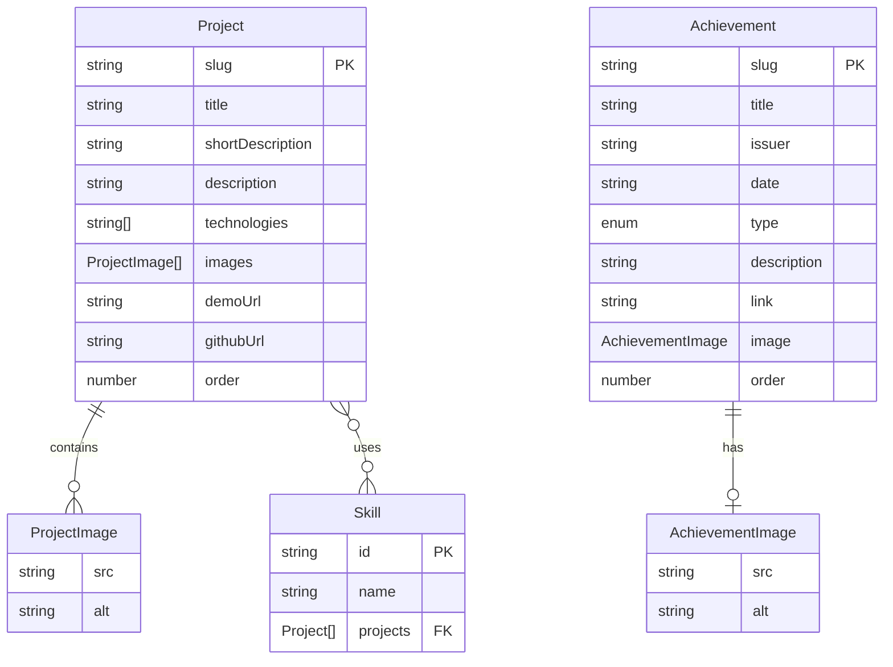
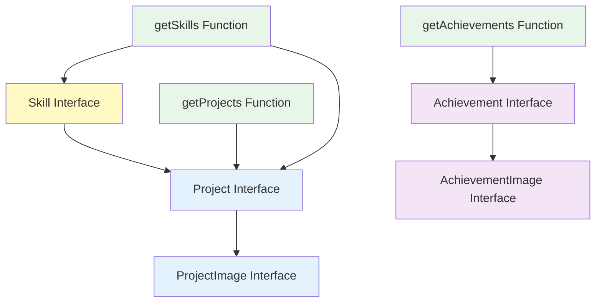

# TypeScript Interfaces

**Navigation**: [Documentation Home](../index.md) > [Content Management](./README.md) > TypeScript Interfaces

---

## Table of Contents

- [Introduction](#introduction)
- [Project Interfaces](#project-interfaces)
- [Achievement Interfaces](#achievement-interfaces)
- [Skill Interfaces](#skill-interfaces)
- [Type Relationships](#type-relationships)
- [Type Guards and Utilities](#type-guards-and-utilities)
- [Type Safety Benefits](#type-safety-benefits)
- [Usage Examples](#usage-examples)
- [Type Extension Patterns](#type-extension-patterns)
- [See Also](#see-also)
- [Next Steps](#next-steps)

---

## Introduction

TypeScript interfaces define the structure and types for all content in the portfolio. These interfaces ensure type safety throughout the application, provide IntelliSense support, and catch errors at compile time.

### Why TypeScript Interfaces?

1. **Type Safety**: Catch errors before runtime
2. **IntelliSense**: Auto-completion in your editor
3. **Documentation**: Self-documenting code
4. **Refactoring**: Safe refactoring with TypeScript compiler
5. **Validation**: Compile-time validation of data structures

### Interface Locations

```
lib/
├── projects.ts        # Project & ProjectImage interfaces
├── achievements.ts    # Achievement & AchievementImage interfaces
├── skills.ts          # Skill interface
└── utils.ts           # Utility types (if any)
```

---

## Project Interfaces

### `ProjectImage` Interface

**Location**: `lib/projects.ts`

```typescript
export interface ProjectImage {
  src: string;
  alt: string;
}
```

#### Field Details

| Field | Type     | Description                  | Example                                 |
| ----- | -------- | ---------------------------- | --------------------------------------- |
| `src` | `string` | Absolute path to image/video | `"/images/projects/signapse/demo.webp"` |
| `alt` | `string` | Accessibility description    | `"Application dashboard screenshot"`    |

#### Usage

```typescript
const images: ProjectImage[] = [
  {
    src: "/images/projects/my-app/screenshot.webp",
    alt: "Main dashboard showing user analytics",
  },
  {
    src: "/images/projects/my-app/demo.mp4",
    alt: "Video demonstration of key features",
  },
];
```

#### Type Checking

```typescript
// ✅ Valid - all required fields present
const validImage: ProjectImage = {
  src: "/images/projects/demo/screen.webp",
  alt: "Screenshot of the application",
};

// ❌ TypeScript Error - missing 'alt'
const invalidImage: ProjectImage = {
  src: "/images/projects/demo/screen.webp",
};
// Error: Property 'alt' is missing in type

// ❌ TypeScript Error - wrong type
const wrongType: ProjectImage = {
  src: 123, // Should be string
  alt: "Screenshot",
};
// Error: Type 'number' is not assignable to type 'string'
```

---

### `Project` Interface

**Location**: `lib/projects.ts`

```typescript
export interface Project {
  slug: string;
  title: string;
  shortDescription: string;
  description: string;
  technologies: string[];
  images: ProjectImage[];
  demoUrl?: string;
  githubUrl?: string;
  order?: number;
}
```

#### Field Details

| Field              | Type                  | Required    | Description                      |
| ------------------ | --------------------- | ----------- | -------------------------------- |
| `slug`             | `string`              | ✅ Yes      | Auto-generated from filename     |
| `title`            | `string`              | ✅ Yes      | Project name                     |
| `shortDescription` | `string`              | ✅ Yes      | Brief one-line summary           |
| `description`      | `string`              | ✅ Yes      | Full project description         |
| `technologies`     | `string[]`            | ✅ Yes      | Array of technology names        |
| `images`           | `ProjectImage[]`      | ✅ Yes      | Array of image/video objects     |
| `demoUrl`          | `string \| undefined` | ⚠️ Optional | Link to live demo                |
| `githubUrl`        | `string \| undefined` | ⚠️ Optional | Link to GitHub repo              |
| `order`            | `number \| undefined` | ⚠️ Optional | Display order (1-6 for featured) |

#### Key Points

1. **Slug**: Not in JSON, added by data access layer from filename
2. **Optional Fields**: Marked with `?`, can be `undefined`
3. **Arrays**: Must have at least one item (enforced by logic, not type)
4. **Images**: Uses nested `ProjectImage` interface

#### Usage

```typescript
import { Project, ProjectImage } from "@/lib/projects";

// Complete project object
const myProject: Project = {
  slug: "my-awesome-project",
  title: "My Awesome Project",
  shortDescription: "A brief description of the project.",
  description: "A longer, more detailed description...",
  technologies: ["React", "TypeScript", "Next.js"],
  images: [
    {
      src: "/images/projects/my-awesome-project/demo.webp",
      alt: "Demo screenshot",
    },
  ],
  demoUrl: "https://my-project.com",
  githubUrl: "https://github.com/user/my-project",
  order: 1,
};

// Project without optional fields
const minimalProject: Project = {
  slug: "minimal-project",
  title: "Minimal Project",
  shortDescription: "Basic project description.",
  description: "Full description here...",
  technologies: ["JavaScript"],
  images: [
    {
      src: "/images/projects/minimal-project/screen.webp",
      alt: "Screenshot",
    },
  ],
  // No demoUrl, githubUrl, or order
};

// Accessing optional fields safely
function getProjectLinks(project: Project): string[] {
  const links: string[] = [];

  if (project.demoUrl) {
    links.push(project.demoUrl); // TypeScript knows this is string, not undefined
  }

  if (project.githubUrl) {
    links.push(project.githubUrl);
  }

  return links;
}

// Using type guards
function isFeaturedProject(project: Project): boolean {
  return project.order !== undefined && project.order >= 1 && project.order <= 6;
}
```

#### Type Checking Examples

```typescript
// ✅ Valid - all required fields
const valid: Project = {
  slug: "test",
  title: "Test Project",
  shortDescription: "Test",
  description: "Test description",
  technologies: ["React"],
  images: [{ src: "/test.webp", alt: "Test" }],
};

// ❌ Error - missing required field
const missingField: Project = {
  slug: "test",
  title: "Test Project",
  // Missing shortDescription
  description: "Test description",
  technologies: ["React"],
  images: [{ src: "/test.webp", alt: "Test" }],
};
// Error: Property 'shortDescription' is missing

// ❌ Error - wrong array type
const wrongArrayType: Project = {
  slug: "test",
  title: "Test Project",
  shortDescription: "Test",
  description: "Test description",
  technologies: [1, 2, 3], // Should be string[]
  images: [{ src: "/test.webp", alt: "Test" }],
};
// Error: Type 'number' is not assignable to type 'string'

// ✅ Optional fields can be omitted
const withoutOptional: Project = {
  slug: "test",
  title: "Test",
  shortDescription: "Test",
  description: "Test",
  technologies: ["React"],
  images: [{ src: "/test.webp", alt: "Test" }],
  // demoUrl, githubUrl, order are optional
};

// ✅ Optional fields can be undefined
const withUndefined: Project = {
  slug: "test",
  title: "Test",
  shortDescription: "Test",
  description: "Test",
  technologies: ["React"],
  images: [{ src: "/test.webp", alt: "Test" }],
  demoUrl: undefined, // Explicitly undefined is OK
  githubUrl: undefined,
  order: undefined,
};
```

---

## Achievement Interfaces

### `AchievementImage` Interface

**Location**: `lib/achievements.ts`

```typescript
export interface AchievementImage {
  src: string;
  alt: string;
}
```

#### Field Details

| Field | Type     | Description           | Example                                     |
| ----- | -------- | --------------------- | ------------------------------------------- |
| `src` | `string` | Absolute path to logo | `"/images/logos/rotary-international.webp"` |
| `alt` | `string` | Logo description      | `"Rotary International logo - gold wheel"`  |

#### Usage

```typescript
const logo: AchievementImage = {
  src: "/images/logos/aws.webp",
  alt: "AWS logo - orange smile arrow",
};
```

---

### `Achievement` Interface

**Location**: `lib/achievements.ts`

```typescript
export interface Achievement {
  slug: string;
  title: string;
  issuer: string;
  date: string;
  type: "certification" | "award" | "achievement";
  description?: string;
  link?: string;
  image?: AchievementImage;
  order?: number;
}
```

#### Field Details

| Field         | Type                                          | Required    | Description                    |
| ------------- | --------------------------------------------- | ----------- | ------------------------------ |
| `slug`        | `string`                                      | ✅ Yes      | Auto-generated from filename   |
| `title`       | `string`                                      | ✅ Yes      | Achievement/certification name |
| `issuer`      | `string`                                      | ✅ Yes      | Issuing organization           |
| `date`        | `string`                                      | ✅ Yes      | Date earned (YYYY or YYYY-MM)  |
| `type`        | `"certification" \| "award" \| "achievement"` | ✅ Yes      | Category type                  |
| `description` | `string \| undefined`                         | ⚠️ Optional | Additional details             |
| `link`        | `string \| undefined`                         | ⚠️ Optional | Verification/info URL          |
| `image`       | `AchievementImage \| undefined`               | ⚠️ Optional | Issuer logo                    |
| `order`       | `number \| undefined`                         | ⚠️ Optional | Display order override         |

#### Type Literal

The `type` field uses a **type literal** (union of string literals), not an enum:

```typescript
// ✅ Valid types
const cert: Achievement["type"] = "certification";
const award: Achievement["type"] = "award";
const ach: Achievement["type"] = "achievement";

// ❌ Invalid type - TypeScript error
const invalid: Achievement["type"] = "diploma";
// Error: Type '"diploma"' is not assignable to type
// '"certification" | "award" | "achievement"'
```

#### Usage

```typescript
import { Achievement, AchievementImage } from "@/lib/achievements";

// Certification with all fields
const certification: Achievement = {
  slug: "aws-solutions-architect",
  title: "AWS Certified Solutions Architect",
  issuer: "Amazon Web Services",
  date: "2024-01",
  type: "certification",
  description: "Validates expertise in designing distributed systems on AWS.",
  link: "https://www.credly.com/badges/...",
  image: {
    src: "/images/logos/aws.webp",
    alt: "AWS logo",
  },
  order: 1,
};

// Award without image or link
const award: Achievement = {
  slug: "innovation-award",
  title: "Best Innovation Award",
  issuer: "Tech Conference 2024",
  date: "2024",
  type: "award",
  description: "Awarded for innovative problem-solving approach.",
};

// Type checking function
function isAward(achievement: Achievement): boolean {
  return achievement.type === "award";
}

// Filtering by type
function getCertifications(achievements: Achievement[]): Achievement[] {
  return achievements.filter((a) => a.type === "certification");
}

// Type-safe date parsing
function getYear(achievement: Achievement): number {
  return parseInt(achievement.date.split("-")[0]);
}
```

#### Type Checking Examples

```typescript
// ✅ Valid - required fields only
const minimal: Achievement = {
  slug: "test",
  title: "Test Achievement",
  issuer: "Test Org",
  date: "2024",
  type: "achievement",
};

// ❌ Error - invalid type value
const invalidType: Achievement = {
  slug: "test",
  title: "Test",
  issuer: "Test Org",
  date: "2024",
  type: "certification-badge", // Not a valid type
};
// Error: Type '"certification-badge"' is not assignable

// ❌ Error - wrong optional field type
const wrongImageType: Achievement = {
  slug: "test",
  title: "Test",
  issuer: "Test Org",
  date: "2024",
  type: "award",
  image: "logo.webp", // Should be AchievementImage object
};
// Error: Type 'string' is not assignable to type 'AchievementImage'

// ✅ Correct optional image
const correctImage: Achievement = {
  slug: "test",
  title: "Test",
  issuer: "Test Org",
  date: "2024",
  type: "award",
  image: {
    src: "/images/logos/test.webp",
    alt: "Test logo",
  },
};
```

---

## Skill Interfaces

### `Skill` Interface

**Location**: `lib/skills.ts`

```typescript
export interface Skill {
  id: string;
  name: string;
  projects: Project[];
}
```

#### Field Details

| Field      | Type        | Description                                               |
| ---------- | ----------- | --------------------------------------------------------- |
| `id`       | `string`    | Generated slug from skill name (e.g., "react", "next-js") |
| `name`     | `string`    | Display name (e.g., "React", "Next.js")                   |
| `projects` | `Project[]` | Array of projects using this skill                        |

#### Key Points

1. **Auto-Generated**: Not stored in JSON, computed from projects
2. **ID Generation**: Lowercase, kebab-case, special chars removed
3. **Name Preservation**: Original capitalization maintained
4. **Project References**: Full `Project` objects, not just slugs

#### Usage

```typescript
import { Skill } from "@/lib/skills";
import { Project } from "@/lib/projects";

// Skill with projects
const reactSkill: Skill = {
  id: "react",
  name: "React",
  projects: [
    {
      slug: "project-1",
      title: "Project 1",
      technologies: ["React", "TypeScript"],
      // ... other fields
    },
    {
      slug: "project-2",
      title: "Project 2",
      technologies: ["React", "Next.js"],
      // ... other fields
    },
  ],
};

// Accessing skill data
function getProjectCount(skill: Skill): number {
  return skill.projects.length;
}

function getSkillProjectTitles(skill: Skill): string[] {
  return skill.projects.map((p) => p.title);
}

// Finding projects by skill
function findProjectsWithSkill(skills: Skill[], skillName: string): Project[] {
  const skill = skills.find((s) => s.name.toLowerCase() === skillName.toLowerCase());
  return skill?.projects || [];
}
```

#### ID Generation Logic

```typescript
// From lib/skills.ts
export function generateSkillId(skillName: string): string {
  return skillName
    .toLowerCase()
    .replace(/[^\w\s-]/g, "") // Remove special characters
    .replace(/\s+/g, "-") // Replace spaces with hyphens
    .replace(/-+/g, "-") // Replace multiple hyphens
    .replace(/^-|-$/g, ""); // Remove leading/trailing hyphens
}

// Examples
generateSkillId("React"); // "react"
generateSkillId("Next.js"); // "nextjs"
generateSkillId("Tailwind CSS"); // "tailwind-css"
generateSkillId("C++"); // "c"
generateSkillId("ASP.NET Core"); // "aspnet-core"
generateSkillId("Node.js (Express)"); // "nodejs-express"
```

---

## Type Relationships

### Entity Relationship Diagram



### Type Dependencies



---

## Type Guards and Utilities

### Type Guards

Type guards help narrow types at runtime:

```typescript
// Check if project is featured
function isFeaturedProject(project: Project): boolean {
  return project.order !== undefined && project.order >= 1 && project.order <= 6;
}

// Check if project has demo
function hasDemo(project: Project): project is Project & { demoUrl: string } {
  return project.demoUrl !== undefined;
}

// Usage with type narrowing
const project: Project = getProject();

if (hasDemo(project)) {
  // TypeScript knows project.demoUrl is string, not undefined
  console.log(project.demoUrl.toUpperCase());
}

// Check achievement type
function isCertification(achievement: Achievement): boolean {
  return achievement.type === "certification";
}

// Type predicate for filtering
function hasTechnology(technology: string) {
  return (project: Project): boolean => {
    return project.technologies.includes(technology);
  };
}

const reactProjects = allProjects.filter(hasTechnology("React"));
```

### Utility Functions

```typescript
// From lib/utils.ts
export function isVideoFile(src: string): boolean {
  return (
    src.toLowerCase().endsWith(".mp4") ||
    src.toLowerCase().endsWith(".webm") ||
    src.toLowerCase().endsWith(".mov")
  );
}

// Usage with types
function getVideoImages(project: Project): ProjectImage[] {
  return project.images.filter((img) => isVideoFile(img.src));
}

function getStaticImages(project: Project): ProjectImage[] {
  return project.images.filter((img) => !isVideoFile(img.src));
}
```

### Type Assertions

Use sparingly and carefully:

```typescript
// ⚠️ Type assertion - use only when you're certain
const jsonData: unknown = JSON.parse(fileContent);
const project = jsonData as Project;

// ✅ Better - validate before asserting
function isProject(data: unknown): data is Project {
  if (typeof data !== "object" || data === null) return false;

  const obj = data as Record<string, unknown>;

  return (
    typeof obj.slug === "string" &&
    typeof obj.title === "string" &&
    typeof obj.shortDescription === "string" &&
    typeof obj.description === "string" &&
    Array.isArray(obj.technologies) &&
    Array.isArray(obj.images)
  );
}

const jsonData: unknown = JSON.parse(fileContent);
if (isProject(jsonData)) {
  // TypeScript knows jsonData is Project
  console.log(jsonData.title);
}
```

---

## Type Safety Benefits

### 1. Compile-Time Errors

```typescript
// ❌ Caught at compile time, not runtime
const project: Project = {
  slug: "test",
  title: "Test",
  shortDescription: "Test",
  description: "Test",
  technologies: ["React"],
  images: [], // Empty array - TypeScript doesn't catch this
};

// But accessing will be safe
project.images.forEach((img) => {
  console.log(img.src); // TypeScript knows img has src
});
```

### 2. IntelliSense Support

```typescript
const project: Project = getProject();

// Type "project." and get autocomplete for:
// - slug
// - title
// - shortDescription
// - description
// - technologies
// - images
// - demoUrl
// - githubUrl
// - order

// Type "project.images[0]." and get:
// - src
// - alt
```

### 3. Refactoring Safety

```typescript
// If you rename interface field:
export interface Project {
  slug: string;
  projectTitle: string; // Renamed from 'title'
  // ...
}

// TypeScript will show errors everywhere 'title' is used:
// Error: Property 'title' does not exist on type 'Project'
// Did you mean 'projectTitle'?
```

### 4. Documentation

```typescript
// Interfaces serve as documentation
function displayProject(project: Project): void {
  // I know exactly what fields are available
  // I know which are required vs optional
  // I know the types of each field
}
```

---

## Usage Examples

### Component Props

```typescript
import { Project, ProjectImage } from "@/lib/projects";

interface ProjectCardProps {
  project: Project;
  featured?: boolean;
}

export function ProjectCard({ project, featured = false }: ProjectCardProps) {
  return (
    <div>
      <h2>{project.title}</h2>
      <p>{project.shortDescription}</p>
      {project.demoUrl && (
        <a href={project.demoUrl}>View Demo</a>
      )}
    </div>
  );
}
```

### Data Fetching

```typescript
import { Project, getProjects, getProjectBySlug } from "@/lib/projects";

// Get all projects (returns Project[])
const allProjects: Project[] = await getProjects();

// Get specific project (returns Project | null)
const project: Project | null = await getProjectBySlug("signapse");

if (project) {
  console.log(project.title);
} else {
  console.log("Project not found");
}
```

### Filtering and Mapping

```typescript
import { Project } from "@/lib/projects";

// Get featured projects
function getFeatured(projects: Project[]): Project[] {
  return projects.filter((p) => p.order !== undefined && p.order >= 1 && p.order <= 6);
}

// Get project titles
function getTitles(projects: Project[]): string[] {
  return projects.map((p) => p.title);
}

// Get all technologies
function getAllTechnologies(projects: Project[]): string[] {
  const allTech = projects.flatMap((p) => p.technologies);
  return Array.from(new Set(allTech));
}

// Find projects by technology
function findByTechnology(projects: Project[], tech: string): Project[] {
  return projects.filter((p) => p.technologies.includes(tech));
}
```

---

## Type Extension Patterns

### Extending Interfaces

If you need additional fields:

```typescript
// Extend Project with computed fields
interface ProjectWithMetadata extends Project {
  createdAt: Date;
  updatedAt: Date;
  viewCount: number;
}

// Extend with optional fields
interface ProjectWithAnalytics extends Project {
  analyticsId?: string;
  trackingEnabled?: boolean;
}
```

### Partial Types

```typescript
// Partial project for updates
type ProjectUpdate = Partial<Project>;

function updateProject(slug: string, updates: ProjectUpdate): Project {
  const current = getProjectBySlug(slug);
  return { ...current, ...updates };
}

// Usage
updateProject("my-project", {
  title: "New Title",
  order: 5,
  // Other fields remain unchanged
});
```

### Pick and Omit

```typescript
// Only certain fields
type ProjectPreview = Pick<Project, "slug" | "title" | "shortDescription">;

function getPreview(project: Project): ProjectPreview {
  return {
    slug: project.slug,
    title: project.title,
    shortDescription: project.shortDescription,
  };
}

// Exclude certain fields
type ProjectWithoutImages = Omit<Project, "images">;

function getProjectMeta(project: Project): ProjectWithoutImages {
  const { images, ...meta } = project;
  return meta;
}
```

---

## See Also

- [JSON Schema Reference](./02-json-schema.md) - JSON structure these interfaces match
- [Data Fetching API](./04-data-fetching.md) - Functions that return these types
- [CMS Overview](./01-cms-overview.md) - System architecture
- [TypeScript Official Docs](https://www.typescriptlang.org/docs/handbook/2/everyday-types.html) - TypeScript fundamentals

---

## Next Steps

1. **Review JSON Schema**: Compare with [JSON Schema docs](./02-json-schema.md)
2. **Study Data Access**: Learn [data fetching functions](./04-data-fetching.md)
3. **Practice Type Safety**: Write type-safe functions with these interfaces
4. **Explore Components**: See how components use these types
5. **Add Content**: Follow [Adding Projects guide](./06-adding-projects.md)

---

**Last Updated**: February 2026  
**Maintainer**: Development Team  
**TypeScript Version**: 5.x
