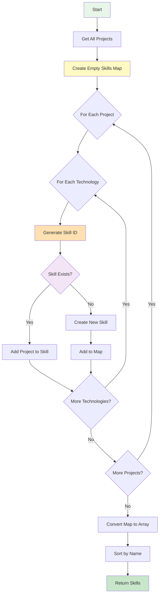

# Data Fetching Functions API

**Navigation**: [Documentation Home](../README.md) > [Content Management](./README.md) > Data Fetching

---

## Table of Contents

- [Introduction](#introduction)
- [Project Functions](#project-functions)
- [Achievement Functions](#achievement-functions)
- [Skill Functions](#skill-functions)
- [Function Implementation Details](#function-implementation-details)
- [Error Handling](#error-handling)
- [Performance Considerations](#performance-considerations)
- [Caching Strategy](#caching-strategy)
- [Usage in Components](#usage-in-components)
- [Usage in Pages](#usage-in-pages)
- [Advanced Patterns](#advanced-patterns)
- [See Also](#see-also)
- [Next Steps](#next-steps)

---

## Introduction

Data fetching functions provide a clean API for accessing content from JSON files. These functions handle file reading, parsing, validation, and sorting, returning type-safe objects ready for use in components and pages.

### Core Principles

1. **Async/Await**: All functions are async for consistency
2. **Type Safety**: Return typed objects, not `any`
3. **Error Handling**: Graceful fallbacks for invalid data
4. **Sorting**: Consistent, predictable ordering
5. **Simplicity**: Easy to use, hard to misuse

### Available Functions

```typescript
// Projects (lib/projects.ts)
getProjects(): Promise<Project[]>
getFeaturedProjects(): Promise<Project[]>
getProjectBySlug(slug: string): Promise<Project | null>

// Achievements (lib/achievements.ts)
getAchievements(): Promise<Achievement[]>

// Skills (lib/skills.ts)
getSkills(): Promise<Skill[]>
generateSkillId(skillName: string): string
```

---

## Project Functions

### `getProjects()`

Reads all project JSON files and returns sorted array.

#### Signature

```typescript
async function getProjects(): Promise<Project[]>;
```

#### Returns

`Promise<Project[]>` - Array of all projects, sorted by:

1. Projects with `order` field (ascending)
2. Projects without `order` field (alphabetical by title)

#### Usage

```typescript
import { getProjects } from "@/lib/projects";

// In Server Component
export default async function ProjectsPage() {
  const projects = await getProjects();

  return (
    <div>
      <h1>All Projects ({projects.length})</h1>
      {projects.map(project => (
        <ProjectCard key={project.slug} project={project} />
      ))}
    </div>
  );
}

// In Route Handler
import { NextResponse } from "next/server";
import { getProjects } from "@/lib/projects";

export async function GET() {
  const projects = await getProjects();
  return NextResponse.json(projects);
}
```

#### Sorting Behavior

```typescript
// Example projects:
const projects = [
  { slug: "z-project", title: "Z Project", order: 1 }, // Position 1
  { slug: "a-project", title: "A Project", order: 2 }, // Position 2
  { slug: "m-project", title: "M Project", order: 10 }, // Position 3
  { slug: "b-project", title: "B Project" }, // Position 4 (alphabetical)
  { slug: "c-project", title: "C Project" }, // Position 5 (alphabetical)
  { slug: "d-project", title: "D Project" }, // Position 6 (alphabetical)
];
```

#### Error Handling

```typescript
// Invalid JSON file - skipped with console error
// File: content/projects/broken.json
{
  "title": "Test",
  "invalid": json
}
// Console: Error parsing JSON for project broken

// Invalid structure - skipped with console error
// File: content/projects/array.json
[
  {"title": "Test"}
]
// Console: Invalid JSON structure for project array
```

---

### `getFeaturedProjects()`

Returns only featured projects (order 1-6) for homepage.

#### Signature

```typescript
async function getFeaturedProjects(): Promise<Project[]>;
```

#### Returns

`Promise<Project[]>` - Array of featured projects (order 1-6), sorted by order.

#### Usage

```typescript
import { getFeaturedProjects } from "@/lib/projects";

// In Home Page
export default async function HomePage() {
  const featured = await getFeaturedProjects();

  return (
    <section>
      <h2>Featured Projects</h2>
      <div className="grid grid-cols-3 gap-4">
        {featured.map(project => (
          <FeaturedProjectCard key={project.slug} project={project} />
        ))}
      </div>
    </section>
  );
}
```

#### Implementation Logic

```typescript
export async function getFeaturedProjects(): Promise<Project[]> {
  const projects = await getProjects();
  return projects.filter((project) => {
    // Include projects with order 1-6
    return project.order !== undefined && project.order >= 1 && project.order <= 6;
  });
}
```

#### Examples

```typescript
// Projects
const allProjects = [
  { slug: "p1", title: "P1", order: 1 }, // ✅ Featured
  { slug: "p2", title: "P2", order: 2 }, // ✅ Featured
  { slug: "p3", title: "P3", order: 6 }, // ✅ Featured
  { slug: "p4", title: "P4", order: 7 }, // ❌ Not featured (order > 6)
  { slug: "p5", title: "P5" }, // ❌ Not featured (no order)
];

const featured = await getFeaturedProjects();
// Result: [p1, p2, p3]
```

---

### `getProjectBySlug()`

Retrieves a single project by its slug.

#### Signature

```typescript
async function getProjectBySlug(slug: string): Promise<Project | null>;
```

#### Parameters

- `slug` (string): The project slug (filename without .json)

#### Returns

- `Promise<Project | null>` - The project if found, `null` otherwise

#### Usage

```typescript
import { getProjectBySlug } from "@/lib/projects";
import { notFound } from "next/navigation";

// In Dynamic Route: app/projects/[slug]/page.tsx
export default async function ProjectPage({
  params
}: {
  params: { slug: string }
}) {
  const project = await getProjectBySlug(params.slug);

  if (!project) {
    notFound();  // Shows 404 page
  }

  return (
    <div>
      <h1>{project.title}</h1>
      <p>{project.description}</p>
      {/* ... */}
    </div>
  );
}

// Generate static params for all projects
export async function generateStaticParams() {
  const projects = await getProjects();
  return projects.map((project) => ({
    slug: project.slug,
  }));
}
```

#### Null Handling

```typescript
// ✅ Good - check for null
const project = await getProjectBySlug("unknown-project");
if (project === null) {
  console.log("Project not found");
} else {
  console.log(project.title);
}

// ✅ Good - use optional chaining
const title = (await getProjectBySlug("unknown"))?.title ?? "Unknown";

// ❌ Bad - no null check (runtime error)
const project = await getProjectBySlug("unknown-project");
console.log(project.title); // Error: Cannot read property 'title' of null
```

---

## Achievement Functions

### `getAchievements()`

Reads all achievement JSON files and returns sorted array.

#### Signature

```typescript
async function getAchievements(): Promise<Achievement[]>;
```

#### Returns

`Promise<Achievement[]>` - Array of all achievements, sorted by:

1. Achievements with `order` field (ascending)
2. Achievements without `order` field (by date, newest first)

#### Usage

```typescript
import { getAchievements } from "@/lib/achievements";

// In Server Component
export default async function HomePage() {
  const achievements = await getAchievements();

  // Get first 3 for homepage
  const topAchievements = achievements.slice(0, 3);

  return (
    <section>
      <h2>Recent Achievements</h2>
      {topAchievements.map(achievement => (
        <AchievementCard key={achievement.slug} achievement={achievement} />
      ))}
    </section>
  );
}

// Filter by type
export default async function CertificationsPage() {
  const achievements = await getAchievements();
  const certifications = achievements.filter(a => a.type === "certification");

  return (
    <div>
      <h1>Certifications</h1>
      {certifications.map(cert => (
        <CertificationCard key={cert.slug} certification={cert} />
      ))}
    </div>
  );
}
```

#### Sorting Behavior

```typescript
// Example achievements:
const achievements = [
  { slug: "a1", title: "A1", order: 1, date: "2020" }, // Position 1 (order)
  { slug: "a2", title: "A2", order: 2, date: "2020" }, // Position 2 (order)
  { slug: "a3", title: "A3", date: "2024-06" }, // Position 3 (newest date)
  { slug: "a4", title: "A4", date: "2023-12" }, // Position 4
  { slug: "a5", title: "A5", date: "2023-01" }, // Position 5
  { slug: "a6", title: "A6", date: "2022" }, // Position 6 (oldest date)
];
```

#### Filtering by Type

```typescript
import { getAchievements, Achievement } from "@/lib/achievements";

async function getCertifications(): Promise<Achievement[]> {
  const all = await getAchievements();
  return all.filter((a) => a.type === "certification");
}

async function getAwards(): Promise<Achievement[]> {
  const all = await getAchievements();
  return all.filter((a) => a.type === "award");
}

async function getGeneralAchievements(): Promise<Achievement[]> {
  const all = await getAchievements();
  return all.filter((a) => a.type === "achievement");
}
```

---

## Skill Functions

### `getSkills()`

Generates skills from all project technologies.

#### Signature

```typescript
async function getSkills(): Promise<Skill[]>;
```

#### Returns

`Promise<Skill[]>` - Array of skills with associated projects, sorted alphabetically by name.

#### Usage

```typescript
import { getSkills } from "@/lib/skills";

// In Skills Page
export default async function SkillsPage() {
  const skills = await getSkills();

  return (
    <div>
      <h1>Skills ({skills.length})</h1>
      {skills.map(skill => (
        <div key={skill.id}>
          <h2>{skill.name}</h2>
          <p>{skill.projects.length} projects</p>
          <ul>
            {skill.projects.map(project => (
              <li key={project.slug}>{project.title}</li>
            ))}
          </ul>
        </div>
      ))}
    </div>
  );
}

// Get skill by ID
const skills = await getSkills();
const reactSkill = skills.find(s => s.id === "react");

// Get most used skills
const topSkills = skills
  .sort((a, b) => b.projects.length - a.projects.length)
  .slice(0, 10);
```

#### Generation Algorithm



#### Example Generation

```typescript
// Input Projects
const projects = [
  {
    slug: "project-a",
    title: "Project A",
    technologies: ["React", "TypeScript", "Docker"],
  },
  {
    slug: "project-b",
    title: "Project B",
    technologies: ["React", "Next.js", "PostgreSQL"],
  },
  {
    slug: "project-c",
    title: "Project C",
    technologies: ["Python", "FastAPI", "Docker"],
  },
];

// Generated Skills
const skills = [
  {
    id: "docker",
    name: "Docker",
    projects: [
      /* Project A, Project C */
    ], // 2 projects
  },
  {
    id: "fastapi",
    name: "FastAPI",
    projects: [
      /* Project C */
    ], // 1 project
  },
  {
    id: "nextjs",
    name: "Next.js",
    projects: [
      /* Project B */
    ], // 1 project
  },
  {
    id: "postgresql",
    name: "PostgreSQL",
    projects: [
      /* Project B */
    ], // 1 project
  },
  {
    id: "python",
    name: "Python",
    projects: [
      /* Project C */
    ], // 1 project
  },
  {
    id: "react",
    name: "React",
    projects: [
      /* Project A, Project B */
    ], // 2 projects
  },
  {
    id: "typescript",
    name: "TypeScript",
    projects: [
      /* Project A */
    ], // 1 project
  },
];
// Sorted alphabetically by name
```

---

### `generateSkillId()`

Converts skill name to URL-safe ID.

#### Signature

```typescript
function generateSkillId(skillName: string): string;
```

#### Parameters

- `skillName` (string): Original skill name (e.g., "React", "Next.js")

#### Returns

`string` - URL-safe skill ID (e.g., "react", "nextjs")

#### Usage

```typescript
import { generateSkillId } from "@/lib/skills";

// Basic usage
const id = generateSkillId("React");
console.log(id); // "react"

// Complex names
generateSkillId("Next.js"); // "nextjs"
generateSkillId("Tailwind CSS"); // "tailwind-css"
generateSkillId("ASP.NET Core"); // "aspnet-core"
generateSkillId("Node.js (Express)"); // "nodejs-express"
generateSkillId("C++"); // "c"
generateSkillId("PostgreSQL"); // "postgresql"

// Use in URLs
const skillId = generateSkillId(skillName);
const url = `/skills/${skillId}`;
```

#### Transformation Rules

```typescript
// Step-by-step transformation
const input = "Next.js (Framework)";

// 1. Lowercase
("next.js (framework)");

// 2. Remove special characters (except spaces and hyphens)
("nextjs framework");

// 3. Replace spaces with hyphens
("nextjs-framework");

// 4. Replace multiple hyphens with single hyphen
("nextjs-framework");

// 5. Remove leading/trailing hyphens
("nextjs-framework"); // Final result
```

---

## Function Implementation Details

### File Reading Pattern

```typescript
import fs from "fs";
import path from "path";

// 1. Define directory path
const projectsDirectory = path.join(process.cwd(), "content/projects");

// 2. Read all filenames
const fileNames = fs.readdirSync(projectsDirectory);

// 3. Filter .json files
const jsonFiles = fileNames.filter((fileName) => fileName.endsWith(".json"));

// 4. Read and parse each file
const projects = jsonFiles.map((fileName) => {
  const slug = fileName.replace(/\.json$/, "");
  const filePath = path.join(projectsDirectory, fileName);
  const fileContent = fs.readFileSync(filePath, "utf8");
  const projectData = JSON.parse(fileContent);

  return {
    slug,
    ...projectData,
  };
});
```

### Error Handling Pattern

```typescript
// Safe JSON parsing with error handling
let projectData: unknown;
try {
  projectData = JSON.parse(fileContent);
} catch (error) {
  console.error(`Error parsing JSON for project ${slug}`, { error, fileName });
  return null; // Skip invalid files
}

// Validate data structure
if (typeof projectData !== "object" || projectData === null || Array.isArray(projectData)) {
  console.error(`Invalid JSON structure for project ${slug}`, { projectData });
  return null; // Skip invalid structure
}

// Filter out null values
const projects = allData.filter((project): project is Project => project !== null);
```

### Sorting Implementation

```typescript
// Projects sorting
projects.sort((a, b) => {
  // If both have order, sort by order
  if (a.order !== undefined && b.order !== undefined) {
    return a.order - b.order;
  }

  // If only one has order, it comes first
  if (a.order !== undefined && b.order === undefined) return -1;
  if (a.order === undefined && b.order !== undefined) return 1;

  // If neither has order, sort alphabetically
  return a.title.localeCompare(b.title);
});

// Achievements sorting
achievements.sort((a, b) => {
  // If both have order, sort by order
  if (a.order !== undefined && b.order !== undefined) {
    return a.order - b.order;
  }

  // If only one has order, it comes first
  if (a.order !== undefined && b.order === undefined) return -1;
  if (a.order === undefined && b.order !== undefined) return 1;

  // If neither has order, sort by date (newest first)
  const dateA = new Date(a.date).getTime();
  const dateB = new Date(b.date).getTime();
  return dateB - dateA;
});

// Skills sorting
skills.sort((a, b) => a.name.localeCompare(b.name));
```

---

## Error Handling

### Graceful Degradation

```typescript
// Missing directory
export async function getAchievements(): Promise<Achievement[]> {
  // Check if directory exists
  if (!fs.existsSync(achievementsDirectory)) {
    return []; // Return empty array instead of throwing
  }
  // ... rest of function
}

// Invalid JSON
try {
  projectData = JSON.parse(fileContent);
} catch (error) {
  console.error(`Error parsing JSON for project ${slug}`, { error });
  return null; // Skip this file, continue with others
}

// Invalid structure
if (typeof projectData !== "object" || projectData === null) {
  console.error(`Invalid JSON structure for project ${slug}`);
  return null; // Skip this file
}
```

### Error Logging

```typescript
// Console errors for debugging
console.error(`Error parsing JSON for project ${slug}`, {
  error,
  fileName,
  filePath,
});

// In production, these should be logged to monitoring service
// Example with error tracking:
if (process.env.NODE_ENV === "production") {
  errorTracker.captureException(error, {
    context: {
      slug,
      fileName,
      operation: "parse-project-json",
    },
  });
}
```

---

## Performance Considerations

### Build-Time vs Runtime

```typescript
// ✅ At build time (Static Generation)
// Files read once, cached in static pages
export async function generateStaticParams() {
  const projects = await getProjects();  // Read files once
  return projects.map(p => ({ slug: p.slug }));
}

// ✅ At build time (Server Components)
export default async function ProjectsPage() {
  const projects = await getProjects();  // Read files once per build
  return <div>{/* ... */}</div>;
}

// ⚠️ At runtime (Route Handlers)
export async function GET() {
  const projects = await getProjects();  // Read files on every request
  return Response.json(projects);
}
// Consider caching for API routes
```

### Caching Recommendations

```typescript
// For API routes, implement caching
import { unstable_cache } from "next/cache";

const getCachedProjects = unstable_cache(async () => await getProjects(), ["projects"], {
  revalidate: 3600, // Cache for 1 hour
  tags: ["projects"],
});

export async function GET() {
  const projects = await getCachedProjects();
  return Response.json(projects);
}
```

---

## Caching Strategy

### Next.js Automatic Caching

```typescript
// Server Components are cached automatically
export default async function ProjectsPage() {
  // This data is cached during build
  const projects = await getProjects();
  return <div>{/* ... */}</div>;
}

// Force dynamic rendering
export const dynamic = "force-dynamic";

export default async function ProjectsPage() {
  // This will fetch on every request
  const projects = await getProjects();
  return <div>{/* ... */}</div>;
}
```

### Manual Cache Invalidation

```typescript
import { revalidatePath, revalidateTag } from "next/cache";

// After updating content
export async function POST(request: Request) {
  // ... update content ...

  // Revalidate specific path
  revalidatePath("/projects");
  revalidatePath("/skills");

  // Or revalidate by tag
  revalidateTag("projects");

  return Response.json({ success: true });
}
```

---

## Usage in Components

### Server Components

```typescript
import { getProjects } from "@/lib/projects";

// ✅ Async Server Component
export default async function ProjectsList() {
  const projects = await getProjects();

  return (
    <div>
      {projects.map(project => (
        <div key={project.slug}>
          <h2>{project.title}</h2>
          <p>{project.shortDescription}</p>
        </div>
      ))}
    </div>
  );
}
```

### Client Components

```typescript
// ❌ Cannot use data fetching functions directly
"use client";

import { getProjects } from "@/lib/projects";  // Error!

export default function ProjectsList() {
  const projects = await getProjects();  // Error! Can't use await in client component
  // ...
}

// ✅ Pass data from Server Component
"use client";

import { Project } from "@/lib/projects";

interface Props {
  projects: Project[];
}

export default function ProjectsList({ projects }: Props) {
  return (
    <div>
      {projects.map(project => (
        <div key={project.slug}>{project.title}</div>
      ))}
    </div>
  );
}

// ✅ Or fetch in parent Server Component
import { getProjects } from "@/lib/projects";
import ProjectsList from "@/components/projects-list";

export default async function ProjectsPage() {
  const projects = await getProjects();
  return <ProjectsList projects={projects} />;
}
```

---

## Usage in Pages

### Static Pages

```typescript
// app/projects/page.tsx
import { getProjects } from "@/lib/projects";

export default async function ProjectsPage() {
  const projects = await getProjects();

  return (
    <main>
      <h1>Projects</h1>
      <div className="grid">
        {projects.map(project => (
          <ProjectCard key={project.slug} project={project} />
        ))}
      </div>
    </main>
  );
}
```

### Dynamic Pages

```typescript
// app/projects/[slug]/page.tsx
import { getProjects, getProjectBySlug } from "@/lib/projects";
import { notFound } from "next/navigation";

interface Props {
  params: { slug: string };
}

// Generate static paths
export async function generateStaticParams() {
  const projects = await getProjects();
  return projects.map(project => ({
    slug: project.slug,
  }));
}

// Page component
export default async function ProjectPage({ params }: Props) {
  const project = await getProjectBySlug(params.slug);

  if (!project) {
    notFound();
  }

  return (
    <article>
      <h1>{project.title}</h1>
      <p>{project.description}</p>
      {/* ... */}
    </article>
  );
}

// Generate metadata
export async function generateMetadata({ params }: Props) {
  const project = await getProjectBySlug(params.slug);

  if (!project) {
    return { title: "Project Not Found" };
  }

  return {
    title: project.title,
    description: project.shortDescription,
  };
}
```

---

## Advanced Patterns

### Parallel Data Fetching

```typescript
// Fetch multiple data sources in parallel
export default async function HomePage() {
  // ✅ Fetch in parallel
  const [projects, achievements, skills] = await Promise.all([
    getFeaturedProjects(),
    getAchievements(),
    getSkills(),
  ]);

  return (
    <main>
      <FeaturedProjects projects={projects} />
      <RecentAchievements achievements={achievements.slice(0, 3)} />
      <TopSkills skills={skills.slice(0, 10)} />
    </main>
  );
}
```

### Custom Filtering

```typescript
import { getProjects, Project } from "@/lib/projects";

// Filter projects by technology
export async function getProjectsByTechnology(tech: string): Promise<Project[]> {
  const projects = await getProjects();
  return projects.filter((p) => p.technologies.includes(tech));
}

// Get projects with demos
export async function getProjectsWithDemos(): Promise<Project[]> {
  const projects = await getProjects();
  return projects.filter((p) => p.demoUrl !== undefined);
}

// Get projects by year (from order as proxy)
export async function getRecentProjects(count: number): Promise<Project[]> {
  const projects = await getProjects();
  return projects.slice(0, count);
}
```

### Related Projects

```typescript
import { getProjects, Project } from "@/lib/projects";

export async function getRelatedProjects(project: Project, limit: number = 3): Promise<Project[]> {
  const allProjects = await getProjects();

  // Find projects with shared technologies
  const related = allProjects
    .filter((p) => p.slug !== project.slug) // Exclude current project
    .map((p) => ({
      project: p,
      sharedTech: p.technologies.filter((t) => project.technologies.includes(t)).length,
    }))
    .filter((item) => item.sharedTech > 0) // At least 1 shared tech
    .sort((a, b) => b.sharedTech - a.sharedTech) // Most shared first
    .slice(0, limit)
    .map((item) => item.project);

  return related;
}
```

---

## See Also

- [TypeScript Interfaces](./03-typescript-interfaces.md) - Return types for these functions
- [CMS Overview](./01-cms-overview.md) - System architecture
- [Skills Generation](./05-skills-generation.md) - Detailed skills algorithm
- [Adding Projects](./06-adding-projects.md) - Creating content these functions read

---

## Next Steps

1. **Study the Code**: Read actual implementations in `lib/` directory
2. **Practice Usage**: Use these functions in your components
3. **Explore Patterns**: Try custom filtering and sorting
4. **Build Features**: Create new pages using these APIs
5. **Optimize**: Implement caching for better performance

---

**Last Updated**: February 2026  
**Maintainer**: Development Team  
**Related Files**: `lib/projects.ts`, `lib/achievements.ts`, `lib/skills.ts`
