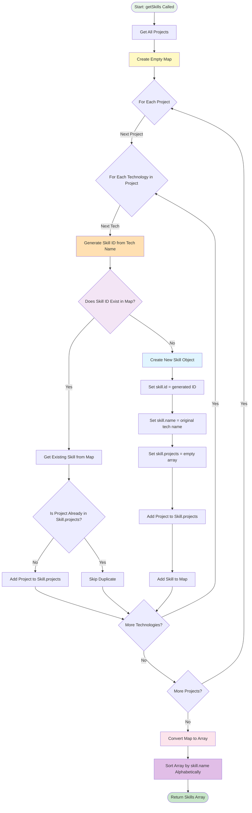

# Skills Generation System

**Navigation**: [Documentation Home](../README.md) > [Content Management](./README.md) > Skills Generation

---

## Table of Contents

- [Introduction](#introduction)
- [How It Works](#how-it-works)
- [Generation Algorithm](#generation-algorithm)
- [Skill ID Generation](#skill-id-generation)
- [Deduplication Strategy](#deduplication-strategy)
- [Project Association](#project-association)
- [Sorting and Ordering](#sorting-and-ordering)
- [Usage Examples](#usage-examples)
- [Best Practices](#best-practices)
- [Common Issues](#common-issues)
- [Advanced Scenarios](#advanced-scenarios)
- [See Also](#see-also)
- [Next Steps](#next-steps)

---

## Introduction

The skills system is **automatically generated** from project technologies. There are no manual skill definitions—skills are dynamically created by analyzing the `technologies` array in every project.

### Key Concepts

1. **Source of Truth**: Project `technologies` arrays
2. **Auto-Generation**: Skills computed at runtime/build time
3. **Deduplication**: Same technology (case-insensitive ID) groups projects
4. **Full References**: Each skill contains complete project objects, not just IDs
5. **Alphabetical Sorting**: Skills sorted by name for consistency

### Benefits

- ✅ **No Duplication**: Single source of truth in projects
- ✅ **Always in Sync**: Skills automatically update when projects change
- ✅ **Zero Maintenance**: No manual skill management required
- ✅ **Type Safe**: Full TypeScript support
- ✅ **Flexible**: Easy to query and filter

---

## How It Works

### High-Level Overview

```mermaid
flowchart LR
    A[Project JSON Files] --> B[technologies Arrays]
    B --> C[Extract All Technologies]
    C --> D[Generate IDs]
    D --> E[Group by ID]
    E --> F[Create Skill Objects]
    F --> G[Associate Projects]
    G --> H[Sort Alphabetically]
    H --> I[Return Skills Array]

    style A fill:#e3f2fd
    style B fill:#e8f5e9
    style C fill:#fff3e0
    style D fill:#f3e5f5
    style E fill:#fce4ec
    style F fill:#e0f2f1
    style G fill:#fff9c4
    style H fill:#e1bee7
    style I fill:#c5e1a5
```



### Example Transformation

**Input**: Project Files

```json
// signapse.json
{
  "technologies": ["AI", "Python", "React Native", "TypeScript"]
}

// pop-a-loon.json
{
  "technologies": ["React", "TypeScript", "MongoDB"]
}

// chitchatz.json
{
  "technologies": ["React", "TypeScript", "WebSocket"]
}
```

**Output**: Generated Skills

```typescript
[
  {
    id: "ai",
    name: "AI",
    projects: [
      /* Signapse */
    ],
  },
  {
    id: "mongodb",
    name: "MongoDB",
    projects: [
      /* Pop-a-loon */
    ],
  },
  {
    id: "python",
    name: "Python",
    projects: [
      /* Signapse */
    ],
  },
  {
    id: "react",
    name: "React",
    projects: [
      /* Pop-a-loon, ChitChatz */
    ],
  },
  {
    id: "react-native",
    name: "React Native",
    projects: [
      /* Signapse */
    ],
  },
  {
    id: "typescript",
    name: "TypeScript",
    projects: [
      /* Signapse, Pop-a-loon, ChitChatz */
    ],
  },
  {
    id: "websocket",
    name: "WebSocket",
    projects: [
      /* ChitChatz */
    ],
  },
];
```

---

## Generation Algorithm

### Complete Flow Diagram



### Code Implementation

```typescript
// lib/skills.ts
import { getProjects, Project } from "@/lib/projects";

export interface Skill {
  id: string;
  name: string;
  projects: Project[];
}

export async function getSkills(): Promise<Skill[]> {
  // Step 1: Get all projects
  const projects = await getProjects();

  // Step 2: Create a map to collect unique skills and their projects
  const skillsMap = new Map<string, Skill>();

  // Step 3: Iterate through each project
  projects.forEach((project) => {
    // Step 4: Iterate through each technology in the project
    project.technologies.forEach((tech) => {
      // Step 5: Generate skill ID
      const skillId = generateSkillId(tech);

      // Step 6: Check if skill already exists
      if (skillsMap.has(skillId)) {
        // Add project to existing skill
        const existingSkill = skillsMap.get(skillId)!;
        if (!existingSkill.projects.includes(project)) {
          existingSkill.projects.push(project);
        }
      } else {
        // Create new skill
        skillsMap.set(skillId, {
          id: skillId,
          name: tech, // Preserve original capitalization
          projects: [project],
        });
      }
    });
  });

  // Step 7: Convert map to array and sort by name
  return Array.from(skillsMap.values()).sort((a, b) => {
    return a.name.localeCompare(b.name);
  });
}
```

### Step-by-Step Example

Let's trace through the algorithm with 2 projects:

**Input**:

```typescript
const projects = [
  {
    slug: "project-a",
    title: "Project A",
    technologies: ["React", "TypeScript"],
  },
  {
    slug: "project-b",
    title: "Project B",
    technologies: ["react", "Node.js"], // Note: lowercase "react"
  },
];
```

**Execution**:

```typescript
// Initial state
skillsMap = new Map()

// Process Project A, Technology "React"
skillId = generateSkillId("React")  // "react"
skillsMap.has("react")              // false
skillsMap.set("react", {
  id: "react",
  name: "React",                    // Preserves original "React"
  projects: [Project A]
})

// Process Project A, Technology "TypeScript"
skillId = generateSkillId("TypeScript")  // "typescript"
skillsMap.has("typescript")              // false
skillsMap.set("typescript", {
  id: "typescript",
  name: "TypeScript",
  projects: [Project A]
})

// Process Project B, Technology "react" (lowercase)
skillId = generateSkillId("react")  // "react" (same ID!)
skillsMap.has("react")              // true (found existing!)
existingSkill = skillsMap.get("react")
// existingSkill.name is still "React" (from first occurrence)
existingSkill.projects.push(Project B)  // Add to existing

// Process Project B, Technology "Node.js"
skillId = generateSkillId("Node.js")  // "nodejs"
skillsMap.has("nodejs")               // false
skillsMap.set("nodejs", {
  id: "nodejs",
  name: "Node.js",
  projects: [Project B]
})

// Convert to array and sort
skills = [
  {
    id: "nodejs",
    name: "Node.js",
    projects: [Project B]
  },
  {
    id: "react",
    name: "React",                  // First occurrence capitalization
    projects: [Project A, Project B]
  },
  {
    id: "typescript",
    name: "TypeScript",
    projects: [Project A]
  }
]
// Sorted alphabetically: "Node.js", "React", "TypeScript"
```

---

## Skill ID Generation

### Algorithm

```typescript
export function generateSkillId(skillName: string): string {
  return skillName
    .toLowerCase() // Convert to lowercase
    .replace(/[^\w\s-]/g, "") // Remove special characters (keep word chars, spaces, hyphens)
    .replace(/\s+/g, "-") // Replace spaces with hyphens
    .replace(/-+/g, "-") // Replace multiple hyphens with single hyphen
    .replace(/^-|-$/g, ""); // Remove leading/trailing hyphens
}
```

### Transformation Examples

| Input               | Step 1: Lowercase   | Step 2: Remove Special | Step 3: Spaces→Hyphens | Step 4: Collapse Hyphens | Step 5: Trim     | **Output**           |
| ------------------- | ------------------- | ---------------------- | ---------------------- | ------------------------ | ---------------- | -------------------- |
| `React`             | `react`             | `react`                | `react`                | `react`                  | `react`          | **`react`**          |
| `Next.js`           | `next.js`           | `nextjs`               | `nextjs`               | `nextjs`                 | `nextjs`         | **`nextjs`**         |
| `Tailwind CSS`      | `tailwind css`      | `tailwind css`         | `tailwind-css`         | `tailwind-css`           | `tailwind-css`   | **`tailwind-css`**   |
| `C++`               | `c++`               | `c`                    | `c`                    | `c`                      | `c`              | **`c`**              |
| `ASP.NET Core`      | `asp.net core`      | `aspnet core`          | `aspnet-core`          | `aspnet-core`            | `aspnet-core`    | **`aspnet-core`**    |
| `Node.js (Express)` | `node.js (express)` | `nodejs express`       | `nodejs-express`       | `nodejs-express`         | `nodejs-express` | **`nodejs-express`** |
| `Vue.js 3.0`        | `vue.js 3.0`        | `vuejs 30`             | `vuejs-30`             | `vuejs-30`               | `vuejs-30`       | **`vuejs-30`**       |
| `  React  `         | `  react  `         | `  react  `            | `--react--`            | `-react-`                | `react`          | **`react`**          |

### Regex Breakdown

```typescript
// Step 2: Remove special characters
.replace(/[^\w\s-]/g, "")

// Breakdown:
// [^\w\s-]  - Match any character that is NOT:
//   \w      - Word character (a-z, A-Z, 0-9, _)
//   \s      - Whitespace
//   -       - Hyphen
// g         - Global flag (replace all occurrences)

// Examples:
"Next.js"        → "Nextjs"     (. removed)
"C++"            → "C"          (++ removed)
"React (v18)"    → "React v18"  (parentheses removed)
```

### Collision Cases

Some technology names generate the same ID:

```typescript
// These all generate id "c"
generateSkillId("C");           // "c"
generateSkillId("C++");         // "c" (++ removed)
generateSkillId("C#");          // "c" (# removed)

// Solution: Use more specific names in technologies array
"technologies": ["C++"]           // Better: Specific
"technologies": ["C-Sharp"]       // Better: Specific
"technologies": ["C Language"]    // Better: Specific

// These generate different IDs
generateSkillId("React");         // "react"
generateSkillId("React Native");  // "react-native" (different!)
```

---

## Deduplication Strategy

### Case-Insensitive Matching

The system uses **ID-based deduplication**, which is case-insensitive:

```typescript
// These are treated as the SAME skill
"React"      → ID: "react"
"react"      → ID: "react"
"REACT"      → ID: "react"
"ReAcT"      → ID: "react"

// They all map to the same skill
{
  id: "react",
  name: "React",  // First occurrence's capitalization preserved
  projects: [/* all projects using any variant */]
}
```

### First Occurrence Wins

The `name` field preserves the capitalization from the **first occurrence**:

```typescript
// Project 1 (processed first)
{
  "technologies": ["react"]  // lowercase
}

// Project 2
{
  "technologies": ["React"]  // proper case
}

// Result
{
  id: "react",
  name: "react",  // ⚠️ Uses first occurrence (lowercase)
  projects: [Project 1, Project 2]
}

// Best Practice: Use consistent capitalization in all projects
// All projects should use:
{
  "technologies": ["React"]  // Consistent!
}
```

### Example: Inconsistent Capitalization

```typescript
// Projects with inconsistent capitalization
const projects = [
  { slug: "p1", technologies: ["TypeScript", "Docker"] },
  { slug: "p2", technologies: ["typescript", "docker"] },
  { slug: "p3", technologies: ["TYPESCRIPT", "DOCKER"] },
];

// Generated skills
const skills = [
  {
    id: "docker",
    name: "Docker", // First occurrence
    projects: [
      /* p1, p2, p3 */
    ],
  },
  {
    id: "typescript",
    name: "TypeScript", // First occurrence
    projects: [
      /* p1, p2, p3 */
    ],
  },
];

// ✅ Correct grouping (all variants included)
// ⚠️ Display name uses first occurrence capitalization
```

---

## Project Association

### Full Project Objects

Skills contain **complete project objects**, not just slugs or IDs:

```typescript
const skill: Skill = {
  id: "react",
  name: "React",
  projects: [
    {
      slug: "project-a",
      title: "Project A",
      shortDescription: "...",
      description: "...",
      technologies: ["React", "TypeScript"],
      images: [...],
      // ... all project fields
    },
    {
      slug: "project-b",
      title: "Project B",
      // ... all project fields
    }
  ]
};

// You can access any project field directly
skill.projects.forEach(project => {
  console.log(project.title);
  console.log(project.technologies);
  console.log(project.images[0].src);
});
```

### Duplicate Prevention

The algorithm prevents the same project from being added twice:

```typescript
if (skillsMap.has(skillId)) {
  const existingSkill = skillsMap.get(skillId)!;

  // Check if project is already in the array
  if (!existingSkill.projects.includes(project)) {
    existingSkill.projects.push(project);
  }
}
```

**Why needed?** Edge cases where same project might be processed multiple times (though unlikely with current implementation).

---

## Sorting and Ordering

### Alphabetical by Name

Skills are always sorted alphabetically by the `name` field (case-insensitive):

```typescript
skills.sort((a, b) => a.name.localeCompare(b.name));
```

### Locale-Aware Sorting

`localeCompare()` provides proper internationalized sorting:

```typescript
// Example
const skills = [{ name: "Ångström" }, { name: "Zebra" }, { name: "Apple" }];

skills.sort((a, b) => a.name.localeCompare(b.name));
// Result: ["Ångström", "Apple", "Zebra"]

// Without localeCompare (incorrect):
skills.sort((a, b) => (a.name < b.name ? -1 : 1));
// Result: ["Apple", "Zebra", "Ångström"]
```

### Custom Sorting

You can re-sort skills for specific use cases:

```typescript
const skills = await getSkills();

// Sort by number of projects (descending)
const byPopularity = [...skills].sort((a, b) => b.projects.length - a.projects.length);

// Sort by most recent project
const byRecency = [...skills].sort((a, b) => {
  const maxOrderA = Math.min(...a.projects.map((p) => p.order ?? Infinity));
  const maxOrderB = Math.min(...b.projects.map((p) => p.order ?? Infinity));
  return maxOrderA - maxOrderB;
});

// Filter and sort
const popularSkills = skills
  .filter((s) => s.projects.length >= 3)
  .sort((a, b) => b.projects.length - a.projects.length);
```

---

## Usage Examples

### Display All Skills

```typescript
import { getSkills } from "@/lib/skills";

export default async function SkillsPage() {
  const skills = await getSkills();

  return (
    <div>
      <h1>Skills ({skills.length})</h1>
      <ul>
        {skills.map(skill => (
          <li key={skill.id}>
            <strong>{skill.name}</strong> - {skill.projects.length} project(s)
          </li>
        ))}
      </ul>
    </div>
  );
}
```

### Skills Table

```typescript
import { getSkills } from "@/lib/skills";

export default async function SkillsTable() {
  const skills = await getSkills();

  return (
    <table>
      <thead>
        <tr>
          <th>Skill</th>
          <th>Projects</th>
          <th>Project Names</th>
        </tr>
      </thead>
      <tbody>
        {skills.map(skill => (
          <tr key={skill.id}>
            <td>{skill.name}</td>
            <td>{skill.projects.length}</td>
            <td>
              {skill.projects.map(p => p.title).join(", ")}
            </td>
          </tr>
        ))}
      </tbody>
    </table>
  );
}
```

### Find Projects by Skill

```typescript
import { getSkills } from "@/lib/skills";

async function findProjectsBySkill(skillName: string) {
  const skills = await getSkills();
  const skill = skills.find((s) => s.name.toLowerCase() === skillName.toLowerCase());
  return skill?.projects ?? [];
}

// Usage
const reactProjects = await findProjectsBySkill("React");
console.log(reactProjects.map((p) => p.title));
```

### Related Projects by Skills

```typescript
import { getSkills, Skill } from "@/lib/skills";
import { Project } from "@/lib/projects";

async function getRelatedProjects(currentProject: Project, limit: number = 3): Promise<Project[]> {
  const skills = await getSkills();

  // Find skills used by current project
  const projectSkills = skills.filter((skill) =>
    skill.projects.some((p) => p.slug === currentProject.slug)
  );

  // Collect all related projects
  const relatedMap = new Map<string, { project: Project; sharedCount: number }>();

  projectSkills.forEach((skill) => {
    skill.projects.forEach((project) => {
      if (project.slug !== currentProject.slug) {
        const existing = relatedMap.get(project.slug);
        if (existing) {
          existing.sharedCount++;
        } else {
          relatedMap.set(project.slug, {
            project,
            sharedCount: 1,
          });
        }
      }
    });
  });

  // Sort by shared skills count and return
  return Array.from(relatedMap.values())
    .sort((a, b) => b.sharedCount - a.sharedCount)
    .slice(0, limit)
    .map((item) => item.project);
}
```

---

## Best Practices

### 1. Consistent Capitalization

Always use the same capitalization across all projects:

```json
// ✅ Good - consistent
// project-a.json
{"technologies": ["React", "TypeScript", "Docker"]}

// project-b.json
{"technologies": ["React", "Node.js", "MongoDB"]}

// ❌ Bad - inconsistent
// project-a.json
{"technologies": ["React", "TypeScript", "Docker"]}

// project-b.json
{"technologies": ["react", "typescript", "docker"]}
// Creates display names with lowercase (if processed first)
```

### 2. Specific Technology Names

Use specific names to avoid ID collisions:

```json
// ✅ Good - specific
{"technologies": ["React Native", "React"]}  // Different IDs: "react-native", "react"

// ✅ Good - specific
{"technologies": ["C++", "C#", "C"]}  // Use "C-Plus-Plus", "C-Sharp", "C"

// ❌ Bad - ambiguous
{"technologies": ["C++", "C"]}  // Both generate "c"
```

### 3. Standard Names

Use widely recognized technology names:

```json
// ✅ Good - standard names
{
  "technologies": [
    "TypeScript", // Not "TS"
    "JavaScript", // Not "JS"
    "React", // Not "React.js"
    "Next.js", // Not "NextJS"
    "Node.js", // Not "NodeJS"
    "PostgreSQL", // Not "Postgres"
    "MongoDB" // Not "Mongo"
  ]
}
```

### 4. Avoid Redundancy

Don't list both framework and underlying language unless both are significant:

```json
// ⚠️ Redundant
{"technologies": ["React", "JavaScript"]}  // React implies JavaScript

// ✅ Better
{"technologies": ["React", "TypeScript"]}  // TypeScript is significant

// ⚠️ Redundant
{"technologies": ["Next.js", "React"]}  // Next.js implies React

// ✅ Better (if both are showcased)
{"technologies": ["Next.js", "React", "TypeScript"]}
```

### 5. Order by Importance

List technologies from most to least important:

```json
{
  "technologies": [
    "React", // Primary framework
    "TypeScript", // Primary language
    "Next.js", // Framework extension
    "Tailwind CSS", // Styling
    "PostgreSQL", // Database
    "Docker" // Deployment
  ]
}
```

---

## Common Issues

### Issue 1: Duplicate Skills with Different Names

**Problem**: Skills appear multiple times with slight variations

**Cause**: Inconsistent capitalization across projects

**Solution**:

```typescript
// Find inconsistencies
const skills = await getSkills();
const names = skills.map((s) => s.name);
const lowercase = names.map((n) => n.toLowerCase());
const duplicates = lowercase.filter((n, i) => lowercase.indexOf(n) !== i);

// Fix by updating all project JSON files to use consistent capitalization
```

### Issue 2: Skill Has Wrong Display Name

**Problem**: Skill displays as "react" instead of "React"

**Cause**: First project processed uses lowercase

**Solution**: Update the first project file (alphabetically by filename) to use proper capitalization

### Issue 3: Too Many Skills

**Problem**: Too many granular skills (e.g., "React", "React Hooks", "React Router")

**Solution**: Use broader terms

```json
// ❌ Too granular
{"technologies": ["React", "React Hooks", "React Router", "React Context"]}

// ✅ Better
{"technologies": ["React"]}

// ✅ Or mention specific advanced features
{"technologies": ["React", "React Router"]}
```

---

## Advanced Scenarios

### Custom Skill Grouping

Create skill categories:

```typescript
const skills = await getSkills();

const categories = {
  frontend: skills.filter((s) => ["React", "Vue.js", "Angular", "Svelte"].includes(s.name)),
  backend: skills.filter((s) => ["Node.js", "Python", "Java", "Go"].includes(s.name)),
  database: skills.filter((s) => ["PostgreSQL", "MongoDB", "MySQL", "Redis"].includes(s.name)),
  devops: skills.filter((s) => ["Docker", "Kubernetes", "CI/CD", "AWS"].includes(s.name)),
};
```

### Skill Statistics

```typescript
const skills = await getSkills();

const stats = {
  total: skills.length,
  mostUsed: skills.reduce((max, s) => (s.projects.length > max.projects.length ? s : max)),
  average: skills.reduce((sum, s) => sum + s.projects.length, 0) / skills.length,
  single: skills.filter((s) => s.projects.length === 1).length,
  multiple: skills.filter((s) => s.projects.length > 1).length,
};
```

---

## See Also

- [Data Fetching API](./04-data-fetching.md) - `getSkills()` function details
- [TypeScript Interfaces](./03-typescript-interfaces.md) - `Skill` interface definition
- [Adding Projects](./06-adding-projects.md) - How to add technologies to projects
- [JSON Schema](./02-json-schema.md) - `technologies` field specification

---

## Next Steps

1. **Review Projects**: Check all project `technologies` arrays for consistency
2. **Test Generation**: Run `getSkills()` and examine output
3. **Build Skills Page**: Create a page displaying all skills
4. **Add Filtering**: Implement skill-based project filtering
5. **Create Categories**: Group skills into meaningful categories

---

**Last Updated**: February 2026  
**Maintainer**: Development Team  
**Related Files**: `lib/skills.ts`, `lib/projects.ts`
