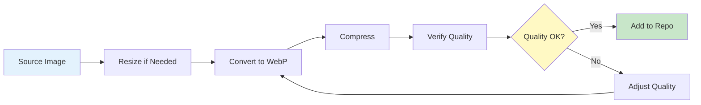

# Image Handling Guide

**Navigation**: [Documentation Home](../README.md) > [Content Management](./README.md) > Image Handling

---

## Table of Contents

- [Introduction](#introduction)
- [Directory Structure](#directory-structure)
- [Image Formats](#image-formats)
- [Image Optimization](#image-optimization)
- [Naming Conventions](#naming-conventions)
- [Path Formats](#path-formats)
- [Alt Text Guidelines](#alt-text-guidelines)
- [Responsive Images](#responsive-images)
- [Image Processing Tools](#image-processing-tools)
- [Best Practices](#best-practices)
- [Common Issues](#common-issues)
- [Performance Optimization](#performance-optimization)
- [See Also](#see-also)
- [Next Steps](#next-steps)

---

## Introduction

Proper image handling is crucial for portfolio performance and user experience. This guide covers organization, optimization, and best practices for all images in the portfolio.

### Image Categories

1. **Project Images**: Screenshots, demos, architecture diagrams
2. **Project Videos**: Demo videos, tutorials
3. **Achievement Logos**: Organization and issuer logos
4. **Other Assets**: Favicons, OG images, profile photos

### Key Principles

1. **Optimize First**: Always optimize before committing
2. **Use WebP**: Preferred format for web images
3. **Descriptive Names**: Use clear, descriptive filenames
4. **Proper Paths**: Use absolute paths starting with `/images/`
5. **Alt Text**: Always provide descriptive alt text

---

## Directory Structure

### Complete Structure

```
public/images/
├── projects/
│   ├── signapse/
│   │   ├── demo.webp
│   │   ├── stack.webp
│   │   ├── tablet-home-1-2527x1422.webp
│   │   └── video-demo.mp4
│   ├── pop-a-loon/
│   │   ├── small.webp
│   │   ├── screenshot-1.webp
│   │   ├── screenshot-2.webp
│   │   └── screenshot-3.webp
│   └── [other-projects]/
│
├── logos/
│   ├── rotary-international.webp
│   ├── cisco.webp
│   ├── aws.webp
│   └── erasmus-plus.webp
│
└── [other-assets]/
    ├── favicon.ico
    ├── og-image.png
    └── profile.webp
```

### Project Images

**Location**: `public/images/projects/{project-slug}/`

Each project has its own directory matching the project slug:

```
public/images/projects/
├── my-project/           ← Directory name matches slug
│   ├── hero.webp
│   ├── screenshot-1.webp
│   ├── screenshot-2.webp
│   └── demo-video.mp4
```

**Rules**:

- Directory name MUST match project slug
- One directory per project
- All project media in same directory

### Achievement Logos

**Location**: `public/images/logos/`

All achievement/organization logos in a single shared directory:

```
public/images/logos/
├── aws.webp
├── cisco.webp
├── rotary-international.webp
└── google-cloud.webp
```

**Rules**:

- Shared directory for all logos
- Use descriptive filenames (organization name)
- kebab-case names preferred

---

## Image Formats

### Supported Formats

| Format   | Use Case                       | Pros                           | Cons                               |
| -------- | ------------------------------ | ------------------------------ | ---------------------------------- |
| **WebP** | General use (recommended)      | Best compression, good quality | Older browser support              |
| **JPEG** | Photos                         | Wide support                   | Lossy compression, no transparency |
| **PNG**  | Screenshots with transparency  | Lossless, transparency         | Larger file size                   |
| **SVG**  | Logos, icons (simple graphics) | Scalable, small                | Not for photos                     |
| **GIF**  | Avoid for new content          | Wide support                   | Poor compression, limited colors   |

### Format Recommendations

**Project Screenshots**:

- Use WebP (best choice)
- Fallback to PNG if transparency needed
- JPEG for photos without transparency

**Achievement Logos**:

- Use WebP (best choice)
- SVG for simple logos
- PNG if transparency required

**Profile/Hero Images**:

- Use WebP
- Provide JPEG fallback for critical images

### WebP Benefits

```
Original PNG: 2.5 MB
Optimized WebP: 450 KB (82% smaller)
Quality: Visually identical
```

**Conversion**:

```bash
# Convert PNG to WebP
cwebp -q 80 input.png -o output.webp

# Batch conversion
for file in *.png; do
  cwebp -q 80 "$file" -o "${file%.png}.webp"
done
```

---

## Image Optimization

### Before Committing

**Always optimize images before committing to repository.**

### Optimization Workflow



### Size Guidelines

**Max Dimensions**:

- Screenshots: 2000px width
- Logos: 400px width
- Hero images: 2400px width
- Thumbnails: 800px width

**File Sizes**:

- Screenshots: Target < 500KB
- Logos: Target < 100KB
- Videos: Target < 50MB

### Optimization Commands

#### Resize Images

```bash
# Using ImageMagick
convert input.png -resize 2000x output.png

# Maintain aspect ratio
convert input.png -resize 2000x -quality 85 output.png

# Batch resize
mogrify -resize 2000x *.png
```

#### Convert to WebP

```bash
# High quality (q=80)
cwebp -q 80 input.png -o output.webp

# Balanced (q=75)
cwebp -q 75 input.png -o output.webp

# Smaller size (q=70)
cwebp -q 70 input.png -o output.webp

# With progress
cwebp -q 80 -progress input.png -o output.webp
```

#### Optimize Existing WebP

```bash
# Re-compress WebP
cwebp -q 75 input.webp -o output.webp
```

#### Optimize PNG

```bash
# Using optipng
optipng -o7 image.png

# Using pngquant (lossy but better compression)
pngquant --quality=70-85 image.png -o output.png
```

#### Optimize JPEG

```bash
# Using ImageMagick
convert input.jpg -quality 85 -sampling-factor 4:2:0 -strip output.jpg

# Using jpegoptim
jpegoptim --size=500k image.jpg
```

---

## Naming Conventions

### Project Images

Use descriptive, kebab-case names:

```bash
# ✅ Good names
hero.webp
dashboard.webp
user-profile.webp
settings-page.webp
mobile-view.webp
architecture-diagram.webp
demo-video.mp4

# ✅ Good with numbers
screenshot-1.webp
screenshot-2.webp
screenshot-3.webp

# ✅ Good with dimensions (optional)
hero-2400x1350.webp
thumbnail-800x600.webp

# ❌ Bad names
IMG_1234.webp
screen shot 1.webp
Untitled.webp
image.webp
pic.webp
```

### Logo Names

Use organization name in kebab-case:

```bash
# ✅ Good names
aws.webp
amazon-web-services.webp
cisco.webp
rotary-international.webp
google-cloud.webp
microsoft.webp

# ❌ Bad names
logo1.webp
org-logo.webp
badge.webp
cert.webp
```

### General Rules

1. **Lowercase**: All lowercase letters
2. **Hyphens**: Use hyphens for spaces
3. **No Spaces**: Never use spaces
4. **Descriptive**: Name describes content
5. **No Special Chars**: Avoid except hyphens and dots
6. **Extension**: Include proper extension

---

## Path Formats

### Absolute Paths

Always use absolute paths starting with `/images/`:

```json
// ✅ Correct - absolute path
{
  "src": "/images/projects/my-project/screenshot.webp"
}

// ❌ Wrong - relative path
{
  "src": "screenshot.webp"
}

// ❌ Wrong - includes 'public'
{
  "src": "/public/images/projects/my-project/screenshot.webp"
}

// ❌ Wrong - relative with ./
{
  "src": "./images/projects/my-project/screenshot.webp"
}
```

### Path Structure

```
/images/{category}/{subcategory}/{filename}

Examples:
/images/projects/signapse/demo.webp
/images/logos/aws.webp
```

### Path Validation

```bash
# Check all project image paths
jq -r '.images[].src' content/projects/*.json | sort -u

# Verify paths start with /images/
jq -r '.images[].src' content/projects/*.json | grep -v '^/images/'
# Should return nothing

# Check for common mistakes
jq -r '.images[].src' content/projects/*.json | grep -E '(public|\.\.|\./)'
# Should return nothing
```

---

## Alt Text Guidelines

### Purpose of Alt Text

Alt text serves multiple purposes:

1. **Accessibility**: Screen readers for visually impaired users
2. **SEO**: Search engines index alt text
3. **Fallback**: Displayed if image fails to load

### Writing Good Alt Text

**Rules**:

1. Be descriptive and specific
2. Describe what's visible and important
3. Include context relevant to the content
4. Keep concise (typically < 125 characters)
5. Don't start with "image of" or "picture of"
6. Don't repeat nearby text

### Examples

#### Project Screenshots

```json
// ✅ Good - specific and descriptive
{
  "alt": "Task Manager dashboard showing active tasks, team members, and progress charts"
}

// ✅ Good - describes key elements
{
  "alt": "User profile page with editable bio, profile picture, and activity history"
}

// ✅ Good - technical diagram
{
  "alt": "System architecture diagram showing React frontend, Node.js backend, and PostgreSQL database"
}

// ❌ Bad - too generic
{
  "alt": "Screenshot"
}

// ❌ Bad - redundant
{
  "alt": "Picture of the Task Manager application"
}

// ❌ Bad - too vague
{
  "alt": "Application interface"
}
```

#### Achievement Logos

```json
// ✅ Good - logo description
{
  "alt": "AWS certification badge - orange smile arrow on dark blue background"
}

// ✅ Good - simple org name
{
  "alt": "Cisco Networking Academy logo"
}

// ✅ Good - descriptive
{
  "alt": "Rotary International logo - gold wheel with 24 cogs"
}

// ❌ Bad - too simple
{
  "alt": "Logo"
}

// ❌ Bad - not descriptive
{
  "alt": "Organization badge"
}
```

### Alt Text Templates

**Screenshots**:

```
"{Page/Feature name} {showing/displaying} {key elements}"

Examples:
"Dashboard showing user analytics and recent activity"
"Settings page displaying notification preferences and account options"
"Mobile app home screen with navigation menu and featured content"
```

**Diagrams**:

```
"{Diagram type} {showing} {components and relationships}"

Examples:
"Architecture diagram showing microservices connected via API gateway"
"Data flow diagram from user input through processing to database storage"
"Network topology showing routers, switches, and end devices"
```

**Logos**:

```
"{Organization name} logo - {visual description}"

Examples:
"Google Cloud logo - multicolored cloud icon"
"AWS logo - orange smile arrow on dark background"
"Microsoft logo - four colored squares"
```

---

## Responsive Images

### Next.js Image Component

The portfolio uses Next.js `<Image>` component which handles:

- Automatic optimization
- Responsive sizes
- Lazy loading
- Format selection (WebP when supported)

**Usage in Components**:

```tsx
import Image from "next/image";

<Image
  src={project.images[0].src}
  alt={project.images[0].alt}
  width={1200}
  height={800}
  sizes="(max-width: 768px) 100vw, (max-width: 1200px) 50vw, 33vw"
  priority={false}
/>;
```

### Sizes Attribute

Define which image sizes to load at different breakpoints:

```tsx
// Full width on mobile, 50% on tablet, 33% on desktop
sizes = "(max-width: 768px) 100vw, (max-width: 1200px) 50vw, 33vw";

// Fixed size
sizes = "800px";

// Common patterns
sizes = "100vw"; // Always full width
sizes = "(max-width: 640px) 100vw, 800px"; // Full width on mobile, fixed on desktop
```

---

## Image Processing Tools

### Command Line Tools

#### cwebp (WebP Conversion)

```bash
# Install (macOS)
brew install webp

# Install (Ubuntu/Debian)
sudo apt install webp

# Basic usage
cwebp -q 80 input.png -o output.webp

# Options
cwebp -q 75 -m 6 -af -progress input.png -o output.webp
# -q: quality (0-100)
# -m: compression method (0-6, 6 is slowest/best)
# -af: auto-adjust filter strength
# -progress: show progress
```

#### ImageMagick

```bash
# Install (macOS)
brew install imagemagick

# Install (Ubuntu/Debian)
sudo apt install imagemagick

# Resize
convert input.png -resize 2000x output.png

# Convert format
convert input.png output.webp

# Compress JPEG
convert input.jpg -quality 85 output.jpg

# Batch process
mogrify -resize 2000x -quality 85 *.png
```

#### optipng (PNG Optimization)

```bash
# Install
brew install optipng  # macOS
sudo apt install optipng  # Ubuntu/Debian

# Optimize
optipng -o7 image.png

# Batch optimize
optipng -o7 *.png
```

### Online Tools

**For Occasional Use**:

- [Squoosh](https://squoosh.app/) - Google's image optimizer
- [TinyPNG](https://tinypng.com/) - PNG and JPEG compression
- [Compressor.io](https://compressor.io/) - Multi-format compression
- [WebP Converter](https://webp-converter.com/) - Format conversion

### Automated Optimization

**Git Pre-Commit Hook** (optional):

```bash
# .husky/pre-commit
#!/bin/sh

# Optimize images before commit
for file in $(git diff --cached --name-only --diff-filter=ACM | grep -E '\.(png|jpg|jpeg)$'); do
  if [ -f "$file" ]; then
    echo "Optimizing $file..."
    cwebp -q 80 "$file" -o "${file%.*}.webp"
    git add "${file%.*}.webp"
  fi
done
```

---

## Best Practices

### 1. Optimize Before Commit

```bash
# Never commit unoptimized images
# Always run optimization first

# Before
ls -lh screenshot.png
# 2.5M screenshot.png

# Optimize
cwebp -q 80 screenshot.png -o screenshot.webp

# After
ls -lh screenshot.webp
# 450K screenshot.webp

# Commit optimized version
git add screenshot.webp
```

### 2. Use Descriptive Names

```bash
# ✅ Good
dashboard-with-analytics.webp
user-profile-mobile-view.webp
architecture-diagram-v2.webp

# ❌ Bad
IMG_1234.webp
untitled.webp
screen1.webp
```

### 3. Consistent Dimensions

Keep similar images at similar dimensions:

```bash
# Project screenshots
screenshot-1.webp  # 2000x1250
screenshot-2.webp  # 2000x1400
screenshot-3.webp  # 2000x1100

# All approximately 2000px wide
```

### 4. Version Control

Don't commit:

- Original unoptimized images
- Multiple versions of same image
- Temporary/test images

```bash
# .gitignore
*.psd          # Photoshop files
*.ai           # Illustrator files
*-original.*   # Original versions
*-temp.*       # Temporary files
```

### 5. Alt Text Standards

Create alt text before adding image:

```json
// Plan alt text while creating image
{
  "src": "/images/projects/my-app/dashboard.webp",
  "alt": "Dashboard displaying real-time metrics, user activity, and system alerts"
}
```

### 6. Check Image Load

Always test images load correctly:

```bash
# Start dev server
npm run dev

# Check browser console for errors
# Check Network tab for 404s
# Verify images display correctly
```

---

## Common Issues

### Issue 1: Image Not Loading

**Symptoms**: Broken image icon

**Causes**:

1. Incorrect path
2. File doesn't exist
3. Wrong directory

**Solutions**:

```bash
# Check file exists
ls -la public/images/projects/my-project/screenshot.webp

# Verify path in JSON
jq '.images[0].src' content/projects/my-project.json

# Check path format
# Should be: /images/projects/my-project/screenshot.webp
```

### Issue 2: Image Too Large

**Symptoms**: Slow page load, large file size

**Causes**:

1. Unoptimized image
2. Too high resolution
3. Wrong format

**Solutions**:

```bash
# Check file size
ls -lh public/images/projects/my-project/screenshot.webp

# If > 1MB, optimize
cwebp -q 70 input.webp -o output.webp

# If > 2000px wide, resize
convert input.webp -resize 2000x output.webp
```

### Issue 3: Poor Image Quality

**Symptoms**: Blurry, pixelated, or artifact-heavy images

**Causes**:

1. Too much compression
2. Quality setting too low
3. Scaled up from small source

**Solutions**:

```bash
# Increase quality setting
cwebp -q 85 input.png -o output.webp  # Higher quality

# Use better source image
# Start with high-resolution original

# Try lossless
cwebp -lossless input.png -o output.webp
```

### Issue 4: Wrong Image Dimensions

**Symptoms**: Image appears stretched or cropped

**Causes**:

1. Aspect ratio mismatch
2. Incorrect width/height props
3. CSS conflicts

**Solutions**:

```bash
# Check image dimensions
identify image.webp
# Output: image.webp WEBP 2000x1250

# Verify aspect ratio matches container
# 2000x1250 = 1.6:1 aspect ratio
```

---

## Performance Optimization

### Image Optimization Checklist

- [ ] Format: Use WebP when possible
- [ ] Size: Under 500KB for screenshots
- [ ] Dimensions: Max 2000px width
- [ ] Compression: Quality 75-85
- [ ] Alt text: Descriptive and concise
- [ ] Path: Absolute path starting with `/images/`
- [ ] Loading: Lazy load non-critical images

### Next.js Optimization

Next.js `<Image>` component provides:

- Automatic format selection
- Responsive image sizes
- Lazy loading
- Blur placeholder
- Priority loading for above-fold images

**Component usage**:

```tsx
<Image
  src="/images/projects/my-app/hero.webp"
  alt="Application hero image"
  width={1200}
  height={800}
  priority={true} // Load immediately (above fold)
  placeholder="blur" // Show blur while loading
/>
```

### Lazy Loading

All images lazy load by default except:

- Images with `priority={true}`
- Images above the fold

```tsx
// Lazy load (default)
<Image src="..." alt="..." width={800} height={600} />

// Priority load (above fold)
<Image src="..." alt="..." width={800} height={600} priority />
```

### Performance Metrics

Target metrics:

- Largest Contentful Paint (LCP): < 2.5s
- Cumulative Layout Shift (CLS): < 0.1
- First Input Delay (FID): < 100ms

Images impact LCP and CLS most significantly.

---

## See Also

- [Adding Projects Guide](./06-adding-projects.md) - How to add project images
- [Adding Achievements Guide](./07-adding-achievements.md) - How to add logos
- [Video Support Guide](./09-video-support.md) - Video handling
- [JSON Schema Reference](./02-json-schema.md) - Image field structure

---

## Next Steps

1. **Install Tools**: Set up cwebp and ImageMagick
2. **Optimize Existing**: Review and optimize current images
3. **Create Guidelines**: Document project-specific image standards
4. **Automate**: Set up pre-commit hooks for automatic optimization
5. **Monitor**: Check performance metrics regularly

---

**Last Updated**: February 2026  
**Maintainer**: Development Team  
**Related Tools**: cwebp, ImageMagick, Next.js Image component
