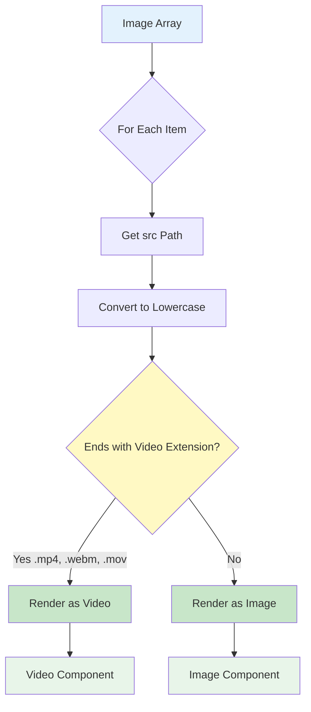

# Video Support Guide

**Navigation**: [Documentation Home](../README.md) > [Content Management](./README.md) > Video Support

---

## Table of Contents

- [Introduction](#introduction)
- [Video Detection](#video-detection)
- [Adding Videos](#adding-videos)
- [Video Formats](#video-formats)
- [Video Optimization](#video-optimization)
- [Rendering Videos](#rendering-videos)
- [Mixing Images and Videos](#mixing-images-and-videos)
- [Video Best Practices](#video-best-practices)
- [Common Issues](#common-issues)
- [Performance Considerations](#performance-considerations)
- [Advanced Techniques](#advanced-techniques)
- [See Also](#see-also)
- [Next Steps](#next-steps)

---

## Introduction

Videos can be added to projects alongside images for demonstrations, tutorials, and showcases. The system automatically detects video files by extension and renders them appropriately.

### Key Features

1. **Automatic Detection**: Videos detected by file extension
2. **Mixed Media**: Videos and images in same gallery
3. **Multiple Formats**: Support for MP4, WebM, MOV
4. **Responsive**: Videos adapt to container size
5. **Accessible**: Alt text for video descriptions

### Supported Video Extensions

- `.mp4` (recommended)
- `.webm`
- `.mov`

---

## Video Detection

### Detection Function

Videos are detected using the `isVideoFile()` utility function:

**Location**: `lib/utils.ts`

```typescript
export function isVideoFile(src: string): boolean {
  return (
    src.toLowerCase().endsWith(".mp4") ||
    src.toLowerCase().endsWith(".webm") ||
    src.toLowerCase().endsWith(".mov")
  );
}
```

### How It Works



### Detection Examples

```typescript
import { isVideoFile } from "@/lib/utils";

// ✅ Detected as video
isVideoFile("/images/projects/demo/video.mp4"); // true
isVideoFile("/images/projects/demo/video.MP4"); // true (case-insensitive)
isVideoFile("/images/projects/demo/video.webm"); // true
isVideoFile("/images/projects/demo/video.mov"); // true

// ❌ Detected as image
isVideoFile("/images/projects/demo/image.webp"); // false
isVideoFile("/images/projects/demo/image.png"); // false
isVideoFile("/images/projects/demo/image.jpg"); // false
```

### Usage in Components

```tsx
import { isVideoFile } from "@/lib/utils";
import { Project } from "@/lib/projects";

function ProjectGallery({ project }: { project: Project }) {
  return (
    <div>
      {project.images.map((media, index) => (
        <div key={index}>
          {isVideoFile(media.src) ? (
            <video src={media.src} controls>
              <p>{media.alt}</p>
            </video>
          ) : (
            
          )}
        </div>
      ))}
    </div>
  );
}
```

---

## Adding Videos

### Step 1: Prepare Your Video

```bash
# Example: Convert and optimize video
ffmpeg -i source.mov \
  -vcodec h264 \
  -acodec aac \
  -crf 23 \
  -preset slow \
  output.mp4
```

### Step 2: Add to Project Directory

Place video in project's image directory:

```bash
# Copy video to project directory
cp ~/demo-video.mp4 public/images/projects/my-project/demo.mp4

# Verify
ls -lh public/images/projects/my-project/demo.mp4
```

### Step 3: Add to JSON

Add video to `images` array (same as images):

```json
{
  "images": [
    {
      "src": "/images/projects/my-project/demo.mp4",
      "alt": "Video demonstration of key features and user workflow"
    }
  ]
}
```

### Complete Example

**File**: `content/projects/task-manager.json`

```json
{
  "title": "Task Manager Pro",
  "shortDescription": "Collaborative task management with real-time updates.",
  "description": "...",
  "technologies": ["React", "TypeScript"],
  "images": [
    {
      "src": "/images/projects/task-manager/screenshot-1.webp",
      "alt": "Dashboard showing active tasks and progress"
    },
    {
      "src": "/images/projects/task-manager/demo-video.mp4",
      "alt": "Video walkthrough of task creation and assignment workflow"
    },
    {
      "src": "/images/projects/task-manager/screenshot-2.webp",
      "alt": "Team collaboration view with real-time updates"
    }
  ]
}
```

**Directory Structure**:

```
public/images/projects/task-manager/
├── screenshot-1.webp
├── demo-video.mp4
└── screenshot-2.webp
```

---

## Video Formats

### MP4 (Recommended)

**Best choice for compatibility and size.**

**Specs**:

- Container: MP4
- Video codec: H.264 (AVC)
- Audio codec: AAC
- Recommended bitrate: 2-5 Mbps
- Max file size: 50 MB

**Conversion**:

```bash
# Convert to MP4 with H.264
ffmpeg -i input.mov \
  -vcodec h264 \
  -acodec aac \
  -b:v 3M \
  output.mp4
```

**Pros**:

- ✅ Universal browser support
- ✅ Good compression
- ✅ Hardware acceleration
- ✅ Streaming support

**Cons**:

- ⚠️ Larger than WebM at same quality
- ⚠️ Requires H.264 codec

### WebM

**Modern format with excellent compression.**

**Specs**:

- Container: WebM
- Video codec: VP8 or VP9
- Audio codec: Vorbis or Opus
- Smaller files than MP4

**Conversion**:

```bash
# Convert to WebM with VP9
ffmpeg -i input.mov \
  -c:v libvpx-vp9 \
  -b:v 2M \
  -c:a libopus \
  output.webm
```

**Pros**:

- ✅ Excellent compression
- ✅ Smaller file sizes
- ✅ Open source
- ✅ Modern browser support

**Cons**:

- ⚠️ No Safari support (older versions)
- ⚠️ Slower encoding

### MOV (Not Recommended)

**Apple's format, works but use MP4 instead.**

**Use Cases**:

- Source format only
- Convert to MP4 for web

**Conversion**:

```bash
# Convert MOV to MP4
ffmpeg -i input.mov \
  -vcodec h264 \
  -acodec aac \
  output.mp4
```

**Pros**:

- ✅ High quality
- ✅ Common source format

**Cons**:

- ❌ Large file sizes
- ❌ Limited browser support
- ❌ Not optimized for web

### Format Comparison

| Format      | Size   | Quality   | Compatibility   | Recommendation      |
| ----------- | ------ | --------- | --------------- | ------------------- |
| MP4 (H.264) | Medium | Excellent | Universal       | ✅ **Best choice**  |
| WebM (VP9)  | Small  | Excellent | Modern browsers | ✅ Good alternative |
| MOV         | Large  | Excellent | Limited         | ❌ Convert to MP4   |

---

## Video Optimization

### Size Optimization

**Target**: < 50 MB for web videos

```bash
# Check current size
ls -lh video.mp4

# Reduce file size
ffmpeg -i input.mp4 -crf 28 output.mp4
# CRF: 18 (high quality) to 28 (smaller file)
```

### Resolution Optimization

**Target**: 1080p (1920x1080) or 720p (1280x720)

```bash
# Scale to 1080p
ffmpeg -i input.mp4 -vf scale=1920:1080 output.mp4

# Scale to 720p
ffmpeg -i input.mp4 -vf scale=1280:720 output.mp4

# Scale with aspect ratio preservation
ffmpeg -i input.mp4 -vf scale=1280:-1 output.mp4
```

### Duration Optimization

**Recommendation**: 30-60 seconds for demos

```bash
# Trim to first 60 seconds
ffmpeg -i input.mp4 -t 60 -c copy output.mp4

# Extract specific segment (10s to 70s)
ffmpeg -i input.mp4 -ss 10 -t 60 -c copy output.mp4
```

### Bitrate Optimization

**Target**: 2-5 Mbps for 1080p, 1-3 Mbps for 720p

```bash
# Set specific bitrate (3 Mbps)
ffmpeg -i input.mp4 -b:v 3M output.mp4

# Two-pass encoding (better quality)
ffmpeg -i input.mp4 -b:v 3M -pass 1 -f mp4 /dev/null && \
ffmpeg -i input.mp4 -b:v 3M -pass 2 output.mp4
```

### Complete Optimization

```bash
# Comprehensive optimization
ffmpeg -i input.mp4 \
  -vcodec h264 \
  -acodec aac \
  -vf scale=1280:-1 \
  -crf 23 \
  -preset slow \
  -movflags +faststart \
  -t 60 \
  output.mp4

# Parameters explained:
# -vcodec h264: H.264 video codec
# -acodec aac: AAC audio codec
# -vf scale=1280:-1: Scale to 720p, preserve aspect ratio
# -crf 23: Constant Rate Factor (lower = better quality)
# -preset slow: Slower encoding, better compression
# -movflags +faststart: Enable streaming
# -t 60: Limit to 60 seconds
```

---

## Rendering Videos

### HTML Video Element

Videos render as standard HTML `<video>` elements:

```html
<video src="/images/projects/my-project/demo.mp4" controls preload="metadata" width="100%">
  Your browser does not support the video tag.
  <p>Video demonstration of key features</p>
</video>
```

### Video Attributes

**Standard Attributes**:

- `controls`: Show play/pause, volume, etc.
- `autoplay`: Start playing automatically (use sparingly)
- `loop`: Replay video when finished
- `muted`: Start muted (required for autoplay)
- `preload`: How much to load (`metadata`, `auto`, `none`)
- `poster`: Thumbnail image before play

**Example with Multiple Attributes**:

```html
<video src="/path/to/video.mp4" controls loop muted preload="metadata" poster="/path/to/poster.jpg">
  Fallback text
</video>
```

### Component Implementation

**Example**: Video gallery component

```tsx
import { Project } from "@/lib/projects";
import { isVideoFile } from "@/lib/utils";

interface Props {
  project: Project;
}

export function ProjectMedia({ project }: Props) {
  return (
    <div className="grid gap-4">
      {project.images.map((media, index) => (
        <div key={index} className="media-item">
          {isVideoFile(media.src) ? (
            <video
              src={media.src}
              controls
              preload="metadata"
              className="w-full rounded-lg"
              aria-label={media.alt}
            >
              <p>{media.alt}</p>
            </video>
          ) : (
            
          )}
          <p className="mt-2 text-sm text-gray-600">{media.alt}</p>
        </div>
      ))}
    </div>
  );
}
```

---

## Mixing Images and Videos

### Order in Array

Videos and images can be mixed freely:

```json
{
  "images": [
    {
      "src": "/images/projects/app/hero.webp",
      "alt": "Application home screen"
    },
    {
      "src": "/images/projects/app/demo.mp4",
      "alt": "Video walkthrough of main features"
    },
    {
      "src": "/images/projects/app/dashboard.webp",
      "alt": "Analytics dashboard"
    },
    {
      "src": "/images/projects/app/tutorial.mp4",
      "alt": "Tutorial: How to create a new project"
    },
    {
      "src": "/images/projects/app/mobile.webp",
      "alt": "Mobile responsive design"
    }
  ]
}
```

### Strategic Placement

**Best Practices**:

1. Lead with a compelling image
2. Place demo video early (position 2-3)
3. Follow video with supporting screenshots
4. End with detailed screenshots or diagrams

**Example Order**:

```json
{
  "images": [
    { "src": "hero-image.webp", "alt": "..." }, // 1. Hero image
    { "src": "demo-video.mp4", "alt": "..." }, // 2. Main demo
    { "src": "feature-1.webp", "alt": "..." }, // 3. Key feature
    { "src": "feature-2.webp", "alt": "..." }, // 4. Another feature
    { "src": "tutorial-video.mp4", "alt": "..." }, // 5. Tutorial
    { "src": "architecture.webp", "alt": "..." } // 6. Technical detail
  ]
}
```

---

## Video Best Practices

### 1. Keep Videos Short

**Recommended**: 30-60 seconds

```bash
# Trim to optimal length
ffmpeg -i long-demo.mp4 -t 45 short-demo.mp4
```

**Why**:

- ✅ Faster loading
- ✅ Better user engagement
- ✅ Smaller file size
- ✅ More focused content

### 2. Optimize File Size

**Target**: < 50 MB, ideally < 20 MB

```bash
# Check size
ls -lh video.mp4
# -rw-r--r-- 1 user staff 85M video.mp4  ❌ Too large

# Optimize
ffmpeg -i video.mp4 -crf 28 -vf scale=1280:-1 optimized.mp4

# Check again
ls -lh optimized.mp4
# -rw-r--r-- 1 user staff 15M optimized.mp4  ✅ Good size
```

### 3. Use Descriptive Alt Text

Videos need good descriptions just like images:

```json
// ✅ Good - describes content and purpose
{
  "src": "/images/projects/app/demo.mp4",
  "alt": "Video walkthrough showing user registration, profile setup, and first project creation"
}

// ✅ Good - specific actions
{
  "src": "/images/projects/app/tutorial.mp4",
  "alt": "Tutorial demonstrating drag-and-drop functionality and keyboard shortcuts"
}

// ❌ Bad - not descriptive
{
  "src": "/images/projects/app/demo.mp4",
  "alt": "Demo video"
}
```

### 4. Provide Poster Images (Optional)

Poster images show before video plays:

```html
<video src="/images/projects/app/demo.mp4" poster="/images/projects/app/demo-poster.webp" controls>
  Video description
</video>
```

### 5. Enable Streaming

For better user experience:

```bash
# Add faststart flag
ffmpeg -i input.mp4 \
  -movflags +faststart \
  output.mp4
```

This allows video to start playing before fully downloaded.

### 6. Test on Multiple Devices

Check video performance on:

- Desktop browsers (Chrome, Firefox, Safari)
- Mobile devices (iOS Safari, Chrome Mobile)
- Different connection speeds

### 7. Consider Accessibility

- Provide descriptive alt text
- Consider captions/subtitles for audio content
- Ensure controls are keyboard accessible
- Test with screen readers

---

## Common Issues

### Issue 1: Video Not Playing

**Symptoms**: Video doesn't load or play

**Possible Causes**:

1. Unsupported codec
2. Incorrect file path
3. File too large
4. Browser compatibility

**Solutions**:

```bash
# Check video codec
ffprobe video.mp4 2>&1 | grep Video

# Should see: h264 or hevc

# Convert to compatible format
ffmpeg -i input.mov -vcodec h264 -acodec aac output.mp4

# Verify path in JSON
jq '.images[] | select(.src | endswith(".mp4"))' content/projects/*.json
```

### Issue 2: Video Too Large

**Symptoms**: Slow loading, browser struggles

**Causes**:

1. High resolution (4K)
2. High bitrate
3. Long duration
4. Uncompressed audio

**Solutions**:

```bash
# Check file size and specs
ls -lh video.mp4
ffprobe video.mp4

# Reduce resolution to 1080p
ffmpeg -i input.mp4 -vf scale=1920:-1 output.mp4

# Reduce bitrate
ffmpeg -i input.mp4 -b:v 3M output.mp4

# Trim duration
ffmpeg -i input.mp4 -t 60 output.mp4

# Compress audio
ffmpeg -i input.mp4 -c:v copy -b:a 128k output.mp4
```

### Issue 3: Video Not Detected

**Symptoms**: Video renders as broken image

**Causes**:

1. Wrong file extension
2. Typo in extension
3. Case sensitivity issue

**Solutions**:

```bash
# Check actual file extension
ls -la public/images/projects/app/demo.mp4

# Verify extension in JSON
jq '.images[].src' content/projects/app.json | grep -i mp4

# Ensure lowercase extension
mv demo.MP4 demo.mp4  # Fix case if needed
```

### Issue 4: Poor Video Quality

**Symptoms**: Blurry, pixelated, or artifacted video

**Causes**:

1. Too much compression (high CRF)
2. Low source quality
3. Incorrect scaling

**Solutions**:

```bash
# Use lower CRF for better quality
ffmpeg -i input.mp4 -crf 18 output.mp4
# CRF 18 = high quality (larger file)
# CRF 23 = balanced (default)
# CRF 28 = smaller file (lower quality)

# Use two-pass encoding
ffmpeg -i input.mp4 -b:v 5M -pass 1 -f mp4 /dev/null && \
ffmpeg -i input.mp4 -b:v 5M -pass 2 output.mp4

# Ensure proper scaling
ffmpeg -i input.mp4 -vf scale=1920:-1 output.mp4
```

---

## Performance Considerations

### Loading Strategy

**Lazy Loading**:
Videos below the fold lazy load by default.

**Preload Options**:

```html
<!-- Minimal preload (default) -->
<video src="..." preload="metadata">
  <!-- Aggressive preload -->
  <video src="..." preload="auto">
    <!-- No preload -->
    <video src="..." preload="none"></video>
  </video>
</video>
```

### Bandwidth Considerations

**File Size Impact**:

```
5 MB video × 1000 visitors = 5 GB bandwidth
20 MB video × 1000 visitors = 20 GB bandwidth
50 MB video × 1000 visitors = 50 GB bandwidth
```

**Optimization Target**:

- Aim for 10-20 MB per video
- Consider hosting on video platform for large files

### Alternative: Video Hosting

For very large videos, consider external hosting:

**Platforms**:

- YouTube (embeddable)
- Vimeo (embeddable, better player)
- Cloudflare Stream (CDN optimized)
- AWS S3 + CloudFront

**Embed Instead**:

```html
<!-- Instead of hosting locally -->
<iframe
  src="https://www.youtube.com/embed/VIDEO_ID"
  allow="accelerometer; autoplay; clipboard-write; encrypted-media; gyroscope; picture-in-picture"
  allowfullscreen
></iframe>
```

---

## Advanced Techniques

### Multiple Source Formats

Provide multiple formats for better compatibility:

```html
<video controls>
  <source src="/images/projects/app/demo.webm" type="video/webm" />
  <source src="/images/projects/app/demo.mp4" type="video/mp4" />
  Your browser doesn't support video.
  <p>Video demonstration of features</p>
</video>
```

### Responsive Videos

Videos adapt to container size:

```css
.video-container {
  position: relative;
  padding-bottom: 56.25%; /* 16:9 aspect ratio */
  height: 0;
  overflow: hidden;
}

.video-container video {
  position: absolute;
  top: 0;
  left: 0;
  width: 100%;
  height: 100%;
}
```

### Video Thumbnails

Generate poster images from video:

```bash
# Extract frame at 5 seconds
ffmpeg -i video.mp4 -ss 5 -vframes 1 poster.jpg

# Create WebP poster
ffmpeg -i video.mp4 -ss 5 -vframes 1 poster.webp
```

### Video with Captions

Add subtitle support:

```html
<video controls>
  <source src="demo.mp4" type="video/mp4" />
  <track kind="captions" src="captions-en.vtt" srclang="en" label="English" default />
</video>
```

**VTT File Example** (`captions-en.vtt`):

```
WEBVTT

00:00:00.000 --> 00:00:05.000
Welcome to the application demo

00:00:05.000 --> 00:00:10.000
First, we'll create a new project
```

---

## See Also

- [Image Handling Guide](./08-image-handling.md) - General media handling
- [Adding Projects Guide](./06-adding-projects.md) - Adding videos to projects
- [Utility Functions](../02-development/04-utilities.md) - `isVideoFile()` function
- [JSON Schema Reference](./02-json-schema.md) - Media field structure

---

## Next Steps

1. **Install FFmpeg**: Essential for video processing
2. **Optimize Existing Videos**: Review and compress current videos
3. **Create Demo Videos**: Record walkthroughs of your projects
4. **Test Performance**: Check load times and playback
5. **Add Captions**: Improve accessibility with subtitles

---

**Last Updated**: February 2026  
**Maintainer**: Development Team  
**Related Tools**: FFmpeg, Video optimization tools  
**Related Files**: `lib/utils.ts`, `components/project-media.tsx`
