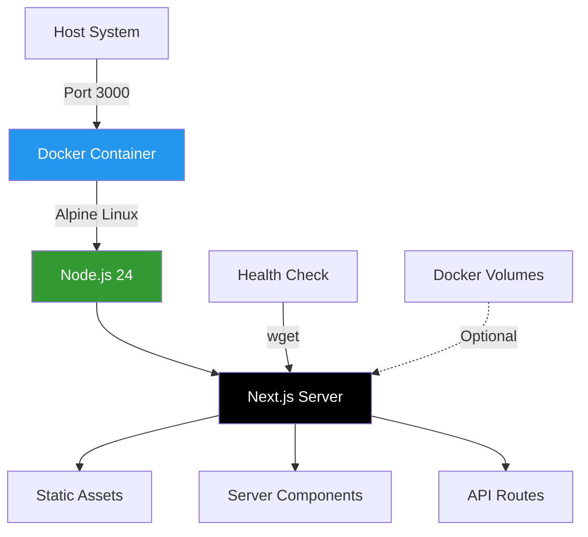

# Docker Guide

**Navigation:** [Home](../index.md) → [Deployment](./README.md) → Docker Guide

---

## Overview

This guide covers everything you need to know about Docker deployment for the Simon Stijnen Portfolio website. The project uses a multi-stage Docker build optimized for Next.js 15 applications with standalone output mode.

## Table of Contents

- [Quick Start](#quick-start)
- [Docker Architecture](#docker-architecture)
- [Building Images](#building-images)
- [Running Containers](#running-containers)
- [Image Optimization](#image-optimization)
- [Health Checks](#health-checks)
- [Troubleshooting](#troubleshooting)

---

## Quick Start

### Prerequisites

- Docker Engine 20.10+ or Docker Desktop
- Docker Compose v2.0+ (optional, for multi-service setup)
- 2GB+ available disk space
- Port 3000 available (or configure alternate port)

### 30-Second Deployment

```bash
# Clone the repository
git clone https://github.com/simonstnn/website.git
cd website

# Build and run with Docker Compose
docker-compose up -d

# View logs
docker-compose logs -f

# Access at http://localhost:3000
```

### Manual Docker Commands

```bash
# Build the image
docker build -t personal-website:local .

# Run the container
docker run -d \
  --name personal-website \
  -p 3000:3000 \
  --restart unless-stopped \
  personal-website:local

# Check logs
docker logs -f personal-website

# Stop and remove
docker stop personal-website && docker rm personal-website
```

---

## Docker Architecture

### Container Stack



### Image Layers

The Docker image uses a multi-stage build with three stages:

1. **deps** - Dependency installation (node_modules)
2. **builder** - Build Next.js application
3. **runner** - Minimal production runtime

See [Dockerfile Documentation](./02-dockerfile.md) for detailed explanation.

---

## Building Images

### Basic Build

```bash
# Build with default tag
docker build -t personal-website .

# Build with specific tag
docker build -t personal-website:v1.0.0 .

# Build with multiple tags
docker build \
  -t personal-website:latest \
  -t personal-website:1.0.0 \
  -t personal-website:1.0 \
  -t personal-website:1 \
  .
```

### Build Arguments

```bash
# Use different Node.js version (requires Dockerfile modification)
docker build --build-arg NODE_VERSION=24-alpine -t personal-website .

# Enable BuildKit for faster builds
DOCKER_BUILDKIT=1 docker build -t personal-website .

# Use build cache from registry
docker build \
  --cache-from personal-website:latest \
  -t personal-website:new-version \
  .
```

### Multi-Platform Builds

```bash
# Install buildx if not available
docker buildx create --use

# Build for multiple architectures
docker buildx build \
  --platform linux/amd64,linux/arm64 \
  -t personal-website:multi-arch \
  --push \
  .

# Build for Apple Silicon (M1/M2/M3)
docker buildx build \
  --platform linux/arm64 \
  -t personal-website:arm64 \
  .
```

### Build Optimization

```bash
# Prune build cache (free up space)
docker builder prune

# Prune all unused data
docker system prune -a

# View build cache usage
docker system df

# Build with no cache (clean build)
docker build --no-cache -t personal-website .
```

---

## Running Containers

### Basic Container Operations

```bash
# Run in foreground (see logs immediately)
docker run -p 3000:3000 personal-website

# Run in background (detached)
docker run -d -p 3000:3000 personal-website

# Run with custom name
docker run -d --name my-website -p 3000:3000 personal-website

# Run with auto-restart
docker run -d --restart unless-stopped -p 3000:3000 personal-website
```

### Port Mapping

```bash
# Map to different host port
docker run -d -p 8080:3000 personal-website
# Access at http://localhost:8080

# Map to specific interface
docker run -d -p 127.0.0.1:3000:3000 personal-website
# Only accessible locally

# Map multiple ports (if needed for custom setup)
docker run -d -p 3000:3000 -p 9229:9229 personal-website
```

### Environment Variables

```bash
# Set Node environment
docker run -d \
  -e NODE_ENV=production \
  -p 3000:3000 \
  personal-website

# Use environment file
docker run -d \
  --env-file .env.production \
  -p 3000:3000 \
  personal-website

# Multiple environment variables
docker run -d \
  -e NEXT_PUBLIC_SITE_URL=https://example.com \
  -e NEXT_PUBLIC_GA_ID=G-XXXXXXXXXX \
  -e PORT=3000 \
  -p 3000:3000 \
  personal-website
```

### Resource Limits

```bash
# Limit CPU and memory
docker run -d \
  --cpus="1.5" \
  --memory="512m" \
  --memory-swap="1g" \
  -p 3000:3000 \
  personal-website

# CPU shares (relative weight)
docker run -d \
  --cpu-shares=512 \
  -p 3000:3000 \
  personal-website

# OOM handling
docker run -d \
  --memory="512m" \
  --oom-kill-disable=false \
  -p 3000:3000 \
  personal-website
```

### Volume Mounts

```bash
# Mount logs directory
docker run -d \
  -v $(pwd)/logs:/app/logs \
  -p 3000:3000 \
  personal-website

# Mount custom content (for development)
docker run -d \
  -v $(pwd)/content:/app/content:ro \
  -p 3000:3000 \
  personal-website

# Named volume for persistent data
docker volume create website-data
docker run -d \
  -v website-data:/app/data \
  -p 3000:3000 \
  personal-website
```

---

## Image Optimization

### Layer Caching Strategy

The Dockerfile is optimized for layer caching:

```dockerfile
# 1. Base layer (cached unless Node version changes)
FROM node:24-alpine AS base

# 2. Dependencies layer (cached unless package.json changes)
COPY package.json yarn.lock* package-lock.json* ./
RUN npm ci

# 3. Build layer (cached unless source code changes)
COPY . .
RUN npm run build

# 4. Runtime layer (minimal, fast to rebuild)
COPY --from=builder /app/.next/standalone ./
```

### Size Comparison

```bash
# View image size
docker images personal-website

# Compare with non-optimized build
# Typical sizes:
# - Full build: ~1.2GB
# - Optimized (standalone): ~180MB
# - Compressed: ~60MB
```

### Standalone Output

The project uses Next.js standalone output mode:

```typescript
// next.config.ts
const nextConfig: NextConfig = {
  output: "standalone", // Only includes necessary files
};
```

**Benefits:**

- 80-90% smaller image size
- Faster startup times
- Reduced security surface
- Only production dependencies included

### Image Inspection

```bash
# View image layers
docker history personal-website

# Inspect image details
docker inspect personal-website

# Use dive for detailed analysis
docker run --rm -it \
  -v /var/run/docker.sock:/var/run/docker.sock \
  wagoodman/dive:latest personal-website
```

---

## Health Checks

### Built-in Health Check

The Dockerfile includes a health check that runs every 30 seconds:

```dockerfile
HEALTHCHECK --interval=30s --timeout=5s --start-period=10s --retries=3 \
  CMD wget --quiet --spider http://localhost:3000/ || exit 1
```

**Parameters:**

- **interval**: 30s between checks
- **timeout**: 5s maximum for check to complete
- **start-period**: 10s grace period on startup
- **retries**: 3 consecutive failures = unhealthy

### Check Health Status

```bash
# View health status
docker ps
# Look for "(healthy)" or "(unhealthy)" in STATUS column

# Detailed health check logs
docker inspect --format='{{json .State.Health}}' personal-website | jq

# Watch health status in real-time
watch -n 1 'docker inspect --format="{{.State.Health.Status}}" personal-website'
```

### Custom Health Checks

```bash
# Override health check at runtime
docker run -d \
  --health-cmd='curl -f http://localhost:3000/ || exit 1' \
  --health-interval=1m \
  --health-timeout=10s \
  --health-retries=3 \
  -p 3000:3000 \
  personal-website

# Disable health check
docker run -d --no-healthcheck -p 3000:3000 personal-website
```

### Health Check Integration

```bash
# Wait for healthy status before proceeding
docker run -d --name website -p 3000:3000 personal-website
timeout 60 bash -c 'until [ "$(docker inspect --format='\''{{.State.Health.Status}}'\'' website)" == "healthy" ]; do sleep 2; done'
echo "Container is healthy!"

# Use in docker-compose with depends_on
# See: docker-compose.md#health-check-dependencies
```

---

## Troubleshooting

### Container Won't Start

```bash
# View container logs
docker logs personal-website

# View last 100 lines
docker logs --tail 100 personal-website

# Follow logs in real-time
docker logs -f personal-website

# Check exit code
docker inspect personal-website --format='{{.State.ExitCode}}'
```

### Common Issues

#### Port Already in Use

```bash
# Error: "port is already allocated"

# Find process using port 3000
lsof -i :3000
# or
netstat -tulpn | grep 3000

# Use different port
docker run -d -p 8080:3000 personal-website
```

#### Out of Memory

```bash
# Error: "OOMKilled"

# Increase memory limit
docker run -d --memory="1g" -p 3000:3000 personal-website

# Check container resource usage
docker stats personal-website
```

#### Image Build Fails

```bash
# Error during build

# Build with verbose output
docker build --progress=plain -t personal-website .

# Check Docker daemon logs
journalctl -u docker.service

# Clear build cache and retry
docker builder prune
docker build --no-cache -t personal-website .
```

#### Permission Denied

```bash
# Error: "permission denied"

# The container runs as non-root user (nextjs:1001)
# Check file permissions if mounting volumes
ls -la /path/to/mounted/directory

# Fix permissions
chown -R 1001:1001 /path/to/mounted/directory
```

### Debug Container

```bash
# Start container with shell for debugging
docker run -it --entrypoint /bin/sh personal-website

# Execute shell in running container
docker exec -it personal-website /bin/sh

# Inspect as root user
docker exec -it -u root personal-website /bin/sh

# View container filesystem
docker export personal-website | tar tv

# Compare with previous image
docker diff personal-website
```

### Performance Issues

```bash
# Monitor resource usage
docker stats personal-website

# View detailed metrics
docker stats --no-stream --format "table {{.Container}}\t{{.CPUPerc}}\t{{.MemUsage}}"

# Check I/O operations
docker stats --format "table {{.Container}}\t{{.BlockIO}}"

# Network statistics
docker stats --format "table {{.Container}}\t{{.NetIO}}"
```

### Network Debugging

```bash
# Inspect network
docker network inspect bridge

# Test connectivity from container
docker exec personal-website wget -O- http://localhost:3000

# View container IP
docker inspect -f '{{range.NetworkSettings.Networks}}{{.IPAddress}}{{end}}' personal-website

# Connect to host network (removes isolation)
docker run -d --network host personal-website
```

---

## See Also

- [Dockerfile Documentation](./02-dockerfile.md) - Detailed multi-stage build explanation
- [Docker Compose Guide](./03-docker-compose.md) - Multi-service orchestration
- [CI/CD Pipeline](./04-ci-cd.md) - Automated Docker builds
- [Production Configuration](./06-production-config.md) - Production best practices

---

## Next Steps

1. **Development Workflow**: Learn about [Docker Compose](./03-docker-compose.md) for local development
2. **Automated Builds**: Set up [CI/CD Pipeline](./04-ci-cd.md) with GitHub Actions
3. **Deployment**: Choose your [Deployment Strategy](./05-deployment-strategies.md)
4. **Production**: Configure [Production Settings](./06-production-config.md)

---

**Last Updated:** February 2026  
**Maintained By:** Simon Stijnen  
**Docker Version:** 24.0+  
**Next.js Version:** 15.1.6
