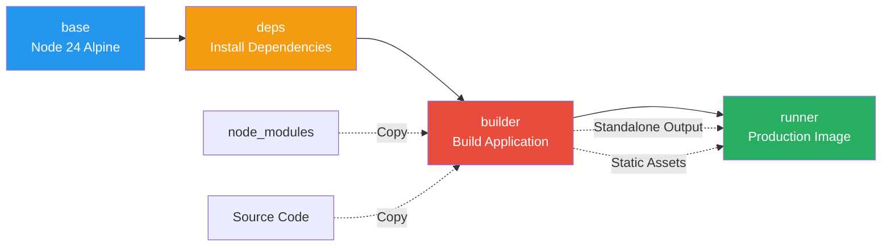
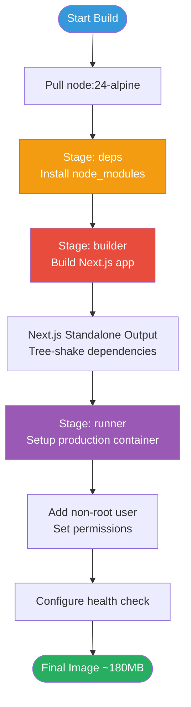
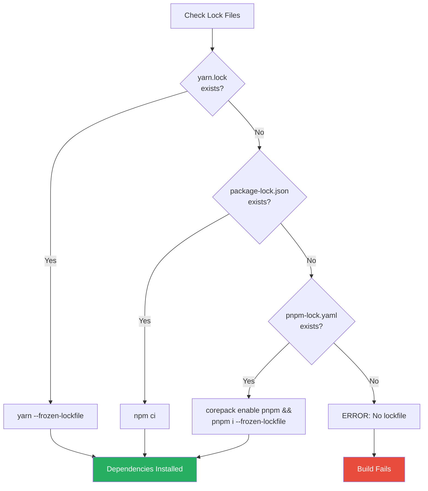

# Dockerfile Deep Dive

**Navigation:** [Home](../README.md) → [Deployment](./README.md) → Dockerfile

---

## Overview

This document provides an in-depth explanation of the multi-stage Dockerfile used to build optimized Docker images for the Simon Stijnen Portfolio website. The Dockerfile implements industry best practices for Next.js applications, resulting in small, secure, and performant production images.

## Table of Contents

- [Architecture](#architecture)
- [Stage 1: Base Image](#stage-1-base-image)
- [Stage 2: Dependencies](#stage-2-dependencies)
- [Stage 3: Builder](#stage-3-builder)
- [Stage 4: Production Runner](#stage-4-production-runner)
- [Optimization Techniques](#optimization-techniques)
- [Security Features](#security-features)
- [Customization](#customization)

---

## Architecture

### Multi-Stage Build Overview



### Build Flow



### Size Comparison

| Stage       | Size   | Contents                        | Purpose                          |
| ----------- | ------ | ------------------------------- | -------------------------------- |
| **base**    | ~150MB | Node.js + Alpine Linux          | Foundation for all stages        |
| **deps**    | ~400MB | base + node_modules             | Isolated dependency installation |
| **builder** | ~1.2GB | deps + source + build artifacts | Build Next.js application        |
| **runner**  | ~180MB | base + standalone output only   | **Final production image**       |

---

## Stage 1: Base Image

### Dockerfile Section

```dockerfile
# syntax=docker.io/docker/dockerfile:1

FROM node:24-alpine AS base
```

### Explanation

**Syntax Directive:**

```dockerfile
# syntax=docker.io/docker/dockerfile:1
```

- Enables BuildKit features and latest Dockerfile syntax
- Provides better caching, parallelization, and security
- Optional but recommended for modern Docker builds

**Base Image Choice:**

```dockerfile
FROM node:24-alpine AS base
```

**Why `node:24-alpine`?**

- **Node.js 24**: Latest LTS version with modern JavaScript features
- **Alpine Linux**: Minimal distribution (~5MB vs ~130MB for Debian)
- **Security**: Fewer packages = smaller attack surface
- **Performance**: Faster image pulls and container startup

**Alternative Base Images:**

```dockerfile
# Standard Debian-based (larger but more compatible)
FROM node:24-slim AS base

# Specific version pinning (reproducible builds)
FROM node:24.0.0-alpine3.19 AS base

# Non-LTS version (not recommended for production)
FROM node:latest AS base
```

---

## Stage 2: Dependencies

### Dockerfile Section

```dockerfile
# Install dependencies only when needed
FROM base AS deps
RUN apk add --no-cache libc6-compat
WORKDIR /app

# Install dependencies based on the preferred package manager
COPY package.json yarn.lock* package-lock.json* pnpm-lock.yaml* .npmrc* ./
RUN \
  if [ -f yarn.lock ]; then yarn --frozen-lockfile; \
  elif [ -f package-lock.json ]; then npm ci; \
  elif [ -f pnpm-lock.yaml ]; then corepack enable pnpm && pnpm i --frozen-lockfile; \
  else echo "Lockfile not found." && exit 1; \
  fi
```

### Detailed Breakdown

#### 1. Alpine Compatibility

```dockerfile
RUN apk add --no-cache libc6-compat
```

**Purpose:** Some Node.js native modules expect glibc (GNU C Library), but Alpine uses musl libc.

- `libc6-compat`: Provides compatibility layer for glibc-dependent packages
- `--no-cache`: Doesn't store apk index, saves ~1-2MB
- Required for packages like: canvas, sharp, better-sqlite3

**When NOT Needed:**
If your application only uses pure JavaScript packages, you can remove this line.

#### 2. Working Directory

```dockerfile
WORKDIR /app
```

- Sets `/app` as the working directory for subsequent commands
- Creates directory if it doesn't exist
- All relative paths now resolve from `/app`

#### 3. Copy Lock Files

```dockerfile
COPY package.json yarn.lock* package-lock.json* pnpm-lock.yaml* .npmrc* ./
```

**Wildcards (`*`):** Copy if file exists, ignore if missing

- `package.json` - Always required
- `yarn.lock*` - Yarn v1/v2/v3 lock file
- `package-lock.json*` - npm lock file
- `pnpm-lock.yaml*` - pnpm lock file
- `.npmrc*` - Optional npm configuration

**Why Copy Lock Files Separately?**

- Maximizes Docker layer caching
- If only source code changes, dependency layer is cached
- Significantly speeds up rebuild times

#### 4. Package Manager Detection

```dockerfile
RUN \
  if [ -f yarn.lock ]; then yarn --frozen-lockfile; \
  elif [ -f package-lock.json ]; then npm ci; \
  elif [ -f pnpm-lock.yaml ]; then corepack enable pnpm && pnpm i --frozen-lockfile; \
  else echo "Lockfile not found." && exit 1; \
  fi
```

**Logic Flow:**



**Command Explanations:**

| Package Manager | Command                    | Purpose                                                 |
| --------------- | -------------------------- | ------------------------------------------------------- |
| **Yarn**        | `yarn --frozen-lockfile`   | Install exact versions, fail if lock file is outdated   |
| **npm**         | `npm ci`                   | Clean install from lock file, faster than `npm install` |
| **pnpm**        | `pnpm i --frozen-lockfile` | Install exact versions with efficient disk usage        |

**Why `npm ci` instead of `npm install`?**

- Deletes `node_modules` before installing (clean state)
- Only installs from `package-lock.json` (reproducible)
- Faster in CI/CD environments
- Fails if lock file is out of sync with `package.json`

---

## Stage 3: Builder

### Dockerfile Section

```dockerfile
# Rebuild the source code only when needed
FROM base AS builder
WORKDIR /app
COPY --from=deps /app/node_modules ./node_modules
COPY . .

ENV NODE_ENV=production

RUN \
  if [ -f yarn.lock ]; then yarn run build; \
  elif [ -f package-lock.json ]; then npm run build; \
  elif [ -f pnpm-lock.yaml ]; then corepack enable pnpm && pnpm run build; \
  else echo "Lockfile not found." && exit 1; \
  fi
```

### Detailed Breakdown

#### 1. Copy Dependencies

```dockerfile
COPY --from=deps /app/node_modules ./node_modules
```

**Multi-stage copy:**

- Copies entire `node_modules` from the `deps` stage
- No need to reinstall dependencies
- Saves time and ensures consistency

#### 2. Copy Source Code

```dockerfile
COPY . .
```

**Copies everything** except patterns in `.dockerignore`:

```plaintext
# Recommended .dockerignore
node_modules
.next
.git
.env*.local
npm-debug.log
Dockerfile
.dockerignore
README.md
```

#### 3. Production Environment

```dockerfile
ENV NODE_ENV=production
```

**Effects:**

- Disables development warnings and debugging features
- Enables production optimizations in Next.js
- Reduces bundle size by tree-shaking dev dependencies
- Enables performance optimizations

#### 4. Build Application

```dockerfile
RUN \
  if [ -f yarn.lock ]; then yarn run build; \
  ...
  fi
```

**What happens during build:**

```bash
# Next.js build process
npm run build
# ↓
# 1. Compile TypeScript → JavaScript
# 2. Bundle client-side code
# 3. Pre-render static pages
# 4. Generate standalone output (if configured)
# 5. Optimize images and assets
```

**Build Output:**

```
.next/
├── cache/              # Build cache (not needed in production)
├── server/             # Server components
├── static/             # Static assets with content hashes
└── standalone/         # Minimal production files (used in runner)
    ├── server.js       # Entry point
    ├── package.json    # Minimal dependencies
    └── node_modules/   # Only production dependencies
```

---

## Stage 4: Production Runner

### Dockerfile Section

```dockerfile
# Production image, copy all the files and run next
FROM base AS runner
WORKDIR /app

ENV NODE_ENV=production

RUN addgroup --system --gid 1001 nodejs
RUN adduser --system --uid 1001 nextjs

RUN apk add --no-cache wget

COPY --from=builder /app/public ./public

# Automatically leverage output traces to reduce image size
COPY --from=builder --chown=nextjs:nodejs /app/.next/standalone ./
COPY --from=builder --chown=nextjs:nodejs /app/.next/static ./.next/static

USER nextjs

EXPOSE 3000

ENV PORT=3000
ENV HOSTNAME="0.0.0.0"

# Health check to verify the application is running correctly
HEALTHCHECK --interval=30s --timeout=5s --start-period=10s --retries=3 \
  CMD wget --quiet --spider http://localhost:3000/ || exit 1

# Run the Next.js application
CMD ["node", "server.js"]
```

### Detailed Breakdown

#### 1. User Creation (Security)

```dockerfile
RUN addgroup --system --gid 1001 nodejs
RUN adduser --system --uid 1001 nextjs
```

**Why non-root user?**

- **Security**: Limits damage if container is compromised
- **Best Practice**: Follows principle of least privilege
- **Compliance**: Required by many security policies

**User Details:**

- `--system`: System user (no login shell, no home directory)
- `--gid 1001`: Group ID 1001 (nodejs group)
- `--uid 1001`: User ID 1001 (nextjs user)
- No password, no interactive login

#### 2. Install Health Check Tool

```dockerfile
RUN apk add --no-cache wget
```

- Minimal HTTP client for health checks
- Alternative: `curl` (slightly larger)
- Only ~400KB added to image

#### 3. Copy Public Assets

```dockerfile
COPY --from=builder /app/public ./public
```

- Static files from `public/` directory
- Served by Next.js at root path
- Includes: images, fonts, favicon, robots.txt

#### 4. Copy Standalone Output

```dockerfile
COPY --from=builder --chown=nextjs:nodejs /app/.next/standalone ./
COPY --from=builder --chown=nextjs:nodejs /app/.next/static ./.next/static
```

**Standalone Output:**
Next.js generates a minimal production build with only required files:

```
standalone/
├── server.js           # Entry point (~10KB)
├── package.json        # Only prod dependencies
└── node_modules/       # Tree-shaken modules (~50MB)
```

**`--chown=nextjs:nodejs`:**

- Sets file ownership to `nextjs` user
- Prevents permission issues at runtime
- Applied during copy (efficient)

**Why two copy commands?**

- `standalone/` contains server code and minimal node_modules
- `static/` contains client-side JavaScript and assets with content hashes
- Static files need to be in `.next/static` for Next.js to serve them

#### 5. Switch to Non-Root User

```dockerfile
USER nextjs
```

- All subsequent commands run as `nextjs` user
- Includes the final `CMD` when container starts
- Cannot modify system files or install packages

#### 6. Port Declaration

```dockerfile
EXPOSE 3000
```

- **Documentary**: Indicates the container listens on port 3000
- Does NOT publish the port (use `-p` flag for that)
- Used by Docker networking and tools

#### 7. Environment Variables

```dockerfile
ENV PORT=3000
ENV HOSTNAME="0.0.0.0"
```

**PORT=3000:**

- Next.js server listens on this port
- Can be overridden at runtime: `-e PORT=8080`

**HOSTNAME="0.0.0.0":**

- Binds to all network interfaces
- Required for Docker networking
- Alternative: `localhost` (only accessible from inside container)

#### 8. Health Check

```dockerfile
HEALTHCHECK --interval=30s --timeout=5s --start-period=10s --retries=3 \
  CMD wget --quiet --spider http://localhost:3000/ || exit 1
```

**Parameters:**

- `--interval=30s`: Check every 30 seconds
- `--timeout=5s`: Kill check if it takes >5 seconds
- `--start-period=10s`: Grace period for app startup
- `--retries=3`: Mark unhealthy after 3 consecutive failures

**Command Breakdown:**

```bash
wget --quiet --spider http://localhost:3000/ || exit 1
#    ↓                                         ↓
#    No output                                 Return 1 (unhealthy) if wget fails
#           ↓
#           Don't download, just check if URL is accessible
```

**Health States:**

- `starting` (0-10s): Grace period
- `healthy`: Check succeeded
- `unhealthy`: 3+ consecutive failures

See: [Health Checks in Docker Guide](./01-docker-guide.md#health-checks)

#### 9. Container Command

```dockerfile
CMD ["node", "server.js"]
```

**Exec form (recommended):**

- Array syntax: `["executable", "param1", "param2"]`
- Direct process execution (PID 1)
- Proper signal handling (SIGTERM, SIGINT)
- Graceful shutdown support

**Shell form (not recommended):**

```dockerfile
CMD node server.js
```

- Wrapped in shell: `/bin/sh -c "node server.js"`
- Signals sent to shell, not Node.js
- Harder to stop gracefully

---

## Optimization Techniques

### Layer Caching Strategy

Docker caches each layer. To maximize cache hits:

```dockerfile
# ✅ GOOD: Copy dependencies first (changes rarely)
COPY package.json package-lock.json ./
RUN npm ci

# Copy source code last (changes frequently)
COPY . .
RUN npm run build
```

```dockerfile
# ❌ BAD: Copy everything at once
COPY . .
RUN npm ci && npm run build
# Any file change invalidates entire layer
```

### BuildKit Features

Enable BuildKit for parallel builds:

```bash
# One-time
export DOCKER_BUILDKIT=1
docker build -t personal-website .

# Permanent (add to ~/.bashrc or ~/.zshrc)
export DOCKER_BUILDKIT=1
```

**Benefits:**

- Parallel stage execution
- Better caching
- Secret mounting
- SSH forwarding

### Standalone Output Configuration

Required in `next.config.ts`:

```typescript
const nextConfig: NextConfig = {
  output: "standalone",
};
```

**Before vs After:**

| Metric       | Standard Build | Standalone Build   |
| ------------ | -------------- | ------------------ |
| Image Size   | ~1.2GB         | ~180MB             |
| node_modules | Full (400MB)   | Tree-shaken (50MB) |
| Startup Time | ~3s            | ~1s                |
| Files Copied | ~10,000        | ~100               |

---

## Security Features

### Multi-Stage Build Security

```mermaid
graph TD
    A[Source Code + Secrets] --> B[builder Stage]
    B --> C[Build Artifacts]
    C --> D[runner Stage]

    E[Secrets/Tokens] -.-> B
    E -.x|NOT copied| D

    F[dev Dependencies] --> B
    F -.x|NOT copied| D

    style D fill:#27ae60,color:#fff
    style E fill:#e74c3c,color:#fff
    style F fill:#e74c3c,color:#fff
```

**What's excluded from final image:**

- Build-time secrets (API keys, tokens)
- Development dependencies
- Source TypeScript files
- Test files
- Git history
- Build cache

### Non-Root User

Running as non-root prevents:

- Privilege escalation attacks
- System file modifications
- Package installation by attackers
- Container breakout scenarios

**Test user permissions:**

```bash
# Verify running as nextjs user
docker exec personal-website whoami
# Output: nextjs

# Verify cannot install packages
docker exec personal-website apk add curl
# Output: permission denied
```

### Minimal Attack Surface

Alpine Linux benefits:

- Fewer pre-installed packages
- Smaller attack surface
- Faster security patches
- Package manager (apk) audit support

**Package count comparison:**

- Alpine: ~30 packages
- Debian Slim: ~120 packages
- Ubuntu: ~400 packages

---

## Customization

### Using Different Node Versions

```dockerfile
# LTS versions
FROM node:20-alpine AS base  # v20 LTS
FROM node:22-alpine AS base  # v22 LTS
FROM node:24-alpine AS base  # v24 LTS (current)

# Pin exact version
FROM node:24.0.0-alpine3.19 AS base

# Use Iron Codename
FROM node:iron-alpine AS base  # Node.js 20
```

### Adding System Dependencies

```dockerfile
FROM base AS deps
RUN apk add --no-cache \
  libc6-compat \
  python3 \
  make \
  g++
# Required for native modules like node-gyp
```

### Custom Build Arguments

```dockerfile
FROM node:${NODE_VERSION}-alpine AS base
ARG NODE_VERSION=24

# Use with: docker build --build-arg NODE_VERSION=22 .
```

### Development Dockerfile

Create `Dockerfile.dev` for local development:

```dockerfile
FROM node:24-alpine

WORKDIR /app

# Install dependencies
COPY package*.json ./
RUN npm ci

# Copy source
COPY . .

# Expose dev server and debugging port
EXPOSE 3000 9229

# Run in development mode
CMD ["npm", "run", "dev"]
```

### Multi-Architecture Support

```dockerfile
# Automatically use correct architecture
FROM --platform=$BUILDPLATFORM node:24-alpine AS base

# Build with: docker buildx build --platform linux/amd64,linux/arm64 .
```

---

## See Also

- [Docker Guide](./01-docker-guide.md) - Comprehensive Docker usage guide
- [Docker Compose](./03-docker-compose.md) - Multi-service orchestration
- [CI/CD Pipeline](./04-ci-cd.md) - Automated Docker builds
- [Production Config](./06-production-config.md) - Production best practices

---

## Next Steps

1. **Build Your Image**: Follow the [Docker Guide](./01-docker-guide.md#building-images)
2. **Local Development**: Set up [Docker Compose](./03-docker-compose.md)
3. **Automate Builds**: Configure [CI/CD Pipeline](./04-ci-cd.md)
4. **Production Deployment**: Review [Deployment Strategies](./05-deployment-strategies.md)

---

**Last Updated:** February 2026  
**Dockerfile Version:** Multi-stage v3  
**Next.js Compatibility:** 13.x, 14.x, 15.x  
**Node.js Version:** 24 LTS
