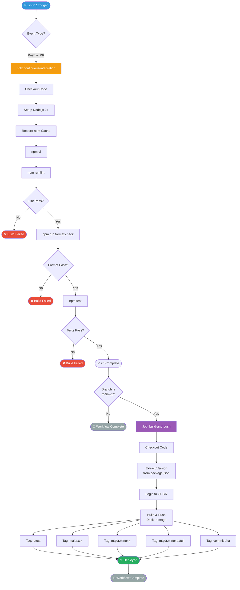
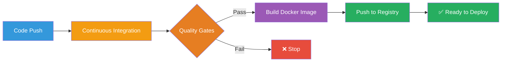
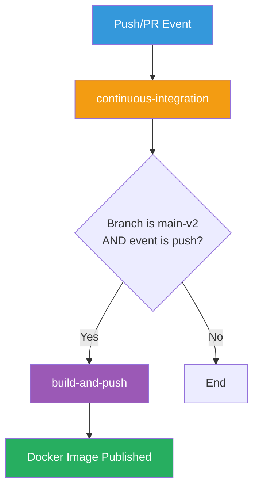
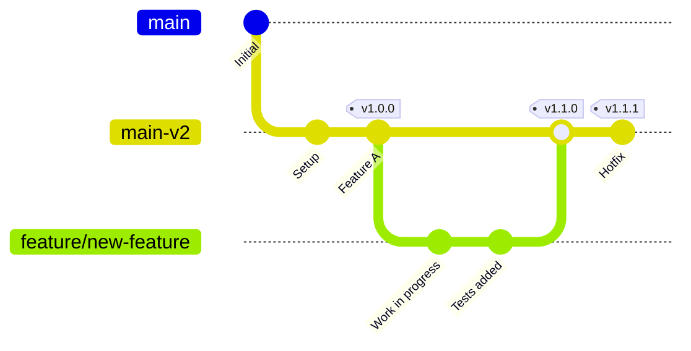

# CI/CD Pipeline

**Navigation:** [Home](../index.md) → [Deployment](./README.md) → CI/CD

---

## Overview

The Simon Stijnen Portfolio uses GitHub Actions for continuous integration and deployment. The pipeline automatically builds, tests, and deploys the application on every push and pull request, ensuring code quality and streamlining the deployment process.

## Table of Contents

- [Pipeline Architecture](#pipeline-architecture)
- [Workflow Configuration](#workflow-configuration)
- [Job Breakdown](#job-breakdown)
- [Docker Image Publishing](#docker-image-publishing)
- [Branch Strategy](#branch-strategy)
- [Secrets and Variables](#secrets-and-variables)
- [Customization](#customization)
- [Troubleshooting](#troubleshooting)

---

## Pipeline Architecture

### Complete Workflow Diagram



### Pipeline Stages



### Job Dependencies



---

## Workflow Configuration

### Complete Workflow File

**File:** `.github/workflows/ci.yml`

```yaml
name: CI

on:
  push:
  pull_request:

jobs:
  continuous-integration:
    runs-on: ubuntu-latest
    steps:
      - name: Checkout code
        uses: actions/checkout@v6
      - name: Setup Node.js
        uses: actions/setup-node@v6
        with:
          node-version: 24
          cache: npm
      - name: Install dependencies
        run: npm ci

      - name: Run linter
        run: |
          npm run lint

      - name: Run format check
        run: |
          npm run format:check

      - name: Run tests
        run: |
          npm test

  build-and-push:
    needs: continuous-integration
    if: github.ref == 'refs/heads/main-v2'
    runs-on: ubuntu-latest
    permissions:
      contents: read
      packages: write
    steps:
      - name: Checkout code
        uses: actions/checkout@v6
      - name: Extract version
        run: |
          VERSION=$(node -p "require('./package.json').version")
          MAJOR=$(echo $VERSION | cut -d. -f1)
          MINOR=$(echo $VERSION | cut -d. -f1-2)
          echo "VERSION=$VERSION" >> $GITHUB_ENV
          echo "MAJOR=$MAJOR" >> $GITHUB_ENV
          echo "MINOR=$MINOR" >> $GITHUB_ENV
      - name: Log in to GitHub Container Registry
        uses: docker/login-action@v3
        with:
          registry: ghcr.io
          username: ${{ github.actor }}
          password: ${{ secrets.GITHUB_TOKEN }}
      - name: Build and push Docker image
        uses: docker/build-push-action@v5
        with:
          context: .
          push: true
          tags: |
            ghcr.io/simonstnn/website:latest
            ghcr.io/simonstnn/website:${{ env.MAJOR }}
            ghcr.io/simonstnn/website:${{ env.MINOR }}
            ghcr.io/simonstnn/website:${{ env.VERSION }}
            ghcr.io/simonstnn/website:${{ github.sha }}
```

### Trigger Configuration

```yaml
on:
  push:
  pull_request:
```

**Behavior:**

- **Push**: Runs on every push to any branch
- **Pull Request**: Runs on PR creation and updates
- Both events trigger the `continuous-integration` job
- Only `main-v2` pushes trigger `build-and-push`

**Alternative Triggers:**

```yaml
# Run only on specific branches
on:
  push:
    branches:
      - main-v2
      - develop
  pull_request:
    branches:
      - main-v2

# Run on tag creation
on:
  push:
    tags:
      - 'v*.*.*'

# Scheduled runs (cron)
on:
  schedule:
    - cron: '0 2 * * 0'  # Weekly on Sunday at 2 AM

# Manual trigger
on:
  workflow_dispatch:
    inputs:
      environment:
        description: 'Deployment environment'
        required: true
        default: 'staging'
        type: choice
        options:
          - staging
          - production

# Multiple triggers
on:
  push:
    branches: [main-v2]
  pull_request:
  workflow_dispatch:
```

---

## Job Breakdown

### Job 1: Continuous Integration

#### Purpose

Validates code quality through linting, formatting, and testing.

#### Configuration

```yaml
continuous-integration:
  runs-on: ubuntu-latest
  steps:
    - name: Checkout code
      uses: actions/checkout@v6
    - name: Setup Node.js
      uses: actions/setup-node@v6
      with:
        node-version: 24
        cache: npm
    - name: Install dependencies
      run: npm ci
    - name: Run linter
      run: npm run lint
    - name: Run format check
      run: npm run format:check
    - name: Run tests
      run: npm test
```

#### Step-by-Step

##### 1. Checkout Code

```yaml
- name: Checkout code
  uses: actions/checkout@v6
```

- Clones repository to runner
- Uses latest version (v6) of checkout action
- Includes full git history by default

**Advanced Options:**

```yaml
- uses: actions/checkout@v6
  with:
    fetch-depth: 0 # Full history
    submodules: true # Include submodules
    token: ${{ secrets.GH_TOKEN }} # Custom token
```

##### 2. Setup Node.js

```yaml
- name: Setup Node.js
  uses: actions/setup-node@v6
  with:
    node-version: 24
    cache: npm
```

- Installs Node.js 24 (LTS)
- Caches npm dependencies automatically
- Speeds up subsequent runs by 30-60s

**Cache Behavior:**

- Cache key based on `package-lock.json` hash
- Automatically invalidated when dependencies change
- Shared across workflow runs

**Alternative Configurations:**

```yaml
# Use .nvmrc file
- uses: actions/setup-node@v6
  with:
    node-version-file: '.nvmrc'
    cache: npm

# Matrix testing (multiple Node versions)
strategy:
  matrix:
    node-version: [20, 22, 24]
steps:
  - uses: actions/setup-node@v6
    with:
      node-version: ${{ matrix.node-version }}
```

##### 3. Install Dependencies

```yaml
- name: Install dependencies
  run: npm ci
```

**Why `npm ci`?**

- Clean install from `package-lock.json`
- Deletes `node_modules` before installing
- Fails if lock file is out of sync
- 2-3x faster than `npm install` in CI

**Comparison:**

| Command       | Speed | Reproducible | Modifies Lock |
| ------------- | ----- | ------------ | ------------- |
| `npm install` | Slow  | ❌           | ✅ Yes        |
| `npm ci`      | Fast  | ✅           | ❌ No         |

##### 4. Run Linter

```yaml
- name: Run linter
  run: npm run lint
```

**Executes:**

```bash
# From package.json
"lint": "next lint"
```

**What it checks:**

- ESLint rules (next/core-web-vitals, next/typescript)
- TypeScript errors
- Code style violations
- Unused imports and variables

**Configuration:** `.eslintrc.json`

##### 5. Run Format Check

```yaml
- name: Run format check
  run: npm run format:check
```

**Executes:**

```bash
# From package.json
"format:check": "prettier --check ."
```

**What it checks:**

- Code formatting consistency
- Indentation, spacing, quotes
- Prettier rules compliance
- Does NOT modify files

**Configuration:** `.prettierrc`

##### 6. Run Tests

```yaml
- name: Run tests
  run: npm test
```

**Executes:**

```bash
# From package.json
"test": "jest"
```

**What it runs:**

- Unit tests
- Integration tests
- Coverage collection
- Snapshot testing

**Configuration:** `jest.config.js`

---

### Job 2: Build and Push

#### Purpose

Builds Docker image and publishes to GitHub Container Registry (GHCR) on main branch pushes.

#### Configuration

```yaml
build-and-push:
  needs: continuous-integration
  if: github.ref == 'refs/heads/main-v2'
  runs-on: ubuntu-latest
  permissions:
    contents: read
    packages: write
  steps:
    - name: Checkout code
      uses: actions/checkout@v6
    - name: Extract version
      run: |
        VERSION=$(node -p "require('./package.json').version")
        MAJOR=$(echo $VERSION | cut -d. -f1)
        MINOR=$(echo $VERSION | cut -d. -f1-2)
        echo "VERSION=$VERSION" >> $GITHUB_ENV
        echo "MAJOR=$MAJOR" >> $GITHUB_ENV
        echo "MINOR=$MINOR" >> $GITHUB_ENV
    - name: Log in to GitHub Container Registry
      uses: docker/login-action@v3
      with:
        registry: ghcr.io
        username: ${{ github.actor }}
        password: ${{ secrets.GITHUB_TOKEN }}
    - name: Build and push Docker image
      uses: docker/build-push-action@v5
      with:
        context: .
        push: true
        tags: |
          ghcr.io/simonstnn/website:latest
          ghcr.io/simonstnn/website:${{ env.MAJOR }}
          ghcr.io/simonstnn/website:${{ env.MINOR }}
          ghcr.io/simonstnn/website:${{ env.VERSION }}
          ghcr.io/simonstnn/website:${{ github.sha }}
```

#### Step-by-Step

##### 1. Job Dependencies

```yaml
needs: continuous-integration
if: github.ref == 'refs/heads/main-v2'
```

**needs:** Job only runs after `continuous-integration` succeeds
**if:** Additional condition - only on `main-v2` branch

**Behavior Matrix:**

| Branch  | Event | CI Job  | Build Job  |
| ------- | ----- | ------- | ---------- |
| main-v2 | push  | ✅ Runs | ✅ Runs    |
| main-v2 | PR    | ✅ Runs | ❌ Skipped |
| feature | push  | ✅ Runs | ❌ Skipped |
| feature | PR    | ✅ Runs | ❌ Skipped |

##### 2. Permissions

```yaml
permissions:
  contents: read
  packages: write
```

**Required for GHCR:**

- `contents: read` - Read repository contents
- `packages: write` - Push Docker images to GHCR

**Security:** Minimal permissions following principle of least privilege

##### 3. Extract Version

```yaml
- name: Extract version
  run: |
    VERSION=$(node -p "require('./package.json').version")
    MAJOR=$(echo $VERSION | cut -d. -f1)
    MINOR=$(echo $VERSION | cut -d. -f1-2)
    echo "VERSION=$VERSION" >> $GITHUB_ENV
    echo "MAJOR=$MAJOR" >> $GITHUB_ENV
    echo "MINOR=$MINOR" >> $GITHUB_ENV
```

**Example:** If `package.json` has `"version": "1.2.3"`:

```bash
VERSION=1.2.3  # Full version
MAJOR=1        # Major version only
MINOR=1.2      # Major.minor
```

**Why multiple versions?**
Enables flexible deployment strategies:

- `latest` - Always newest
- `1` - Latest v1.x.x
- `1.2` - Latest v1.2.x
- `1.2.3` - Exact version
- `abc123` - Specific commit

##### 4. Login to GHCR

```yaml
- name: Log in to GitHub Container Registry
  uses: docker/login-action@v3
  with:
    registry: ghcr.io
    username: ${{ github.actor }}
    password: ${{ secrets.GITHUB_TOKEN }}
```

**Parameters:**

- `registry: ghcr.io` - GitHub Container Registry
- `username: ${{ github.actor }}` - GitHub username that triggered workflow
- `password: ${{ secrets.GITHUB_TOKEN }}` - Automatically provided token

**Alternatives:**

```yaml
# Docker Hub
- uses: docker/login-action@v3
  with:
    username: ${{ secrets.DOCKER_USERNAME }}
    password: ${{ secrets.DOCKER_PASSWORD }}

# AWS ECR
- uses: aws-actions/amazon-ecr-login@v2

# Google Artifact Registry
- uses: docker/login-action@v3
  with:
    registry: us-docker.pkg.dev
    username: _json_key
    password: ${{ secrets.GCP_SA_KEY }}
```

##### 5. Build and Push

```yaml
- name: Build and push Docker image
  uses: docker/build-push-action@v5
  with:
    context: .
    push: true
    tags: |
      ghcr.io/simonstnn/website:latest
      ghcr.io/simonstnn/website:${{ env.MAJOR }}
      ghcr.io/simonstnn/website:${{ env.MINOR }}
      ghcr.io/simonstnn/website:${{ env.VERSION }}
      ghcr.io/simonstnn/website:${{ github.sha }}
```

**Parameters:**

- `context: .` - Build context (current directory)
- `push: true` - Push image to registry
- `tags` - Multiple tags for the same image

**Advanced Options:**

```yaml
- uses: docker/build-push-action@v5
  with:
    context: .
    file: ./Dockerfile
    push: true
    tags: ghcr.io/user/image:tag
    build-args: |
      NODE_VERSION=24
      BUILD_DATE=$(date -u +'%Y-%m-%dT%H:%M:%SZ')
    cache-from: type=gha
    cache-to: type=gha,mode=max
    platforms: linux/amd64,linux/arm64
    labels: |
      org.opencontainers.image.source=${{ github.server_url }}/${{ github.repository }}
      org.opencontainers.image.revision=${{ github.sha }}
```

---

## Docker Image Publishing

### Tagging Strategy

For version `1.2.3` and commit `abc123def`:

| Tag      | Example             | Purpose              | Updates              |
| -------- | ------------------- | -------------------- | -------------------- |
| `latest` | `website:latest`    | Always newest stable | Every main push      |
| Major    | `website:1`         | Latest v1.x.x        | Minor/patch releases |
| Minor    | `website:1.2`       | Latest v1.2.x        | Patch releases       |
| Patch    | `website:1.2.3`     | Exact version        | Never (immutable)    |
| SHA      | `website:abc123def` | Specific commit      | Never (immutable)    |

### Pull Strategy

```bash
# Always get latest
docker pull ghcr.io/simonstnn/website:latest

# Pin to major version (get patches/features)
docker pull ghcr.io/simonstnn/website:1

# Pin to minor version (get patches only)
docker pull ghcr.io/simonstnn/website:1.2

# Pin to exact version (reproducible)
docker pull ghcr.io/simonstnn/website:1.2.3

# Pull specific commit
docker pull ghcr.io/simonstnn/website:abc123def
```

### Registry Configuration

#### GitHub Container Registry (GHCR)

**Advantages:**

- Integrated with GitHub
- Free for public repositories
- No rate limits for authenticated users
- Same authentication as GitHub

**Image URL Format:**

```
ghcr.io/<owner>/<image-name>:<tag>
ghcr.io/simonstnn/website:latest
```

**Visibility:**

- Public by default for public repos
- Can be made private in package settings

#### Alternative Registries

**Docker Hub:**

```yaml
- uses: docker/login-action@v3
  with:
    username: ${{ secrets.DOCKER_USERNAME }}
    password: ${{ secrets.DOCKER_TOKEN }}

- uses: docker/build-push-action@v5
  with:
    push: true
    tags: username/website:latest
```

**AWS ECR:**

```yaml
- uses: aws-actions/configure-aws-credentials@v4
  with:
    aws-access-key-id: ${{ secrets.AWS_ACCESS_KEY_ID }}
    aws-secret-access-key: ${{ secrets.AWS_SECRET_ACCESS_KEY }}
    aws-region: us-east-1

- uses: aws-actions/amazon-ecr-login@v2
  id: login-ecr

- uses: docker/build-push-action@v5
  with:
    push: true
    tags: ${{ steps.login-ecr.outputs.registry }}/website:latest
```

---

## Branch Strategy

### Current Strategy



**Branches:**

- `main-v2` - Production branch, triggers Docker builds
- `feature/*` - Feature branches, CI only
- `hotfix/*` - Hotfix branches, CI only

### Workflow Behavior by Branch

| Branch Pattern | CI Job | Docker Build | Deploy  |
| -------------- | ------ | ------------ | ------- |
| `main-v2`      | ✅     | ✅           | ✅ Auto |
| `feature/*`    | ✅     | ❌           | ❌      |
| `hotfix/*`     | ✅     | ❌           | ❌      |
| Pull Request   | ✅     | ❌           | ❌      |

### Advanced Branch Strategies

#### Git Flow

```yaml
on:
  push:
    branches:
      - main # Production
      - develop # Integration
      - "release/**" # Release candidates
      - "hotfix/**" # Hotfixes

jobs:
  build:
    runs-on: ubuntu-latest
    steps:
      - uses: actions/checkout@v6
      - name: Build Docker image
        if: github.ref == 'refs/heads/main' || github.ref == 'refs/heads/develop'
        run: docker build -t myapp:${{ github.ref_name }} .
```

#### Trunk-Based Development

```yaml
on:
  push:
    branches:
      - main
  pull_request:

jobs:
  deploy:
    if: github.ref == 'refs/heads/main'
    runs-on: ubuntu-latest
    steps:
      - name: Deploy to production
        run: ./deploy.sh
```

---

## Secrets and Variables

### Built-in Secrets

GitHub Actions provides these automatically:

```yaml
${{ secrets.GITHUB_TOKEN }}  # GitHub API token
${{ github.actor }}           # Username that triggered workflow
${{ github.sha }}             # Commit SHA
${{ github.ref }}             # Branch ref (refs/heads/main)
${{ github.repository }}      # owner/repo
```

### Custom Secrets

#### Adding Secrets

1. Go to repository **Settings** → **Secrets and variables** → **Actions**
2. Click **New repository secret**
3. Add name and value

#### Using Secrets

```yaml
steps:
  - name: Deploy to server
    env:
      SSH_KEY: ${{ secrets.SSH_PRIVATE_KEY }}
      API_TOKEN: ${{ secrets.DEPLOY_TOKEN }}
    run: |
      echo "$SSH_KEY" > key.pem
      chmod 600 key.pem
      ssh -i key.pem user@server "docker pull && docker restart"
```

### Environment Variables

#### Repository Variables

```yaml
env:
  NODE_ENV: production
  API_URL: ${{ vars.API_URL }} # Repository variable

jobs:
  build:
    runs-on: ubuntu-latest
    env:
      DATABASE_URL: ${{ secrets.DATABASE_URL }}
```

#### Job-Level Variables

```yaml
jobs:
  build:
    runs-on: ubuntu-latest
    env:
      NODE_ENV: production
    steps:
      - run: echo $NODE_ENV # Available in all steps
```

#### Step-Level Variables

```yaml
steps:
  - name: Build
    env:
      NODE_ENV: production
    run: npm run build # NODE_ENV only available in this step
```

---

## Customization

### Adding Deployment Step

```yaml
jobs:
  deploy:
    needs: build-and-push
    if: github.ref == 'refs/heads/main-v2'
    runs-on: ubuntu-latest
    steps:
      - name: Deploy to server
        uses: appleboy/ssh-action@master
        with:
          host: ${{ secrets.SERVER_HOST }}
          username: ${{ secrets.SERVER_USER }}
          key: ${{ secrets.SSH_PRIVATE_KEY }}
          script: |
            docker pull ghcr.io/simonstnn/website:latest
            docker stop personal-website || true
            docker rm personal-website || true
            docker run -d \
              --name personal-website \
              -p 3000:3000 \
              --restart unless-stopped \
              ghcr.io/simonstnn/website:latest
```

### Adding Notifications

```yaml
jobs:
  notify:
    needs: [continuous-integration, build-and-push]
    if: always()
    runs-on: ubuntu-latest
    steps:
      - name: Send Slack notification
        uses: slackapi/slack-github-action@v1
        with:
          webhook-url: ${{ secrets.SLACK_WEBHOOK }}
          payload: |
            {
              "text": "Deployment ${{ job.status }}: ${{ github.repository }}",
              "blocks": [
                {
                  "type": "section",
                  "text": {
                    "type": "mrkdwn",
                    "text": "*Deployment Status*: ${{ job.status }}\n*Branch*: ${{ github.ref_name }}\n*Commit*: ${{ github.sha }}"
                  }
                }
              ]
            }
```

### Adding Code Coverage

```yaml
- name: Run tests with coverage
  run: npm test -- --coverage

- name: Upload coverage to Codecov
  uses: codecov/codecov-action@v4
  with:
    token: ${{ secrets.CODECOV_TOKEN }}
    files: ./coverage/lcov.info
    flags: unittests
    name: codecov-umbrella
```

### Multi-Environment Deployment

```yaml
jobs:
  deploy-staging:
    needs: build-and-push
    if: github.ref == 'refs/heads/develop'
    runs-on: ubuntu-latest
    environment:
      name: staging
      url: https://staging.example.com
    steps:
      - name: Deploy to staging
        run: echo "Deploy to staging"

  deploy-production:
    needs: build-and-push
    if: github.ref == 'refs/heads/main-v2'
    runs-on: ubuntu-latest
    environment:
      name: production
      url: https://simonstijnen.com
    steps:
      - name: Deploy to production
        run: echo "Deploy to production"
```

---

## Troubleshooting

### Common Issues

#### Build Fails on CI but Works Locally

```bash
# Ensure clean install matches CI
rm -rf node_modules package-lock.json
npm install
npm ci
npm test
```

#### Permission Denied on GHCR Push

**Error:** `denied: permission_denied`

**Solution:** Check permissions in workflow:

```yaml
permissions:
  contents: read
  packages: write # Required for GHCR
```

#### Docker Build Out of Memory

```yaml
- name: Free disk space
  run: |
    docker system prune -af
    df -h

- uses: docker/build-push-action@v5
  with:
    context: .
    push: true
    # Use BuildKit cache to reduce memory
    cache-from: type=gha
    cache-to: type=gha,mode=max
```

#### Workflow Doesn't Trigger

Check trigger configuration:

```yaml
# ✅ Correct - triggers on all branches
on:
  push:
  pull_request:

# ❌ Incorrect - only triggers on main
on:
  push:
    branches: [main]
```

### Debugging Workflows

```yaml
- name: Debug information
  run: |
    echo "Event: ${{ github.event_name }}"
    echo "Ref: ${{ github.ref }}"
    echo "Branch: ${{ github.ref_name }}"
    echo "Actor: ${{ github.actor }}"
    echo "SHA: ${{ github.sha }}"
    env  # Print all environment variables

- name: Enable debug logging
  run: echo "::debug::This is a debug message"
```

**Enable debug logs:**

1. Repository Settings → Secrets and variables → Actions
2. Add repository variable: `ACTIONS_STEP_DEBUG` = `true`
3. Re-run workflow

### Viewing Logs

- Go to **Actions** tab in repository
- Click on workflow run
- Click on job name
- Expand step to view logs
- Download logs with **Download log archive** button

---

## See Also

- [Docker Guide](./01-docker-guide.md) - Docker fundamentals
- [Dockerfile Documentation](./02-dockerfile.md) - Multi-stage build details
- [Deployment Strategies](./05-deployment-strategies.md) - Production deployment options
- [Production Configuration](./06-production-config.md) - Production best practices

---

## Next Steps

1. **Customize Workflow**: Add deployment steps or notifications
2. **Set Up Secrets**: Configure deployment credentials
3. **Choose Deployment**: Review [Deployment Strategies](./05-deployment-strategies.md)
4. **Production Ready**: Configure [Production Settings](./06-production-config.md)

---

**Last Updated:** February 2026  
**GitHub Actions Version:** v6 (actions/checkout, actions/setup-node)  
**Docker Actions:** v5 (build-push-action), v3 (login-action)  
**Registry:** GitHub Container Registry (ghcr.io)
