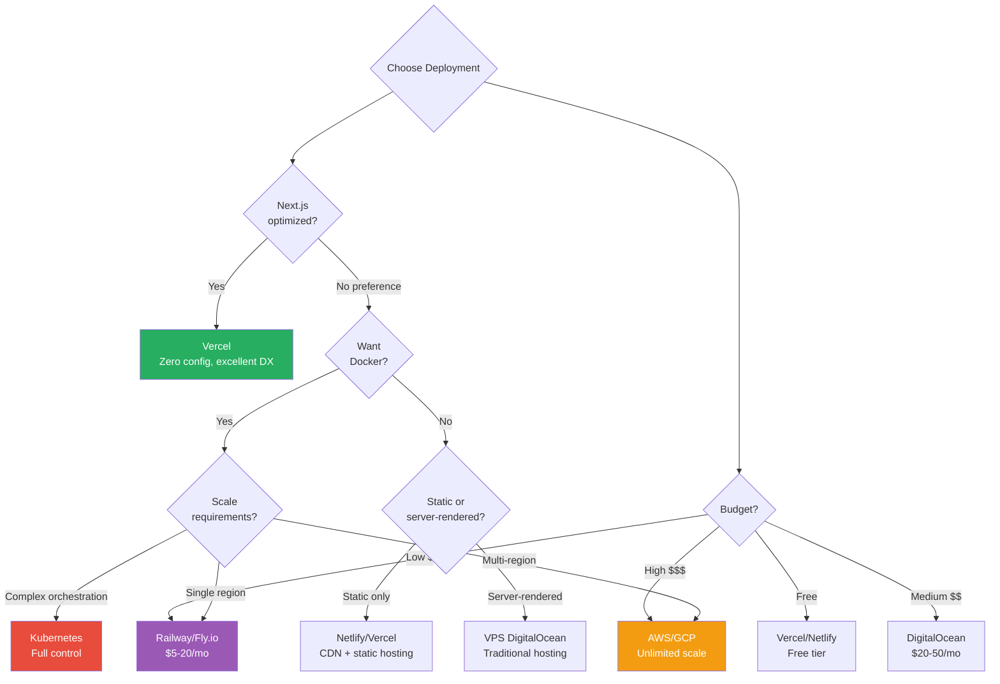
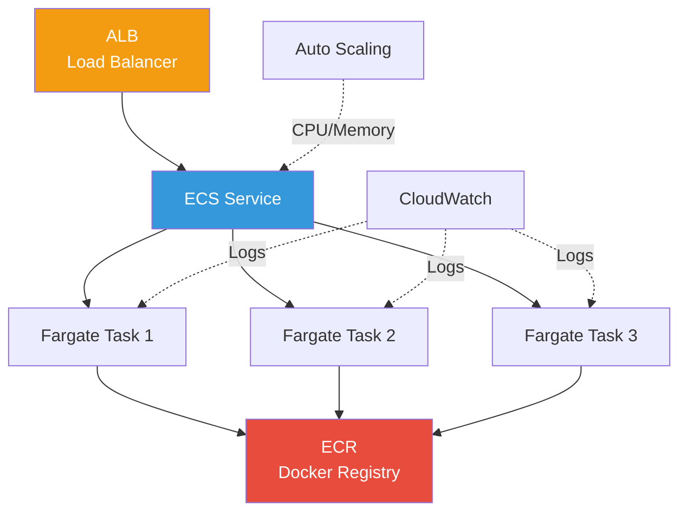
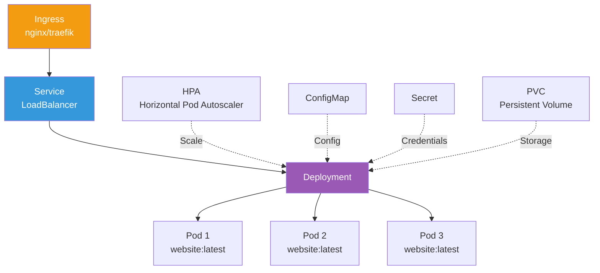
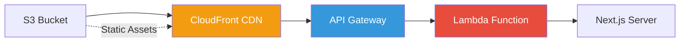

# Deployment Strategies

**Navigation:** [Home](../index.md) → [Deployment](./README.md) → Deployment Strategies

---

## Overview

This guide compares various deployment strategies for the Simon Stijnen Portfolio website, from simple cloud hosting to self-hosted Kubernetes clusters. Each option is evaluated based on cost, complexity, scalability, and maintenance requirements.

## Table of Contents

- [Deployment Comparison](#deployment-comparison)
- [Cloud Platform Deployment](#cloud-platform-deployment)
- [Container Orchestration](#container-orchestration)
- [Self-Hosted Deployment](#self-hosted-deployment)
- [Serverless Deployment](#serverless-deployment)
- [Edge Deployment](#edge-deployment)
- [Choosing a Strategy](#choosing-a-strategy)

---

## Deployment Comparison

### Quick Comparison Matrix

| Platform         | Cost     | Complexity           | Scalability          | Maintenance          | Best For                   |
| ---------------- | -------- | -------------------- | -------------------- | -------------------- | -------------------------- |
| **Vercel**       | Free-$$$ | ⭐ Very Low          | ⭐⭐⭐⭐⭐ Excellent | ⭐ Minimal           | Next.js apps, quick start  |
| **Netlify**      | Free-$$  | ⭐ Very Low          | ⭐⭐⭐⭐ Great       | ⭐ Minimal           | Static sites, JAMstack     |
| **Railway**      | $-$$     | ⭐⭐ Low             | ⭐⭐⭐ Good          | ⭐⭐ Low             | Docker containers          |
| **Fly.io**       | $-$$     | ⭐⭐ Low             | ⭐⭐⭐⭐ Great       | ⭐⭐ Low             | Global edge deployment     |
| **AWS**          | $$-$$$   | ⭐⭐⭐⭐ High        | ⭐⭐⭐⭐⭐ Excellent | ⭐⭐⭐⭐ High        | Enterprise, complex apps   |
| **DigitalOcean** | $-$$     | ⭐⭐⭐ Medium        | ⭐⭐⭐ Good          | ⭐⭐⭐ Medium        | Cost-effective VPS         |
| **Kubernetes**   | $$-$$$   | ⭐⭐⭐⭐⭐ Very High | ⭐⭐⭐⭐⭐ Excellent | ⭐⭐⭐⭐⭐ Very High | Large-scale, multi-service |
| **Self-Hosted**  | $-$$     | ⭐⭐⭐⭐ High        | ⭐⭐ Limited         | ⭐⭐⭐⭐ High        | Learning, full control     |

**Cost Scale:** Free / $ (<$20/mo) / $$ ($20-100/mo) / $$$ (>$100/mo)

### Decision Tree



---

## Cloud Platform Deployment

### Vercel (Recommended for Next.js)

**Best for:** Next.js applications, rapid deployment, zero configuration

#### Advantages

✅ **Native Next.js Support**

- Built by Next.js creators
- Zero configuration needed
- Automatic optimizations

✅ **Excellent Developer Experience**

- Git integration
- Automatic deployments
- Preview deployments for PRs
- Instant rollbacks

✅ **Performance**

- Global Edge Network
- Automatic image optimization
- Built-in CDN
- Edge middleware support

✅ **Free Tier**

- Generous limits
- Custom domains
- SSL certificates
- Analytics included

#### Deployment Process

```bash
# Install Vercel CLI
npm install -g vercel

# Deploy from local directory
cd /path/to/website
vercel

# Deploy production
vercel --prod

# Deploy from GitHub (preferred)
# 1. Push to GitHub
# 2. Import project at vercel.com
# 3. Configure (auto-detected for Next.js)
# 4. Deploy
```

#### Configuration

**vercel.json** (optional):

```json
{
  "buildCommand": "npm run build",
  "outputDirectory": ".next",
  "framework": "nextjs",
  "regions": ["iad1"],
  "env": {
    "NEXT_PUBLIC_SITE_URL": "https://simonstijnen.com"
  },
  "headers": [
    {
      "source": "/(.*)",
      "headers": [
        {
          "key": "X-Content-Type-Options",
          "value": "nosniff"
        },
        {
          "key": "X-Frame-Options",
          "value": "DENY"
        }
      ]
    }
  ]
}
```

#### Pricing

| Tier           | Price  | Limits                               |
| -------------- | ------ | ------------------------------------ |
| **Hobby**      | Free   | 100GB bandwidth, 6,000 build minutes |
| **Pro**        | $20/mo | 1TB bandwidth, unlimited builds      |
| **Enterprise** | Custom | Dedicated infrastructure             |

---

### Netlify

**Best for:** Static sites, JAMstack applications

#### Advantages

✅ **Static Site Excellence**

- CDN distribution
- Atomic deploys
- Instant rollbacks

✅ **Developer Tools**

- Split testing
- Form handling
- Functions (serverless)

✅ **Generous Free Tier**

- 100GB bandwidth
- Unlimited sites
- Custom domains

#### Deployment Process

```bash
# Install Netlify CLI
npm install -g netlify-cli

# Login
netlify login

# Initialize
netlify init

# Deploy
netlify deploy --prod

# Or drag and drop build output at netlify.com
npm run build
# Upload .next folder
```

#### Configuration

**netlify.toml:**

```toml
[build]
  command = "npm run build"
  publish = ".next"

[[redirects]]
  from = "/*"
  to = "/index.html"
  status = 200

[[headers]]
  for = "/*"
  [headers.values]
    X-Frame-Options = "DENY"
    X-Content-Type-Options = "nosniff"
    Referrer-Policy = "strict-origin-when-cross-origin"
```

#### Pricing

| Tier           | Price  | Limits                             |
| -------------- | ------ | ---------------------------------- |
| **Free**       | $0     | 100GB bandwidth, 300 build minutes |
| **Pro**        | $19/mo | 1TB bandwidth, unlimited builds    |
| **Enterprise** | Custom | SLA, priority support              |

---

### Railway

**Best for:** Docker containers, PostgreSQL databases, simple deployment

#### Advantages

✅ **Docker Native**

- Uses your Dockerfile
- No modifications needed
- Database included

✅ **Developer Experience**

- Simple CLI
- Git integration
- Environment variables

✅ **Pricing**

- Pay for what you use
- No minimum cost
- ~$5-10/mo typical

#### Deployment Process

```bash
# Install Railway CLI
npm install -g @railway/cli

# Login
railway login

# Initialize project
railway init

# Link to existing project
railway link

# Deploy
railway up

# Or connect GitHub repository
# 1. Go to railway.app
# 2. New Project → Deploy from GitHub
# 3. Select repository
# 4. Auto-detects Dockerfile
# 5. Deploy
```

#### Configuration

**railway.json:**

```json
{
  "build": {
    "builder": "DOCKERFILE",
    "dockerfilePath": "Dockerfile"
  },
  "deploy": {
    "numReplicas": 1,
    "sleepApplication": false,
    "restartPolicyType": "ON_FAILURE",
    "restartPolicyMaxRetries": 10
  }
}
```

#### Pricing

- **Free Trial:** $5 credit
- **Usage-Based:** ~$0.000463/GB-hour (RAM), $0.000231/vCPU-hour
- **Typical Cost:** $5-20/mo for small app

---

### Fly.io

**Best for:** Global edge deployment, Docker containers, low latency

#### Advantages

✅ **Global Edge**

- Deploy to multiple regions
- Automatic routing to nearest region
- Built-in load balancing

✅ **Docker Support**

- Uses your Dockerfile
- Multi-region deployments
- Persistent volumes

✅ **Performance**

- Anycast routing
- Fast cold starts
- Close to users

#### Deployment Process

```bash
# Install flyctl
curl -L https://fly.io/install.sh | sh

# Login
fly auth login

# Launch app (interactive setup)
fly launch

# Deploy
fly deploy

# Scale to multiple regions
fly regions add lhr  # London
fly regions add syd  # Sydney
fly regions add iad  # US East

# Scale instances
fly scale count 2

# View status
fly status
```

#### Configuration

**fly.toml:**

```toml
app = "personal-website"
primary_region = "iad"

[build]
  dockerfile = "Dockerfile"

[env]
  PORT = "3000"
  NODE_ENV = "production"

[http_service]
  internal_port = 3000
  force_https = true
  auto_stop_machines = true
  auto_start_machines = true
  min_machines_running = 1

[[vm]]
  cpu_kind = "shared"
  cpus = 1
  memory_mb = 512
```

#### Pricing

- **Free Tier:** 3 shared-cpu VMs, 3GB persistent storage
- **Hobby:** ~$5-10/mo for basic app
- **Paid:** $1.94/mo per 256MB RAM

---

## Container Orchestration

### Amazon ECS/Fargate

**Best for:** AWS ecosystem, serverless containers, enterprise

#### Architecture



#### Deployment Process

```bash
# Install AWS CLI
aws configure

# Create ECR repository
aws ecr create-repository --repository-name personal-website

# Build and push Docker image
aws ecr get-login-password --region us-east-1 | \
  docker login --username AWS --password-stdin <account-id>.dkr.ecr.us-east-1.amazonaws.com
docker build -t personal-website .
docker tag personal-website:latest <account-id>.dkr.ecr.us-east-1.amazonaws.com/personal-website:latest
docker push <account-id>.dkr.ecr.us-east-1.amazonaws.com/personal-website:latest

# Create ECS cluster
aws ecs create-cluster --cluster-name personal-website-cluster

# Register task definition
aws ecs register-task-definition --cli-input-json file://task-definition.json

# Create service
aws ecs create-service \
  --cluster personal-website-cluster \
  --service-name website \
  --task-definition personal-website:1 \
  --desired-count 2 \
  --launch-type FARGATE \
  --network-configuration "awsvpcConfiguration={subnets=[subnet-xxx],securityGroups=[sg-xxx],assignPublicIp=ENABLED}"
```

#### Task Definition

**task-definition.json:**

```json
{
  "family": "personal-website",
  "networkMode": "awsvpc",
  "requiresCompatibilities": ["FARGATE"],
  "cpu": "256",
  "memory": "512",
  "containerDefinitions": [
    {
      "name": "website",
      "image": "<account-id>.dkr.ecr.us-east-1.amazonaws.com/personal-website:latest",
      "portMappings": [
        {
          "containerPort": 3000,
          "protocol": "tcp"
        }
      ],
      "environment": [
        {
          "name": "NODE_ENV",
          "value": "production"
        }
      ],
      "logConfiguration": {
        "logDriver": "awslogs",
        "options": {
          "awslogs-group": "/ecs/personal-website",
          "awslogs-region": "us-east-1",
          "awslogs-stream-prefix": "ecs"
        }
      }
    }
  ]
}
```

#### Pricing (Fargate)

- **vCPU:** $0.04048/hour
- **Memory:** $0.004445/GB/hour
- **Example:** 0.25 vCPU + 0.5GB = ~$10/mo

---

### Kubernetes

**Best for:** Large-scale applications, multi-service architectures, full control

#### Architecture



#### Kubernetes Manifests

**deployment.yaml:**

```yaml
apiVersion: apps/v1
kind: Deployment
metadata:
  name: personal-website
  namespace: production
spec:
  replicas: 3
  selector:
    matchLabels:
      app: personal-website
  template:
    metadata:
      labels:
        app: personal-website
    spec:
      containers:
        - name: website
          image: ghcr.io/simonstnn/website:latest
          ports:
            - containerPort: 3000
          env:
            - name: NODE_ENV
              value: "production"
            - name: PORT
              value: "3000"
          resources:
            requests:
              memory: "256Mi"
              cpu: "250m"
            limits:
              memory: "512Mi"
              cpu: "500m"
          livenessProbe:
            httpGet:
              path: /
              port: 3000
            initialDelaySeconds: 30
            periodSeconds: 10
          readinessProbe:
            httpGet:
              path: /
              port: 3000
            initialDelaySeconds: 5
            periodSeconds: 5
```

**service.yaml:**

```yaml
apiVersion: v1
kind: Service
metadata:
  name: personal-website
  namespace: production
spec:
  selector:
    app: personal-website
  ports:
    - protocol: TCP
      port: 80
      targetPort: 3000
  type: LoadBalancer
```

**ingress.yaml:**

```yaml
apiVersion: networking.k8s.io/v1
kind: Ingress
metadata:
  name: personal-website
  namespace: production
  annotations:
    cert-manager.io/cluster-issuer: "letsencrypt-prod"
    nginx.ingress.kubernetes.io/ssl-redirect: "true"
spec:
  ingressClassName: nginx
  tls:
    - hosts:
        - simonstijnen.com
      secretName: website-tls
  rules:
    - host: simonstijnen.com
      http:
        paths:
          - path: /
            pathType: Prefix
            backend:
              service:
                name: personal-website
                port:
                  number: 80
```

**hpa.yaml:**

```yaml
apiVersion: autoscaling/v2
kind: HorizontalPodAutoscaler
metadata:
  name: personal-website-hpa
  namespace: production
spec:
  scaleTargetRef:
    apiVersion: apps/v1
    kind: Deployment
    name: personal-website
  minReplicas: 2
  maxReplicas: 10
  metrics:
    - type: Resource
      resource:
        name: cpu
        target:
          type: Utilization
          averageUtilization: 70
    - type: Resource
      resource:
        name: memory
        target:
          type: Utilization
          averageUtilization: 80
```

#### Deployment Commands

```bash
# Apply all manifests
kubectl apply -f k8s/

# Apply specific manifest
kubectl apply -f deployment.yaml

# View status
kubectl get pods -n production
kubectl get svc -n production
kubectl get ingress -n production

# View logs
kubectl logs -f deployment/personal-website -n production

# Scale manually
kubectl scale deployment/personal-website --replicas=5 -n production

# Rolling update
kubectl set image deployment/personal-website \
  website=ghcr.io/simonstnn/website:v2.0.0 \
  -n production

# Rollback
kubectl rollout undo deployment/personal-website -n production

# View rollout status
kubectl rollout status deployment/personal-website -n production
```

#### Managed Kubernetes Options

| Provider         | Service | Pricing                         |
| ---------------- | ------- | ------------------------------- |
| **AWS**          | EKS     | $0.10/hour + node costs         |
| **Google Cloud** | GKE     | $0.10/hour + node costs         |
| **Azure**        | AKS     | Free control plane + node costs |
| **DigitalOcean** | DOKS    | $12/mo + node costs             |
| **Linode**       | LKE     | Free + node costs               |

---

## Self-Hosted Deployment

### DigitalOcean Droplet

**Best for:** Cost-effective VPS, full control, learning

#### Setup Process

```bash
# 1. Create Droplet
# - OS: Ubuntu 24.04 LTS
# - Size: $6/mo (1GB RAM)
# - Region: Nearest to users

# 2. SSH into server
ssh root@your-server-ip

# 3. Install Docker
curl -fsSL https://get.docker.com -o get-docker.sh
sh get-docker.sh

# 4. Install Docker Compose
apt-get install -y docker-compose-plugin

# 5. Clone repository
git clone https://github.com/simonstnn/website.git
cd website

# 6. Run with Docker Compose
docker compose up -d

# 7. Setup Nginx reverse proxy
apt-get install -y nginx certbot python3-certbot-nginx

# 8. Configure Nginx
cat > /etc/nginx/sites-available/website <<'EOF'
server {
    listen 80;
    server_name simonstijnen.com www.simonstijnen.com;

    location / {
        proxy_pass http://localhost:3000;
        proxy_http_version 1.1;
        proxy_set_header Upgrade $http_upgrade;
        proxy_set_header Connection 'upgrade';
        proxy_set_header Host $host;
        proxy_cache_bypass $http_upgrade;
        proxy_set_header X-Real-IP $remote_addr;
        proxy_set_header X-Forwarded-For $proxy_add_x_forwarded_for;
        proxy_set_header X-Forwarded-Proto $scheme;
    }
}
EOF

# 9. Enable site
ln -s /etc/nginx/sites-available/website /etc/nginx/sites-enabled/
nginx -t
systemctl restart nginx

# 10. Setup SSL with Let's Encrypt
certbot --nginx -d simonstijnen.com -d www.simonstijnen.com

# 11. Setup auto-deployment
cat > /root/deploy.sh <<'EOF'
#!/bin/bash
cd /root/website
git pull origin main-v2
docker compose down
docker compose build
docker compose up -d
EOF
chmod +x /root/deploy.sh
```

#### Automated Updates

**Using webhook:**

```bash
# Install webhook
apt-get install -y webhook

# Create webhook script
cat > /root/webhook-deploy.sh <<'EOF'
#!/bin/bash
cd /root/website
git pull origin main-v2
docker compose up -d --build
EOF
chmod +x /root/webhook-deploy.sh

# Configure webhook
cat > /etc/webhook.conf <<'EOF'
[
  {
    "id": "deploy-website",
    "execute-command": "/root/webhook-deploy.sh",
    "command-working-directory": "/root/website",
    "pass-arguments-to-command": [],
    "trigger-rule": {
      "match": {
        "type": "payload-hash-sha256",
        "secret": "YOUR_SECRET_HERE",
        "parameter": {
          "source": "header",
          "name": "X-Hub-Signature-256"
        }
      }
    }
  }
]
EOF

# Start webhook
webhook -hooks /etc/webhook.conf -verbose -port 9000
```

**GitHub webhook:**

1. Repository Settings → Webhooks → Add webhook
2. Payload URL: `http://your-server:9000/hooks/deploy-website`
3. Content type: `application/json`
4. Secret: Same as in webhook.conf
5. Events: `push` events

#### Pricing

| Provider         | Size    | Price  | Specs                     |
| ---------------- | ------- | ------ | ------------------------- |
| **DigitalOcean** | Basic   | $6/mo  | 1GB RAM, 1 vCPU, 25GB SSD |
| **DigitalOcean** | Regular | $12/mo | 2GB RAM, 1 vCPU, 50GB SSD |
| **Linode**       | Nanode  | $5/mo  | 1GB RAM, 1 vCPU, 25GB SSD |
| **Vultr**        | Regular | $6/mo  | 1GB RAM, 1 vCPU, 25GB SSD |
| **Hetzner**      | CX11    | €4/mo  | 2GB RAM, 1 vCPU, 20GB SSD |

---

## Serverless Deployment

### AWS Lambda + API Gateway

**Best for:** Sporadic traffic, cost optimization, AWS ecosystem

#### Architecture



**Note:** Next.js 15 with App Router is not fully compatible with AWS Lambda. Consider using [OpenNext](https://open-next.js.org/) or AWS Amplify for better Next.js support.

---

## Edge Deployment

### Cloudflare Pages/Workers

**Best for:** Global edge deployment, static sites with dynamic elements

#### Deployment

```bash
# Install Wrangler CLI
npm install -g wrangler

# Login
wrangler login

# Deploy
wrangler pages deploy .next

# Or connect GitHub repository
# 1. Go to pages.cloudflare.com
# 2. Connect repository
# 3. Configure build:
#    Build command: npm run build
#    Output directory: .next
# 4. Deploy
```

#### Pricing

- **Free:** Unlimited requests, 100k reads/day
- **Paid:** $5/mo for 10M requests

---

## Choosing a Strategy

### Use Case Recommendations

#### Personal Portfolio (Current Project)

**Recommended:** Vercel or Railway

- **Vercel** if you prioritize developer experience and Next.js optimization
- **Railway** if you want Docker deployment and database included

#### Small Business Website

**Recommended:** Vercel, Netlify, or DigitalOcean

- Simple deployment
- Reasonable costs
- Minimal maintenance

#### High-Traffic Application

**Recommended:** AWS ECS/Fargate or Kubernetes

- Auto-scaling
- High availability
- Enterprise support

#### Multi-Service Application

**Recommended:** Kubernetes or Docker Compose on VPS

- Multiple containers
- Service orchestration
- Database, cache, queue integration

#### Learning/Experimentation

**Recommended:** DigitalOcean or Self-hosted

- Full control
- Learn infrastructure
- Low cost

---

## See Also

- [Docker Guide](./01-docker-guide.md) - Docker fundamentals for any deployment
- [CI/CD Pipeline](./04-ci-cd.md) - Automated deployment workflows
- [Production Configuration](./06-production-config.md) - Production best practices
- [Docker Compose](./03-docker-compose.md) - Local and VPS deployment

---

## Next Steps

1. **Choose Platform**: Select deployment strategy based on requirements
2. **Configure CI/CD**: Set up [automated deployments](./04-ci-cd.md)
3. **Production Setup**: Review [production configuration](./06-production-config.md)
4. **Deploy**: Follow platform-specific guide above

---

**Last Updated:** February 2026  
**Platforms Tested:** Vercel, Railway, Fly.io, DigitalOcean, AWS ECS  
**Next.js Version:** 15.1.6  
**Docker Compatibility:** All platforms
