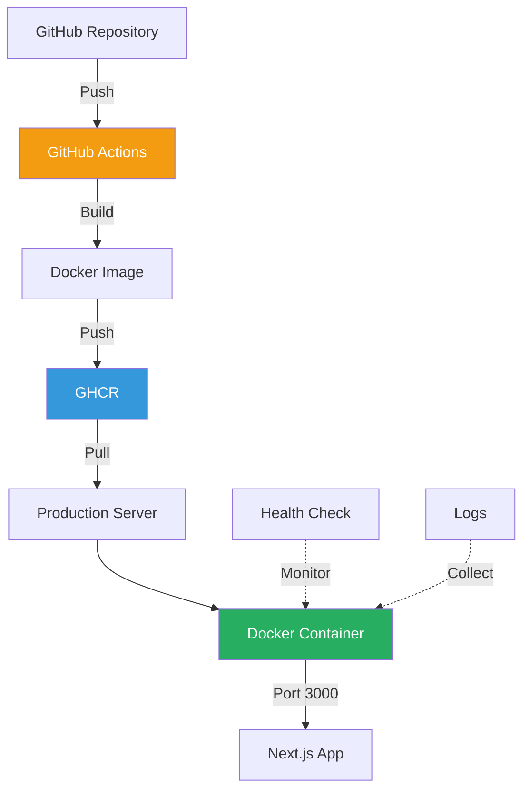
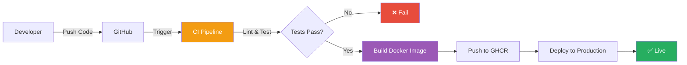

# Deployment Documentation

**Navigation:** [Home](../index.md) → Deployment

---

## Overview

Complete deployment documentation for the Simon Stijnen Portfolio website, covering Docker containerization, CI/CD pipelines, deployment strategies, and production configuration.

---

## Documentation Structure

### 📦 [Docker Guide](./01-docker-guide.md)

Complete Docker reference with quick start guide, image building, container operations, and troubleshooting.

**Topics Covered:**

- Quick 30-second deployment
- Docker architecture and layers
- Image building and optimization
- Container operations and management
- Health checks and monitoring
- Troubleshooting common issues

**Best for:** Getting started with Docker, understanding container basics

---

### 🏗️ [Dockerfile Documentation](./02-dockerfile.md)

In-depth explanation of the multi-stage Dockerfile with optimization techniques and security features.

**Topics Covered:**

- Multi-stage build architecture
- Stage-by-stage breakdown
- Layer caching strategies
- Standalone output configuration
- Security hardening
- Customization options

**Best for:** Understanding the build process, optimizing Docker images

---

### 🎭 [Docker Compose Guide](./03-docker-compose.md)

Docker Compose configuration for multi-service orchestration and local development.

**Topics Covered:**

- Configuration breakdown
- Common operations (start, stop, logs)
- Advanced configurations
- Multi-service examples (database, cache, proxy)
- Environment management
- Troubleshooting

**Best for:** Multi-container setups, local development environments

---

### 🔄 [CI/CD Pipeline](./04-ci-cd.md)

GitHub Actions workflow for continuous integration and automated deployments.

**Topics Covered:**

- Pipeline architecture with diagrams
- Workflow configuration
- Job breakdown (CI, build, push)
- Docker image publishing to GHCR
- Branch strategies
- Secrets management
- Customization examples

**Best for:** Automated deployments, understanding the CI/CD process

---

### 🚀 [Deployment Strategies](./05-deployment-strategies.md)

Comprehensive comparison of deployment platforms and strategies.

**Topics Covered:**

- Platform comparison matrix
- Cloud platforms (Vercel, Netlify, Railway, Fly.io)
- Container orchestration (ECS, Kubernetes)
- Self-hosted deployment (DigitalOcean, VPS)
- Serverless and edge deployment
- Decision framework

**Best for:** Choosing the right deployment platform

---

### 🔐 [Production Configuration](./06-production-config.md)

Production best practices including security, performance, monitoring, and operational procedures.

**Topics Covered:**

- Environment configuration
- Security hardening (headers, SSL, firewall)
- Performance optimization
- Monitoring and logging
- Backup and recovery
- Rate limiting and DDoS protection
- Health checks

**Best for:** Production-ready deployments, security hardening

---

## Quick Start Paths

### Path 1: Simple Cloud Deployment (5 minutes)

**Best for:** Quick deployment without infrastructure management

1. Push code to GitHub
2. Connect repository to [Vercel](https://vercel.com) or [Netlify](https://netlify.com)
3. Deploy automatically

**Learn more:** [Deployment Strategies - Vercel Section](./05-deployment-strategies.md#vercel-recommended-for-nextjs)

---

### Path 2: Docker Deployment (15 minutes)

**Best for:** Full control with Docker containers

1. Read [Docker Guide Quick Start](./01-docker-guide.md#quick-start)
2. Build and run locally:

   ```bash
   docker compose up -d
   ```

3. Deploy to [Railway](https://railway.app) or [Fly.io](https://fly.io)

**Learn more:** [Docker Guide](./01-docker-guide.md) → [Deployment Strategies](./05-deployment-strategies.md)

---

### Path 3: Production Self-Hosted (1 hour)

**Best for:** Full infrastructure control and customization

1. Set up VPS ([DigitalOcean guide](./05-deployment-strategies.md#digitalocean-droplet))
2. Configure Docker and Nginx ([Production Config](./06-production-config.md#nginx-reverse-proxy-configuration))
3. Set up SSL ([SSL Configuration](./06-production-config.md#ssltls-configuration))
4. Configure monitoring ([Monitoring Setup](./06-production-config.md#monitoring-and-logging))

**Learn more:** [Deployment Strategies - Self-Hosted](./05-deployment-strategies.md#self-hosted-deployment) → [Production Configuration](./06-production-config.md)

---

### Path 4: Enterprise Kubernetes (1 day)

**Best for:** Large-scale, multi-service applications

1. Understand [Kubernetes architecture](./05-deployment-strategies.md#kubernetes)
2. Set up cluster (EKS, GKE, or AKS)
3. Deploy manifests
4. Configure ingress, monitoring, and scaling

**Learn more:** [Deployment Strategies - Kubernetes](./05-deployment-strategies.md#kubernetes)

---

## Architecture Overview

### Current Architecture



### Deployment Flow



---

## Technology Stack

### Core Technologies

- **Runtime:** Node.js 24 (LTS)
- **Framework:** Next.js 15.1.6
- **Container:** Docker + Docker Compose
- **Base Image:** Alpine Linux (minimal)
- **Registry:** GitHub Container Registry (GHCR)

### CI/CD

- **Platform:** GitHub Actions
- **Triggers:** Push, Pull Request
- **Stages:** Lint → Format → Test → Build → Deploy

### Supported Platforms

- ✅ Vercel (recommended for Next.js)
- ✅ Railway (Docker native)
- ✅ Fly.io (global edge)
- ✅ AWS ECS/Fargate
- ✅ Google Cloud Run
- ✅ DigitalOcean (VPS)
- ✅ Kubernetes (all managed providers)
- ✅ Self-hosted (any Docker host)

---

## Key Features

### Docker Image

- **Size:** ~180MB (optimized with standalone output)
- **Build:** Multi-stage (deps → builder → runner)
- **Security:** Non-root user, minimal base image
- **Health Check:** Built-in HTTP health check
- **Performance:** Layer caching, tree-shaken dependencies

### CI/CD Pipeline

- **Automated:** Runs on every push/PR
- **Quality Gates:** Linting, formatting, testing
- **Image Tagging:** latest, major, minor, patch, commit SHA
- **Registry:** GitHub Container Registry (GHCR)
- **Deployment:** Conditional on main-v2 branch

### Production Features

- **Security:** HTTPS, security headers, CSP, HSTS
- **Performance:** CDN, caching, compression, image optimization
- **Monitoring:** Health checks, logs, metrics, error tracking
- **Reliability:** Auto-restart, health monitoring, backup strategy

---

## Environment Requirements

### Development

```bash
Node.js: 24 (LTS)
npm: 10+
Docker: 20.10+
Docker Compose: v2.0+
```

### Production

```bash
Docker Engine: 20.10+
RAM: 512MB minimum, 1GB recommended
Storage: 2GB minimum
Port: 3000 (configurable)
Network: HTTPS recommended
```

---

## Common Tasks

### Local Development

```bash
# Clone repository
git clone https://github.com/simonstnn/website.git
cd website

# Install dependencies
npm ci

# Run development server
npm run dev

# Build for production
npm run build

# Run production build locally
npm start
```

### Docker Operations

```bash
# Build image
docker build -t personal-website .

# Run container
docker compose up -d

# View logs
docker compose logs -f

# Stop container
docker compose down

# Rebuild and restart
docker compose up -d --build
```

### Deployment

```bash
# Deploy to Vercel
vercel --prod

# Deploy to Railway
railway up

# Deploy to Fly.io
fly deploy

# Deploy to VPS (manual)
ssh user@server
cd /path/to/website
git pull
docker compose up -d --build
```

---

## Troubleshooting

### Common Issues

#### Docker Build Fails

**Solution:** [Docker Guide - Troubleshooting](./01-docker-guide.md#troubleshooting)

#### Container Won't Start

**Solution:** [Docker Guide - Container Won't Start](./01-docker-guide.md#container-wont-start)

#### CI/CD Pipeline Fails

**Solution:** [CI/CD Pipeline - Troubleshooting](./04-ci-cd.md#troubleshooting)

#### Deployment Issues

**Solution:** [Deployment Strategies - Platform Guides](./05-deployment-strategies.md)

#### Production Problems

**Solution:** [Production Config - Monitoring](./06-production-config.md#monitoring-and-logging)

---

## Best Practices

### Security

✅ Use HTTPS with valid SSL certificate  
✅ Configure security headers (CSP, HSTS, X-Frame-Options)  
✅ Run containers as non-root user  
✅ Keep dependencies updated  
✅ Use environment variables for secrets  
✅ Enable rate limiting  
✅ Regular security audits

**Learn more:** [Production Configuration - Security](./06-production-config.md#security-hardening)

### Performance

✅ Use CDN for static assets  
✅ Enable compression (gzip/brotli)  
✅ Implement caching strategies  
✅ Optimize images (AVIF/WebP)  
✅ Use standalone output mode  
✅ Monitor performance metrics

**Learn more:** [Production Configuration - Performance](./06-production-config.md#performance-optimization)

### Reliability

✅ Configure health checks  
✅ Set up monitoring and alerting  
✅ Implement auto-restart policies  
✅ Regular backups  
✅ Document recovery procedures  
✅ Test disaster recovery

**Learn more:** [Production Configuration - Monitoring](./06-production-config.md#monitoring-and-logging)

---

## Additional Resources

### Official Documentation

- [Next.js Deployment](https://nextjs.org/docs/deployment)
- [Docker Documentation](https://docs.docker.com/)
- [GitHub Actions](https://docs.github.com/en/actions)

### Related Documentation

- [Documentation Home](../index.md) - Documentation index
- [Architecture Guide](../01-architecture/README.md) - Technical architecture
- [Development Guide](../04-development/README.md) - Development setup
- [Content Guide](../03-content/README.md) - Content management

---

## Support

For questions or issues:

1. Check relevant documentation section above
2. Review [troubleshooting guides](#troubleshooting)
3. Search [GitHub Issues](https://github.com/simonstnn/website/issues)
4. Create new issue with detailed information

---

## Contributing

Contributions to documentation are welcome! Please:

1. Follow existing documentation structure
2. Include code examples and diagrams
3. Add cross-references to related sections
4. Test all commands and configurations
5. Update this README if adding new sections

---

**Last Updated:** February 2026  
**Maintained By:** Simon Stijnen  
**Documentation Version:** 1.0  
**Project Version:** 1.0.0
